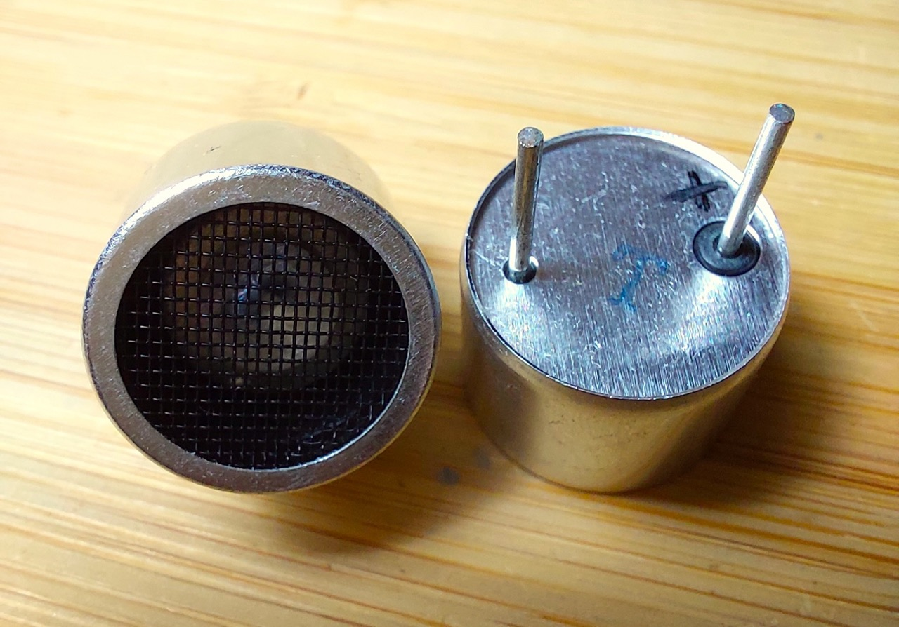
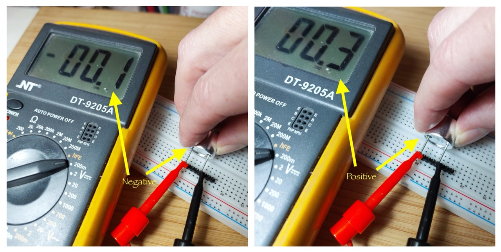

# #856 TCT40-16

Reviewing some common 40kHz 16mm ultrasonic transmitters and receivers TCT40-16T/TCT40-16R, including methods for testing polarity.

## Notes

40KHz ultrasonic transducers are very common these days. Most commonly found in range sensing modules such as the HC-SR04.
See [LEAP#287 Ultrasonic Alarm](../../UltrasonicAlarm/) for an example of their use.

They are also used for ultrasonic levitation experiments, such as the
[LEAP#849 Ultrasonic Levitator Kit](../../../Kinetics/Levitation/UltrasonicLevitatorKit/).

So I could experiment further with ultrasonic levitation, I purchased pack of 10 transmitters for SG$3.85 (Jun-2026):
["10pcs 16mm 40K ultrasonic transmitter ultrasonic sensor Ultrasonic emitter TCT40-16T 40KHz Transmit+receive aluminum sensor" (aliexpress seller listing)](https://www.aliexpress.com/item/1005005796612921.html).

These notes simple introduce and characterise these components, including methods for testing polarity.

### Product information: ultrasonic sensor

From the vendor:

* Size: 16 mm
* Nominal frequency: 40KHz.
* Launch sound pressure at 10V (0dB=0.02mPa) : greater than 117dB.
* V receiving sensitivity at 40KHz (0dB= v/µbar): greater than or equal to -70db.
* Electrostatic capacity at 1KHz, <1V (PF): 2000+ +30%.
* Detection distance (m) : 0.2~3.
* Shell material: full aluminum.
* Available models:
    * TCT40-16T-1 : plastic housing - transmitter
    * TCT40-16R-1 : plastic housing - receiver
    * TCT40-16T-2 : aluminum housing - transmitter
    * TCT40-16R-2 : aluminum housing - receiver
    * TCT40-16T-3 : black aluminum housing - transmitter
    * TCT40-16R-3 : black aluminum housing - receiver

### Transmitters v Receivers

While both transmitters and receivers utilize the same underlying piezoelectric effect,
they are ideally optimized for the specific task

| Feature           | Transmit Sensor (TX)                    | Receive Sensor (RX)                        |
|-------------------|-----------------------------------------|--------------------------------------------|
| Primary Role      | Converts electrical energy to sound     | Converts sound to electrical energy        |
| Operating Voltage | High (often 10V to over 100V)           | Extremely low (microvolts to millivolts)   |
| Impedance         | Low impedance to maximize current flow  | High impedance to maximize voltage output  |
| Bandwidth         | Narrow (tuned sharply to one frequency) | Wider (designed to capture shifted echoes) |
| Capacitance       | Typically higher                        | Typically lower                            |

In a pinch, transmitters and receivers can be interchanged but likely with a massive drop in performance.

### Polarity

Ultrasonic piezos are inherently polarized.
During manufacturing, materials like PZT (Lead Zirconate Titanate) undergo a process called poling, where a high-voltage DC field aligns their internal microscopic dipoles to give them their piezoelectric properties.

Because they have a permanent polarization direction, how you connect them determines how they function.
Applying a voltage that matches the polarization direction causes the element to expand. Reversing the voltage causes it to contract.

With low voltage AC operation, polarization may not be significant for sensors used alone, as the polarity essentially effects a 180˚ phase shift.

Where polarity may be significant:

* Risk of Depolarization: Applying a high voltage opposite to the polarization direction can permanently damage or destroy the element's internal structure.
* Multi-Element Stacks: Large ultrasonic hardware (like ultrasonic cleaner transducers) often stacks multiple piezo discs face-to-face. Their polarities must be oriented correctly relative to each other so their physical movements add together instead of canceling each other out.
* Metal Housing Grounding: In many 2-pin ultrasonic sensors, one terminal is explicitly connected to the outer metal shield/casing for noise isolation. This makes identifying the positive and negative terminals critical during installation

Manufacturers typically mark the positive or poling direction with a red wire, a printed dot, or a specific symbol on the casing.
In my case, the positive terminal has a distinctive insulating ring around it (I added the "+" marking after testing):

### Testing for Polarity with a Multimeter

Polarity markings are notoriously unreliably, so testing the polarity is recommended if polarity is critical for the application.

See [Tutorial: Marking the Polarity of Ultrasonic Piezos using a Multimeter](https://www.youtube.com/watch?v=0HaKv3aJQWA) by UpnaLab.

The method:

* set multimeter to most sensitive voltage scale
* touch Ultrasonic Piezo across the +ve and -ve multimeter leads
* if the voltage swings positive, then the piezo lead connected to the +ve lead can be considered the +ve/anode
* if the voltage swings negative, then the piezo lead connected to the -ve lead can be considered the +ve/anode

Testing with a multimeter:

## Credits and References

* ["10pcs 16mm 40K ultrasonic transmitter ultrasonic sensor Ultrasonic emitter TCT40-16T 40KHz Transmit+receive aluminum sensor" (aliexpress seller listing)](https://www.aliexpress.com/item/1005005796612921.html)
    * Purchased pack of 10 transmitters for SG$3.85 (Jun-2026)
