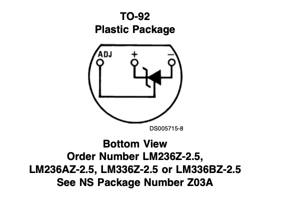
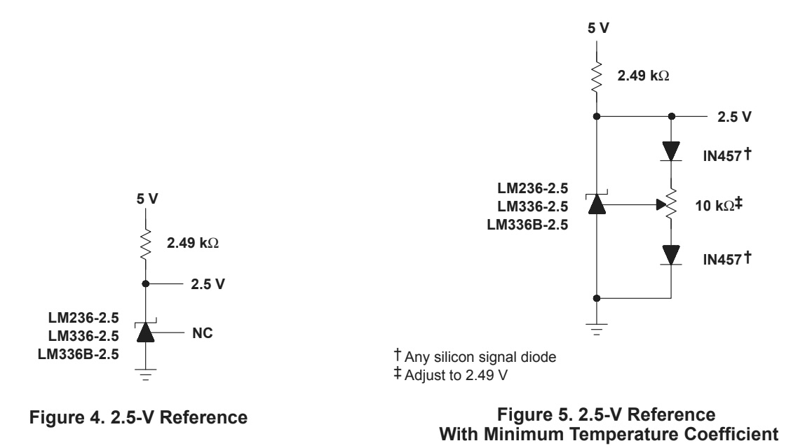
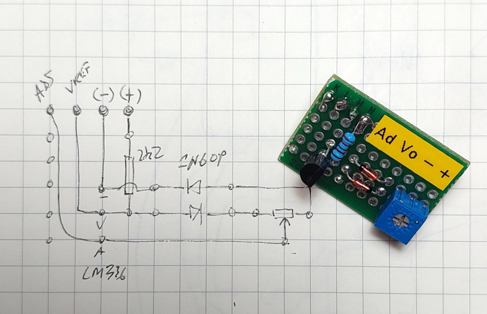
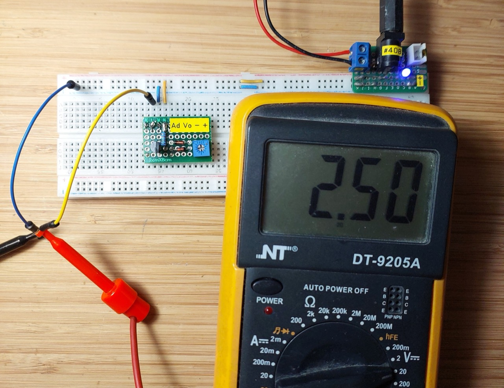

# #699 LM336 Voltage Reference

Exploring the LM336 precision reference and testing the minimum temperature coefficient circuit design.

## Notes

The [LM336](https://www.futurlec.com/Linear/LM336Z-25.shtml) is a precision adjustable voltage reference diode, commonly used for voltage regulation and calibration in analog and digital circuits. It provides a stable reference voltage of 2.5V, with the ability to fine-tune the output using an external resistor. Operating over a wide current range, it offers low temperature drift and excellent long-term stability, making it ideal for use in power supplies, ADCs, DACs, and sensor applications. Unlike standard Zener diodes, the LM336 provides better accuracy and lower noise, making it a reliable choice for precision voltage regulation.

### Circuit Design

While the simplest use of the LM336 is inline with a 2.5kΩ resistor, the datasheet describes a 2.5V Reference with Minimum Temperature Coefficient.
That's is the circuit I've reproduced here.

Essentially, it just requires a pair of signal diodes in series with a 10kΩ trimmer to set the adjustment point.

* I'm using [1N60P Germanium Detector Diodes](https://www.futurlec.com/Diodes/1N60P.shtml)

See the [schematic in EasyEDA](https://easyeda.com/editor#id=10979ec84b8340caa0ff0bc32b6b1b89)

Testing the circuit on a breadboard, and I am able to get a very stable 2.5V.
Note:

* the datasheet seems to indicate the ADJ point should be set to adjusted to 2.49 V, but I must be misunderstanding it, because
    * (a) this doesn't work and
    * (b) it doesn't seem possible while also keeping the cathode at 2.5V.
* instead, I trimmed the pot until I get precisely 2.5V on the cathode. At this point, the ADJ pin is at approximately half that (~1.21V), as I would expect.

### Protoboard Build

I decided to put the circuit on a small piece of protoboard:

It works nicely as a simple breadboard module.

## Credits and References

* [LM336Z-25 Datasheet](https://www.futurlec.com/Linear/LM336Z-25.shtml)
* [1N60P Germanium Detector Diode datasheet](https://www.futurlec.com/Diodes/1N60P.shtml)
