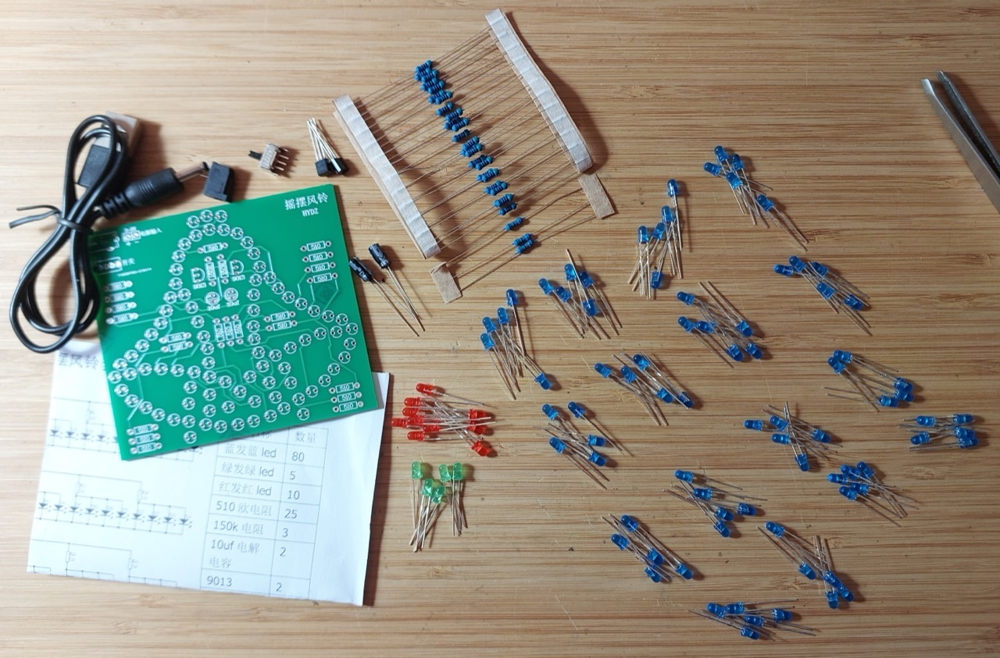
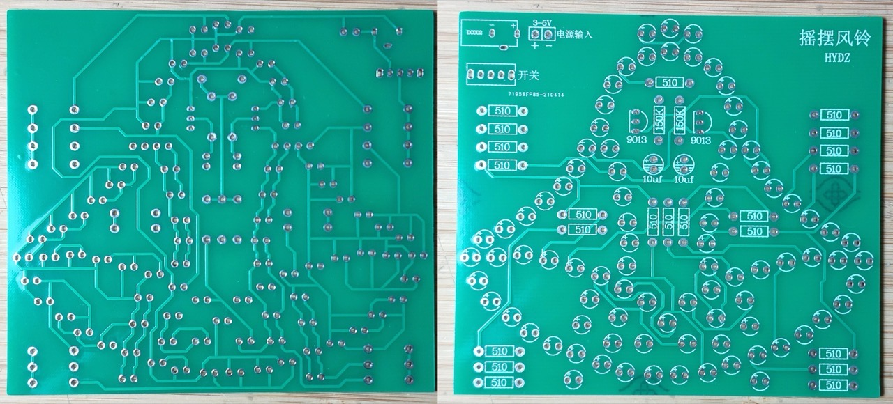
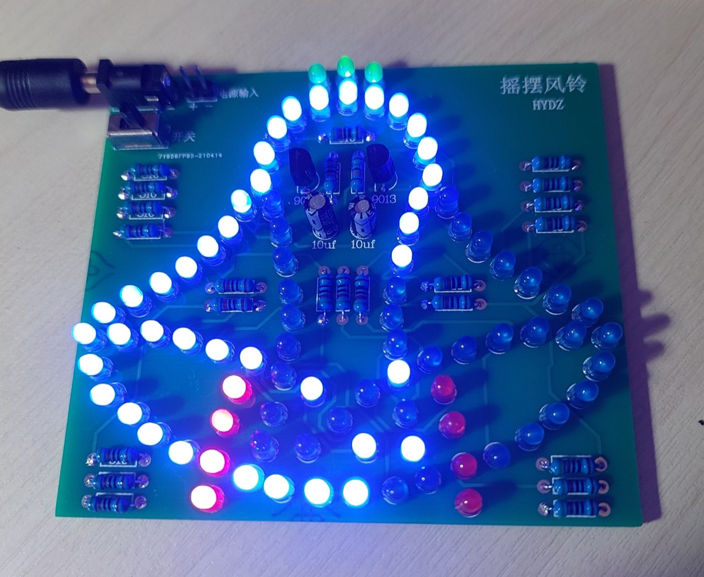
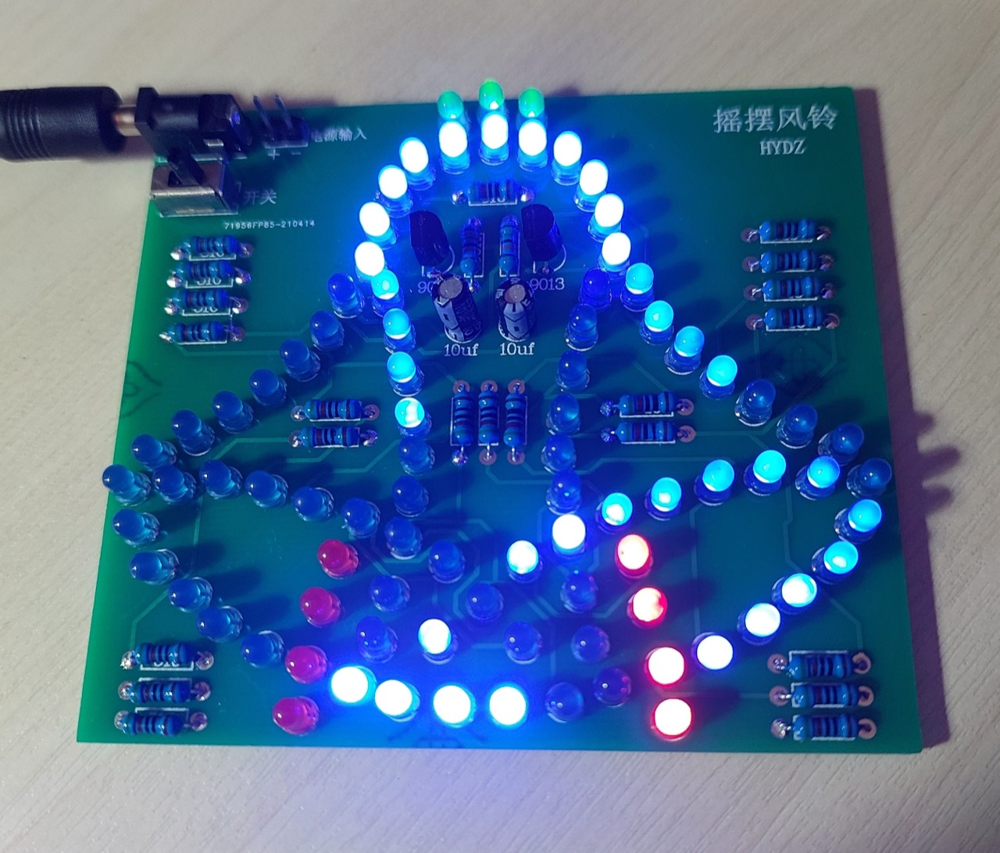

# #639 Wobbly Wind Bell Kit

Building the Wobbly Wind Bell demonstrating a simple RC oscillator circuit. Available as a cheap project kit from many online sellers.

Here's a quick demo..

## Notes

### The Kit

The [Wobbly Wind Bell Kit](https://www.aliexpress.com/item/4001116940559.html) is available from many sellers on aliexpress

### Packing List

| Qty | Refs   | Description                             |
|-----|--------|-----------------------------------------|
| 80  |        | Blue LED 3mm |
| 5   |        | Green LED 3mm |
| 10  |        | Red LED 3mm |
| 25  |        | 50Ω resistor |
| 3   |        | 150kΩ resistor |
| 2   |        | 10µF electrolytic capacitor |
| 2   |        | S9013 NPN Transistor |
| 1   |        | STDP switch |
| 1   |        | 3.5mm power jack |
| 1   |        | USB to 3.5mm power cable |
| 1   |        | PCB |

### Circuit Design

The circuit uses a simple oscillator to switch between two banks of LEDs.
The circuit is similar to that demonstrated in
[LEAP#049 BJT RC Oscillator](./../Oscillators/BjtRcOscillator/).

PCB layout:

Here's a quick redraw of the circuit in Fritzing:

### Build Log

After initial construction, quite a number of the LEDs failed.
It seems that the components provided in the kit were not good quality.

After replacing the failed LEDs with components from stock, all is working correctly:

The completed board:

## Credits and References

* [laboratory Swing bells Wobbly Windbell Fun Electronic DIY Kit Wring 95 LEDs Wind bell 5V 9V](https://www.aliexpress.com/item/4001116940559.html) - one of many sellers on aliexpress
* [S9013 NPN Transistor](https://www.futurlec.com/Transistors/S9013.shtml)
* [LEAP#049 BJT RC Oscillator](./../Oscillators/BjtRcOscillator/)
