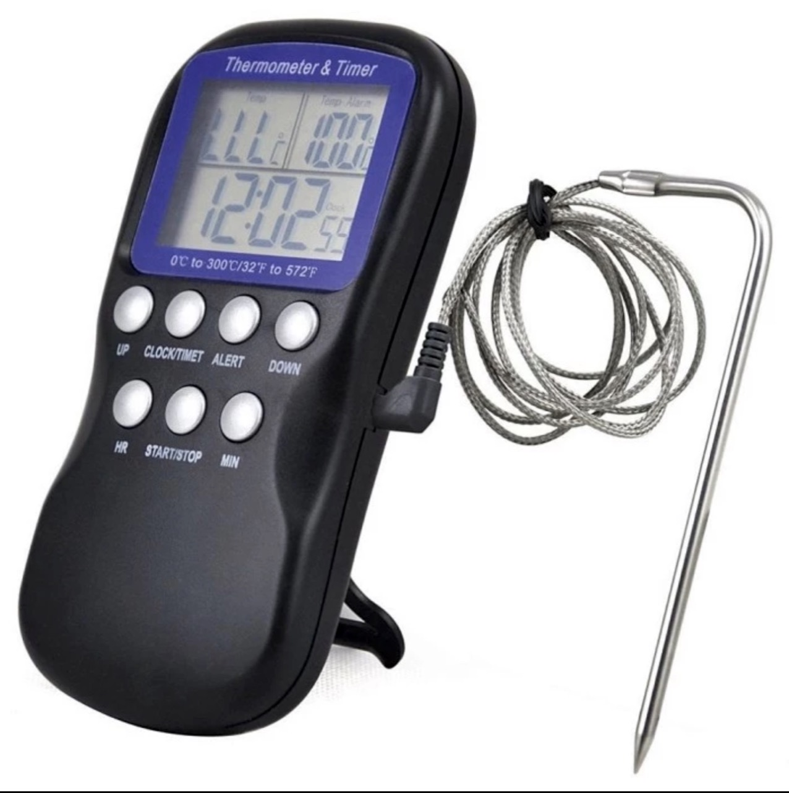
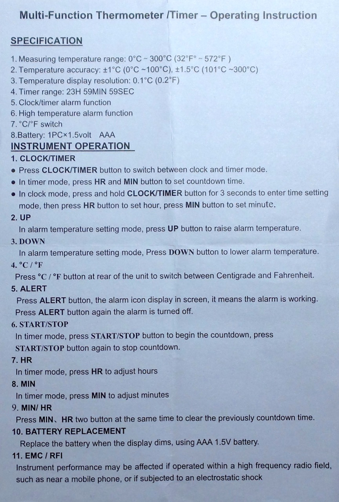
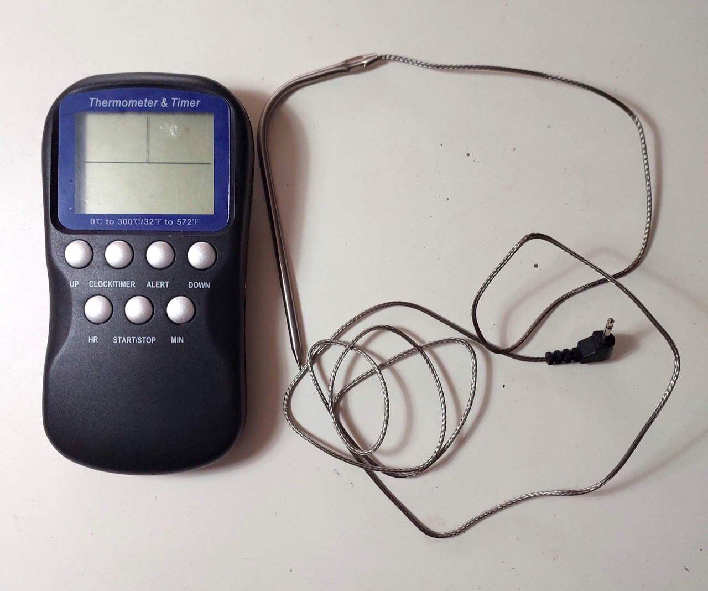
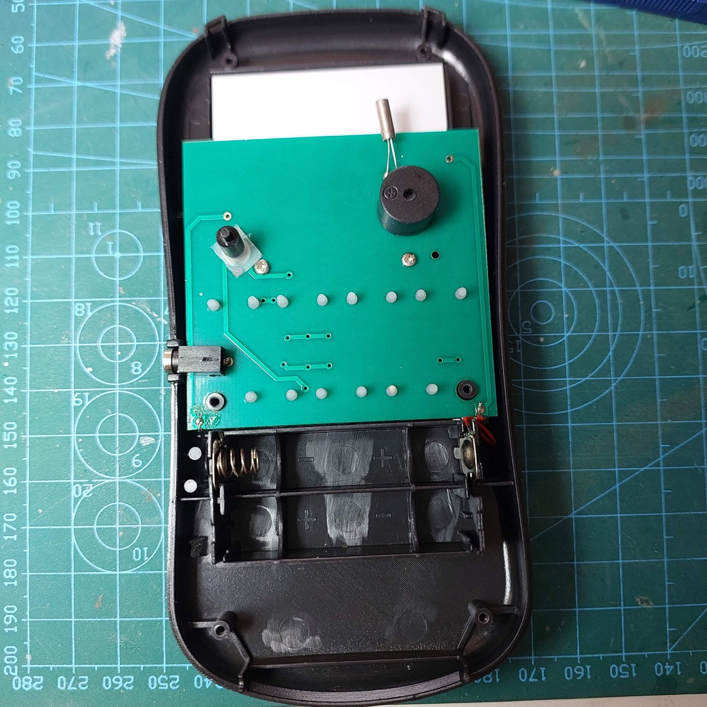
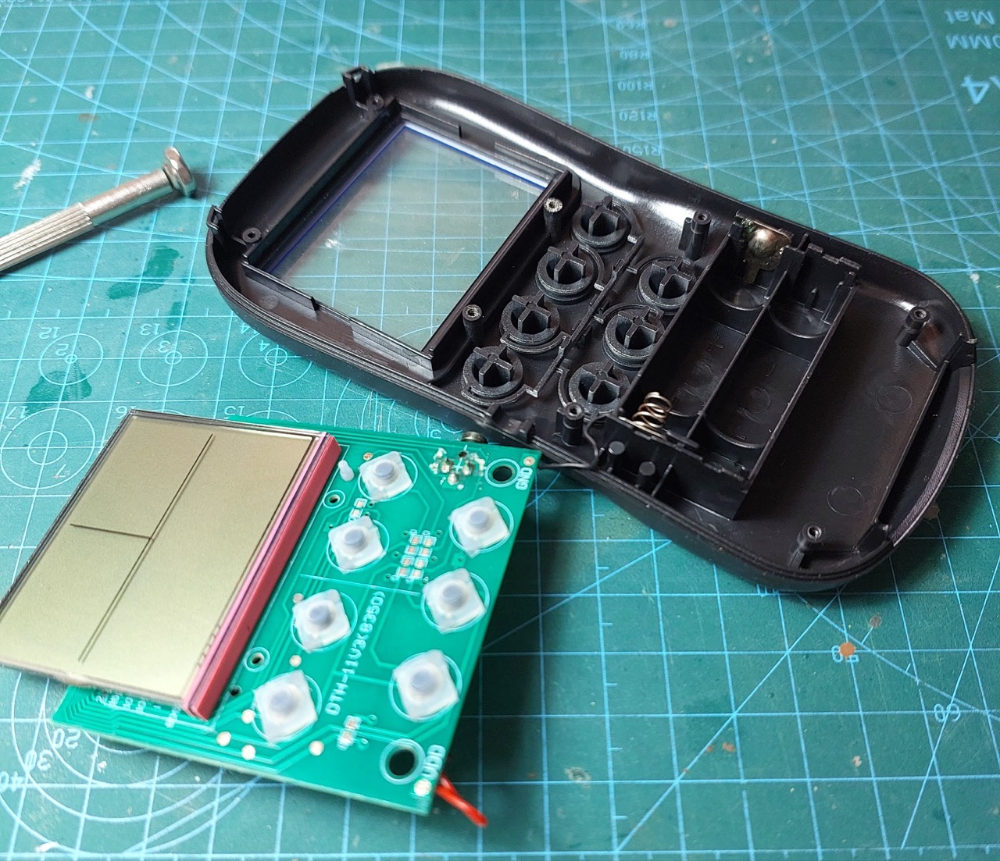

# #632 TS-BN55 Digital Oven Thermometer

Examining and fixing the TS-BN55 Digital Oven Thermometer

## Notes

I purchased the
[TS-BN55 Digital Display Electronic Thermometer](https://www.tokopedia.com/eskibike/ts-bn55-digital-display-0-300-electronic-thermometer-with)
some time ago. It appears to have been superseded by
[newer models](https://vi.aliexpress.com/item/32831844836.html)
that may have largely the same hardware but upgraded firmware (and perhaps a higher resolution LCD).

### Features

* Easy to use and safe for food.
* Light weight and portable food thermometer.
* Large easy-read LCD triple screen display with thermometer,timer and 12/24hr clock.
* Switchable °C and °F unit.
* Thermometer / timer alarm function.
* High-low temperature alarm function.
* A great helper for food health and safety.

### Specifications

* Material: Stainless Steel + ABS
* Measuring Temperature Range: 0°C～300°C (32°F～572°F)
* Temperature Accuracy: ±1°C (0°C～100°C), ±1.5°C (101°F～300°F)
* Temperature Display Resolution: 0.1°C (0.2°F)
* Timer Range: 99MIN 59SEC
* Unit: °C / °F Switch
* Power supply: 2 × 1.5V AAA Battery (NOT Included)
* Probe Length: Approx. 18cm / 7.09in
* Size: Approx. 14.5 *7.5* 2.5cm / 5.71 *2.95* 0.98in (L *W* H)
* Net Weight: Approx. 110g / 3.88 oz

### Package List

* 1 * Digital Food Thermometer (Batteries not included)
* 1 * Stainless Probe
* 1 * User Manual

### Failure and Fix

It stopped working this Christmas. After opening it up, it was immediately apparent that the battery connection with had corroded through.
Replacing this was all that was required to get the unit working again. Good save - this unit was moments away from going in the bin!

No sign of life:

Pulling the circuit board makes it clear we have an issue with broken battery connector:

With battery connection repaired, the unit is back in action:

## Credits and References

* [TS-BN55 (original version) Digital Display 0+300 Electronic Thermometer](https://www.tokopedia.com/eskibike/ts-bn55-digital-display-0-300-electronic-thermometer-with)
* [TS-BN55 (newer version) Digital Oven Thermometer BBQ Food Probe Meat Kitchen Thermometer Cooking Tools Temperature Sensor with Timer and Alarm Function](https://vi.aliexpress.com/item/32831844836.html) - seller on aliexpress
