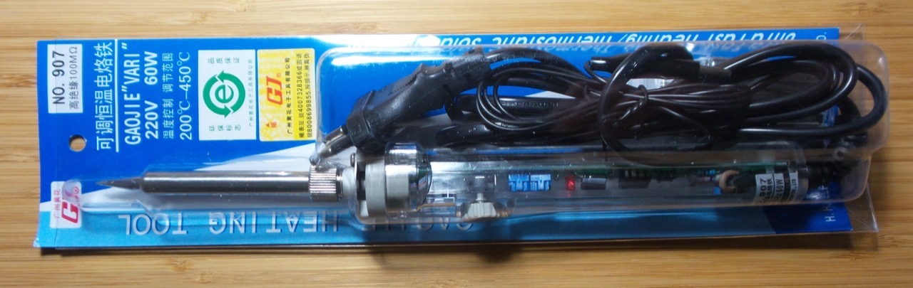
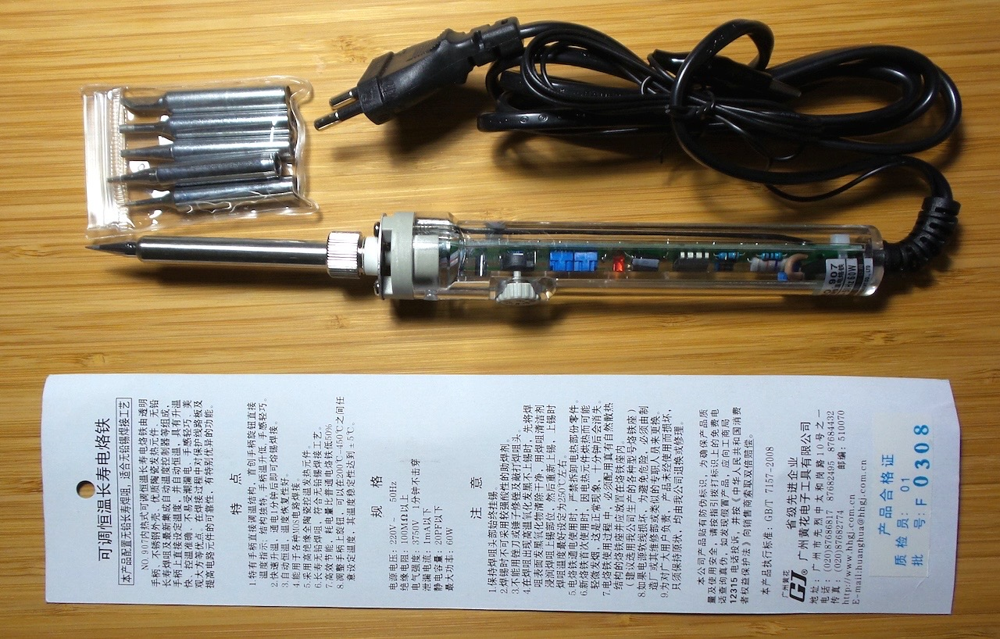
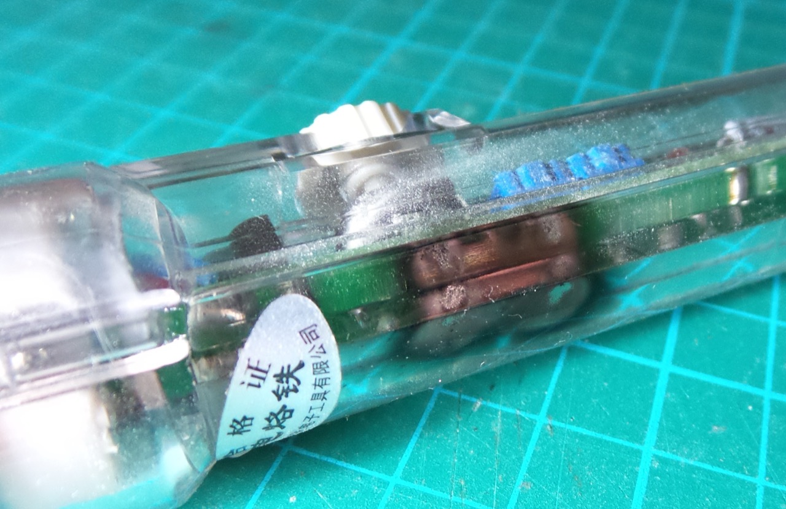
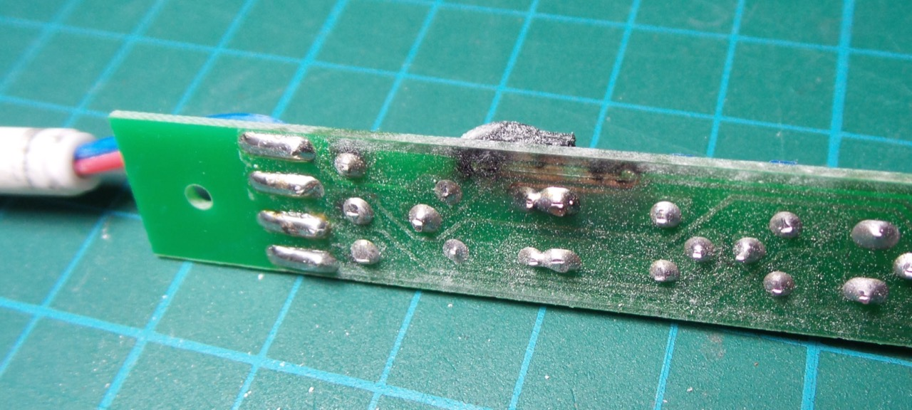
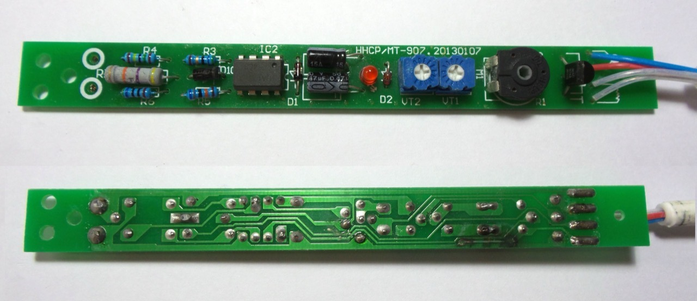
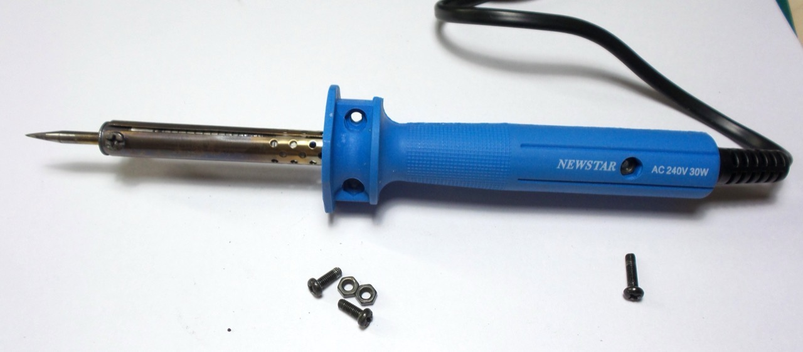
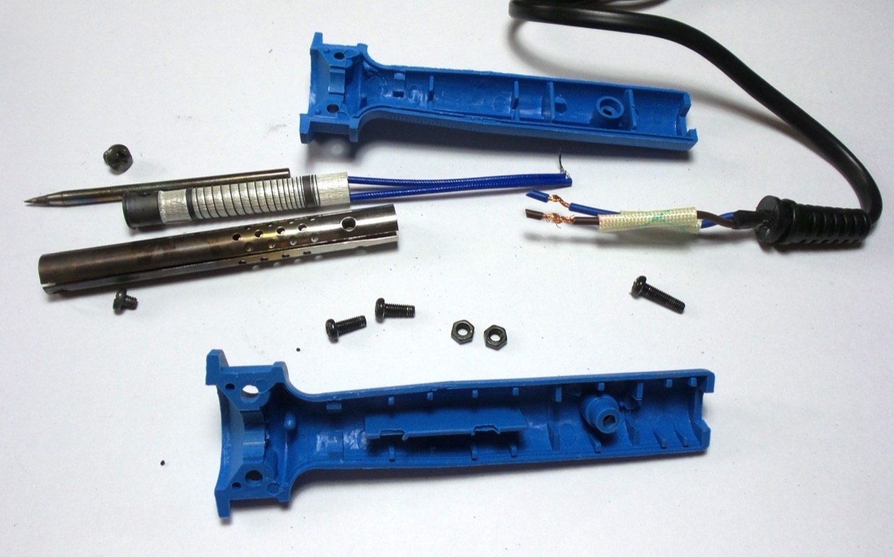

# #298 Handheld Soldering Irons

Notes on my experiences with various cheap hand-held soldering irons. Currently using a GJ 907 adjustable constant temperature iron.

## Notes

For most of my hand soldering, I use a relative cheap iron. I've gone through a couple before settling on the
[GJ 907 adjustable constant temperature iron](https://www.aliexpress.com/item/1998306095.html)
that has kept me very happy since 2016.

Prior to that I had another GJ 907 for about a year before it blew up one day!
I made notes below in the hope of one day diagnosing the problem.

The iron I was using before that was a pretty ordinary Newstar 30W iron. It didn't last long in my novice hands before I threw it out in disgust and "upgraded" to the GJ 907. For hot air work I use a [Saike 909D 3-in-1 hot air rework station](../Saike909D/)

I know there's a whole other level of more "professional" irons and soldering stations such as those from [Hakko](https://hakko.com.sg/) and [Weller](https://www.weller-tools.com/). Great discussions and recommendations can be found for example on:

* [Ham Radio Work Bench Podcast](https://www.hamradioworkbench.com/shop.html)
* [QRPLabs discussions: Soldering iron recommendations](https://groups.io/g/QRPLabs/topic/soldering_iron/13842994)

### Current Iron: GJ 907

[GJ 907 Adjustable constant temperature Lead-free Internal heating electric soldering iron Soldering Station +5pcs tip 220V60W](https://www.aliexpress.com/item/1998306095.html)

### Previous Iron: GJ 907 until it blew up one day

So one day I was soldering with my first GJ 907 and it made a loud pop!
It seems a current surge stripped one of the PCB traces off the board.

Exactly why or how this occurred I never quite diagnosed. I traced the schematic (below).

I go another GJ 907 for comparison purposes, and I've been using that ever since without issue.

### My Beginner Iron: Newstar Soldering Iron (30 watts) NSN-203

When I first started dabbling back into electronics in 2014 or so I started with a Newstar 30W iron.
I can't remember where I even picked it up from - it may have come as part of a kit or from a local hardware store.
I found the iron currently listed on [kinmo.com](https://kinmo.com/product/newstar-soldering-iron-30-watts-nsn-203/).

The Newstar 30W iron is not adjustable, and I found this made it very prone to either being underpowered for the job at hand, or burning itself up.

## Credits and References

* [GJ 907 Adjustable constant temperature Lead-free Internal heating electric soldering iron Soldering Station +5pcs tip 220V60W](https://www.aliexpress.com/item/1998306095.html)
* [Saike 909D 3-in-1 hot air rework station](../Saike909D/)
* [MAC97A8 datasheet](http://parts.io/detail/11636418/MAC97A8)
* [HA17358 datasheet](http://parts.io/detail/4994146/HA17358)
