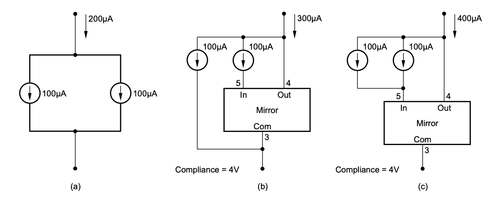
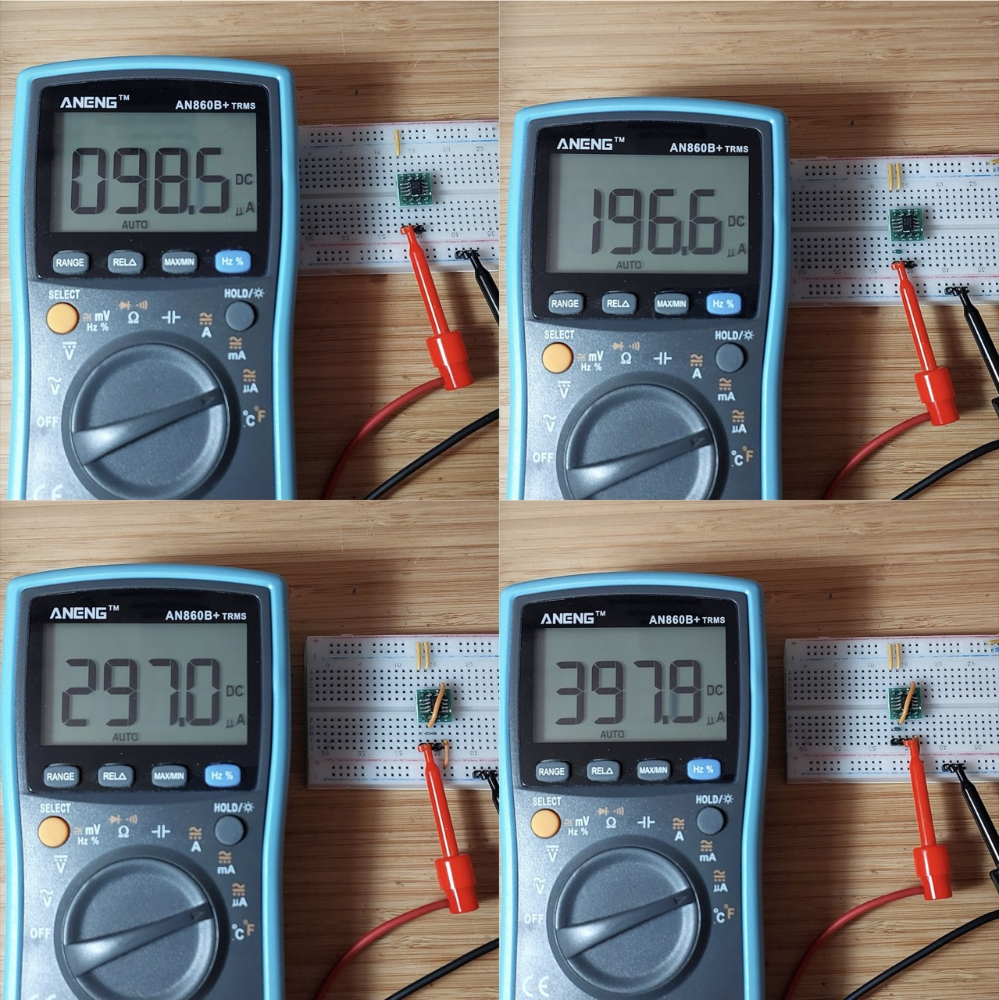
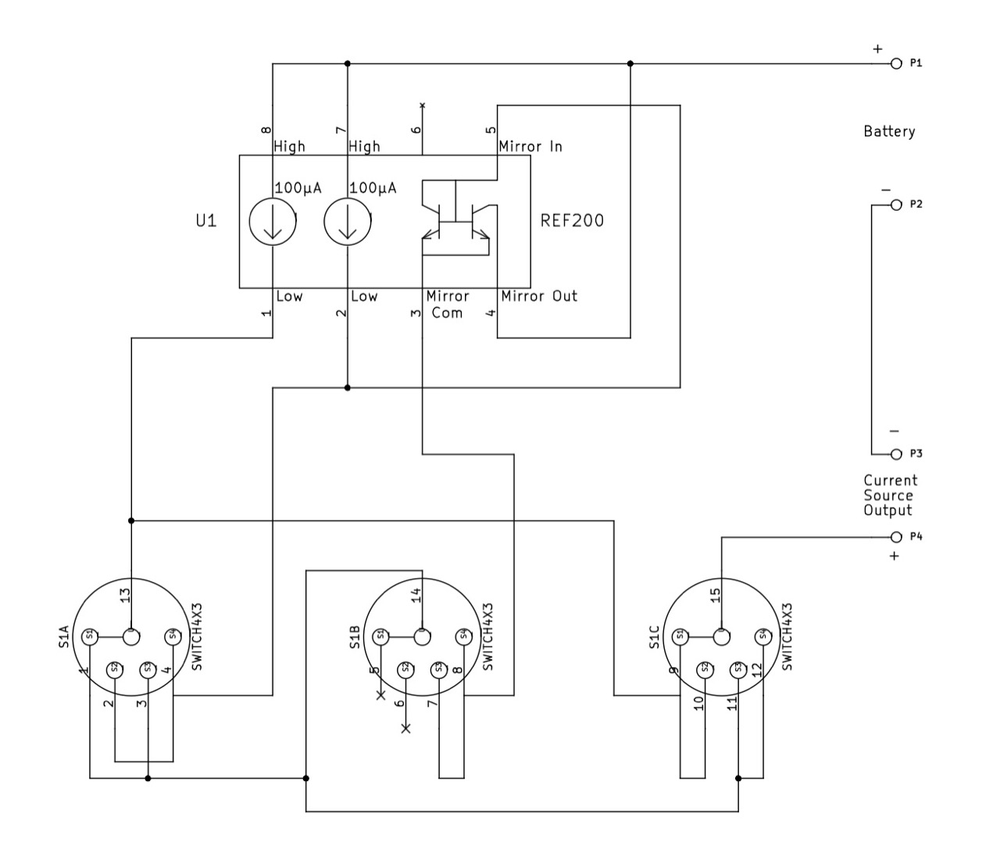
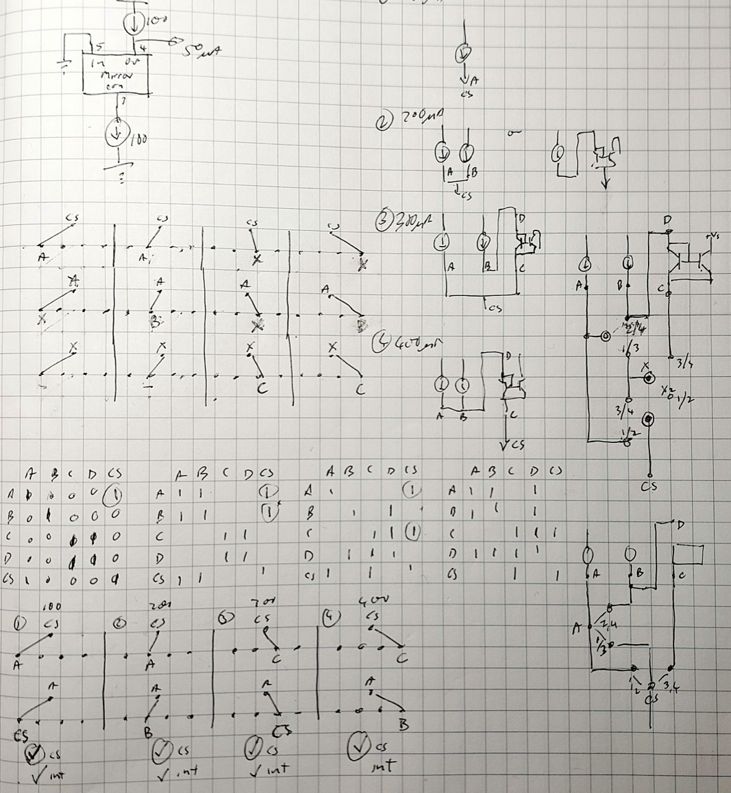
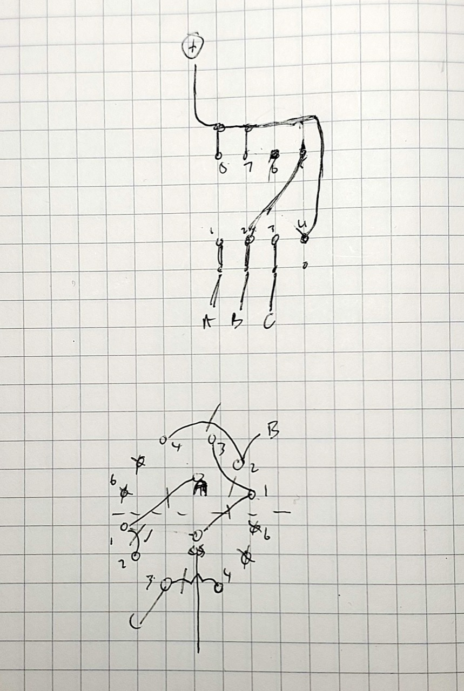
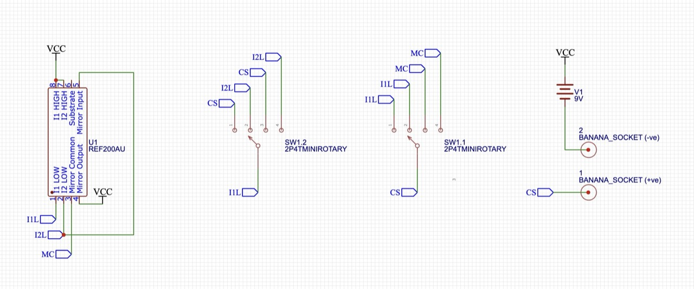
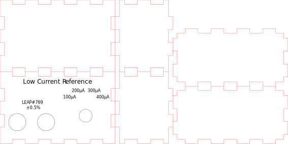
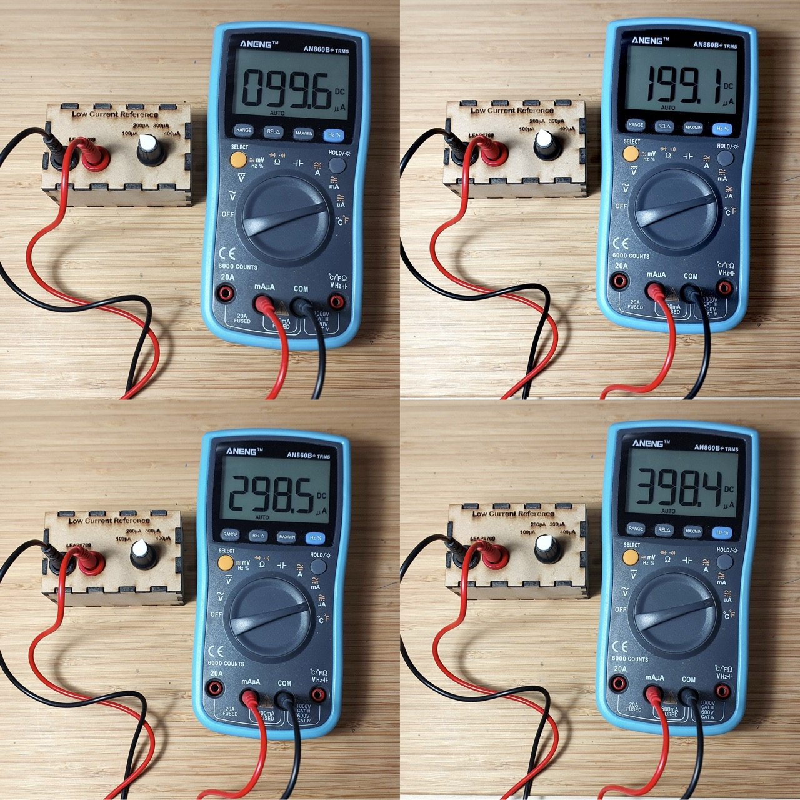

# #769 Low Current Reference

Building a low current reference switchable between 100μA, 200μA, 300μA and 400μA,
based on a design from Louis Scully / Scullcom Hobby Electronics using the REF200 current reference and a laser-cut MDF project case.

## Notes

I saw Louis Scully's [Low Current Reference](http://www.scullcom.uk/design-build-a-low-current-reference-source/) tutorial many years ago,
and it has long been on my list of things to build.

It is quite a simple project - essentially taking advantage of the capabilities of the
[REF200](https://www.ti.com/product/REF200) current reference. The main complexity is in figuring out an efficient switching scheme to enable
100μA, 200μA, 300μA, and 400μA operation.

See the Scullcom Hobby Electronics #40 - Design & Build a Low Current Reference video for the full background:

> In this project we will design and built a Low Current Reference Source which has four switched ranges, namely; 100μA, 200μA, 300μA and 400μA. No calibration is required and it will operate from a standard 9 volt battery with no on/off switch. The unit will have an accuracy of ±0.5% or better.
>
> This project uses the Texas Instruments REF200 Dual Current Source and Current Sink I.C. This I.C. can operate over a wide voltage range from 2.5 V to 40 V and still maintain the accuracy of the output current source. Accuracy of the I.C. is ±0.5%. It also has a very low temperature Coefficient: ±25 ppm/°C.

### Reference Designs

The [REF200 data sheet](https://www.ti.com/product/REF200) provides some reference implementations for 200μA, 300μA, and 400μA current sources.
A 100μA source is simply achieved by tapping one of the integrated 100µA sources.

I've tested the individual circuits on a breadboard, as follows:

| Design | Breadboard Test |
|--------|-----------------|
| 100µA  | 98.5µA          |
| 200µA  | 196.6µA         |
| 300µA  | 297.0µA         |
| 400µA  | 397.9µA         |

NB: current measurements taken with an
[ANENG ANG860B+ Digital Multimeter](../ANG860B/)
with DC µA accuracy is quoted at ±1.5%.

### Switching Design

The original design uses a 3P4T switch to select between the 4 operating modes, as follows:

After analyzing the networks I found a solution that can achieve the required switching with 2P4T. Basically consider a 2-bit/4 state solution:

* CS, current source +ve, switching between
    * I1L (1st current source), or
    * MC (Mirror Common)
* and I1L (1st current source) switching between
    * direct to CS, or
    * connected to I2L

| Position | 1P (CS, current source +ve) | 2P (I1L) | Output        |
|----------|-----------------------------|----------|---------------|
| 1        | I1L                         | CS       | 100µA from I1 |
| 2        | I1L                         | I2L      | 200µA from I1 + I2 |
| 3        | MC                          | CS       | 300µA from MC (2x I2) + I1 |
| 4        | MC                          | I2L      | 400µA from MC (2x (I1 + I2)) |

My scratching workings:

And figuring out the wiring of the switch. Note: I've used a 2P6T because I did not have a 2P4T. Two throws are unused.

Wiring up the actual switch, with a protoboard adapter for the REF200:

### Parts

| Qty | Spec                     | Notes |
|-----|--------------------------|-------|
| 1   | [REF200](https://www.ti.com/product/REF200)                   | |
| 1   | [2P4T](https://www.aliexpress.com/item/32840329605.html)  | used [2P6T](https://www.aliexpress.com/item/32840329605.html) since that is what I had on hand |
| 2   | [4mm Banana Female Jack Panel Mount](https://www.aliexpress.com/item/32684201221.html) | |

The actual schematic of the final build (drawn in EasyEDA):

### Project Box

[MakerCase](https://en.makercase.com/) is one of the many tools available to generate box designs.
I found it on a good [list of box generators](https://www.instructables.com/The-Ultimate-Guide-to-Laser-cut-Box-Generators/).

I used MakerCase to first generate a simple parametric design:

* outside dimensions:
    * width: 80mm
    * height:  50mm
    * depth: 40mm
* material thickness: 3mm
* closed box
* finger joints: 9mm
* exported as [box-template-8x5x4.svg](./assets/box-template-8x5x4.svg)

I then used Affinity Designer ([box-8x5x4.afdesign](./assets/box-8x5x4.afdesign))
to add the front panel etching, and export the resulting design as [box-8x5x4.svg](./assets/box-8x5x4.svg).

This was then imported to Inkscape (with extensions for the cutter) and positioned for laser cutting [box-8x5x4-inkscape.svg](./assets/box-8x5x4-inkscape.svg)
The generated g-code assets:

* engraving file [box-engraving-gcode.txt](./assets/box-engraving-gcode.txt)
* cutting file [box-cut-gcode.txt](./assets/box-cut-gcode.txt)

I cut the box from MDF using the [Lionsforge Craftlaser](https://leap.tardate.com/equipment/nlb/lionsforgecraftlaser/) at my local library .. NLB ftw!

The box parts came out quite nicely. I've just finished them with a light sand:

### Building the Box

Attaching the components. A light file of the holes was required to get the parts to fit nicely.

With a 9V battery fitting snugly inside. There is not much room at all.
If I made this again. I would move the main switch slightly further towards the edges.

Complete. I have glued the front, bottom, top and sides in place.
The rear fits quite tightly without any glue, allowing battery replacement, but normally stays snugly closed.

Testing the ranges..

| Design | Breadboard Test | Final Build Measurements |
|--------|-----------------|--------------------------|
| 100µA  | 98.5µA          | 99.6µA                   |
| 200µA  | 196.6µA         | 199.1µA                  |
| 300µA  | 297.0µA         | 298.5µA                  |
| 400µA  | 397.9µA         | 398.4µA                  |

Note:

* current measurements taken with an [ANENG ANG860B+ Digital Multimeter](../ANG860B/) with DC µA accuracy is quoted at ±1.5%.
* readings are much closer to expected results in the final build compared to the breadboard setup, indocating that the breadboard circuits were responsible for some degree of inaccuracy.

In summary - a successful little build!

## Credits and References

* [Design & Build a Low Current Reference Source](http://www.scullcom.uk/design-build-a-low-current-reference-source/)
* [3P4T 3 Pole 4 Position Single Wafer Band Selector Rotary Switch](https://www.aliexpress.com/item/1005008460542772.html)
* [REF200 Product and Data sheet](https://www.ti.com/product/REF200)
