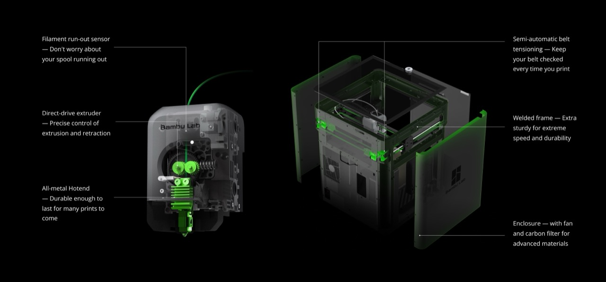
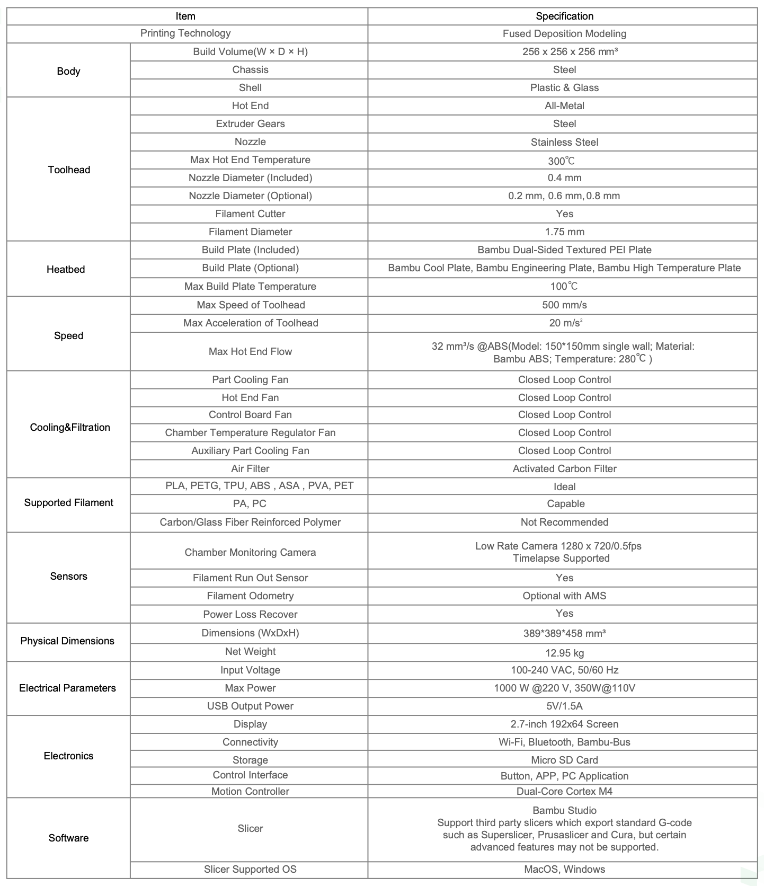
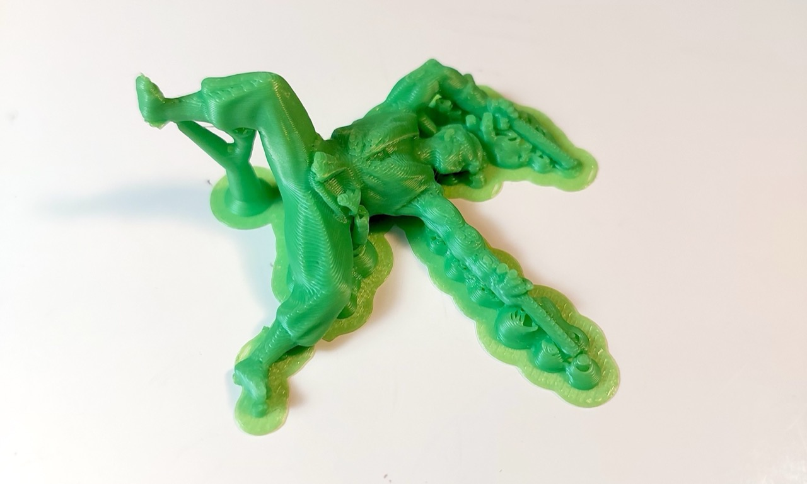

# #xxx Bambu Lab P1S

Using the PLA 3D printing services available in Singapore's National Libraries - Bambu Lab P1S.

## Notes

Singapore's library service - the [National Library Board (NLB)](https://www.nlb.gov.sg/main/home) - run ["MakeIt" centres](https://www.nlb.gov.sg/main/services/MakeIT-at-Libraries) in their libraries where a range of tools are available to citizens to use (including 3D printers, laser cutters, digital cutters, and sewing machines). This is an amazing service. They don't (yet) have 3D resin printers, but these tools make rapid prototyping readily available to all residents at no cost.

For most of these services, they do require users to first complete a free [starter course](https://go.gov.sg/nlb-makeit-events). These help make sure you can keep yourself safe, and save the machines from damage.

I've completed my training, so I can now [book](https://makeitsg.simplybook.asia/v2/) and use the devices available at currently 4 of the libraries (Jurong, Punggol, Tampines, Woodlands).

Note: as of late 2025, the Bambu Lab P1S printers have replaced the [Flashforge Creator Pro 2](../FlashforgeCreatorPro2/) printers previously available.

## About the Bambu Lab P1S

The [Bambu Lab P1S](https://asia.store.bambulab.com/products/p1s)
is a high-speed, reliable desktop FDM 3D printer known for excellent print quality and ease of use for hobbyists. Currently retails from US$399.00 (Mar-2026).

## Software and Workflow

[Bambu Studio](https://bambulab.com/en/download/studio) is used to prepare models for printing.
It is an open-source, cutting-edge, feature-rich slicing software available for Windows and macOS.

Basic workflow:

* import STL or other source material
* scale and orient on the build plate
* adds supports as needed (manual or auto)
* export G-code/3MF file
* load the file on the printer via SD card and print

## Test Print

I did a test print of a 54mm figure, and the results are surprisingly good..

The figure was created with ChatGPT and Tripo3D AI,
see [LCK#421 Tripo3D](https://codingkata.tardate.com/ai/tripo3d/) for details.

## Credits and References

* [Bambu Lab P1S](https://asia.store.bambulab.com/products/p1s)
* [Bambu Studio](https://bambulab.com/en/download/studio)
* [LCK#421 Tripo3D](https://codingkata.tardate.com/ai/tripo3d/)
