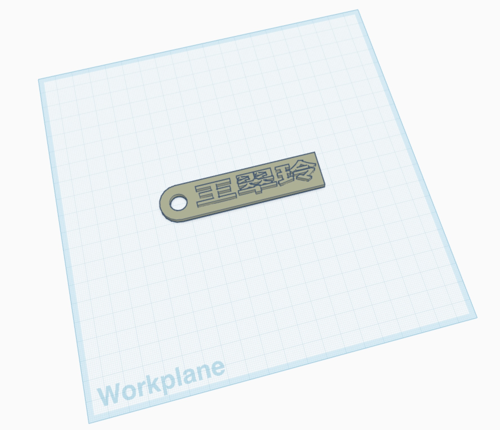

# #756 NLB Flashforge Creator Pro 2

Using the amazing PLA 3D Printing services available in Singapore's National Libraries - Flashforge Creator Pro 2, Flashforge Dreamer, and 3D Pens.

## Notes

Last year I accidentally discovered that Singapore's library service - the [National Library Board (NLB)](https://www.nlb.gov.sg/main/home) - has been running ["MakeIt" centres](https://www.nlb.gov.sg/main/services/MakeIT-at-Libraries) in their libraries where a range of tools are available to citizens to use (including 3D printers, laster cutters, digital cutters, and sewing machines). This is an amazing service. They don't (yet) have 3D resin printers, but these tools make rapid prototyping readily available to all residents at no cost.

For most of these services, they do require users to first complete a free [starter course](https://www.nlb.gov.sg/main/services/MakeIT-at-Libraries). These help make sure you can keep yourself safe, and save the machines from damage.

I've completed the training for the 3D printing facilities, so I can now [book](https://makeitsg.simplybook.asia/v2/) and use the PLA printers available at currently 4 of the libraries (Jurong, Punggol, Tampines, Woodlands). There are 3 types of equipment available:

* Flashforge Creator Pro 2
    * the main printers currently available. Each stocked with PLA in 2 colors
    * [Starter Session - 2024-09-01](./assets/makeit-3d-printing-starter-session-2024-09-01.pdf)
* Flashforge Dreamer
    * I think the original printers that were made available
    * [3D Printer Guide](./assets/makeit-selfservice-3dprinter-guide.pdf) - [source](https://file.go.gov.sg/makeit-selfservice-3dprinter-guide.pdf)
* 3D Pens
    * [3D Pen Guide](./assets/makeit-selfservice-3dpen-guide.pdf) - [source](https://file.go.gov.sg/makeit-selfservice-3dpen-guide.pdf)

### About the Flashforge Creator Pro 2 3D Printer

The library still uses the [FlashPrint 5](https://flashforge.com/pages/software-flashprint) software for slicing.
They provide laptops with the software pre-installed. It can be downloaded for use elsewhere (Windows only, not available for latest macOS).

See the [Creator Pro 2 User Guide](./assets/creator-pro-2.pdf).

### Workflow

The [starter training](./assets/makeit-3d-printing-starter-session-2024-09-01.pdf) introduced the basic process:

* using [TinkerCAD](https://www.tinkercad.com/) to make a 3D model
* export to STL
* using [FlashPrint 5](https://flashforge.com/pages/software-flashprint) to import the STL and slice it. Settings:
    * nozzle size: 0.4mm
    * layer height: 0.1mm min, 0.3mm max
    * shell count: increase to 3 to strengthen the part (default: 2)
    * top solid layers: increase to 5 to solidify the part (default: 3)
    * bottom solid layers: increase to 4 to solidify the part (default: 3)
    * fill density: reduce to speed up the print (default: 15%)
    * raft: disable unless required
* export to [CNC G-code](https://en.wikipedia.org/wiki/G-code)
* use an SD card to load and print the g-code on the printer

The starter course has everyone design and print a simple name tag
(the tag I made: [name-tag-wcl.stl](./assets/name-tag-wcl.stl)).

### 3D Model Sources

* <https://www.printables.com>
* <https://www.thingiverse.com>
* <https://www.thangs.com>
* <https://www.myminifactory.com>

## Credits and References

* [NLB MakeIT At Libraries](https://www.nlb.gov.sg/main/services/MakeIT-at-Libraries)
    * [NLB MakeIT booking](https://makeitsg.simplybook.asia/v2/)
* [FlashPrint 5](https://flashforge.com/pages/software-flashprint)
* [TinkerCAD](https://www.tinkercad.com/)
* [CNC G-code](https://en.wikipedia.org/wiki/G-code)
