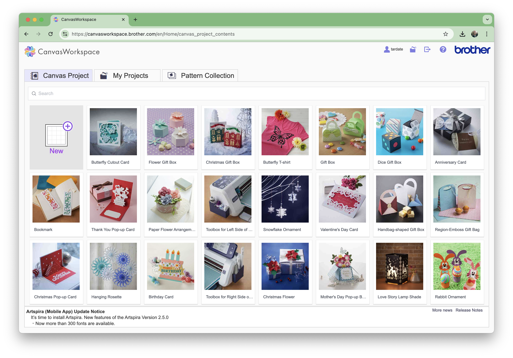
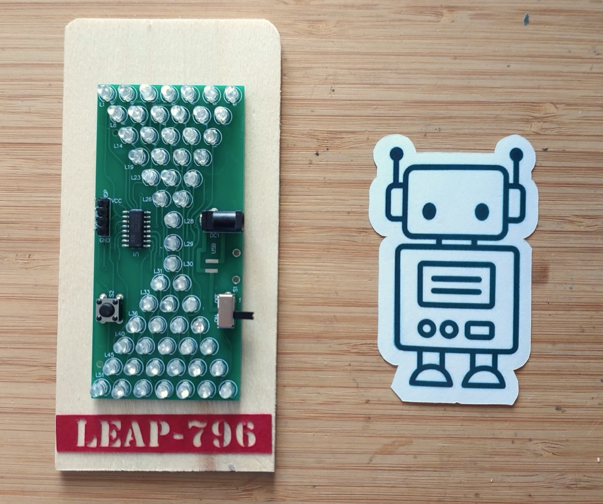

# #xxx Brother ScanNCut SDX1200

Using the laser cutting services available in Singapore's National Libraries - Brother ScanNCut SDX1200

## Notes

Last year I accidentally discovered that Singapore's library service - the [National Library Board (NLB)](https://www.nlb.gov.sg/main/home) - has been running ["MakeIt" centres](https://www.nlb.gov.sg/main/services/MakeIT-at-Libraries) in their libraries where a range of tools are available to citizens to use (including 3D printers, laster cutters, digital cutters, and sewing machines). This is an amazing service. They don't (yet) have 3D resin printers, but these tools make rapid prototyping readily available to all residents at no cost.

For most of these services, they do require users to first complete a free [starter course](https://go.gov.sg/nlb-makeit-events). These help make sure you can keep yourself safe, and save the machines from damage.

I've completed the training for the digital cutting facilities, so I can now [book](https://makeitsg.simplybook.asia/v2/) and use the devices available at currently 4 of the libraries (Jurong, Punggol, Tampines, Woodlands).

## About the Brother ScanNCut SDX1200

Key features of the [Brother ScanNCut SDX1200](https://www.brother.com.sg/en/scanncuts/all-scanncuts/sdx1200):

* Stand-alone – no PC required
* Now cuts up to 3 mm thick materials like foam and felt
* 600 dpi capable built-in scanner
* Fully automatic blade
* 1,303 built-in designs with 17 fonts
* Wireless connectivity
* Precise, faster, quieter cutting

### Main methods of cutting

* Design using the built-in screen
    * use library of shapes
    * then cut
* Scan and cut
    * scan a picture into the machine, which performs edge-detection
    * use the built-in screen to edit/cleanup
    * then cut
* Cut from FCM file (a fabric cutting design format created by Brother CanvasWorkspace)
    * use [CanvasWorkspace](https://canvasworkspace.brother.com/) to design
    * import SVG, DXF, FCM
    * transfer via USB or wireless
    * then cut

### Supported materials

* Paper
    * e.g. use for basic prototyping of projects before committing to final materials.
* Cardstock
    * e.g. create decorative crafts with varying thickness and texture.
* Vinyl Sticker
    * e.g. make adhesive decals and stickers to apply to different surfaces.
* Cardboard
    * e.g. use for structural prototyping before finalising materials with laser cutter.

### Workshop Examples

In the starter session we tried three things:

* scan an image (the robot below-right) and cut it out with a border margin
* use the built-in designer to cut some shapes - we chose a range of sea creatures and flowers (not shown here)
* use [CanvasWorkspace](https://canvasworkspace.brother.com/) to design and cut
    * I made a label for [LEAP#796 Project](../../../Electronics101/HourglassKit/) (below-left)
    * design exported to [Workshop_Test](./assets/Workshop_Test.fcm)

## Credits and References

* [NLB MakeIT At Libraries](https://www.nlb.gov.sg/main/services/MakeIT-at-Libraries)
    * [NLB MakeIT booking](https://makeitsg.simplybook.asia/v2/)
* [xTool S1 40W Enclosed Diode Laser Cutter](https://www.xtool.com/products/xtool-s1-laser-cutter)
* [Brother ScanNCut SDX1200](https://www.brother.com.sg/en/scanncuts/all-scanncuts/sdx1200)
* [CanvasWorkspace](https://canvasworkspace.brother.com/)
* [FCM files](https://fileinfo.com/extension/fcm#canvasworkspace_fabric_cutting_design)
