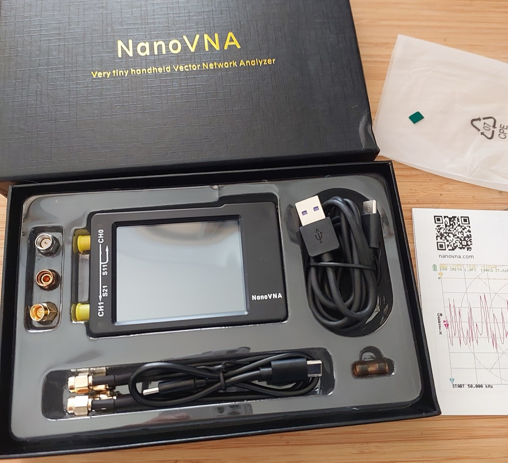
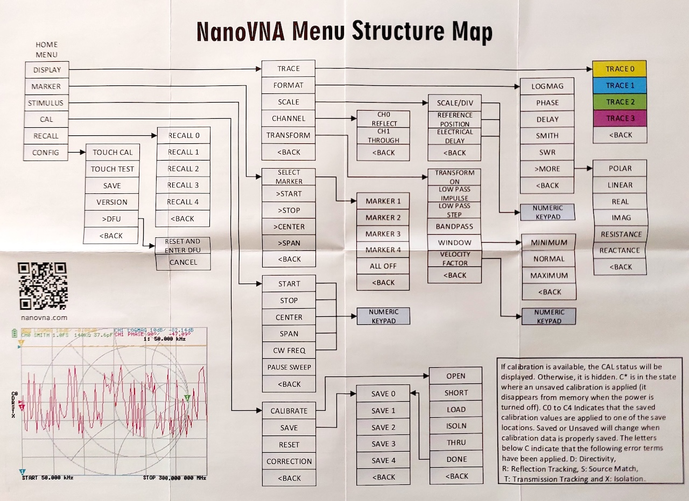
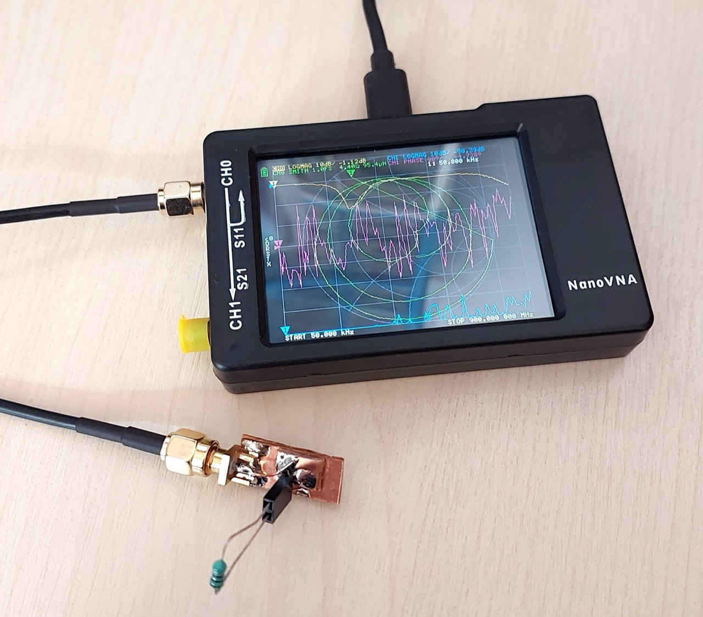
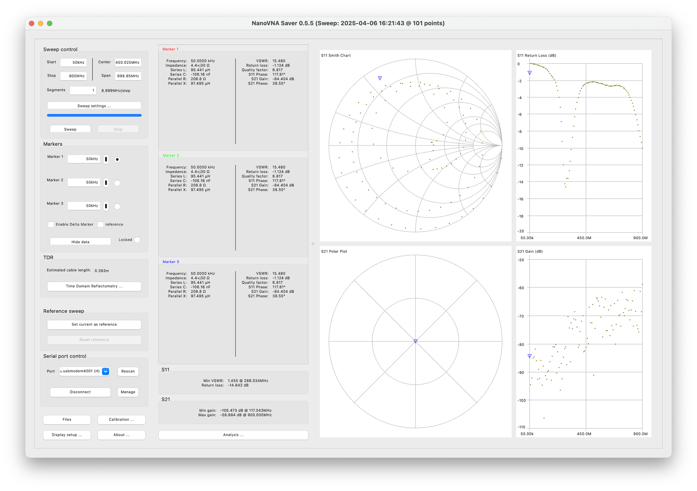

# #767 NanoVNA

Unpacking and doing some basic tests with the NanoVNA, including using the NanoVNASaver software on macOS.

## Notes

A [Vector Network Analyzer (VNA)](https://en.wikipedia.org/wiki/Network_analyzer_(electrical)) is a powerful instrument used to measure the electrical characteristics of radio frequency (RF) and microwave components. It evaluates how signals behave in a network by analyzing parameters such as reflection (S11) and transmission (S21), commonly referred to as S-parameters. Engineers and hobbyists use VNAs to design, test, and troubleshoot antennas, filters, cables, and other RF devices by providing detailed insights into impedance, return loss, and signal behavior across a range of frequencies.

The [NanoVNA](https://nanovna.com/) is a compact, low-cost, open-source VNA that has gained popularity among electronics enthusiasts, amateur radio operators, and engineers for its affordability and portability. Despite its small size, it offers surprisingly capable performance, making it ideal for basic RF measurements in the field or lab. The NanoVNA allows users to visualize data in real time on a built-in screen or via PC software, making it a practical entry point into the world of RF testing and analysis.

### The NanoVNA

I purchased the
["NanoVNA-H 50KHz~1.5GHz VNA 2.8inch LCDHF VHF UHF UV Vector Network Analyzer Antenna Analyzer" from a seller on aliexpress](https://www.aliexpress.com/item/4000340610778.html)
currently listed for SG$118.30 (was $57.99 when I purchased in 2020).

Package included:

* 1x Antenna Analyzer Host
* 2x 20cm SMA Male to Male RG174 RF Cable
* 1x SMA Female to Female Connector
* 1x SMA Simple Calibration Kit SHORT
* 1x SMA Simple Calibration kit OPEN
* 1x SMA Simple Calibration kit LOAD
* 1x USB Type-C Data Cable
* 1x USB-C to USB-C Line
* 1x Touch Paddle

### Tutorials and Other References

Hackaday published a quick introduction the the NanoVNA: [So. You Bought A VNA. Now What?](https://hackaday.com/2020/04/23/so-you-bought-a-vna-now-what/).
It was also reviewed in some details in [Silicon Chip Apr 2020 (p34)](https://www.siliconchip.com.au/Issue/SC/2020/April).

The most comprehensive and useful tutorial series is by W2AEW, see his
[NanoVNA playlist](https://www.youtube.com/playlist?list=PL4ZSD4omd_AylEyNCQYR3RcEb0olukPEJ).

### Charging

With USB cable attached

* red LED fast flash during battery charge.
* red LED slow flash when charged

### Calibration

First, calibrate as follows.

* Make sure START is 50kHz
* Make sure STOP is 900MHz
* Calibrate according to the [calibration method](https://nanovna.com/?page_id=2)
    * choose `CAL` from the main menu
    * choose `RESET`
    * choose `CALIBRATE`
    * connect the open standard to S11, press `OPEN`
    * connect the short standard to S11, press `SHORT`
    * connect the load standard to S11, press `LOAD`
    * connect the load standard to S21, press `ISOLN`
    * connect cable from S11 to S21, press `THRU`
    * press `DONE`

Note: some clearer instructions can be found at
<https://hexandflex.com/2019/08/31/getting-started-with-the-nanovna-part-1/>

### Menu Map

The menu mmap for the version of the software that came pre-installed:

### Measuring Impedances

### NanoVNASaver

[NanoVNASaver](https://github.com/NanoVNA-Saver/nanovna-saver) is an open source multiplatform tool to save Touchstone files from the NanoVNA,
sweep frequency spans in segments to gain more than 101 data points, and generally display and analyze the resulting data.

I am running macOS as my main machine. There are various ways to install NanoVNASaver, this is the one that worked without any issues:

I used pyenv to install python 3.12.9 (older than the main versions I run). NanoVNASaver appears to still require versions before 3.13.

First created a virtual environment (in a folder named `venv`) and install the latest source using pip:

    $ pyenv shell 3.12.9
    $ python --version
    Python 3.12.9
    $ python -m venv venv
    $ source venv/bin/activate
    (venv)$ pip install https://github.com/NanoVNA-Saver/nanovna-saver/archive/refs/tags/v0.5.5.tar.gz

Once installed, the virtual environment just needs to be activated before running the app:

    $ source venv/bin/activate
    (venv)$ NanoVNASaver
    NanoVNASaver 0.5.5

    Copyright (C) 2019, 2020 Rune B. Broberg
    Copyright (C) 2020ff NanoVNA-Saver Authors

    This program comes with ABSOLUTELY NO WARRANTY
    This program is licensed under the GNU General Public License version 3

    See https://github.com/NanoVNA-Saver/nanovna-saver for further details.

Here's a quick test with a 100µH choke on S11:

The test sweep as captured with NanoVNASaver:

## Credits and References

* ["NanoVNA-H 50KHz~1.5GHz VNA 2.8inch LCDHF VHF UHF UV Vector Network Analyzer Antenna Analyzer"](https://www.aliexpress.com/item/4000340610778.html) - a seller on aliexpress
* [NanoVNA](https://nanovna.com/)
* [NanoVNASaver](https://github.com/NanoVNA-Saver/nanovna-saver)
* [Vector Network Analyzer (VNA)](https://en.wikipedia.org/wiki/Network_analyzer_(electrical))  - wikipedia
* [So. You Bought A VNA. Now What?](https://hackaday.com/2020/04/23/so-you-bought-a-vna-now-what/)
* Review: 900MHz Touchscreen Vector Network Analyser - [Silicon Chip Apr 2020 p34](https://www.siliconchip.com.au/Issue/SC/2020/April)
* [w2aew NanoVNA playlist](https://www.youtube.com/playlist?list=PL4ZSD4omd_AylEyNCQYR3RcEb0olukPEJ)
