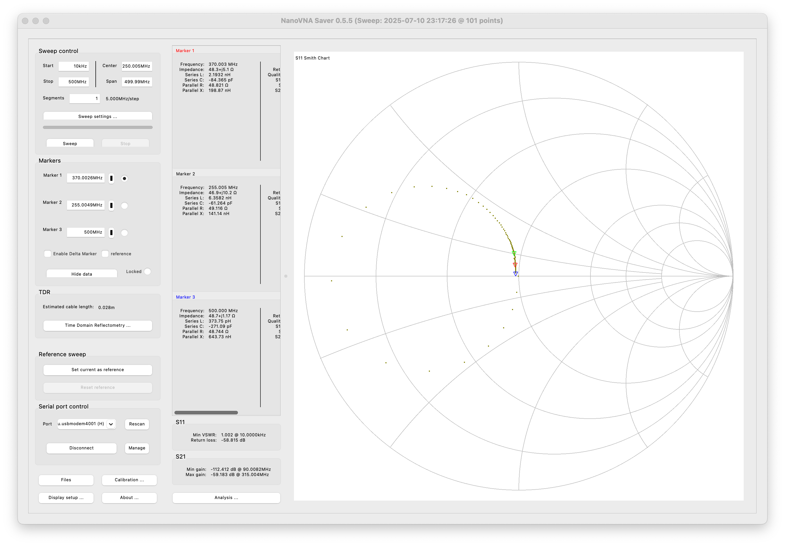
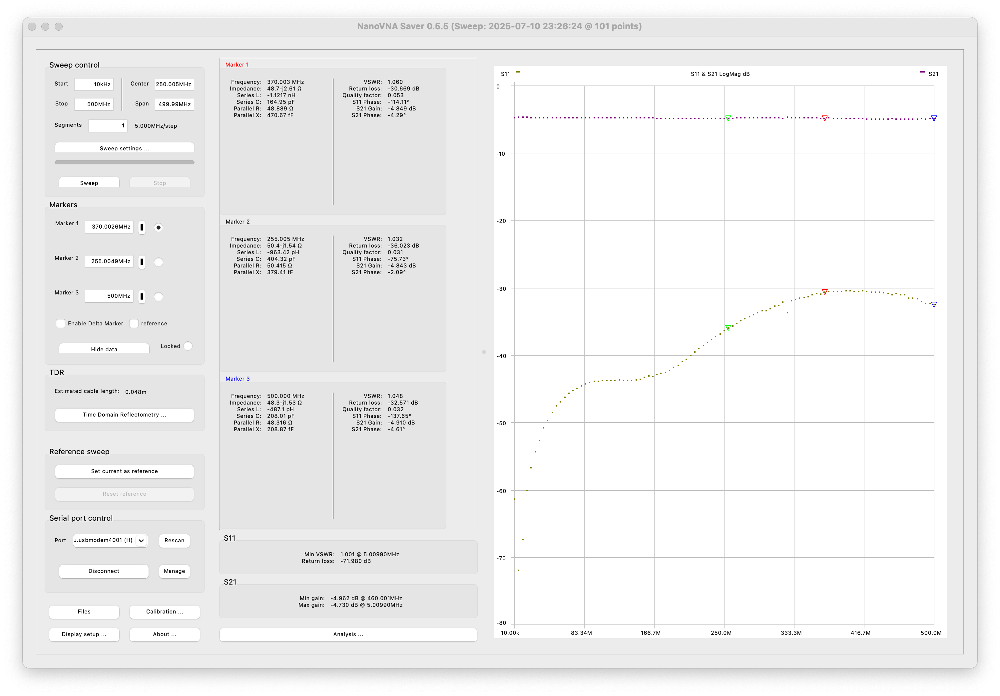

# #776 RF Demo Kit

Using the NWDZ Rev-01-10 RF Test Board with the NanoVNA.

## Notes

The NWDZ Rev-01-10 RF Test Board is widely available from many sellers; I got mine from
[aliexpress](https://www.aliexpress.com/item/1005005622482238.html) for SGD$7.64 (April 2025).

It is designed for primarily for testing  and learning how to use a vector network analyzer,
such as the NanoVNA - see [LEAP#767](../) for more on the NanoVNA.

### RF Demo Kit Product Description

Package List:

* 1 x RF Demo Kit Board
* 2 x UFL Patch Cord

Test circuits:

* Pad 1: 30MHz low-pass filter
* Pad 2: 100MHz high-pass filter
* Pad 3: 433MHz band-pass filter (BPF)
* Pad 4: 6.5MHz notch/band-stop filter (BSF)
* Pad 5: 33Ω load SWR=1.5
* Pad 6: 75Ω load SWR=1.5
* Pad 7: Capacitor (C) circuit
* Pad 8: Inductor (L) circuit
* Pad 9: resistor-capacitor (RC) series circuit
* Pad 10: inductor-capacitor (LC) series circuit
* Pad 11: capacitor in series with parallel resistor-inductor (RLC) circuit
* Pad 12: resistor in parallel with series capacitor-inductor (RLC) circuit
* Pad 13: short
* Pad 14: open
* Pad 15: load (50Ω)
* Pad 16: through connection
* Pad 17: -5dB attenuation circuit
* Pad 18: -10dB attenuation circuit

Board front and rear:

### Calibration

To calibrate the NanoVNA with the RF Board and connectors,
I used the following procedure:

* set `START` to 10kHz, `END` to 500MHz
* choose `CAL` from the main menu
* choose `RESET`
* choose `CALIBRATE`
* connect S11 to the "14: Open" pad, press `OPEN`
* connect S11 to the "13: Short" pad, press `SHORT`
* connect S11 to the "15: Load" pad, press `LOAD`
* connect S21 to the "15: Load" pad, press `ISOLN`
* connect S11 and S21 via the "16: Thru" pad, press `THRU`
* press `DONE`

## Tests

For the following tests, I am capturing the result with [NanoVNASaver](https://github.com/NanoVNA-Saver/nanovna-saver)

### Testing Pad 1: 30MHz low-pass filter

### Testing Pad 2: 100MHz high-pass filter

### Testing Pad 3: 433MHz band-pass filter (BPF)

### Testing Pad 4: 6.5MHz notch/band-stop filter (BSF)

### Testing Pad 5: 33Ω load SWR=1.5

### Testing Pad 6: 75Ω load SWR=1.5

### Testing Pad 7: Capacitor (C) circuit

### Testing Pad 8: Inductor (L) circuit

### Testing Pad 9: resistor-capacitor (RC) series circuit

### Testing Pad 10: inductor-capacitor (LC) series circuit

### Testing Pad 11: capacitor in series with parallel resistor-inductor (RLC) circuit

### Testing Pad 12: resistor in parallel with series capacitor-inductor (RLC) circuit

### Testing Pad 17: -5dB attenuation circuit

### Testing Pad 18: -10dB attenuation circuit

## Credits and References

* [NanoVNA Filter Attenuator VNA RF Test Board Tester Demo Kit Module Breadboard Network Analyzer Universal Tool](https://www.aliexpress.com/item/1005005622482238.html) - aliexpress
* [LEAP#767 NanoVNA](../)
* [NanoVNASaver](https://github.com/NanoVNA-Saver/nanovna-saver)

## Video References

### #517 NANOVNA RF Demo Board - IMSAI Guy

### NanoVNA RF Test Board - RF Demos Kit - HAMTech RADIO SCANNER M0FXB CB DRONE HOBBY Diary

