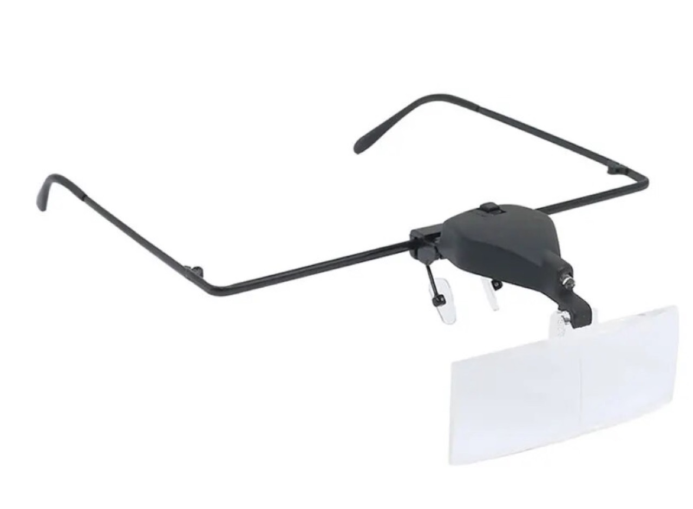
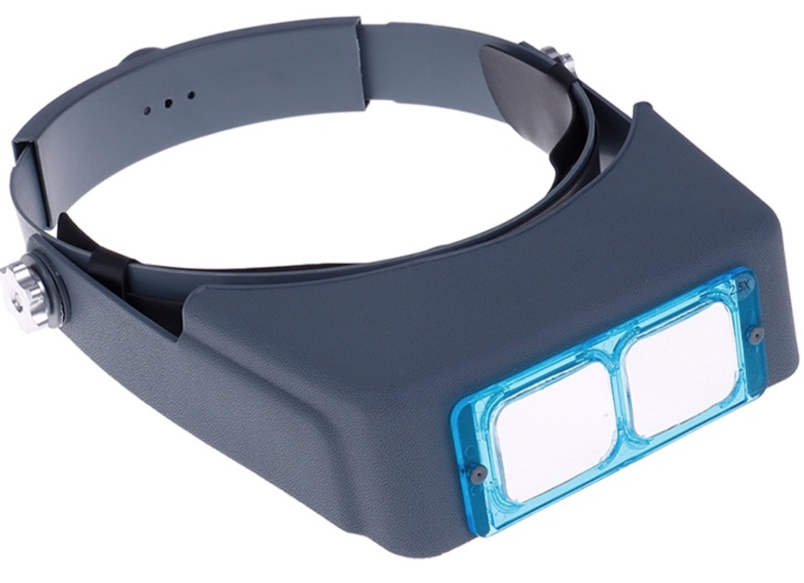
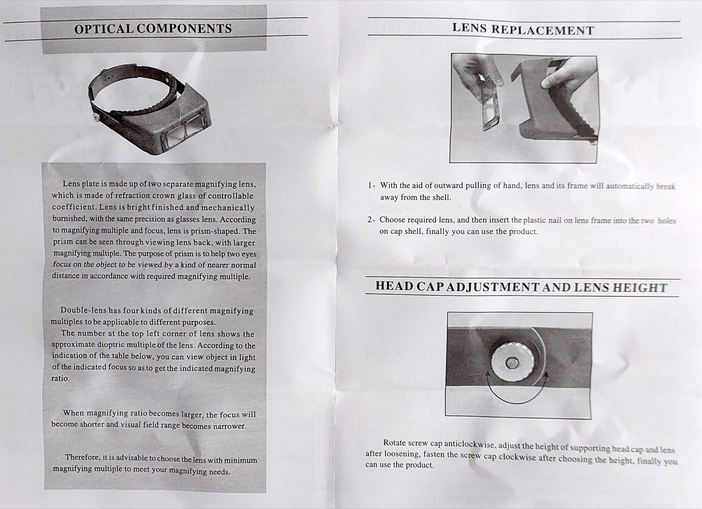
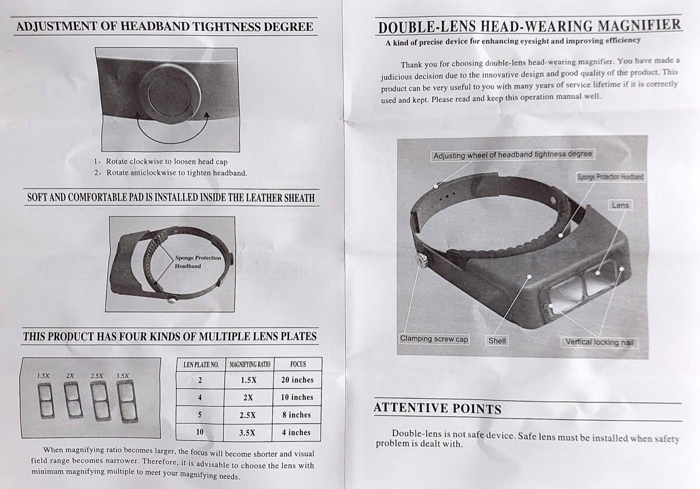
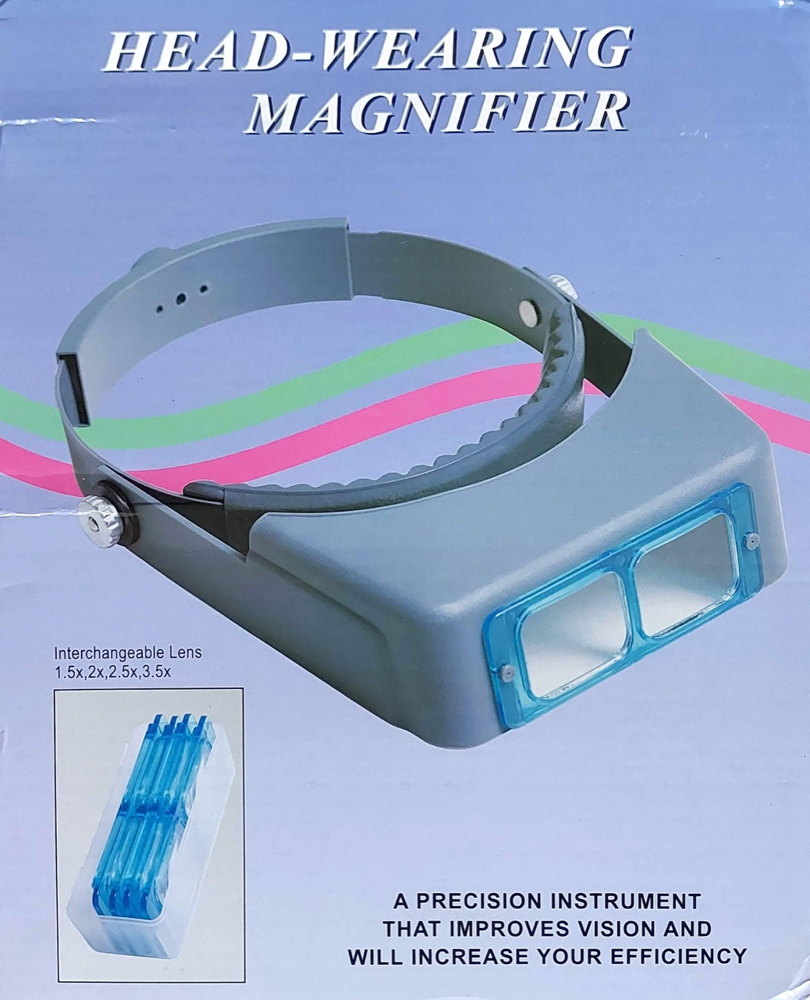
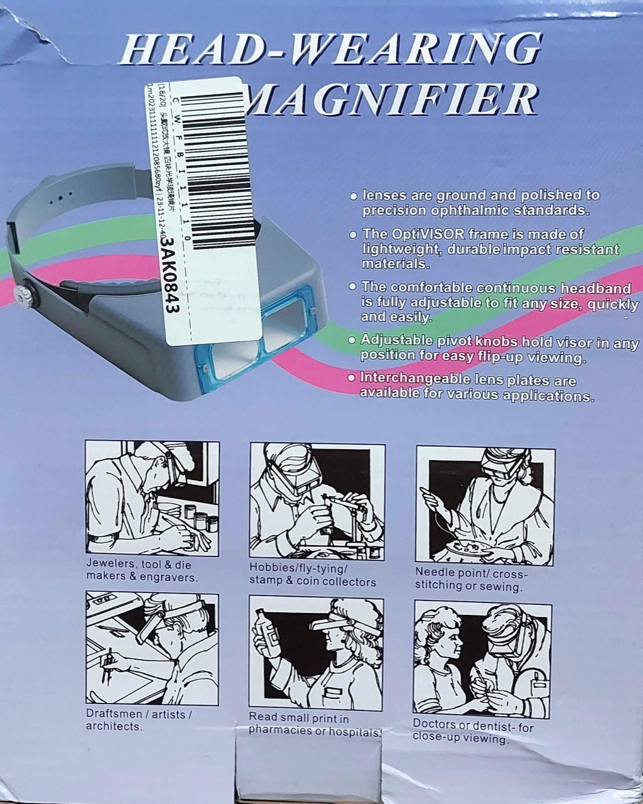

# #734 Optivisor

Trying a new Optivisor for close-up work.

## Notes

I've previously used
[magnifying glasses](https://vi.aliexpress.com/item/1005003223922659.html) from a seller on aliexpress.
These are convenient, but I don't find them comfortable for extended use.

I decided to try an optivisor with headband to see if these were more comfortable.
I found a good deal from a [seller on shopee.sg](https://shopee.sg/DayDayTo-Optivisor-headband-magnifier-loupe-repair-magnifying-glass-spectacles-sg-i.168390908.23742543221)

So far:

* yes, they are more comfortable
* but perhaps not as convenient as the glasses

I can see myself continuing to use both, switching between them depending on the task.

### Instructions

## Credits and References

* [DayDayTo Optivisor headband magnifier loupe repair magnifying glass spectacles](https://shopee.sg/DayDayTo-Optivisor-headband-magnifier-loupe-repair-magnifying-glass-spectacles-sg-i.168390908.23742543221) - seller on shopee
* [Eyeglass Magnifier with LED Lamp with 1.5X 2.5X 3.5X Lens Illuminated Magnifying Glass Loupe Make Both Hands Free for Repairing](https://vi.aliexpress.com/item/1005003223922659.html) - from a seller on aliexpress
