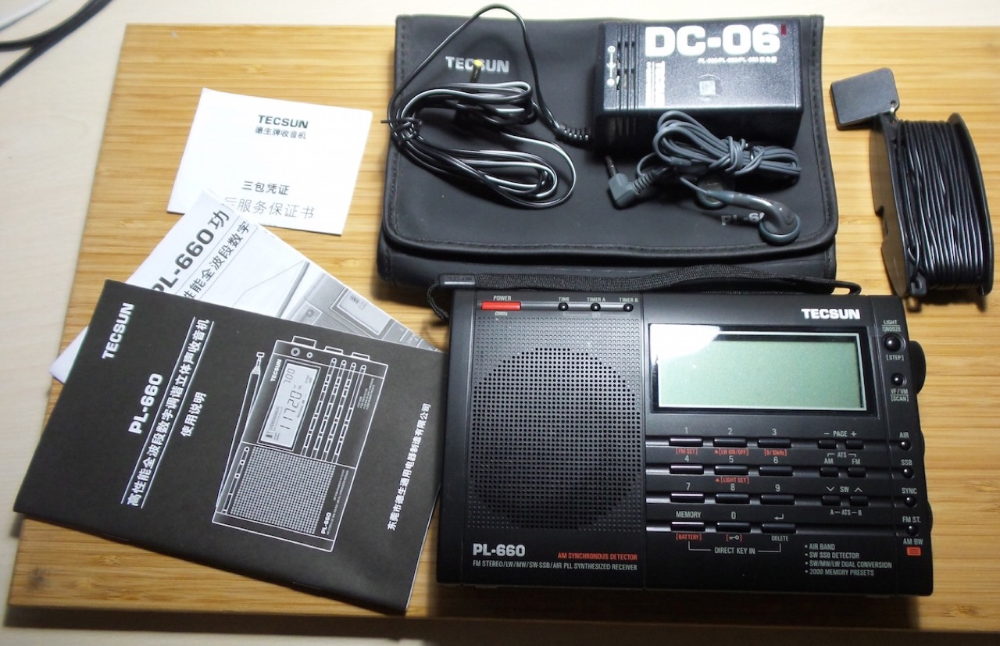

# #xxx Tecsun PL-660

About the Tecsun PL-660 portable FM/MW/LW/SW/SSB/AIR band receiver.

## Notes

I bought the Tecsun PL-660 from an aliexpress seller back in 2018 for SGD$150.30.
I mainly wanted it to monitor the HF/SW bands to cross-check and verify my various radio receiver projects.

The PL-660 is still available from [some aliexpress sellers](https://www.aliexpress.com/item/1005008076464823.html), however prices seem grossly inflated.
It may now be better to look at other models such as the [PL-330](https://www.tecsun-radios.com/product/pl330-radio-receiver/) if you are in the market for something like this.

For more detailson the PL-660, see the
[PL-660 Product Page](https://www.tecsun-radios.com/product/pl660-radio-receiver/)
and download the
[PL-660 Manual](https://www.tecsunradios.com.au/store/wp-content/uploads/2015/12/PL-660-MANUAL.pdf).

### PL-660 Specifications

Frequency Range:

| Band | Frequencies             | Step                                                            |
|------|-------------------------|-----------------------------------------------------------------|
| FM   | 76~108 / 87~108 MHz     | 0.01MHz / 0.1 MHz                                               |
| MW   | 522~1620 / 520~1710 kHz | 9K for North America or other countries / 10K for South America |
| LW   | 100~519 kHz             | 1 kHz / 9 kHz                                                   |
| SW   | 1711~29999 kHz          | 1 kHz / 5 kHz                                                   |
| AIR  | 118~137 MHz             | 1kHz / 25 kHz                                                   |

Features:

* Dual conversion for MW/LW/SW with excellent sensitivity & selectivity Synchronous detector
* Single Side Band (SSB) with BFO control
* 2000 station memories
* Multiple tuning methods
* Sleep timer from 1-120 minutes
* Dual alarm clock with auto turn off timer from 1-90 minutes
* DX / Normal / Local antenna gain
* Treble/Bass tone selection
* Backlight and snooze function
* Signal strength & battery consumption display
* External FM / SW antenna jack
* Extra-long telescopic antenna
* Stereo earphones jack (3.5mm)
* Power source:
    * 3.5mm DC jack (6V)
    * 4 x UM3 (AA) size battery
* Unit size: 187 x 114 x 33 mm
* Color: Black / Silver

### Unboxing

### Performance

Works great! See it in use with some of my projects. for example:

* [LEAP#375 Three Transistor Shortwave Receiver](../../Radio/ThreeTransistorShortWaveReceiver/)

## Credits and References

* [PL-660 Product Page](https://www.tecsun-radios.com/product/pl660-radio-receiver/)
* [PL-660 Manual](https://www.tecsunradios.com.au/store/wp-content/uploads/2015/12/PL-660-MANUAL.pdf)
