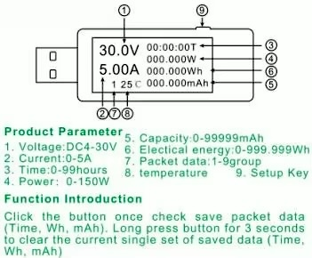
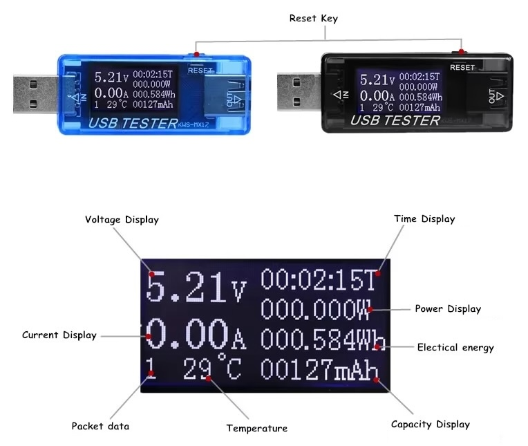

# #713 USB Multifunction Tester

Examining the KWS-MX17 inline USB multi-function tester

## Notes

The KWS-MX17 device sites inline and monitors USB voltage, current, power, timing and temperature.
It is very handy for keeping an eye on current drawn by an appliance for example.

It is widely available, for example from sellers on aliexpress, with listings such as:
[8 in1 QC2.0 3.0 4-30v Electrical power USB capacity voltage tester current meter monitor voltmeter ammeter](https://www.aliexpress.com/item/32812273461.html)

## Specifications

Model:KWS-MX17

* Voltage: DC4-30V
* Current: 0-5A
* Time: 0-99hours
* Power: 0-150W
* Capacity: 0-99999mAh
* Electrical energy: 0-999.999Wh

## Credits and References

* [8 in1 QC2.0 3.0 4-30v Electrical power USB capacity voltage tester current meter monitor voltmeter ammeter](https://www.aliexpress.com/item/32812273461.html) - seller on aliexpress
