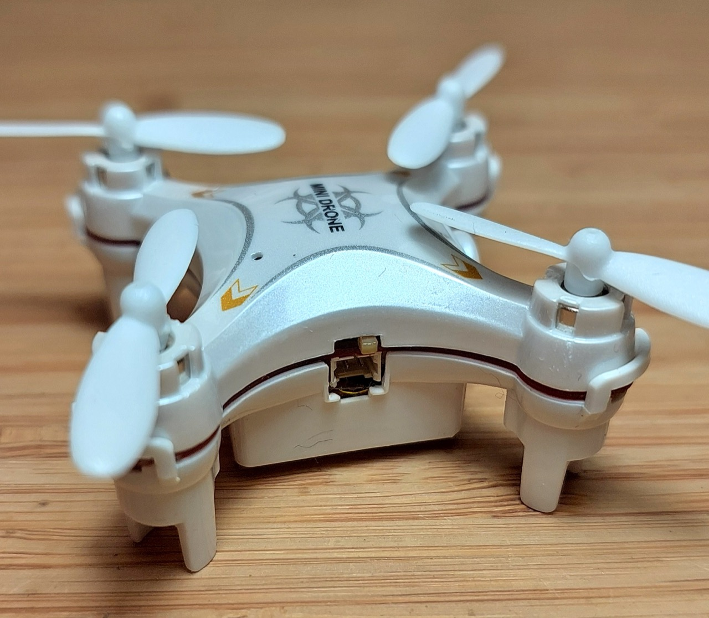
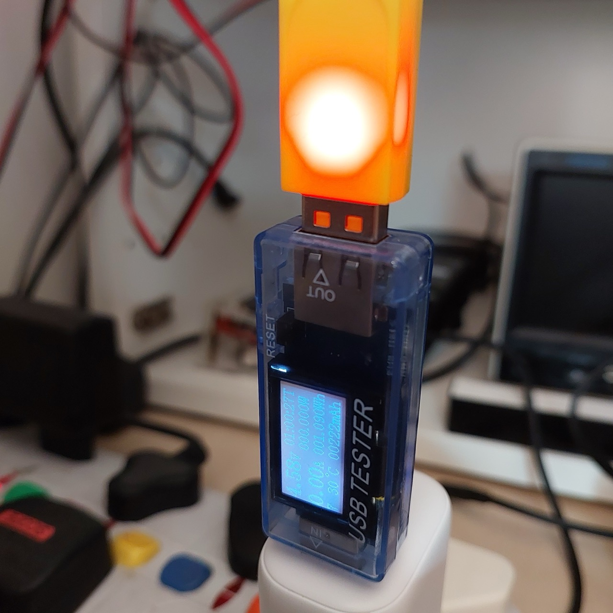

# #225 FQ777-954 Tear Down

Teardown an FQ777-954 nano drone and figure out as much of the technical design as possible.

## Notes

The FQ777-954 and its derivatives (RC Leading RC101W, Cheerson CX-10W..) is a pretty hot item if one can judge
by the number of unboxing and flight test reports - a simple [search on youtube](https://www.youtube.com/results?search_query=FQ777-954)
will find a few thousand. I get the impression someone has been flooding the market with review units!

What is much harder to come by is good technical information beyond the usual product feature specs.

I recently got an [FQ777-954](https://www.aliexpress.com/item/FQ777-954-mini-Drone-The-Eyes-RC-Quadcopter-WIFI-FPV-with-720P-Camera-4CH-6Axis-APP/32641566808.html). And yes I can confirm its fun and pretty amazing for such a small package!

Since I'm interesting in exploring ways of controlling it with my own electronics and code, I first wanted to
study the technical design and specs. Good information is hard to come by, but the following is the best I've been able
to figure out and collate to date.

### Product Specifications

This is basically the extent of the information available from most sources:

* Channel: 4CH Gyro: 6 axis Flight Duration: 6-7 Minutes Quadcopter Control Distance: 30 meters
* Recharging Time: 25mins Battery For Quadcopter: 3.7V 150mAh/25C(included) Battery For Transmitter: 2 x AAA Battery (not included)
* Quadcopter weight: 17g
* Product size: 60x60x26mm
* Camera: 0.3Megapixel(480P)/Photo Quality 640x480 / Video Quality 640x480,30FPS
* Function: WIFI FPV camera/Take photo/Record video/up/down/forward/backward/side flying/360˚rolling action/hover/3D/LED

Note that many listings claim 720P but actually ship as 480P. FQ do make 720P drones but as far as I can tell,
there is no 720P version of the FQ777-954 (yet).

### Manufacturer

The FQ777-954 is produced by [Fu Qi / FQ Model Factory](http://fuqitoys.en.alibaba.com/) located in the Chinese Toys Town -- Chenghai, Shantou City, Guangdong Province. They design, manufacture and sell a range or drones, RC models and other toys and have been around since 1997.

They also offer OEM arrangements, so it is possible that other "similar" drones are actually originally manufactured by FQ.

### Mechanical Design - Propulsion

The FQ777-954 uses a conventional quadcoptor configuration of counter-rotating propellers to offset torque:

### Disassembly

Parts out of the box. This is the "BNF" version (no controller). It also comes in an "RTF" version with controller.
Without a controller, it can be flown with the RC Leading mobile application.

The top comes of:

* remove the rotors - requires a bit of force or a level/tool (they are press-fit)
* remove the 4 screw on the underside of the rotor arms

Close-up of the top:

* main processor board, with an unidentified processor chip and camera attached by ribbon cable
* sitting on the receiver board, which also runs wires to the the 4 motors

The bottom shell comes off by unclipping from the four arms of the receiver board:

* 3.7V 150mAh LiPo battery

Underside of the main processor board, featuring:

* Marvell Wi-Fi SoC
* BergMicro SPI Flash memory

### Processor Board

The main detail I haven't been able to pin down is perhaps the most important - which processor does it use?
The identification has been etched off, but I'm guessing it's something like a Cortex M3.

Main components:

* CPU - unidentified
* [Marvell 88W8801 IEEE 802.11n (1x1) single-band (2.4GHz) Wi-Fi SoC with integrated PA, LNA, and TX/RX Switch](http://www.marvell.com/microcontrollers/wi-fi-microcontroller-platform/wi-fi/)
* [BergMicro BG25Q80ASICG 8M-bit Serial Peripheral Interface(SPI) Flash memory](http://www.trolink.cn/Products/BG25Q80A.html)

### Receiver Board

The so-called receiver board also doubles as the structural component that holds the motors in position as well as the LEDs.

* [F16867 FQ777-954-02 Receiver Board for 954 The Eyes RC Quadcopter Drone Accessories Spare Parts](https://www.aliexpress.com/item/F16867-FQ777-954-02-Receiver-Board-for-954-The-Eyes-RC-Quadcopter-Drone-Accessories-Spare-Parts/32602860102.html)

### Camera

* 0.3MP Camera 4809 640x480 : SPA03442 V3.0 7P 0308
* [FQ777-954-10 RC Drone Quadcopter Parts 30W Camera with Cable for FQ777 954 The Eyes F16875](https://www.aliexpress.com/item/FQ777-954-10-RC-Drone-Quadcopter-Parts-30W-Camera-with-Cable-for-FQ777-954-The-Eyes/32653552823.html)

### Chassis/Case

* [F16864 /66 FQ777-954-01 Chassis Upper Case + Lower Case for FQ777 954 The Eyes RC Quadcopter](https://www.aliexpress.com/item/F16864-66-FQ777-954-01-Chassis-Upper-Case-Lower-Case-for-FQ777-954-The-Eyes-RC/32613923072.html)

### Motors

2x clockwise brushless motors, 2x counter-clockwise brushless motors.

* [4pcs 1set FQ777-126C drone Spare Parts Motor 2pcs CW Motor and 2 pcs CCW Motor for FQ777 126C RC Helicopter Quadcopter](https://www.aliexpress.com/item/4pcs-1set-FQ777-126C-drone-Spare-Parts-Motor-2pcs-CW-Motor-and-2-pcs-CCW-Motor/32673422957.html)

### Rotors

* [Free Shipping FQ777-124 Cheerson CX-10 CX-10A RC Quadcopter Parts Blade Propeller 5set=20pcs](https://www.aliexpress.com/item/Free-Shipping-FQ777-124-Cheerson-CX-10-CX-10A-RC-Quadcopter-Parts-Blade-Propeller-5set-20pcs/32458373757.html)

### USB Charging Cable

* [FQ777-124 / Cheerson CX-10/cx-10A/cx-10W RC Quadcopter Spare Parts USB Charging Cable CX-10-012 RC quadcopter](https://www.aliexpress.com/item/FQ777-124-Cheerson-CX-10-cx-10A-RC-Quadcopter-Spare-Parts-USB-Charging-Cable-CX-10/32517023241.html)

### Battery

* 3.7V 150mAh 15L19
* [FQ777-954 FQ777 954 MINI Quadcopter 3.7V 150mAh 25c Li-Po battery Spare Parts](https://www.aliexpress.com/item/FQ777-954-FQ777-954-MINI-Quadcopter-3-7V-150mAh-25c-Li-Po-battery-Spare-Parts/32652226271.html)

### Using the Drone

#### Power Switch

It's not clear in any of the documentation, and there are no marks on the drone, but the drone power switch functions as follows:

* switch right: drone off or for charging
* switch left: drone on

#### Charging

Contrary to some of the printed documentation, the charging cable I received with the drone behaves as follows:

* when charging in progress - no light
* when fully charged (as depicted in the picture below) - charging will stop and the red light in the USB adapter will glow

NB: drone power switch must be in the "off" position for charging to start

#### Mobile Application

The original application released for use with the drone is no longer available in the Google Play store: <https://play.google.com/store/apps/details?id=com.lewei.multiple.rcleading>

I've tried a range of other apps currently in the Google Play store, but none seem to be compatible.

It seems that a v3.5 APK of the RC-Leading app is available for download from other sources, such as
<https://apkpure.com/rc-leading/com.lewei.multiple.rcleading>.

I downloaded this to an old/spare Andriod phone, and it works fine without any apparent issues.

## Credits and References

* [FQ777 954 FQ777-954 Mini Drone The Eyes RC Quadcopter WIFI FPV with 0.3MP Camera 4CH 6Axis APP Control BNF & RTF](https://www.aliexpress.com/item/FQ777-954-mini-Drone-The-Eyes-RC-Quadcopter-WIFI-FPV-with-720P-Camera-4CH-6Axis-APP/32641566808.html) - example available from an aliexpress seller
* [fuqitoys](http://fuqitoys.en.alibaba.com/) - manufacturer
* [FQ777-954 Factory-direct](http://fuqitoys.en.alibaba.com/product/60415170562-801977057/FQ777_954_Nano_wifi_control_nano_drone_fpv_with_camera_rc_quadcopter.html)
* [How to hack IP camera in toy drone](https://www.reddit.com/r/HowToHack/comments/4512il/how_to_hack_ip_camera_in_toy_drone/)
* [Open source firmware for toy drones](http://diydrones.com/profiles/blogs/open-source-firmware-for-toy-drones)
* [Eachine H8 mini acro firmware](https://github.com/silver13/h8mini-acro)
* [python code for controlling the FQ777-954 drone through wifi](https://github.com/voorloopnul/drone-fq777-954)
* [FQ777-954 Chrome App](https://github.com/FREEZX/fq777-954-chrome-app)
* [FQ777-954 “The Eyes” Review](http://rc-view.com/index.php/2016/01/16/fq777-954/) - one of the more competent technical reviews
* [Item No.RC101W 2.4G 4CH RC Nano Quadcopter with 6-axis gyroscope](http://www.rc-leading.com/productShow.asp?id=1942) - clone/competitor
* [..as mentioned on my blog](https://blog.tardate.com/2017/01/littlearduinoprojects225-fq777-teardown.html)
