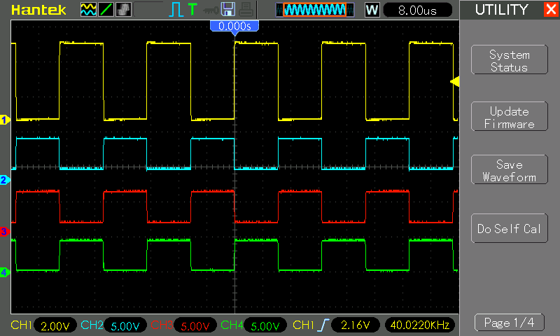

# #858 NanoLev

The most minimalist acoustic levitation demo using an Arduino Nano to drive a pair of TCT40-16 ultrasonic transmitters.

Here's a quick demo..

## Notes

I had my first taste of acoustic levitation with a kit - see [LEAP#849 Ultrasonic Levitator Kit](../UltrasonicLevitatorKit/).

With this project, I'm going back t the basics to reproduce the early projects that demonstrated this concept.

This is the most basic form - driving a pair of TCT40-16 ultrasonic transmitters with an Arduino Nano.

### Circuit Design

Designed with Fritzing: see [NanoLev.fzz](./NanoLev.fzz).

### The Sketch

See [NanoLev.ino](./NanoLev.ino).

Essential operation:

* sets up an interrupt service routine to fire at 80kHz
* each interrupt: toggles the A0-A1 and A2-A3 output pairs

Here is a trace of the outputs captured on a scope:

* CH1 (Yellow) - A0
* CH2 (Blue) - A1
* CH3 (Red) - A2
* CH4 (Green) - A3

### Build and Test

Adjusting the piezo spacing and testing levitation before soldering in place:

The completed test module:

In operation:

Works very well! See the demo..

## Credits and References

* [LEAP#856 TCT40-16](../../../Electronics101/Ultrasonics/TCT40-16/)
* [Ultrasonic Levitation | Acoustic Levitation Experiment](https://projecthub.arduino.cc/milespeterson101/ultrasonic-levitation-acoustic-levitation-experiment-22df22)
* <https://millermansprojects.blogspot.com/2018/11/mini-acoustic-levitation.html>
* [Original project from Make Magazine by Ulrich Schmerold.](https://www.heise.de/ratgeber/Einfacher-Ultraschall-Levitationsapparat-4022505.html)
* <https://www.instructables.com/Acoustic-Levitator/>
* [easy acoustic levitator](https://www.tinkercad.com/things/2yDkXuRhWhw) 3D Design by IB-as
* <https://github.com/gbarbarov/NanoLev>
