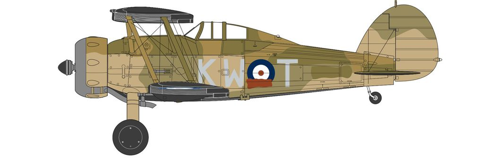
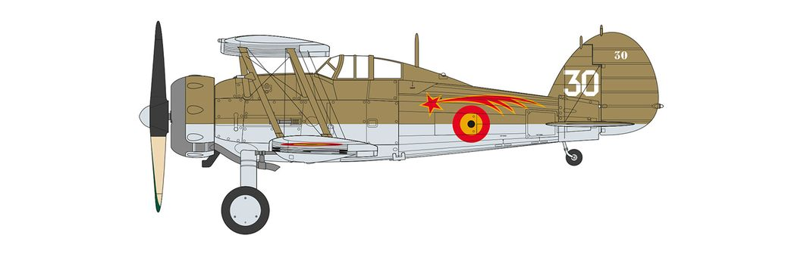

# #741 Gloster Gladiator

Building the Airfix 1:72 Gloster Gladiator Mk II over St. Inglevert, Northern France, December 1939.
No electronics in this one.

## Notes

The Gloster Gladiator is a British biplane fighter. It was used by the Royal Air Force (RAF) and the Fleet Air Arm (FAA) (as the Sea Gladiator variant) and was exported to a number of other air forces during the late 1930s.

Developed privately as the Gloster SS.37, it was the RAF's last biplane fighter aircraft, and was rendered obsolescent by newer monoplane designs even as it was being introduced. Though often pitted against more advanced fighters during the early days of the Second World War, it acquitted itself reasonably well in combat.

The Gladiator saw action in almost all theatres during the Second World War, with a large number of air forces, some of them on the Axis side. The RAF used it in France, Norway, Greece, the defence of Malta, the Middle East, and the brief Anglo-Iraqi War (during which the Royal Iraqi Air Force was similarly equipped). Other countries deploying the Gladiator included China against Japan, beginning in 1938; Finland (along with Swedish volunteers) against the Soviet Union in the Winter War and the Continuation War; Sweden as a neutral noncombatant (although Swedish volunteers fought for Finland against USSR as stated above); and Norway, Belgium, and Greece resisting Axis invasion of their respective lands.

### References

Gloster Gladiator Mk.I 1/72 Airfix - PLASMO

Airfix 1/72 Gloster Gladiator Mk I/II Build and Review

### Marking Schemes

#### Scheme A (selected scheme)

Gloster Gladiator Mk.II No.615 (County of Surrey) Squadron, Royal Air Force, St. Inglevert, Northern France, December 1939. (A)

| Feature               | Color                  | Recommended | Paint Used |
|-----------------------|------------------------|-------------|------------|
| engine inlet pipes    | Silver - Metallic      | Humbrol 11  | |
| engine block          | Black - Gloss          | Humbrol 21  | H18 |
|                       | Trainer Yellow - Matt  | Humbrol 24  | |
| upper camo.           | Dark Earth - Matt      | Humbrol 29  | H72 |
| upper camo            | Dark Green - Matt      | Humbrol 30  | H64 |
| cockpit details       | Black - Matt           | Humbrol 33  | |
| under camo            | Black - Matt           | Humbrol 33  | H12 |
| under camo            | White - Matt           | Humbrol 34  | H11 |
| engine cowling        | Gunmetal - Metallic    | Humbrol 53  | |
| cockpit interior      | Aluminium - Metallic   | Humbrol 56  | |
|                       | Flesh - Matt           | Humbrol 61  | |
| cockpit upper         | Cockpit Green          | Humbrol 78  | H320 |
|                       | Cream - Matt           | Humbrol 103 | |
| compass               | Ocean Grey - Matt      | Humbrol 106 | |
| lower camo            | US Light Green - Matt  | Humbrol 117 | H303 |
| lower camo            | US Light Earth - Matt  | Humbrol 119 | H310 |

#### Scheme B

Gloster Gladiator Mk.I 1 Escadrille, 1 Groupe Belgian Air Force, Schaffen Air Base, Diest, Belguim, 1938. (B)

| Feature               | Color                  | Recommended | Paint Used |
|-----------------------|------------------------|-------------|------------|
|                       | Black - Matt           | Humbrol 33  | |
|                       | Gunmetal - Metallic    | Humbrol 53  | |
|                       | Aluminium - Metallic   | Humbrol 56  | |
|                       | Matt Mid Green         | Humbrol 101 | |
|                       | Matt Pale Stone        | Humbrol 121 | |
|                       | Matt Olive Drab - Matt | Humbrol 155 | |

### Build Log

Gloster Gladiator Mk.II over St. Inglevert, France, 1939.

Added to my wall of flight..

## Credits and References

* [this project on scalemates](https://www.scalemates.com/profiles/mate.php?id=74137&p=projects&project=135764)
* [A02052A Gloster Gladiator Mk.I/Mk.II](https://uk.airfix.com/products/gloster-gladiator-mkimkii-a02052a)
* [Gloster Gladiator Mk.I/II Airfix No. A02052A 1:72](https://www.scalemates.com/kits/airfix-a02052a-gloster-gladiator-mki-ii--1189956)
* [Gladiator for Airfix Eduard No. CX377 1:72](https://www.scalemates.com/kits/eduard-cx377-gladiator--233515)
* [Gloster Gladiator](https://en.wikipedia.org/wiki/Gloster_Gladiator) - wikipedia
* [LFIS – SAINT INGLEVERT LES DEUX CAPS](https://vfr-pilote.fr/aerodrome/lfis/)
* [Saint-Inglevert Airfield](https://maps.app.goo.gl/7Z7XQM4Q8Agubeet9)
