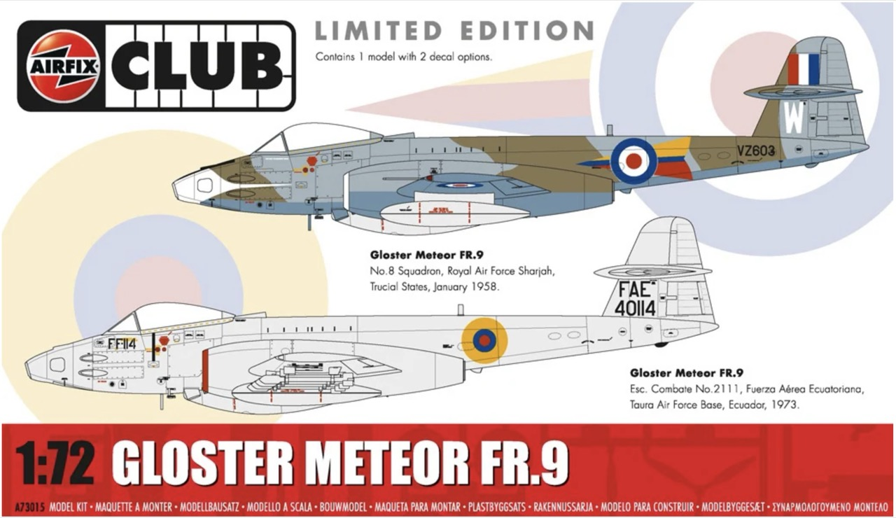
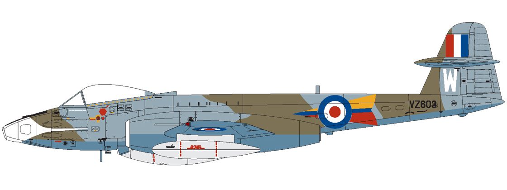
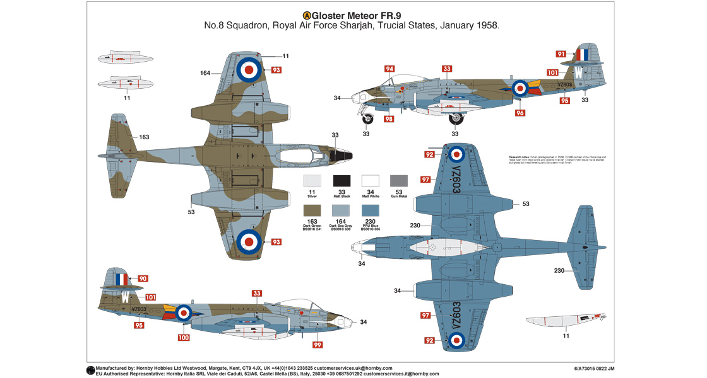
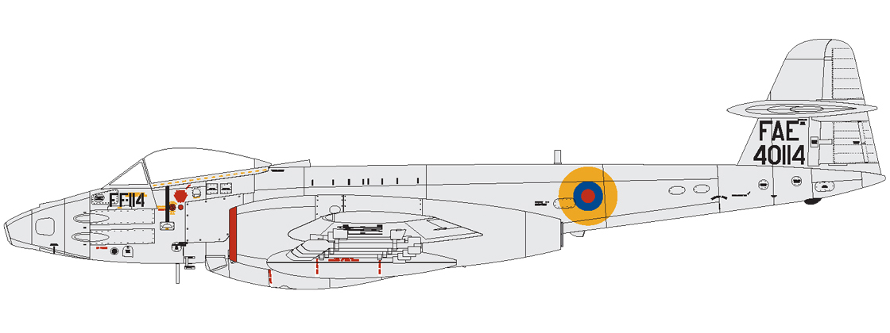

# #758 Gloster Meteor FR.9

Building the 1:72 Airfix 2022 tooling of the Gloster Meteor FR.9. No electronics in this one.

## Notes

The Gloster Meteor FR.9 was a variant of the Gloster Meteor, which was the first British jet fighter and the Allies' only jet aircraft to see combat in World War II. The Meteor itself entered service in 1944, but it was primarily used for intercepting German V-1 flying bombs and saw limited combat against enemy aircraft.

The FR.9 variant was introduced after the war as a specialized fighter-reconnaissance aircraft. It first flew in March 1950 and entered service with the Royal Air Force (RAF) shortly after. The FR.9 was based on the Meteor F.8 airframe, but it featured modifications to carry reconnaissance cameras in the nose while retaining its fighter capabilities. It had an elongated nose for camera equipment and was primarily used for tactical reconnaissance missions.

Equipped with Rolls-Royce Derwent 8 engines, the Meteor FR.9 had a top speed of around 600 mph (965 km/h) and a service ceiling of 43,000 feet (13,000 meters). It was operational during the early stages of the Cold War and served in various theaters, including Germany and the Middle East, before being phased out in the mid-1950s as more advanced jet aircraft like the Hawker Hunter entered service.

The FR.9 was retired from active service by the late 1950s but played a significant role in early post-war reconnaissance efforts.

### The Kit

[Gloster Meteor FR.9 Airfix Club Limited Edition No. A73015 1:72](https://www.scalemates.com/kits/airfix-a73015-gloster-meteor-fr9--1412592)
is the club boxing of the 2022 tool [Gloster Meteor F.8 No. A04064](https://www.scalemates.com/kits/airfix-a04064-gloster-meteor-f8--1396777).
It contains some new parts and schemes.

### Scheme A

I've chosen to build scheme A.

Gloster Meteor FR.9 VZ603/W, No.8 Squadron Royal Air Force, Sharjah, Trucial States, January 1958.

| Feature               | Color                    | Recommended | Paint Used |
|-----------------------|--------------------------|-------------|------------|
| cockpit interior      | Coal Black               | 85          |            |
| cockpit fittings      | Matt Black               | 33          |            |
| ejector seat strap    | Gloss Bright Red         | 19          |            |
| seat                  | Matt WW1 Blue            | 109         | H26        |
| jet interiors         | Super Duralumin          |             | SM208      |
| pitot tube            | Silver                   | 11          |            |
| nose cone             | Matt Black               | 33          | H12        |
| nose cone             | Matt White               | 34          | H11        |
| jet exhausts          | Gun Metal                | 53          |            |
| upper fuselage camo 1 | Dark Green BS381C 241    | 163         | H73, highlights w/H27  |
| upper fuselage camo 2 | Dark Sea Grey BS381C 638 | 164         | H331, highlights w/H27 |
| lower fuselage        | Prussian Blue BS381C 636 | 230         | H56        |

### Scheme B

Gloster Meteor FR.9 FF-114, Escudrón de Combate No.2111, Fuerza Aérea Ecuatoriana, Taura Air Force Base, Ecuador, 1973.

### Build Log

I was called out for some poor geography(!) ... so now with an updated background,
more reminiscent ot Sharjah in the Trucial States...

## Credits and References

* [this project on scalemates](https://www.scalemates.com/profiles/mate.php?id=74137&p=projects&project=140040)
* [New kit for Airfix Club Members in 2023](https://uk.airfix.com/community/blog-and-news/workbench/new-kit-airfix-club-members-2023)
* [Gloster Meteor FR.9 Airfix Club Limited Edition No. A73015 1:72](https://www.scalemates.com/kits/airfix-a73015-gloster-meteor-fr9--1412592)
* [Meteor F.8 for Airfix Eduard No. CX641 1:72](https://www.scalemates.com/kits/eduard-cx641-meteor-f8--1450843)
