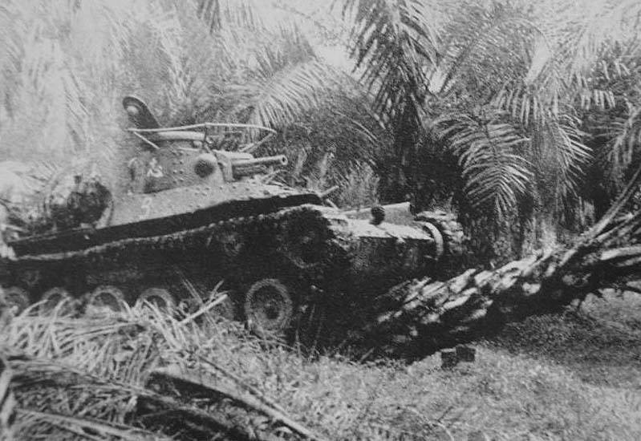

# #751 Type 97 ChiHa in Malaya

A Type 97 Chi-Ha チハ roaring down the Malayan peninsula in 1941. This is the old Airfix 1:76 kit with a couple of infantry figures, echoing a pretty well-known picture. No electronics in this one.

## Notes

The Type 97 Chi-Ha (九七式中戦車 チハ, Kyūnana-shiki chū-sensha Chi-ha or simply "Type 97/57"), was the most widely produced Japanese medium tank of the Imperial Japanese Army during WWII. Entering service in 1937, the Chi Ha saw widespread service in China and the Pacific, but inadequate armour protection and the low velocity of its 57mm gun made it no match when it came up against Allied tanks.

### Paint Scheme

No 3 Squadron No 1 Tank Division Malaya 1941/2

| Feature               | Color           | Recommended    | Paint Used |
|-----------------------|-----------------|----------------|------------|
| A camouflage          | IJA Khaki       | 26             | 70.879 Green Brown  |
| B camouflage          | IJN Earth Brown | 98             | 70.872 Chocolate Brown   |
| C camouflage          | IJA Grass Green | 76             | H60 / 70.895 Gunship Green       |
| D camouflage          | Yellow          | 74             | 70.953 Flat Yellow  |
| E tracks              | Gunmetal        | 53             | H18        |
| F exhaust             | Rust            | 113            | H18 + AK Light Rust wash |
| G tools               | Wood            |                |            |
| H tires               | Black           |                |            |
| J n/a                 | Grey            |                | n/a        |
| K n/a                 | IJA Dry Grass   |                | n/a        |

### Build Log

## Credits and References

* [this project on scalemates](https://www.scalemates.com/profiles/mate.php?id=74137&p=projects&project=167701)
* [Type 97 Medium Tank Chi-Ha Vintage Classics Airfix No. A01319V 1:76](https://www.scalemates.com/kits/airfix-a01319v-type-97-medium-tank-chi-ha--1403237)
* [A01319V Type 97 Chi Ha Japanese Tank](https://uk.airfix.com/products/type-97-chi-ha-japanese-tank-a01319v)
* [Type 97 Chi-Ha medium tank](https://en.wikipedia.org/wiki/Type_97_Chi-Ha_medium_tank) - wikipedia
