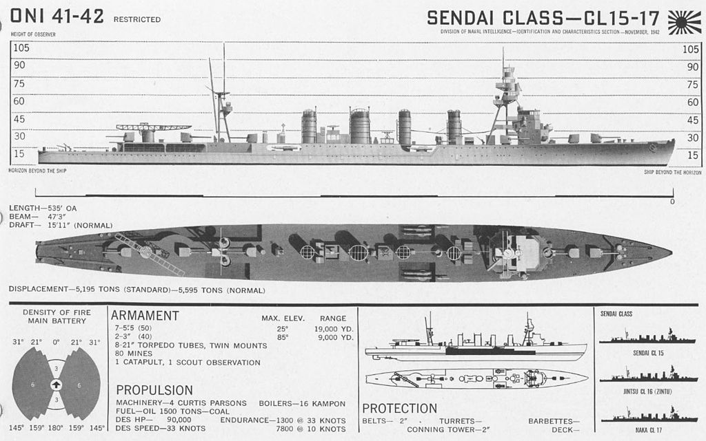
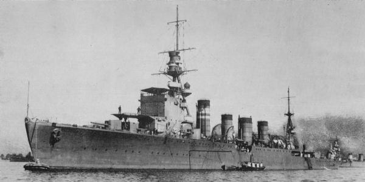

# #753 IJN Cruiser Jintsū

Building the Fujimi 1:700 kit of the IJN Cruiser Jintsū (神通) (じんつう).

## Notes

[Japanese cruiser Jintsū (神通) (じんつう)](https://en.wikipedia.org/wiki/Japanese_cruiser_Jints%C5%AB)
was the second vessel completed in the three-ship Sendai-class.

Commissioned in 1925, On 13 July 1943 in the
[Battle of Kolombangara](https://en.wikipedia.org/wiki/Battle_of_Kolombangara),
she was discovered during a night attack by American ships and sunk in combat.

Key events from the [record of movement](http://www.combinedfleet.com/jintsu_t.htm):

* 8 December 1923: Launched at 0800 and named JINTSU.
* October 1931: The Kure Type No. 2 Model 2 catapult, previously tested aboard KINU, is transferred to JINTSU. An Aichi E3A1 Type 90 Mod. 1 reconnaissance floatplane is embarked.
* 6 December 1941: Operation "M" - The Attack on the Southern Philippines
* 12 December 1941: The Invasion of Legaspi, Luzon
* 17 December 1941: Operation "M" - The Attack on the Southern Philippines
* 19/20 December 1941: The Invasion of Davao, Philippines.
* 23 December 1941: The Invasion of Jolo, Philippines.
* 9 January 1942: Operation "H" - The Invasion of Celebes, Netherlands East Indies
* 17 January 1942: JINTSU launches a reconnaissance floatplane, probably a Kawanishi E7K2 "Alf". The pilot claims downing a Dutch Lockheed A-29 "Hudson" light bomber near Menado. The victory is short-lived because soon thereafter, the floatplane is shot down.
* 31 January 1942: The Invasion of Ambon Island, Netherlands East Indies
* 27 February 1942: The Battle of the Java Sea
* 28 May 1942: Operation "MI" - The Battle of Midway
* 24 August 1942: The Battle of the Eastern Solomons
* 31 January 1943: Operation "KE" - The Evacuation of Guadalcanal
* 13 July 1943: The Battle of Kolombangara: sunk
    * Transport Group from Buin, carrying troops and equipment to be landed at Vila on Kolombangara Island
    * at 0036, a PBY Catalina reports the sighting of the Japanese squadron to Rear Admiral Walden L. Ainsworth, leading Task Group 36.1
    * At 0108, JINTSU snaps on her searchlights to illuminate Ainsworth's force. Two minutes later she is taken under the radar-controlled fire of three cruisers.
    * Around 0145 a torpedo hits JINTSU at starboard aft engine room. A massive explosion follows; the cruiser breaks in two abaft the middle funnel and sinks three minutes later at 07-38S, 157-06E.

### Finding of the Wreck

February 2019: Microsoft co-founder Paul G. Allen's research vessel RV PETREL locates the wreck of JINTSU a depth of 2,952 ft.
Her bow section is lying on her port side while the stern section is upright.

The Wreck of IJN Jintsu – Blown in Two, Yet Remarkably Preserved

### The Kit

The [Fujimi Kit No. 40123](https://www.scalemates.com/kits/fujimi-40123-ijn-light-cruiser-jintsu--323315)
is a 1st generation tooling from 1973.

I've used a few upgrades, though these are far from essential:

* [Ocean Spirit No. H034 1:700](https://www.scalemates.com/kits/ocean-spirit-h034-ijn-catapult--967904) - replace the  catapult with a nicely details PE part
* [Tetra Model Works No. SA-70016 1:700](https://www.scalemates.com/kits/tetra-model-works-sa-70016-wwii-japanese-navy-fine-rail-set--1281563) - railings
* [Ocean Spirit No. H049 1:700](https://www.scalemates.com/kits/ocean-spirit-h049-pullies-signal-flag-strings--967910) - pullies for rigging
* [Sky Wave Series Pit-Road No. E12 1:700](https://www.scalemates.com/kits/pit-road-e12-equipment-japanese-navy-ships-ww2-set-7--1245027) for the E7K1 float plane to replace the E8N included in the kit

### Paint Scheme - Jintsū

| Feature               | Color                | Recommended | Paint Used |
|-----------------------|----------------------|-------------|------------|
|                       |                      | H8          |            |
|                       |                      | H11         |            |
|                       |                      | H12         |            |
| hull                  |                      | H17         | H17        |
|                       |                      | H18         |            |
| Deck                  |                      | H37         | H37        |
| Superstructure        |                      | H83         | H83        |
|                       | flat red             | H13/H3+H20  |            |

### Paint Scheme - E7K1

The Fujimi kit includes an [Nakajima E8N](https://en.wikipedia.org/wiki/Nakajima_E8N) Navy Type 95 Reconnaissance Seaplane Model 1
but it appears most likely that Jintsū normally carried an
[Kawanishi E7K2](https://en.wikipedia.org/wiki/Kawanishi_E7K) Navy Type 94 Reconnaissance Seaplane Model 2.

For the plane, I've used an E7K1 from [Sky Wave Series Equipment For Japanese Navy Ships-WW2 (Set 7) Pit-Road No. E12 1:700](https://www.scalemates.com/kits/pit-road-e12-equipment-japanese-navy-ships-ww2-set-7--1245027).

| Feature                  | Color                | Recommended | Paint Used |
|--------------------------|----------------------|-------------|------------|
| prop and                 | Black                |             | H12        |
| fuselage                 | Silver               |             | H8         |

### Build Log

Although a tooling from 1973, the kits is still remarkably buildable. Superstructure details is a little soft, but overall not bad.

This time I am experimenting with a hand-carved wooden base to simulate the sea.

Working up the sea surface. Painted with Vallejo Model Color with layers of Mod Podge Gloss. Cotton wool for the foam and crests of the wake.

The final gallery shots:

## Credits and References

* [this project on scalemates](https://www.scalemates.com/profiles/mate.php?id=74137&p=projects&project=139014)
* Kits and detail sets used:
    * [Sea Way Model (EX) Series IJN Light Cruiser Jintsu Fujimi No. 40123 1:700](https://www.scalemates.com/kits/fujimi-40123-ijn-light-cruiser-jintsu--323315)
    * [Upgrades Series IJN Catapult Ocean Spirit No. H034 1:700](https://www.scalemates.com/kits/ocean-spirit-h034-ijn-catapult--967904)
    * [WWII Japanese Navy Fine Rail Set (0.1mm) Tetra Model Works No. SA-70016 1:700](https://www.scalemates.com/kits/tetra-model-works-sa-70016-wwii-japanese-navy-fine-rail-set--1281563)
    * [Sky Wave Series Equipment For Japanese Navy Ships-WW2 (Set 7) Pit-Road No. E12 1:700](https://www.scalemates.com/kits/pit-road-e12-equipment-japanese-navy-ships-ww2-set-7--1245027)
    * [Upgrades Series Pullies for Signal Flag Strings Ocean Spirit No. H049 1:700](https://www.scalemates.com/kits/ocean-spirit-h049-pullies-signal-flag-strings--967910)
* [Japanese cruiser Jintsū (神通)](https://en.wikipedia.org/wiki/Japanese_cruiser_Jints%C5%AB) - wikipedia
* [神通 (軽巡洋艦)](https://ja.wikipedia.org/wiki/%E7%A5%9E%E9%80%9A_(%E8%BB%BD%E5%B7%A1%E6%B4%8B%E8%89%A6)) - ja.wikipedia
* [IJN JINTSU: Tabular Record of Movement](http://www.combinedfleet.com/jintsu_t.htm)
* [Battle of Kolombangara](https://en.wikipedia.org/wiki/Battle_of_Kolombangara)
* [Sendai class Cruisers (1923)](https://naval-encyclopedia.com/ww2/japan/sendai-class-cruisers.php)
* [Navy Yard 047](https://kaiga.co.jp/publication/books/%e3%83%8d%e3%82%a4%e3%83%93%e3%83%bc%e3%83%a4%e3%83%bc%e3%83%89-vol-47-%e3%82%a2%e3%83%bc%e3%83%9e%e3%83%bc%e3%83%a2%e3%83%87%e3%83%aa%e3%83%b3%e3%82%b02021%e5%b9%b47%e6%9c%88%e5%8f%b7%e5%88%a5/) - Jintsu (Aoshima)
