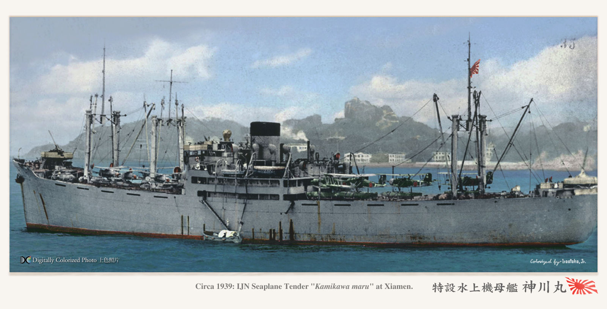
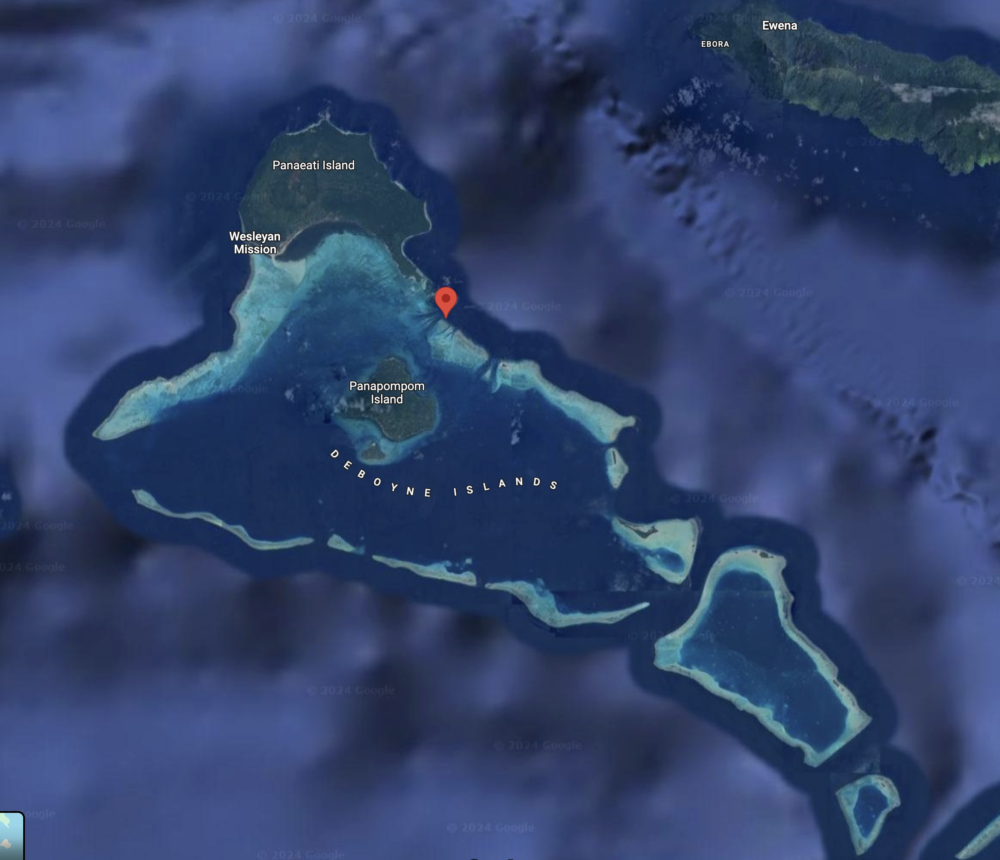
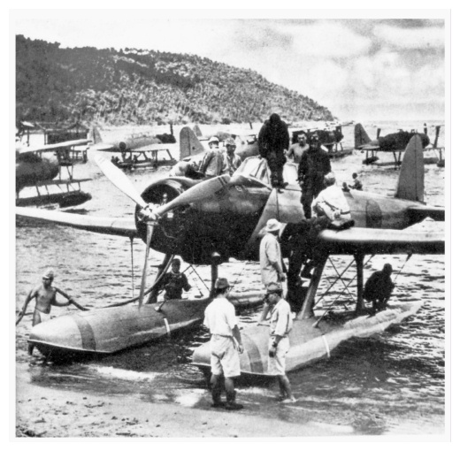
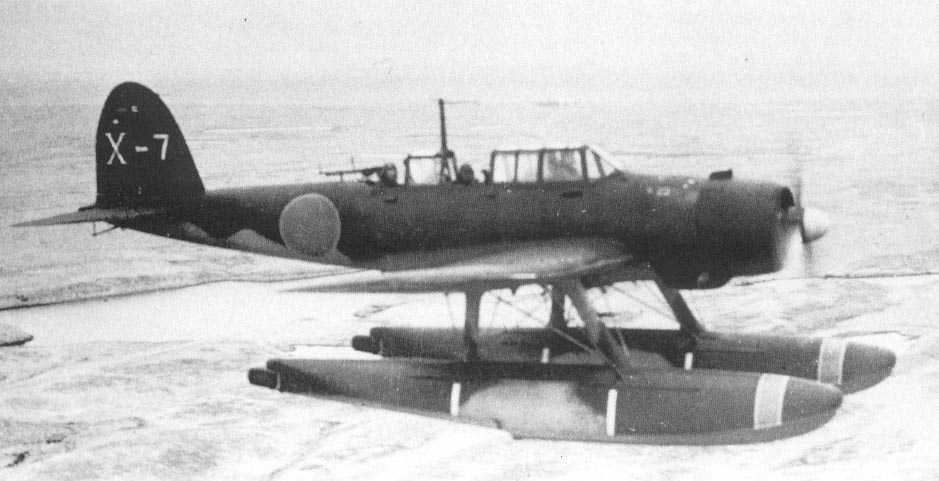
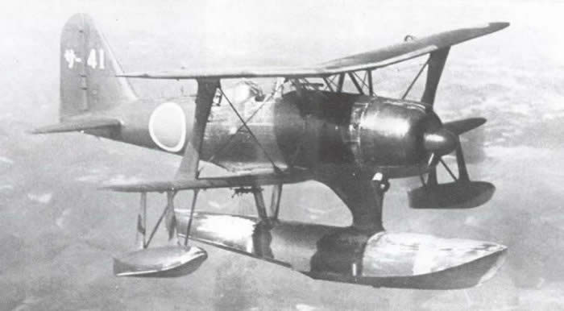
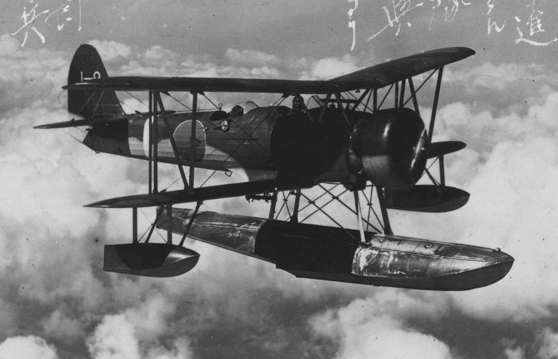
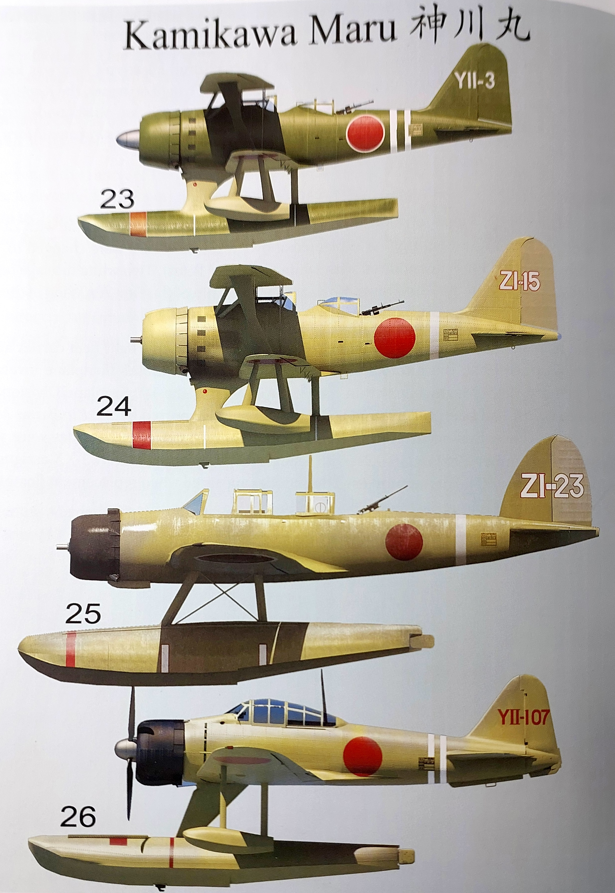

# #754 Kamikawa Maru at Deboyne 1942

Depicting the brief establishment of a seaplane base at Deboyne in 1942 by the IJN Seaplane Tender Kamikawa Maru and a supporting force.

## Notes

On May 6, 1942 a force of ten Japanese ships entered Deboyne Lagoon including the Kamikawa Maru, a destroyer, cruiser, and transports. The Japanese captured three Australian Army Signalers and five natives and established as a forward seaplane operating area.
On May 10, 1942 Kamikawa Maru departed, abandoning Deboyne Seaplane Base.

The Deboyne Seaplane base was located off Panaeati Island (Panniet) in the Louisiade Archipelago.

### About the Kamikawa Maru

Kamikawa Maru (神川丸) was initially built at Kawasaki's Kōbe Shipyard and launched on 13 December 1936 as a merchant vessel for the Kawasaki Kisen K. K. Line. On 18 September 1937 the IJN requisitioned her as an aircraft transport ship and she was refitted in 1939 as a seaplane tender. The ship subsequently saw service in the Second Sino-Japanese War and the Pacific Campaign of World War II. On May 29, 1943, Kamikawa Maru was torpedoed and sunk by the submarine USS Scamp approximately 250 miles (400 km) northwest of Kavieng, New Ireland at [01°36′S 150°24′E](https://maps.app.goo.gl/Uhti48bFRSy6YESe9).

See also:

* [Maru Floatplane Carriers](https://laststandonzombieisland.com/tag/ijn-kamikawa-class-seaplane-tender/)
* [WW2 Pacific Treasures: The Battle of the Coral Sea "stray" Zero](https://pierrekosmidis.blogspot.com/2016/02/ww2-pacific-treasures-the.html) - includes details of Operations at Deboyne
* [Invasion of the Bismarcks](https://history.army.mil/books/wwii/macarthur%20reports/macarthur%20v2%20p1/ch7.htm)

#### Pictured at Xiamen (1938-1940)

前甲板に九五式、後甲板には九四式水偵
Type 95 on the front deck, Type 94 floatplane 1938-40 on the rear deck

References:

* <http://blog.livedoor.jp/irootoko_jr/archives/295756.html>
* <https://laststandonzombieisland.com/2020/01/08/warship-wednesday-jan-8-2020-maru-floatplane-carriers/seaplane-tender-kamikawa-maru-at-xiamen-1939/>

#### Kamikawa Maru Air Unit

[Pacific Profiles Volume Eight IJN Floatplanes in the South Pacific 1942-1944](https://avonmorebooks.com.au/?page=3&id=152) covers in great detail the Kamikawa Maru air unit in the South Pacific theatre from April 1942 to April 1943. It serviced in various combinations the following aircraft:

* Aichi E13A Jake
* Mitsubishi F1M Pete
* Nakajima E8N Dave
* Nakajima A6M Rufe
* tail codes:
    * initially ZI
    * changed to YII in July 1942 when assigned to the 11th seaplane tender division
    * changed to L-1 in Nov 1942 when assigned as No.1 seaplane tender

### IJN Seaplane Base on Deboyne

Between May 6-10, 1942, the IJN established a seaplane base in the lagoon at Deboyne Atoll as part of MO Sakusen, the attempt to capture Port Moresby, Papua.
It was established by units that came from Rabaul, New Britain and Shortland Island in the Solomon Islands, including the seaplane tender Kamikawa Maru.

The base existed for approximately five-and-a-half days in May 1942, including the Battle of the Coral Sea. During that time the Japanese Navy operated a small number of Aichi E13A (Jake), Mitsubishi F1M (Pete), Nakajima E8N (Dave) and possibly other types of seaplanes there.

Fortifications were minimal, consisting of felled palm trees and small-caliber anti-aircraft guns on shore, as well as any firepower on ships in the lagoon.

References:

* <https://en.wikipedia.org/wiki/Raids_on_Deboyne_(1942)>
* <https://pacificwrecks.com/airfields/png/deboyne/index.html>

#### About the Deboyne Islands

The Deboyne Islands are located in the Louisiade Archipelago, off the eastern tip of Papua New Guinea.

#### Allied Operations on Deboyne - early 1942

During 1942, a small force of eight: three Australian Army signalers (radio operators) supported by five natives arrived at Deboyne Lagoon to establish a radio post.

#### IJN Capture - May 6, 1942

On May 6, 1942 a force of ten Japanese ships entered Deboyne Lagoon including the Kamikawa Maru, a destroyer, cruiser, and transports. The Japanese capture eight Prisoners Of War (POWs) in the area: three Australian Army Signalers and five natives and established as a forward seaplane operating area.

The Deboyne Seaplane base was located off Panaeati Island (Panniet). There were no shore facilities as the Japanese operated off the seaplane tender. Deboyne was under the commanded by Lt. Minematsu Hideo. During the Battle of the Coral Sea between May 7-8, 1942 Japanese seaplanes from Deboyne searched for enemy ships and during the battle, aircraft ditch in the area and their crews were rescued.

A series of raids on Deboyne were conducted by Allied forces between 9–11 May 1942

An Aichi E13A, probably from Kamikawa Maru's air unit, possibly photographed at Deboyne Islands during the Battle of the Coral Sea:

#### IJN Departure - May 10, 1942

At the conclusion of the Battle of the Coral Sea, the Japanese withdrew from the area on May 10, 1942.

On May 10, 1942 Kamikawa Maru departed, abandoning Deboyne Seaplane Base. The Japanese abandoned several aircraft wrecks in the area including F1M2 Pete Tail RI-6 and G4M1 Betty 2271. American aircraft continued to bomb the area until May 16, 1942 unaware the Japanese had departed.

#### IJN Deboyne Task Force

[South Pacific Air War Volume 3: Coral Sea & Aftermath May - June 1942](https://www.goodreads.com/book/show/43728230-south-pacific-air-war-volume-3)

* p34
* Task: build and operate seaplane bases at Shortland and Deboyne Island
* Support Force
    * [18th Cruiser Division](https://en.wikipedia.org/wiki/18th_Cruiser_Division_(Imperial_Japanese_Navy))
        * Tenryū
        * Tatsuta
    * Kamikawa Maru: 2x E8N2 Dave, 8x F1M2 Pete, 4x E13A Jake
    * Kiyokawa Maru: 2x E8N2 Dave, 6x F1M2 Pete, 4x E13A Jake
    * Nikkai Maru 2562-ton aux gunboat
    * Seikai Maru 3114-ton aux gunboat
    * Shoei Maru 5644 ton aux repair ship
        * referred to as Matsue Maru to avoid confusion with a gunboat named Shoei Maru in northern waters at the time

#### [IJN Seaplane Tender Kamikawa Maru - Deboyne Record of Movement](http://www.combinedfleet.com/Kamikawa%20Maru_t.htm)

* 6 May 1942: At Deboyne Island, Louisade Archipelago. KAMIKAWA MARU is detached from CruDiv 18.
* 7 May 1942: Deboyne Island.
    * At 0630, several floatplanes are dispatched on an air search.
    * At 0820, a search plane spots an enemy cruiser fleet 150 miles SSW of DeBoyne.
* 10 May 1942: Departs Deboyne.

#### [IJN Light Cruiser Tenryū - Deboyne Record of Movement](http://www.combinedfleet.com/tenryu_t.htm)

* 3 May 1942: CruDiv 18 covers the invasion landings on Santa Isabel Island.
    * KAMIKAWA MARUs with the No. 5 Gunboat Group's SEIKAI and NIKKAI MARUs establish a seaplane base at Rekata Bay.
    * KIYOKAWA MARU's Air Unit remains at Rekata, but CruDiv 18 and KAMIKAWA MARU depart for Deboyne Island in the Louisiade Archipelago in the Louisades.
* 4 May 1942: Rear Admiral Koso's Transport Force departs Rabaul.
* 5 May 1942: CruDiv 18 arrives off DeBoyne. KAMIKAWA MARU is detached.

#### [IJN Light Cruiser Tatsuta - Deboyne Record of Movement](http://www.combinedfleet.com/tatsuta_t.htm)

* 3 May 1942: CruDiv 18 covers the invasion landings on Santa Isabel Island.
    * KAMIKAWA and KIYOKAWA MARUs with the No. 5 Gunboat Group's SEIKAI MARU and NIKKAI MARU establish a seaplane base at Rekata Bay.
    * KIYOKAWA MARU remains at Rekata, but CruDiv 18 and KAMIKAWA MARU depart for Deboyne Island in the Louisiade Archipelago in the Louisades.
* 5 May 1942: CruDiv 18 arrives off DeBoyne. KAMIKAWA MARU is detached.

#### [IJN HOYO MARU - Deboyne Record of Movement](http://www.combinedfleet.com/Hoyo_t.htm)

* 6 May 1942: At 0530 arrives at Deboyne Is with carrier SHOHO.
* 9 May 1942: The Battle of the Coral Sea:
    * After the Battle of the Coral Sea, the Attack Force returns to Rabaul.
    * Some ships sail to Shortland where they are refuelled by HOYO MARU, IRO and OMUROSAN MARU.
* 11 May 1942: Departs Shortland and is met by destroyer OITE.
* 12 May 1942: At 0500 arrives and later departs Deboyne Island escorted by auxiliary gunboat NIKKAI MARU.

#### [IJN NIKKAI MARU - Deboyne Record of Movement](http://www.combinedfleet.com/NikkaiT_t.htm)

* 7 May 1942: Receives eighth wireless order No. 16:
    * 1: After completing the mission at Tulagi, auxiliary minesweepers HAGOROMO MARU and NOSHIRO MARU No. 2 GO, auxiliary oiler HOYO MARU, auxiliary gunboat NIKKAI MARU and if necessary auxiliary gunboat SHOEI MARU should quickly meet after landing the required Deboyne base cargo at point A, 7° 40'S, 153° 43'E.
    * 2: Auxiliary gunboat KEYO MARU should cooperate with the RZP invasion unit.
* 8 May 1942: Arrives at Gavutu anchorage, Tulagi. Departs later that day for Rabaul.
* 10 May 1942: Attacked by aircraft without damage.
* 11 May 1942: At 2115 arrives at Rabaul
* 12 May 1942: Departs Rabaul for Deboyne Island and from there escorts tanker HOYO MARU.

#### [IJN Repair Ship SHOEI (MATSUE) MARU - Deboyne Record of Movement](http://www.combinedfleet.com/Shoei_t.htm)

* 22 March 1942: At Rabaul.
* 12 May 1942: Off New Ireland

Appears not to have been part of the Deboyne operation?

### Air Units Deployed on Deboyne

#### [Aichi E13A (Jake)](https://en.wikipedia.org/wiki/Aichi_E13A)

Aichi E13A Navy Type Zero Reconnaissance Seaplane (零式水上偵察機)

* 零 Rei 式 shiki : Type 0
* 水上 minakami : on water
* 偵察機 Teisatsu-ki : Reconnaissance Plane
* 機 ki :  machine

Build from [WWII IJN Type Zero Water Plane (x4) 3D Printed Seed Hobby No. SH700048 1:700](https://www.scalemates.com/kits/seed-hobby-sh700048-wwii-ijn-type-zero-water-plane-x4--1518615)

Other options but not used in the build:

* Additional from Sprue W included in [Water Line Series No. 560 Japanese Seaplane Tender Kamikawamaru Aoshima No. 009741 1:700](https://www.scalemates.com/kits/aoshima-009741-japanese-seaplane-tender-kamikawamaru--638934)
* Additional build from [Sky Wave Series Equipment For Japanese Navy Ships-WW2 (Set 7) Pit-Road No. E12 1:700](https://www.scalemates.com/kits/pit-road-e12-equipment-japanese-navy-ships-ww2-set-7--1245027)
* Detail parts from [IJN Aircraft Set III Seaplane details Rainbow No. Rb7022 1:700](https://www.scalemates.com/kits/rainbow-rb7022-ijn-aircraft-set-iii--956000)

#### [Mitsubishi F1M (Pete)](https://en.wikipedia.org/wiki/Mitsubishi_F1M)

* Build from Sprue W included in [Water Line Series No. 560 Japanese Seaplane Tender Kamikawamaru Aoshima No. 009741 1:700](https://www.scalemates.com/kits/aoshima-009741-japanese-seaplane-tender-kamikawamaru--638934)
* Build from [Sky Wave Series Equipment For Japanese Navy Ships-WW2 (Set 7) Pit-Road No. E12 1:700](https://www.scalemates.com/kits/pit-road-e12-equipment-japanese-navy-ships-ww2-set-7--1245027)
* Detail parts from [IJN Aircraft Set III Seaplane details Rainbow No. Rb7022 1:700](https://www.scalemates.com/kits/rainbow-rb7022-ijn-aircraft-set-iii--956000)

#### [Nakajima E8N (Dave)](https://en.wikipedia.org/wiki/Nakajima_E8N)

* Other options but not used in the build:
    * Included in [Sky Wave Series Equipment For Japanese Navy Ships-WW2 (Set 7) Pit-Road No. E12 1:700](https://www.scalemates.com/kits/pit-road-e12-equipment-japanese-navy-ships-ww2-set-7--1245027)
    * Sprue W included in [Water Line Series No. 560 Japanese Seaplane Tender Kamikawamaru Aoshima No. 009741 1:700](https://www.scalemates.com/kits/aoshima-009741-japanese-seaplane-tender-kamikawamaru--638934)
    * Detail parts from [IJN Aircraft Set III Seaplane details Rainbow No. Rb7022 1:700](https://www.scalemates.com/kits/rainbow-rb7022-ijn-aircraft-set-iii--956000)

### References

[Pacific Profiles Volume Eight IJN Floatplanes in the South Pacific 1942-1944](https://avonmorebooks.com.au/?page=3&id=152)

* Chapter 7 Kamikawa Maru Air Unit

[South Pacific Air War Volume 1 The Fall of Rabaul](https://www.goodreads.com/book/show/40244519-south-pacific-air-war-volume-1)

* pp19,20 Mar 1942, Kamikawa Maru attached to 4th fleet

[South Pacific Air War Volume 3: Coral Sea & Aftermath May - June 1942](https://www.goodreads.com/book/show/43728230-south-pacific-air-war-volume-3)

* pp 26,33-35,38-41 Deboyne island
* pp44,45,70-72,77,87,95,
* p102 B-25 reported Kamikawa Maru new seaplane base Deboyne island
* 137,138,140,
* 228,229 - aircraft profiles, E13A1, F1M2 Pete

#### Kamikawa Maru (and Coral Sea, Too!) - Japanese Seaplane Tenders in WWII

### Build Resources

Build by Bilal Jamri

### Paint Scheme - Kamikawa Maru

| Feature                  | Color                | Recommended | Paint Used |
|--------------------------|----------------------|-------------|------------|
|                          | Silver               | H8          |  |
| boat covers              | Flat White           | H11         |  |
| funnel top               | Flat Black           | H12         |  |
| rear deck                | Tan                  | H27         | H27 |
|                          | Wood Brown           | H37         |  |
| forward deck, upper hull | Dark Gray (2)        | H83         | H83 |
| guns                     | Steel                |             | H18 |

### Paint Schemes - Kamikawa Maru Planes

#### Paint Scheme - Aichi E13A Jake

| Feature                  | Color                | Recommended | Paint Used |
|--------------------------|----------------------|-------------|------------|
| prop warning rings       | Red                  | H3          |  |
| leading wing trim        | Yellow               | H4          |  |
| upper camo               | IJN Green            | H59         | H73 |
| lower camo               | IJN Gray             | H61         | H61 |

#### Paint Scheme - Mitsubishi F1M2 Pete

| Feature                  | Color                | Recommended | Paint Used |
|--------------------------|----------------------|-------------|------------|
| prop warning rings       | Red                  | H3          |  |
| leading wing trim        | Yellow               | H4          |  |
| upper camo               | IJN Green            | H59         | H73 + H74 |
| lower camo               | IJN Gray             | H61         | H61 |

### Build Log

For the Mitsubishi F1M Petes:

* Build from Sprue W included in [Water Line Series No. 560 Japanese Seaplane Tender Kamikawamaru Aoshima No. 009741 1:700](https://www.scalemates.com/kits/aoshima-009741-japanese-seaplane-tender-kamikawamaru--638934)
* Build from [Sky Wave Series Equipment For Japanese Navy Ships-WW2 (Set 7) Pit-Road No. E12 1:700](https://www.scalemates.com/kits/pit-road-e12-equipment-japanese-navy-ships-ww2-set-7--1245027)
* Detail parts from [IJN Aircraft Set III Seaplane details Rainbow No. Rb7022 1:700](https://www.scalemates.com/kits/rainbow-rb7022-ijn-aircraft-set-iii--956000)

Aiche E13A are built using [WWII IJN Type Zero Water Plane (x4) 3D Printed Seed Hobby No. SH700048 1:700](https://www.scalemates.com/kits/seed-hobby-sh700048-wwii-ijn-type-zero-water-plane-x4--1518615)

The ships boat W13 is replaced by a nice resin alternative from [WWII IJN 11m Motor Boat (8set) 3D Printed Five Star Model No. FS710360 1:700](https://www.scalemates.com/kits/five-star-model-fs710360-wwii-ijn-11m-motor-boat-8set--1507608).

Additional boats:

* [WWII IJN 6m Traffic Boat (8set) 3D Printed Five Star Model No. FS710362 1:700](https://www.scalemates.com/kits/five-star-model-fs710362-wwii-ijn-6m-traffic-boat-8set--1507610)
* [WWII IJN 7.5m Motor Boat (for destroyers and smaller vessels) (6 set) Five Star Model No. FS710353 1:700](https://www.scalemates.com/kits/five-star-model-fs710353-wwii-ijn-75m-motor-boat-destroyers-and-smaller-vessels-6-set--1486116)

### Final Gallery - Kamikawa Maru at Deboyne 1942

On May 6, 1942 an IJN task force entered Deboyne Lagoon to establish a forward seaplane operating area.
The Deboyne Islands are located in the Louisiade Archipelago, off the eastern tip of Papua New Guinea.
The Kamikawa Maru (神川丸) was the main seaplane transport, and delivered a force of made up of Aichi E13A Jakes and probably Mitsubishi F1M Petes.

The Kamikawa Maru (神川丸) was built at Kawasaki's Kōbe Shipyard and launched on 13 December 1936 as a merchant vessel for the Kawasaki Kisen K. K. Line.
On 18 September 1937 the IJN requisitioned her as an aircraft transport ship and she was refitted in 1939 as a seaplane tender.
She served throughout the Pacific before being sunk by USS Scamp on May 29, 1943.

The build is based around the Aoshima 1:700 kit.

## Credits and References

* [this project on scalemates](https://www.scalemates.com/profiles/mate.php?id=74137&p=projects&project=127045)
* Kits:
    * [Water Line Series No. 560 Japanese Seaplane Tender Kamikawamaru Aoshima No. 009741 1:700](https://www.scalemates.com/kits/aoshima-009741-japanese-seaplane-tender-kamikawamaru--638934)
    * [Water Line Series Seaplane Tender Photo Etched Set Aoshima No. 009727 1:700](https://www.scalemates.com/kits/aoshima-009727-seaplane-tender-photo-etched-set--581787)
    * [Sky Wave Series Equipment For Japanese Navy Ships-WW2 (Set 7) Pit-Road No. E12 1:700](https://www.scalemates.com/kits/pit-road-e12-equipment-japanese-navy-ships-ww2-set-7--1245027)
    * [WWII IJN Type Zero Water Plane (x4) 3D Printed Seed Hobby No. SH700048 1:700](https://www.scalemates.com/kits/seed-hobby-sh700048-wwii-ijn-type-zero-water-plane-x4--1518615)
    * [IJN Aircraft Set III Seaplane details Rainbow No. Rb7022 1:700](https://www.scalemates.com/kits/rainbow-rb7022-ijn-aircraft-set-iii--956000)
    * [WWII IJN 11m Motor Boat (8set) 3D Printed Five Star Model No. FS710360 1:700](https://www.scalemates.com/kits/five-star-model-fs710360-wwii-ijn-11m-motor-boat-8set--1507608)
    * [WWII IJN 6m Traffic Boat (8set) 3D Printed Five Star Model No. FS710362 1:700](https://www.scalemates.com/kits/five-star-model-fs710362-wwii-ijn-6m-traffic-boat-8set--1507610)
    * [WWII IJN 7.5m Motor Boat (for destroyers and smaller vessels) (6 set) Five Star Model No. FS710353 1:700](https://www.scalemates.com/kits/five-star-model-fs710353-wwii-ijn-75m-motor-boat-destroyers-and-smaller-vessels-6-set--1486116)
* [Kamikawa Maru-class seaplane tenders](https://en.wikipedia.org/wiki/Kamikawa_Maru-class_seaplane_tender) - wikipedia
* [Japanese seaplane tender Kamikawa Maru](https://en.wikipedia.org/wiki/Japanese_seaplane_tender_Kamikawa_Maru) - wikipedia
* [IJN Seaplane Tender KAMIKAWA MARU: Tabular Record of Movement](http://www.combinedfleet.com/Kamikawa%20Maru_t.htm)
* [Pacific Profiles Volume Eight IJN Floatplanes in the South Pacific 1942-1944](https://avonmorebooks.com.au/?page=3&id=152)
* [South Pacific Air War Volume 1 The Fall of Rabaul](https://www.goodreads.com/book/show/40244519-south-pacific-air-war-volume-1)
* [South Pacific Air War Volume 3: Coral Sea & Aftermath May - June 1942](https://www.goodreads.com/book/show/43728230-south-pacific-air-war-volume-3)
* [World War II Aviation Capable Ships Aviation Battleships, Aviation Cruisers, Seaplane Tenders 第２次大戦　航空能力艦　航空戦艦・航空巡洋艦・水上機母艦](https://www.ships-net.co.jp/ships/202406z/)
* [Operation MO](https://en.wikipedia.org/wiki/Operation_Mo)
