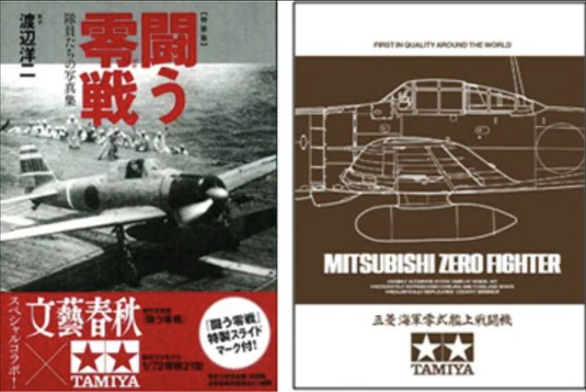

# #756 Mitsubishi A6M2b

Building the classic Tamiya 1:72 A6M2b.

## Notes

The
[Mitsubishi A6M Zero](https://en.wikipedia.org/wiki/Mitsubishi_A6M_Zero)
a long-range carrier-based fighter aircraft.

It was designated Mitsubishi Navy Type 0 carrier fighter 零式艦上戦闘機.
The official Allied reporting name was "Zeke", although the name "Zero" was used colloquially as well.

The A6M2b is the Type 0 Model 21 variant introduced folding wingtips to allow them to fit on aircraft carriers. The resulting Model 21 would become one of the most produced versions early in the war.

### The Kit

I picked up the Tamiya Mitsubishi A6M2b 1:72 kit in a
[Limited Edition boxing No. 25165](https://www.scalemates.com/kits/tamiya-25165-mitsubishi-a6m2b-zero-fighter-zeke-and-zero-at-war-photobook-limited-edition-kit--233477)
while visiting the
[TAMIYA PLAMODEL FACTORY TOKYO](https://maps.app.goo.gl/MgaKjJUUNTrNtCde7).
It includes an extended range of 8 schemes and the
["Zero at War" photo-book](https://www.goodreads.com/book/show/50918831-fighting-zero-fight).

## References

The A6M Naval Carrier Fighter - Zero or Hero? - Drachinifel

The A6M Naval Carrier Fighter - Homegrown or Copy?

### Kit Schemes

* A: 真珠湾攻擊時/ PearlHarborAttack】 《第一航空戰隊一番艦•赤城搭載機》第二次攻擊隊制空隊•進藤三郎大刷
    * Carrier Akagi, Lead ship of Carrier Dvi. 1, Lt. Saburo Shindo, Ari Superiority Force, 2nd Strike Unit
* B: 《第二航空戰隊一番艦• 蒼龍搭載機》 第二次攻擊隊制空隊• 飯田房太大尉
    * Carrier Soryu, Lead ship of Carrier Div. 2, Lt. Fusata lida, Air Superiority Force, 2nd Strike Unit
* C: 《第五航空戰隊二番艦• 瑞鶴搭載機》第二次攻擊隊制空隊• 佐藤正夫大尉
    * Carrier Zuikaku, Second ship of Carrier Div. 5, Lt. Masao Sato, Air Superiority Force, 2nd Strike Unit
* D: 《台南航空隊坂井三郎一飛曹搭栗機》昭和17年8月7日
    * Flight Petty Officer 1st Class Saburo Sakai, Tainan Air Group, August 7, 1942.
* E: 《第一航空 隊一番艦 翔鶴搭載飛行隊長 新鄉英城大尉搭乘機》昭和17年10月26日 南大平洋海
    * Lt. Hideki Shingo (Unit Commander), Carrier Shokaku, Lead ship of Carrier Div, 1,
    * Battle of the Santa Cruz Islands, October 26, 1942
* F: 《第二航空 隊二番艦•隼鷹搭載》昭和17年10月～昭和18年1月
    * Carrier Junyo, 2nd ship of Carrier Div. 2, October 1942 - January 1943
* G: 《201航空隊所属機 》昭和18年初期中部太平洋
    * 201st Air Group, Central Pacific, early 1943
* H: 《第261航空隊所属機》昭和18年中期～昭和19年3月 鹿 島基地
    * 261st Air Group, Kagoshima Airbase, mid-1943 - March 1944

### Paint Scheme

Chosen scheme: C

| Feature                    | Color                        | Recommended       | Paint Used |
|----------------------------|------------------------------|-------------------|------------|
| propeller                  | BARE-METAL SILVER            | AS-12             | H8           |
| propeller rear             | FLAT BLACK                   | XF-1              |            |
| body                       | GRAY GREEN (IJN)             | AS-29             | C128       |
| engine cowling             | SEMI GLOSS BLACK             | X-18              |            |
| instruments, gun           | SEMI GLOSS BLACK             | X-18              |            |
| instrument panel, interior | COCKPIT GREEN (IJN)          | XF-71             | C127       |
| joystick boot              | FLAT BLACK                   | XF-1              |            |
| interior detail            | FLAT ALUMINUM                | XF-16             |            |
| engine block               | J. N. GREY + LIGHT BLUE      | XF-12:1 + XF-23:1 | MC213      |
| engine cylinders           | SEMI GLOSS BLACK             | X-18              |            |
| rear interior              | METALLIC BLUE + CLEAR GREEN  | X-13:3 + X-25:1   |            |
| wheel struts               | CHROME SILVER                | X-11              |            |
| wheel struts               | SEMI GLOSS BLACK             | X-18              |            |
| tires                      | FLAT BLACK                   | XF-1              |            |
| wheel hub                  | FLAT ALUMINUM                | XF-16             | H8         |
| buttons                    | RED                          | X-7               |            |
|                            | RED BROWN                    | XF-64             |            |
| exhaust                    | burnt iron                   | XF-56:5 + XF-7:1  | H76        |

### Build Log

Cockpit detail is superior, even without any PE.

The [Eduard masks CX337](https://www.scalemates.com/kits/eduard-cx337-a6m2b--185132)
allowed the fine detail of the canopy to be painted with ease.

I chose a figure from the
[Red Box Kamikaze set](https://www.scalemates.com/kits/red-box-rb72048-japanese-kamikaze--407570)
to pose with the completed model.

### Final Gallery

Bucket list build! Tamiya A6M, famously "the best 1:72 kit ever made". True?

I've often heard the legend of the "best 1:72 kit ever made" - Tamiya A6M. Finally crossed it off my bucket list. And they're not wrong, the engineering is exceptional. But it's not perfect- decals are typically thick and don't settle down well (if I wasn't trying to do it out of the box, most would be better to paint on). And the undercarriage took a bit of work to get seated and aligned. But I look forward to doing another😁 .. this is the A6M2b; I also have the A6M5 in the stash (they are so cheap too)

## Credits and References

* [this project on scalemates](https://www.scalemates.com/profiles/mate.php?id=74137&p=projects&project=156539)
* [Mitsubishi A6M2b Zero Fighter (Zeke) & "Zero at War" Photo-book Limited Edition Kit Tamiya No. 25165 1:72](https://www.scalemates.com/kits/tamiya-25165-mitsubishi-a6m2b-zero-fighter-zeke-and-zero-at-war-photobook-limited-edition-kit--233477)
* [A6M2b for Tamiya Eduard No. CX337 1:72](https://www.scalemates.com/kits/eduard-cx337-a6m2b--185132)
* [Japanese Kamikaze WWII Red Box No. RB72048 1:72](https://www.scalemates.com/kits/red-box-rb72048-japanese-kamikaze--407570)
* ["Zero at War" photo-book](https://www.goodreads.com/book/show/50918831-fighting-zero-fight)
