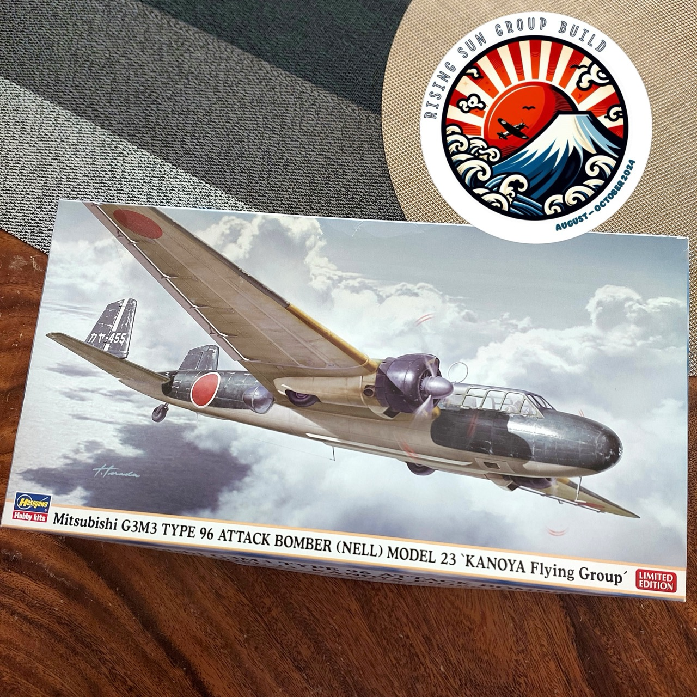

# #759 Mitsubishi G3M3 Nell

Building the Mitsubishi G3M3 Nell from Hasegawa in 1:72, motorized and mounted in-flight for the #risingsungb.

Here's a quick demo..

## Notes

The [Mitsubishi G3M](https://en.wikipedia.org/wiki/Mitsubishi_G3M) (九六式陸上攻撃機, Type 96 land-based attack aircraft "Rikko"; Allied reporting name "Nell") was a long-range, land-based bomber developed by Mitsubishi for the Imperial Japanese Navy in the 1930s. Designed under the guidance of Sueo Honjo, it was Japan’s first modern twin-engine bomber, noted for its advanced aerodynamic design, which prioritized range and speed over armor and defensive armament. Initially conceived as a reconnaissance and torpedo bomber, the G3M played a significant role in the early stages of World War II.

The G3M first saw combat during the Second Sino-Japanese War in 1937, where it was used for bombing raids over Chinese cities. Its most famous moment came in December 1941, when "Nells" from the Mihoro and Genzan Kōkūtai helped sink the British battleships HMS Prince of Wales and Repulse off the coast of Malaya. This was the first time capital ships were sunk purely by air power while at sea.

Despite its early successes, the G3M was gradually outclassed by more modern aircraft, such as its successor, the Mitsubishi G4M "Betty." By 1943, the G3M was mostly relegated to transport and training roles, though it continued to serve until the end of the war. A total of around 1,048 units were built before production ceased.

### The Kit

The [Hasegawa Kit No. 02218 1:72](https://www.scalemates.com/kits/hasegawa-02218-mitsubishi-g3m3-type-96-land-based-attack-aircraft-model-23-kanoya-flying-corps--1007836)
is a 2016 boxing of the original 1997 tooling from Hasegawa of the Mitsubishi G3M3 Type 96 Land-Based Attack Aircraft Model 23 'Kanoya Flying Corps'.

I found this kit in [Hobby Mate ホビーメイト Osaka](https://maps.app.goo.gl/Rngq3cVzB6Ln5hMGA) for ¥2,720 - a true goldmine of a store for kits especially from the 1990's and 2000's.

I also picked up the [Eduard mask set CX114](https://www.scalemates.com/kits/eduard-cx114-g3m-nell--115946) - well worth it, this plane is quite a glasshouse!

The kit has schemes depicting craft from the [Kanoya Air Group](https://en.wikipedia.org/wiki/Kanoya_Air_Group):

* Kanoya Naval Air Group (2nd generation) aircraft "Kaya-455" 1944
* Kanoya Naval Air Group (2nd generation) aircraft "Kaya-459" 1944

On 30 January, the 751st Air Group bombers were involved in the Battle of Rennell Island, where they were led by Lieutenant Commander Kazuo Nishioka and they torpedoed the cruiser Chicago. In April 1943, the unit participated in Operation I-Go. By mid-1943, the high rate of attrition forced the unit to reduce the number of aircrew per bomber from seven to five, which typically meant there was no co-pilot.[1] 253rd Air Group fighters saw heavy fighting during the defence of Rabaul in late 1943 and early 1944. After US carrier force raided Truk Lagoon in February 1944, all air units were withdrawn from Rabaul area, including 751st Air Group.

### Paint Scheme

| Feature               | Color                    | Recommended | Paint Used |
|-----------------------|--------------------------|-------------|------------|
|                       | Black                    | C2, H2      |            |
| torpedo body          | Silver                   | C8, H8      |            |
| propeller front, spinner | Silver                | C8, H8      | SM208      |
| upper fuselage        | IJN Green (Nakajima)     | C15, H36    | H36        |
| guns, engine          | Steel                    | C28, H18    | H18        |
| torpedo nose          | Flat Black               | C33, H12    | H12        |
|                       | Clear Red                | C47, H90    |            |
|                       | Clear Blue               | C50, H93    |            |
| leading edges         | Orange Yellow            | C58, H24    | H24        |
| exhaust               | Burnt Iron               | C61, H76    | H76        |
| interior, wheel wells | Cockpit Color (Nakajima) | C127        |            |
| lower fuselage        | Grey Green               | C128        | H336       |
| propeller rear        | Propeller Color          | C131        | H47        |
|                       | Tire Black               | C137, H77   |            |

### Paint Scheme - Figures

The trusty
[Japanese Navy Airmen Set Hasegawa No. X72-16 1:72](https://www.scalemates.com/kits/hasegawa-x72-16-japanese-navy-airmen-set--1123725)
set comes out...

| Feature                                         | Color                    | Recommended | Paint Used |
|-------------------------------------------------|--------------------------|-------------|------------|
| goggle frames                                   | Silver                   | C8/H8       |            |
| goggle frames (alt)                             | Copper                   | C10/H10     |            |
| goggle straps                                   | Sandy Brown              | C19/H66     |            |
| webbing/life jacket                             | Dark Earth               | C22/H72     | 70.921 English Uniform |
|                                                 | Flat Base                | C30/H40     |            |
| helmet                                          | Red Brown                | C41/H47     |            |
|                                                 | Mahogany                 | C42/H84     | 70.846 Mahogany Brown |
| helmet inner                                    | Tan                      | C44/H27     |            |
|                                                 | Flesh                    | C51/H44     |            |
| scarf                                           | Flat White               | C62/H11     |            |
| boots                                           | Semi gloss black         | C92         |            |
|                                                 | Mitsubishi Cockpit Color | C126        |            |
| flight suit and gloves                          |                          | C22/H72 (70%) + C42/H84 (30%) |            |

### Build Log

I've joined the #risingsungb organised by @adastra_models for one of my next projects.
I'm building this new pop of the old Hasegawa Mitsubishi G3M3 Type 96 九六式陸上攻撃機 (Nell). So far I've done a quick in-flight conversion and motorised props and it is going together like a dream: the fit is remarkable for a 1997 tooling.

#### Cockpit and Main Sub-assembly Preparation

Modifications for in-flight were quite straight-forward, although not specifically catered to by the kit.

The [Eduard mask set CX114](https://www.scalemates.com/kits/eduard-cx114-g3m-nell--115946) is well worth it, given the expanse of glass in this plane..

Testing the motorised engines..

All the main parts prepared for fuselage assembly. I didn't bother with much interior detail as it won't be very visible

wheels up mod

The plane will be mounted with 1.5mm annealed florist's wire from [Knorr Prandell](https://www.knorrprandell.com) (secured with hot glue inside the fuselage)

#### Crew

Not sure if the crew was normally 5 or 7 (sources differ), but I'm doing a selection to crew the ship...

These are the trusty
[Japanese Navy Airmen Set Hasegawa No. X72-16 1:72](https://www.scalemates.com/kits/hasegawa-x72-16-japanese-navy-airmen-set--1123725) .. always seem to turn up in my builds for some reason!

#### Assembly, Painting and Finishing

#### Electronics

With the micro-motors I'm using, the correct motor polarity to got the props to turn in the right direction is:

* Red wire - +3V
* Blue wire - GND

I'm using a simple 555 timer circuit to provide variable speed PWM control. There's just enough oomph in 3V batteries (2xAAA) to power the props.

Note:

* I've put a flyback diode on each motor (mounted inside the plane actually). This was because I originally intended to drive the motors independently. As-is, the duplication is redundant, but it does keep options open for independent drive in the future.

A quick protoboard layout

Circuit boards completed...

And installed in the frame...

#### Final Gallery

The G3M3 Nell (九六式陸上攻撃機) was a long-range, land-based bomber developed by Mitsubishi for the IJN in the 1930s. It was Japan’s first modern twin-engine bomber, noted for its advanced aerodynamic design, which prioritized range and speed over armor and defensive armament. Initially conceived as a reconnaissance and torpedo bomber, the G3M played a significant role in the early stages of World War II.

This is the 2016 boxing of the original 1997 tooling from Hasegawa in 1:72, and still an amazing kit to build. I've motorized the props and mounted in-flight.
I built this as part of the #risingsungb organised by @adastra_models.

The only problem with this kit is that it is getting a little on the large size to be photographed easily - apologies for the focus issues and cluttered background in some of the shots.

Added to my "wall of flight" (getting a little full now).

## Credits and References

* [this project on scalemates](https://www.scalemates.com/profiles/mate.php?id=74137&p=projects&project=167754)
* [Mitsubishi G3M3 Type 96 Land-Based Attack Aircraft Model 23 'Kanoya Flying Corps' Hasegawa No. 02218 1:72](https://www.scalemates.com/kits/hasegawa-02218-mitsubishi-g3m3-type-96-land-based-attack-aircraft-model-23-kanoya-flying-corps--1007836)
* [G3M Nell for Hasegawa Eduard No. CX114 1:72](https://www.scalemates.com/kits/eduard-cx114-g3m-nell--115946)
* [Japanese Navy Airmen Set Hasegawa No. X72-16 1:72](https://www.scalemates.com/kits/hasegawa-x72-16-japanese-navy-airmen-set--1123725)
* [Mitsubishi G3M](https://en.wikipedia.org/wiki/Mitsubishi_G3M)
* [Kanoya Air Group](https://en.wikipedia.org/wiki/Kanoya_Air_Group)
