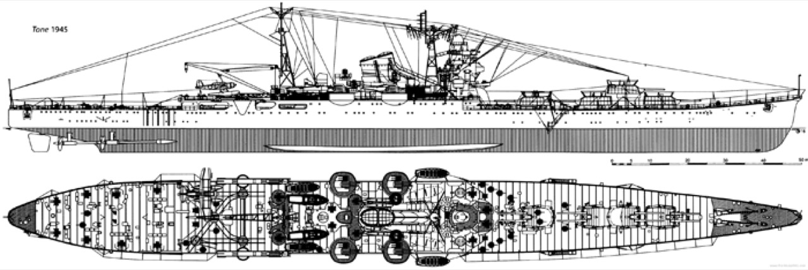

# #738 IJN Heavy Cruiser Tone 利根

On 23 January 1942, the IJN Heavy Cruiser Tone 利根 attacked Buka Island with its float planes.
A diorama featuring the Aoshima 1:700 kit.

## Notes

The Imperial Japanese Navy Heavy Cruiser Tone (利根) was the lead ship in the two-vessel Tone-class. The ship was named after the Tone River, in the Kantō region of Japan and was completed on 20 November 1938 at Mitsubishi's Nagasaki shipyards. Tone was designed for long-range scouting missions and had a large seaplane capacity. She was extensively employed during World War II usually providing scouting services to their aircraft carrier task forces. She almost always operated in this capacity in conjunction with her sister ship Chikuma.

)

Key events from the [record of movement](http://www.combinedfleet.com/tone_t.htm):

* 21 November 1937: Launched and named TONE.
* 26 November 1941: Operation "Z"
* 7 December 1941: The Attack on Pearl Harbor
* 16 December 1941: The Second Invasion of Wake Island
* 17 January 1942: Operation "R" - The Invasion of Rabaul
* 22 January 1942: Departs the New Ireland area.
* 23 January 1942: Attack on Buka Island
* 25 January 1942: The TONE's floatplanes attack the Admiralties.
* 19 February 1942: The Attack on Port Darwin, Australia
* 25 February 1942: Operation "J" -The Invasion of the Netherlands East Indies
* 26 March 1942: Operation "C" - The Raids in the Indian Ocean
* 5 April 1942, Easter Sunday: The Attack on the British naval base at Colombo
* 9 April 1942: The Attack on the British naval base at Trincomalee
* 27 May 1942: Operation "MI" - The Battle of Midway
* 16 August 1942: Operation "KA" - The Reinforcement of Guadalcanal
* 26 October 1942: The Battle of Santa Cruz
* 13 November 1942: The First Naval Battle of Guadalcanal
* 1 February 1944: The Evacuation of Truk
* 1 March 1944: Operation SA-1-GO ("SA No. 1")
* 13 June 1944: Operation "A-GO" - The Battle of the Philippine Sea
* 22 October 1944: Operation "SHO-I-GO"(Victory) - The Battle of Leyte Gulf
* 23 October 1944: The Battle of the Palawan Passage
* 24 October 1944: The Battle of the Sibuyan Sea
* 25 October 1944: The Battle off Samar
* 28 July 1945: sunk by aircraft from USS BATAAN (CVL-29), TICONDEROGA (CV-14) and MONTEREY (CVL-26)

### 23 January 1942: Attack on Buka Island

[During 1941](https://pacificwrecks.com/provinces/bougainville_buka.html), a small Australian Army force was assigned to defend Buka (Town) and Buka Airfield. During January 1942 Japanese flying boats scouted Buka and Buka Airfield. After the Japanese attack on Rabaul on January 21, 1942 the Australian garrison on Buka evacuated to Bougainville.

On March 9, 1942, Japanese warships entered Queen Carola Harbor and soon afterwards occupied all of Buka Island.

23 January 1942: Tone was ordered to attack a reported Australian seaplane base at Buka Passage.
Three floatplanes catapulted from Tone at 0630:

* Two planes approached Buka passage at 0845 and bombed Sohano Island
* a single plane attacked nearby Soraken AOB

It seems likely that TONE operated 2x
[Aichi E13A1 Jake](https://en.wikipedia.org/wiki/Aichi_E13A)
and 1x
[Nakajima E8N Dave](https://en.wikipedia.org/wiki/Nakajima_E8N)
for the Buka raid, according to the detailed battle report, although other sources differ.

The
[Aichi E13A1 Jake](https://en.wikipedia.org/wiki/Aichi_E13A)
Type 0 water reconnaissance aircraft was developed by Aichi Aircraft as a 12-trial three-seater water reconnaissance aircraft, and was adopted by the Japanese Navy as a weapon in December 1940.

The
[Nakajima E8N Dave](https://en.wikipedia.org/wiki/Nakajima_E8N)
Type 95 Reconnaissance Seaplane Model 1 was a two-seat biplane with a central main-float and underwing outriggers.

### Buka Raid References

The [Japanese wikipedia page](https://ja.wikipedia.org/wiki/%E5%88%A9%E6%A0%B9_(%E9%87%8D%E5%B7%A1%E6%B4%8B%E8%89%A6))
provides a detailed summary of the raid:

> 1月23日、利根水上偵察機部隊がブーゲンビル島北方のブカ島を爆撃した。高橋の著作では「零式水偵1機、九五水偵3機」だが、戦闘詳報では「三座水偵2機、二座水偵1機」となっている。

Summary in translation:

* On January 23, Tone's sea reconnaissance aircraft bombed Buka Island, north of Bougainville Island.
* In Takahashi's writings, there was 1 Type 0 and 3 Type 95 Suiko
* but in the detailed battle report, it was 2 Type 0 and 1 Type 95
* Takahashi's writings refers to [Memoirs of the pilot of the Seiran, a submersible aircraft carrier of the Shenron Special Attack Team, Kojinsha NF Bunko](https://www.goodreads.com/book/show/121020851-memoirs-of-employees-maneuvering-seiran-aircraft-carrier-equipped-with) by Kazuo Takahashi, 2001  ISBN 4-7698-1015-6.

According to the [record of movement](http://www.combinedfleet.com/tone_t.htm):

* Two E13A1 floatplanes and one E8N2 from TONE attack and bomb Buka Island.
* this appears to be the same reference used by According to [naval-encyclopedia.com](https://naval-encyclopedia.com/ww2/japan/tone-class-cruisers-1937.php)
* From Andrew Obluski:
    * while TONEs operated during the war a mix of two-seaters and three-seaters the situation changed slowly during the conflict.
    * at Pearl Harbor TONE had 1 E13A1 + 3 E8N2 but returned to Kure before heading for Rabaul.
    * she could have taken other floatplanes for the southern seas.
    * at Midway both CruDivEight cruisers should have operated a mix of 3 E13A1 + 2 E8N2.
    * However TONE had only two as one of her Jakes was lost operationally on 20 May 1942. In 1944 TONEs used only Jakes.
    * Personally I believe that TONE rather operated 1 E13A1 + 2 E8N2 off Buka in Jan 1942. Jakes were then entering service in the fleet and a lot of battleships and heavy cruisers still operated older Kawanishi E7K2. Both TONEs were usually in possession of the same mix of floatplanes. Others ships were equipped as deliveries allowed. During the Aleutian campaign CruDivFour both ships had 2 E8N2 each. However MAYA had 1 E13A1 Jake while TAKAO older E7K2.

According to
[South Pacific Air War Vol1](https://www.goodreads.com/book/show/40244519-south-pacific-air-war-volume-1) p189, p207:

* Tone was ordered to attack a reported Australian seaplane base at Buka Passage.
* Three floatplanes catapulted from Tone at 0630.
    * E8N2 Dave approached Buka passage at 0845, closely followed by E13A Jake, bombed Sohano Island
    * a second E8N2 Dave attacked nearby Soraken AOB

### Reviews and Resources

IJN Tone - Guide 076 - Drachinifel

More resources:

* <https://www.behance.net/gallery/36675129/BOOK-To-Kokoda-Australian-Army-%2812-maps%29>
* <https://artsourceinternational.com/shop/antique-maps/military-maps/wwii/buka-passage-and-vicinity-solomon-islands/>
* <https://oldmapgallery.com/products/pacific-wwii-pilots-reference-strip-955-b>

### Paint Scheme

| Feature                 | Color            | Paint Used |
|-------------------------|------------------|------------|
|                         | Flat White       | H11        |
| funnel, mast, guns      | Flat Black       | H12        |
| boats, main deck        | Tan              | H27        |
| upper deck              | Wood Brown       | H37        |
| hull and superstructure | Dark Gray (2)    | H83        |

Aircraft

* 1x [Aichi E13A1 Jake](https://en.wikipedia.org/wiki/Aichi_E13A)
* 2x [Nakajima E8N Dave](https://en.wikipedia.org/wiki/Nakajima_E8N)

### Paint Scheme - Planes

| Feature                 | Color            | Paint Used |
|-------------------------|------------------|------------|
| upper fuselage          | Dark Green       | H320        |
| lower fuselage          | Hemp             | H336        |

## Rigging Examples

See also
[1/700 IJN Tone June 4, 1942 (Fujimi)](http://www.modelshipgallery.com/gallery/ca/ijn/tone-700-is/tone-index.html)

### Build Log

WIP. just laid down IJN Cruiser Tone 利根 and started to work the water effects, but now away from the bench for a week, so will have to finish this later.

Final shots..

On 23 January 1942, the IJN Heavy Cruiser Tone 利根 attacked Buka Island with its float planes.
A diorama featuring the Aoshima 1:700 kit.. that is now finished;-)

Tone was ordered to attack a reported Australian seaplane base at Buka Passage.
Three floatplanes catapulted from Tone at 0630

* two planes approached Buka passage at 0845 and bombed Sohano Island
* a single plane attacked nearby Soraken AOB

There is some disagreement in the sources as to which actual planes were used, but consensus appears to be two E13A1 (Jake) floatplanes and one E8N2 (Dave).

# ijn #700scale #scalemodels #scalemodel #tone

## Credits and References

* [this project on scalemates](https://www.scalemates.com/profiles/mate.php?id=74137&p=projects&project=139011)
* [Japanese Heavy Cruiser Tone 1944 Super Detail with photo-etched parts Aoshima No. 026977 1:700](https://www.scalemates.com/kits/aoshima-026977-tone-1944-super-detail--1073367)
* [IJN Figures Eduard No. 17505 1:700](https://www.scalemates.com/kits/eduard-17505-ijn-figures--120103)
* [Japanese cruiser Tone (1937)](https://en.wikipedia.org/wiki/Japanese_cruiser_Tone_(1937)) - wikipedia
* [利根 (重巡洋艦)](https://ja.wikipedia.org/wiki/%E5%88%A9%E6%A0%B9_(%E9%87%8D%E5%B7%A1%E6%B4%8B%E8%89%A6)) - wikipedia (japan)
* [IJN TONE: Tabular Record of Movement](http://www.combinedfleet.com/tone_t.htm)
* [Tone class cruisers (1937)](https://naval-encyclopedia.com/ww2/japan/tone-class-cruisers-1937.php)
* [Fujimi 1:700 Tone (利根) build feature by Yoshio Sato - Navy Yard 051, Autumn 2022, p30-32](https://www.1999.co.jp/eng/10921996)
