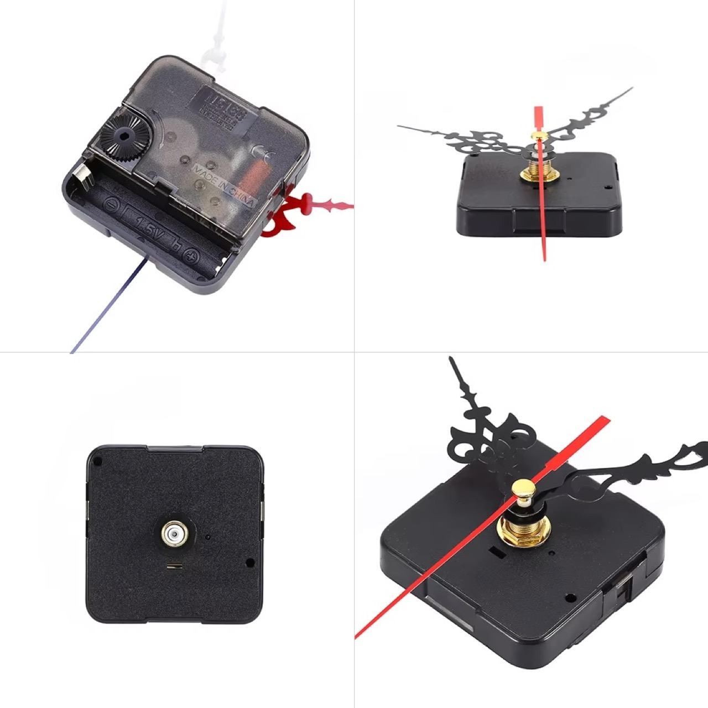
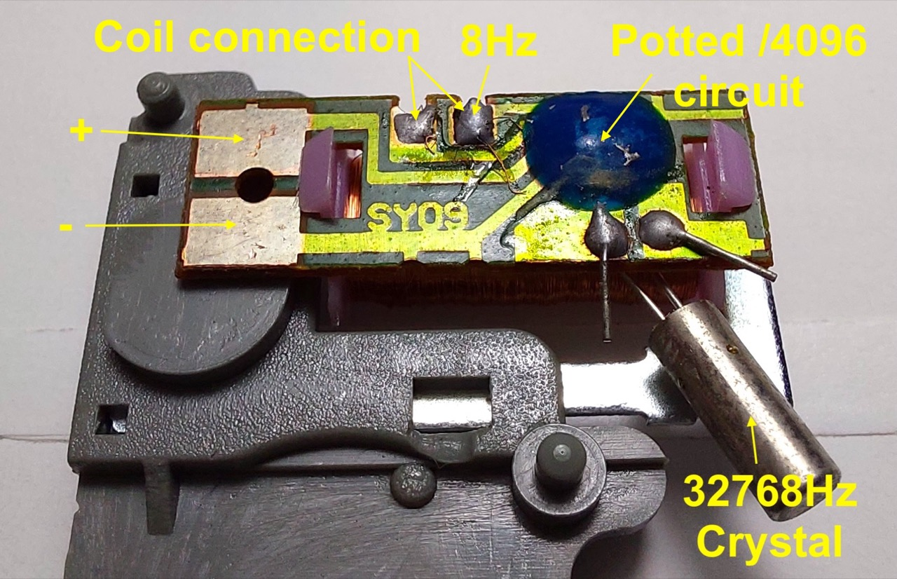
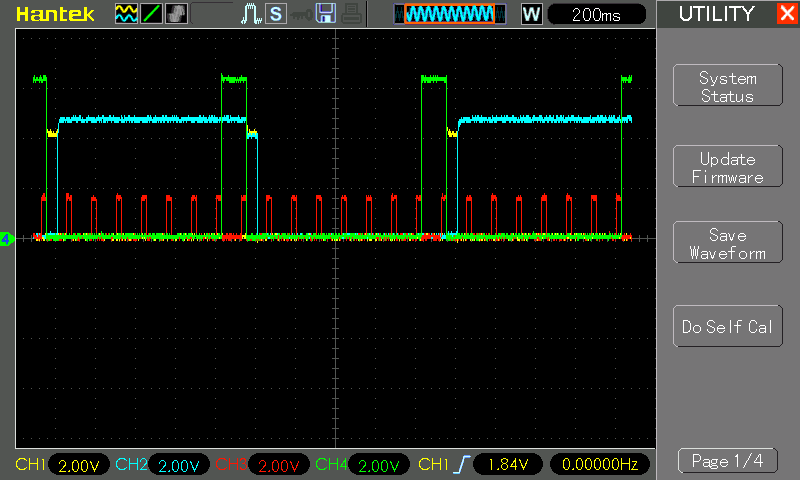
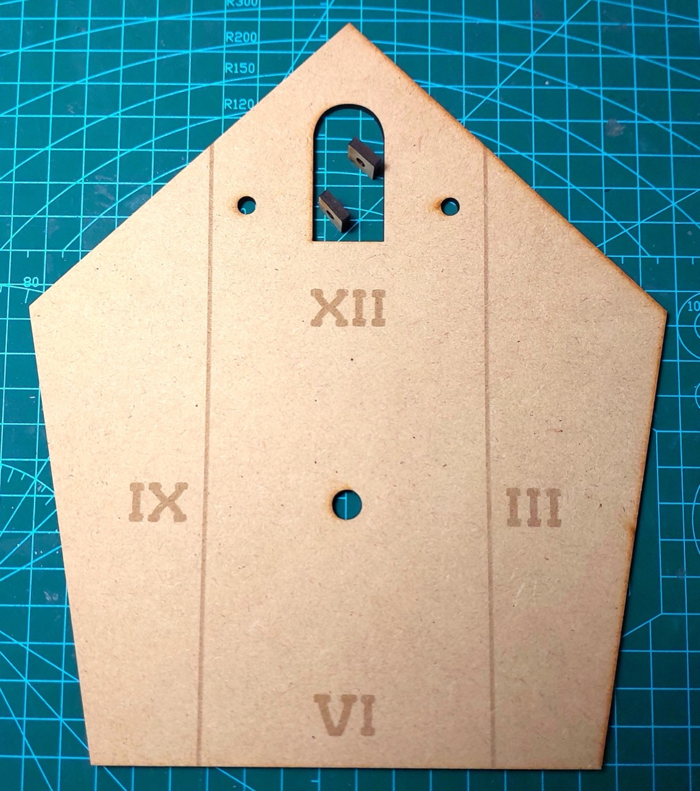

# #786 One Hertz! A most annoying clock

How to turn a cheap quartz clock mechanism into perhaps the most annoying cuckoo clock ever: flashing LEDs, nodding snowman, and a tick-tock chime every second. Made for the 2025 Hackaday One Hertz Challenge.

A bird? A plane? No, it's a snowman! Here's a quick demo..

## Notes

It has been a while since I've participated in a Hackaday competition, time to change that!

This year we have the
[2025 Hackaday One Hertz Challenge](https://hackaday.com/2025/06/26/announcing-the-2025-hackaday-one-hertz-challenge/).

I'm sure there will be some really creative and technical entries, but mine is quite prosaic: a clock.

But not an ordinary clock:

* the "1Hz" signal is obtained by hacking the internals of a common crystal-disciplined quartz clock movement mechanism. We actually find an 8Hz signal, so this is scaled to 1Hz with a CD4017
    * see [LEAP#751 Electro-mechanical Clock Mechanism](../../Kinetics/ElectroMechanicalClockMechanism/) where I documented the investigation in full
* to bring some sound into play, I use a 555/74LS73 circuit to create distinct "tick" and "tock" sound frequencies, clicking over every second
    * see [LEAP#785 Tick Tock](../../Electronics101/555Timer/TickTock/) where I cover the design in detail
* the outputs of the 74LS73 latch are also used to drive red and green LEDs that alternate every second
* finally, we need a bobbing cuckoo. I ran out of time to make a bird, so we have a snowman sitting in for now. The snowman nods in response to pulse driven through a coil every second that repels the neodymium magnets attached to the snowman
    * see [LEAP#296 QSOPBreakout Solar Pendulum](../../BoldportClub/QSOPBreakout/SolarPendulum/) for a similar mechanism

### Hacking the Clock

I found the clock mechanism on aliexpress:
[DIY Wall Clock Quartz Movement Mechanism Black Red Removable Wall Clock Quartz Hour/Minute Hand Clock Movement](https://www.aliexpress.com/item/32687248673.html)

The "quartz" mechanism is encased on a potted PCB labelled "SY09".
The hidden circuitry divides the 32768Hz crystal by 4096 to produce an 8Hz pulse. The 8Hz pulse is used to energize the coil and spin the ferrite/magnetised first drive gear.
The SY09 PCB decoded:

### Complete Circuit Design

The circuit design is fairly naïve - it breaks down all the functions to dedicated circuit sub-modules without trying to be too clever.

I'm using two separate power supplies:

* 1.5V for the clock module
* 6V for the rest of the circuit

I'd like to be able to use a single power source, but I'm not sure what the power rating for the clock module is. It uses 1.5V but perhaps it could handle 3/5/6V? I haven't tried this, as I didn't want to blow up the unit I have!

A quick description of how circuit is broken down:

I tested the entire circuit on breadboards:

The following oscilloscope trace captures the circuit in action:

* CH1 (Yellow) - `TICK`
* CH2 (Blue) - `FNOTCH`
* CH3 (Red) - 8Hz pulse from clock module
* CH4 (Green) - 1Hz pulse

### The Clock Box

I used [MakerCase](https://en.makercase.com/) to generate a simple parametric design,
and cut it on a [Lionsforge Craftlaser at the library](../../Equipment/NLB/LionsforgeCraftlaser/):

* polygon box, 5 sides
* material thickness: 3mm
* inside dimensions:
    * diameter: 180mm
    * height: 25mm
* open box
* edge joints: flat
* panel labels: enabled (to be excluded from cutting)
* cut line width: 1mm
* kerf: 0.2mm
* panel layout: separate, single file
* exported as [clock-box-template.svg](./assets/clock-box-template.svg)
* refined in Affinity Designer: [clock-box.afdesign](./assets/clock-box.afdesign)
* prepared for laser cutting in Inkscape: [clock-box.svg](./assets/clock-box.svg)

The parts for the clock box:

### Final Construction

TBH, I was running out of time to get this ready in time for the challenge deadline,
so my construction is pretty naff, with a heavy reliance on hot glue for instant assembly!

After transferring the circuit sub-systems to protoboard, I attached to the clock frame:

### In Action

"Tick"

"Tock"

A quick demo..

## Credits and References

* [The 2025 Hackaday One Hertz Challenge](https://hackaday.com/2025/06/26/announcing-the-2025-hackaday-one-hertz-challenge/)
* [DIY Wall Clock Quartz Movement Mechanism Black Red Removable Wall Clock Quartz Hour/Minute Hand Clock Movement](https://www.aliexpress.com/item/32687248673.html) - similar clock movement mechanism from an aliexpress seller
* [CD4017 datasheet](https://www.futurlec.com/4000Series/CD4017.shtml)
* [LM555 Datasheet](https://www.futurlec.com/Linear/LM555CN.shtml)
* [74LS73 datasheet](https://www.futurlec.com/74LS/74LS73.shtml) - Dual JK Flip-Flop with Clear
