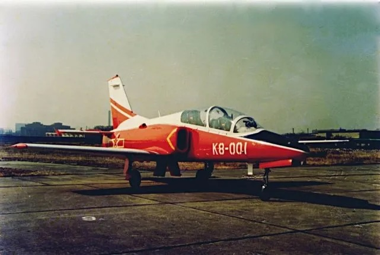
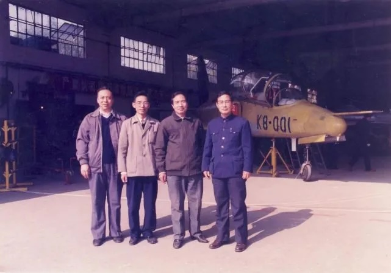

# #746 Hongdu K-8/JL-8

Building the Hongdu K-8/JL-8 trainer aircraft from the Trumpeter 1:72 kit. No electronics in this one.

## Notes

The Hongdu JL-8 (Nanchang JL-8), also known as the Karakorum-8 or K-8 for short, is a two-seat intermediate jet trainer and light attack aircraft designed in the People's Republic of China by China Nanchang Aircraft Manufacturing Corporation. The primary contractor is the Hongdu Aviation Industry Corporation 洪都航空工业集团.

The first flight  of the Hongdu Aviation (320 Factory) K-8 trainer aircraft was on November 21, 1990. The K-8 was the first large-scale export project for China's aviation industry.

Initially, the aircraft was to have used many parts manufactured in the United States, including the Garrett TFE731 engine and several cockpit displays, and communication and avionics systems, but due to political developments and an embargo from the US, other suppliers had to be used.

K-8: Original variant powered by the Garrett TFE731-2A turbofan engine

The JL-8, for the Chinese domestic market, was originally powered by the Ukrainian Ivchenko-Progress AI-25TLK turbofan jet engine with 16.9 kN of thrust, but this has been replaced by the WS-11, the Chinese-manufactured version of the AI-25TLK.

### Paint Scheme

The build depicts K8-001, the first prototype to fly.

| Feature               | Color                | Recommended | Paint Used |
|-----------------------|----------------------|-------------|------------|
| fuselage 1            | gloss white          | H1          | H11 (flat) |
|                       | flat black           | H12         |            |
| interior              | grey                 | H311        |            |
| fuselage 2            | red                  | H327        | H13        |
|                       | silver               | H8          | H8         |
|                       | gloss clear          |             | H30        |

### Build Log

[F-16 / F-18 Pilots from PJ Production](https://www.scalemates.com/kits/pj-production-721124-f-16-f-18-pilots--165456) were used to crew the aircraft.

## Credits and References

* [this project on scalemates](https://www.scalemates.com/profiles/mate.php?id=74137&p=projects&project=175324)
* [Chinese JL-8/K-8 Karakorum Trumpeter No. 01636 1:72](https://www.scalemates.com/kits/trumpeter-01636-chinese-jl-8-k-8-karakorum--166713)
* [F-16 / F-18 Pilots seated in a/c PJ Production No. 721124 1:72](https://www.scalemates.com/kits/pj-production-721124-f-16-f-18-pilots--165456)
* [Hongdu JL-8](https://en.wikipedia.org/wiki/Hongdu_JL-8) - wikipedia
* [教练-8](https://zh.wikipedia.org/wiki/%E6%95%99%E7%BB%83-8) - zh.wikipedia
* [中国军机重回国际市场—纪念洪都航空K-8教练机首飞30周年](https://new.qq.com/rain/a/20201122A0DQVL00) - Chinese military aircraft return to the international market - commemorating the 30th anniversary of the first flight of the Hongdu Airlines K-8 trainer aircraft
* [Chinese JL-8 (K-8 Karakorum) Trainer 01636](http://www.trumpeter-china.com/index.php?g=home&m=product&a=show&id=1637&l=en) - trumpeter-china
