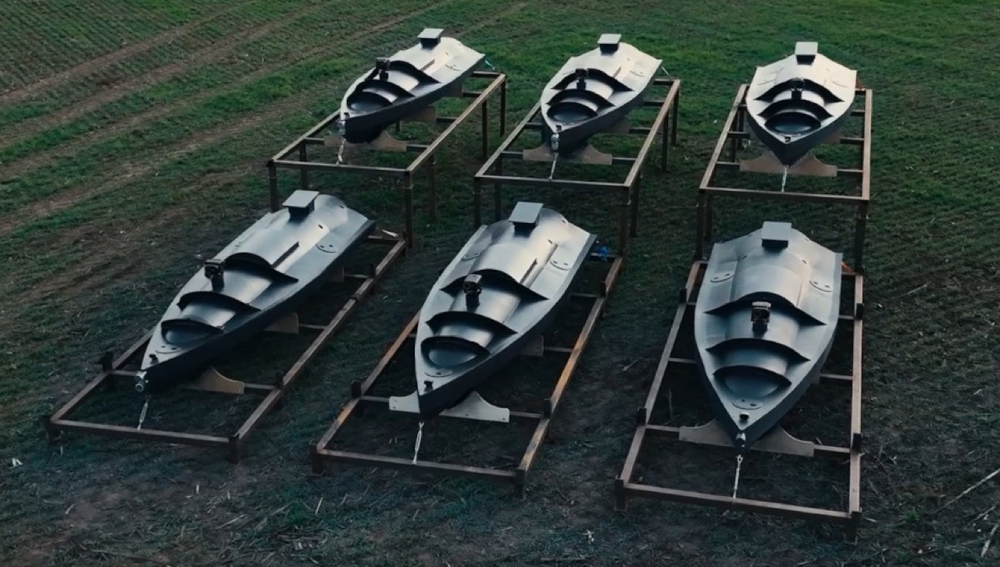

# #714 Ukraine's Maritime Drone (USV)

Building the MikroMir 1:35 kit. No electronics in this one.

## Notes

[Ukraine's Maritime Drones](http://www.hisutton.com/Ukraine-Maritime-Drones.html) - aka Uncrewed Surface Vessels (USV) -
are small, purposeful, and expendable. Propulsion is adapted from commercial jet skis.

This is a new kit from MikroMir of Ukraine, and a simple little build to get me back into the flow after travelling for a few weeks. It's actually the first time I've bought and built from MikroMir. They are quite a niche kit manufacturer, specialising in "rare" subjects, mainly planes and ships (especially submarines).

### Paint Scheme

| Feature                 | Color                | Paint Used |
|-------------------------|----------------------|------------|
| primer                  | black                | MrHobby Aqueous Black Surfacer 1000 |
| body                    | gray FS36118         | H305            |
| body highlights         | gray FS36270         | H305 + H306 mix |
| access hatches          | steel                | H18  |
| aerofoils, guidance pod | silver               | H8   |
| motor housing           | black                | H2   |
| gloss coat              | gloss clear          | H30  |

### Build Log

Using the "hacked off bit of styrene base™" technique;-) I like the lack of borders or regular geometry, which helps focus on the subject itself.

The water is built up with a few layers of Mod Podge gloss, each sprayed with various "sea tones", giving a subtle impression of depth.
I started the waves and spray with cotton wool but switched to polyester cotton pillow stuffing which is easier to create "bulk".
The cotton is applied with liberal lashings of AK Transparent water gel. Finally the splashes are topped of with some Deluxe scenic snowflakes
and touched up with Vallejo Model Color gloss white.

## Credits and References

* [this project on scalemates](https://www.scalemates.com/profiles/mate.php?id=74137&p=projects&project=153807)
* [Ukraine's Maritime Drone (USV) MikroMir No. 35-028 1:35](https://www.scalemates.com/kits/mikromir-35-028-ukraines-maritime-drone-usv--1481701)
* [MikroMir](http://mikro-mir.com/en/)
* [Evolution of Ukraine's Maritime Drone](http://www.hisutton.com/Ukraine-Maritime-Drones-Evolution.html)
* [Ukraine's Maritime Drones (USV) What You Need To Know](http://www.hisutton.com/Ukraine-Maritime-Drones.html)
