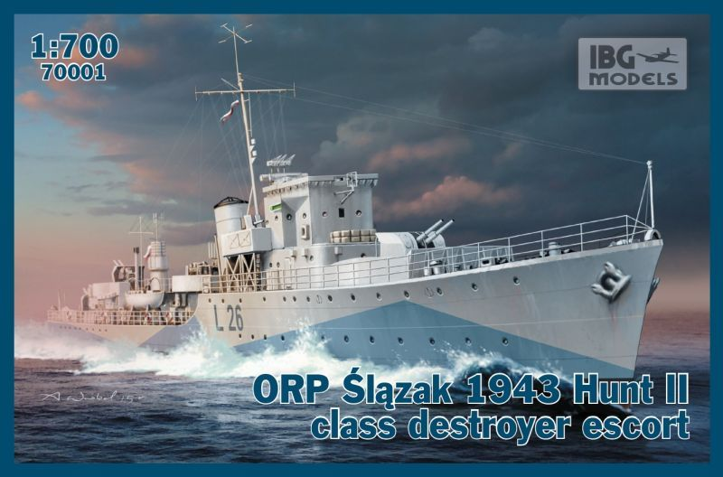

# #665 ORP Ślązak

Building the ORP Ślązak Hunt-class destroyer in 1:700 scale in a Baltic Winter Patrol setting.
My first venture into IBG ship kits - no electronics here, just a very fine kit experience.

## Notes

The ORP Ślązak was a Hunt-class destroyer
that was on loan(?) to the Polish Navy from 1942
until being transferred back to the Royal Navy in 1946.

NB:

* [ORP](https://en.wikipedia.org/wiki/Polish_Navy): Okręt Rzeczypospolitej Polskiej (Warship of the Republic of Poland)
* [PWM](https://en.wikipedia.org/wiki/Polish_Navy): Polska Marynarka Wojenna (Polish Navy)
* [WP](https://en.wikipedia.org/wiki/Polish_Armed_Forces): Wojsko Polskie (Polish Military)

### The Kit

The [ORP Ślązak 1943 Hunt II Class Destroyer Escort IBG Models No. 70001](https://www.scalemates.com/kits/ibg-models-70001-orp-l-zak-1943--969355)
is the first of a series of ship kits produced by IBG Models in 1:700.

This was my first experience of IBG's ship kits and I as very impressed.
The moulding is very crisp and detailed for 1:700, and the kit comes with all the parts needed to create a very nice model, including
a PE set with railings and other details designed specifically for the model.

### Paint Scheme

The basic scheme. As usual for ships in 1:700, I applied final effects with oil paints.

| Feature                    | Color                     | Recommended | Paint Used |
|----------------------------|---------------------------|-------------|------------|
| A funnel                   | Black                     | HTK-A041    | 70.950 Black           |
| B superstructure/hull camo | Admiralty Light Grey 507C | HTK-A503    | 70.990 Light Grey           |
| C hull camo                | Dark Blue-grey B5         | HTK-A504    | 70.868 Dark Seagreen + 70.963 Medium Blue |
| D deck                     | Admiralty Dark Grey 507A  | HTK-A501    | 70.870 Medium Sea Grey           |

### Build Log

The PE was a major selling point for the kit, and I was very happy with railings that perfectly matched the sheer of the hull.

The usual dilemma with ships is deciding the optimal sub-assembly breakdown: easy painting v clean joins.

The kit has a nice rigging guide that's quite easy to follow.

Finished with OPR streaks and stains..

Flying the flag..

### Building a Fridgid Baltic Patrol Scene

A quick base: HD foam, tissue and glue

## Credits and References

* [this project on scalemates](https://www.scalemates.com/profiles/mate.php?id=74137&p=projects&project=131455)
* [ORP Ślązak 1943 Hunt II Class Destroyer Escort IBG Models No. 70001 1:700](https://www.scalemates.com/kits/ibg-models-70001-orp-l-zak-1943--969355) - scalemates
* [70001 – 1/700 – ORP Ślązak 1943 Hunt II class](http://www.ibgmodels.com/70001-2/) - ibgmodels
* [ORP Ślązak (L26)](https://en.wikipedia.org/wiki/ORP_%C5%9Al%C4%85zak_(L26)) - wikipedia
* [Polish Navy](https://en.wikipedia.org/wiki/Polish_Navy)
