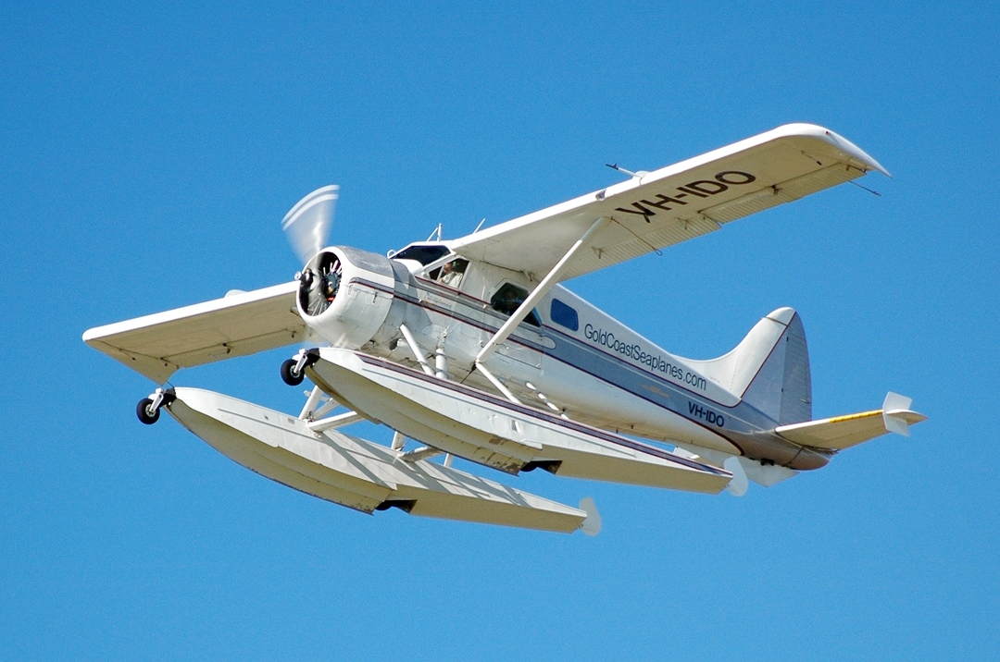
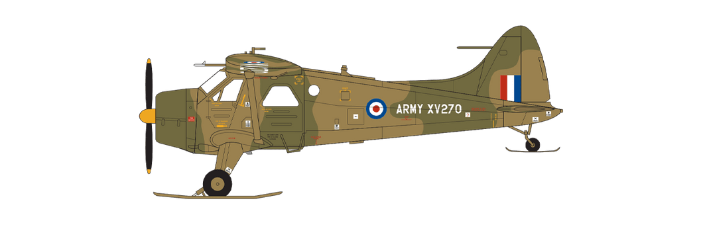
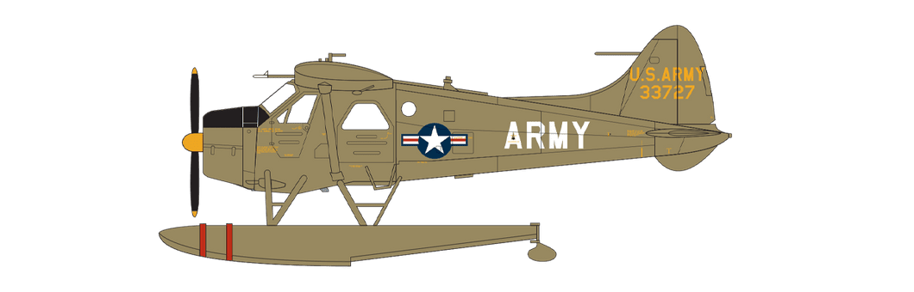

# #726 de Havilland Canada DHC-2 Beaver

Building the DHC Beaver in-flight and motorized, based on the Airfix Vintage Classics kit A03017V.

Here's a quick demo..

## Notes

The de Havilland Canada DHC-2 Beaver is a single-engined high-wing propeller-driven short takeoff and landing (STOL) aircraft developed and manufactured by de Havilland Canada. It has been primarily operated as a bush plane and has been used for a wide variety of utility roles, such as cargo and passenger hauling, aerial application (crop dusting and aerial topdressing), and civil aviation duties.

### References

de Havilland Canada DHC-2 Beaver: Short documentary Don’t Delete History

De Havilland Canada's DHC-2 Beaver

warplane DeHavilland DHC-2 Beaver, JRV i PVO 1/72, Airfix, Full Video Build - MM Marko

### Kit

### Scheme A

A03017V - de Havilland Canada DHC-2 Beaver Al.1 Advanced Fixed Wing Flight, Army Air Corps, Army Aviation Centre Middle Wallop, Hampshire, England, 1971.

| Feature               | Color                 | Recommended |
|-----------------------|-----------------------|-------------|
|                       | Silver - Metallic     | Humbrol 11  |
|                       | Trainer Yellow - Matt | Humbrol 24  |
|                       | Dark Earth - Matt     | Humbrol 29  |
|                       | Black - Matt          | Humbrol 33  |
|                       | Gunmetal - Metallic   | Humbrol 53  |
|                       | Dark Green - Satin    | Humbrol 163 |

### Scheme B (selected scheme)

A03017V - de Havilland Canada DHC-2/U-6A Beaver US Army, 1960s.

| Feature               | Color                  | Recommended | Paint Used |
|-----------------------|------------------------|-------------|------------|
|                       | Silver - Metallic      | Humbrol 11  | H8         |
| prop hub and tips     | Trainer Yellow - Matt  | Humbrol 24  | H34        |
| engine cowling        | Black - Matt           | Humbrol 33  | H12        |
| engine, exhaust       | Gunmetal - Metallic    | Humbrol 53  | H76        |
| prop warning strips   | Scarlet - Matt         | Humbrol 60  | H13        |
|                       | Matt Olive Drab - Matt | Humbrol 155 | H304        |
| seat                  | Linen                  | Humbrol 74  | H85        |
| interior              | Light Aircraft Grey    | Humbrol 166 | H75        |
|                       |                        |             |          |
|                       |                        |             |          |
|                       |                        |             |          |
|                       |                        |             |          |

### Circuit Design

Nothing amazing here - just a micro motor powered directly from a 3v CR2023 coin cell.

### Build Log

testing the micro-motor fixed in the engine

preparing +/- electrical conduits via the floats

cockpit is pretty basic but I don't think will be very visible in the finished model

starting the convoluted process of closing the fuselage with wiring intact

black-basing may not have been the smartest choice, but it is the way I kicked-off

decals conformed to a very bumpy surface incredibly well

mounting and wiring

And the final result, mounted on the wall..

One of my most enjoyable "vintage classic" experiences. Get the motor running .. insert coin on the right:-)

## Credits and References

* [this project on scalemates](https://www.scalemates.com/profiles/mate.php?id=74137&p=projects&project=140047)
* [DHC Beaver Vintage Classics Airfix No. A03017V 1:72](https://www.scalemates.com/kits/airfix-a03017v-dhc-beaver--1396837)
* [A03017V de Havilland Beaver](https://uk.airfix.com/products/de-havilland-beaver-a03017v)
* [de Havilland Canada DHC-2 Beaver](https://en.wikipedia.org/wiki/De_Havilland_Canada_DHC-2_Beaver)
