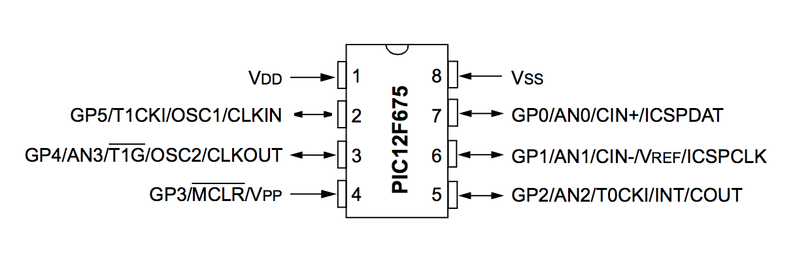
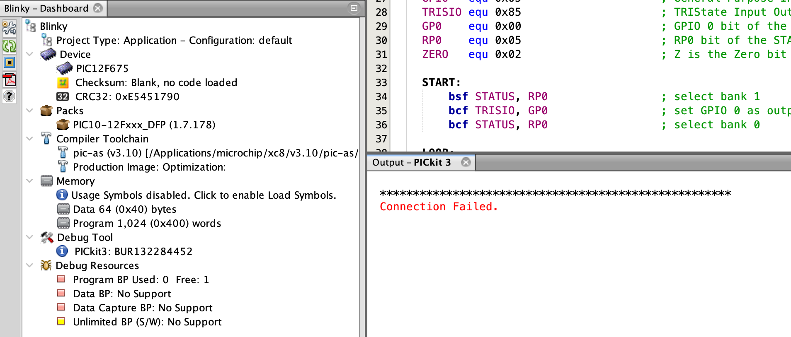
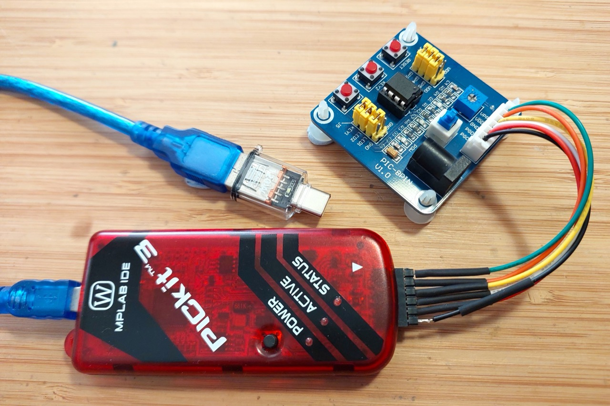
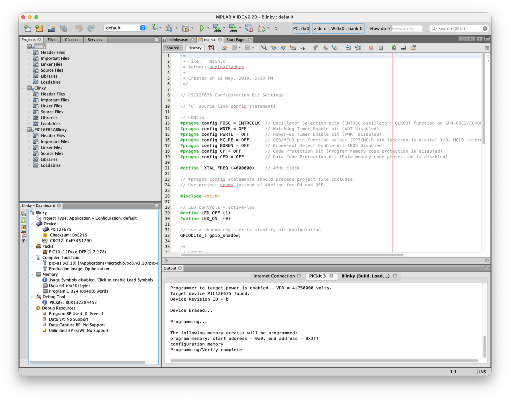
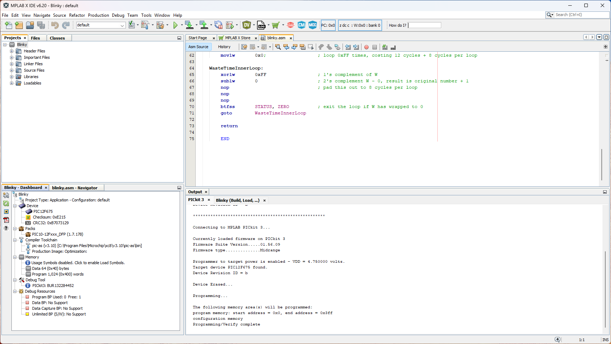
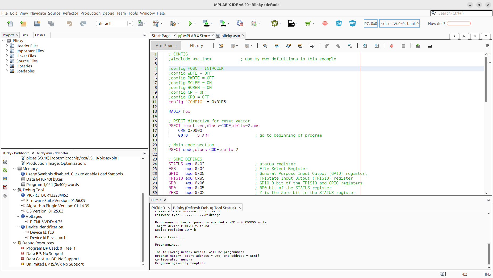

# #331 Getting Blinky with PIC Assembler

Getting starter with PIC assembler on macOS with a PIC12F675 development board and programming with the PICkit 3. Updated in 2026 with the latest MPLAB X IDE. The PICkit 3 support ended with version 6.2, but still works on Windows and Linux, and also macOS after finding a compatible USB C adapter (as an interim measure, I demonstrated compiling on macOS and using a script to remotely program on Ubuntu).

Here's a quick demo of it working...

[](https://www.youtube.com/watch?v=pw0WdkqDNsM)

## Notes

PIC is not necessarily everyone's first choice for embedded development these days,
and perhaps it is now more like a right-of-passage.
I guess it was [Julian Ilett](https://www.youtube.com/watch?v=p2rZwR9oM_k) who finally gave me the nudge - I really need to try this for myself.
One thing that's held me back is the perception that you have to "downgrade" to Windows in order to get anything going.

So challenge accepted: I finally decided to see what it is like to develop with PIC assembler
with a PIC12F675 development board and PICkit 3 programmer, and ideally do it all on my development platform of choice - macOS - without resorting to containers or VMs.

I originally made these notes in 2017, using MPLAB X IDE v3.51 (later updated to v5.30) on Intel-based macOS with a PICkit 3 programmer, and all was peachy. But....

### Feb-2026 Update

It is now Feb-2026, and I am revisiting these notes to get a PIC programming environment back up and running, now on ARM-based macOS 15.7.

Unfortunately, the news is mixed, and the main issue is with PICkit 3 support:

* updated to MPLAB X IDE v6.20 from the [MPLAB downloads archive](https://www.microchip.com/en-us/tools-resources/archives/mplab-ecosystem)
    * Now uses `PIC-as` assembler instead of the old `MPASMWIN` - source files updated to the new syntax
    * Compiles perfectly on all platforms I've tested: macOS 15.7/ARM, Windows 11/Intel, Ubuntu 24.04/Intel
    * This is the last version to support the PICkit 3 programmer, however:
        * It works fine on Windows and Ubuntu.
        * I needed to find a compatible USB C adapter to get the PICkit 3 programmer to work correctly on macOS.
        * See notes below for more details.
* I have installed MPLAB X IDE v6.30, the latest release of the IDE product.
    * Compilation works fine.
    * No integrated PICKit 3 support of course - but can use MPLAB IPE v6.20 for programming.
* Microchip are now promoting [MPLAB Tools for VS Code](https://www.microchip.com/en-us/tools-resources/develop/mplab-tools-vs-code) for current and future projects.
    * Also does not support PICKit 3

So where does this leave me?

I don't really want to fork out for a new (and quite expensive) PICkit 5 that **should** work on macOS, so my choice right now is to hobble along:

* Develop on macOS MPLAB X IDE v6.20 or v6.30 (and try MPLAB Tools for VS Code).
* Program the device remotely on Ubuntu with MPLAB IPE v6.20 and the PICKit 3.
* Or program the device locally on macOS with MPLAB X IDE v6.20 or MPLAB IPE v6.20, the PICKit 3, and a compatible USB C adapter.

#### PIC12F675 Specs

The
[microchip](https://www.microchip.com/en-us/product/PIC12F675)
site has plenty of info and datasheets for the processor. The core specs:

* 1024 words flash memory
* 64 bytes SRAM
* 128 bytes EEPROM
* 6 I/O ports
* 4 channels ADC (10-bit)
* 1 comparator
* 1 timer (8-bit)
* 1 timer (16-bit)
* internal 4 MHz oscillator, up to 20 MHz oscillator / clock input



### PIC12F675 Development Board

I got myself a development board like this:
["1PCS NEW 5V PIC12F675 Development Board Learning Board Breadboard L87" (aliexpress seller listing)](https://www.aliexpress.com/item/32757874629.html)
purchased for US $6.99 (Feb-2017).

It appears to be a very common board - the same as used by Julian - and features the PIC12F675, one of the "Mid-Range 8-bit MCUs" in the PIC family.


Male-to-female Dupont connectors are fine for connecting the programmer.
I also followed the suggestion and made up a cable using a 6-wire "5S1P balanced charger cable" with a 6-pin JST XH female connector on one end and a 6-pin header on the other.

#### Development Board Circuit and Mods

The development board includes a number peripherals to play with:

* 2 LEDs (configured active low)
* 2 push-buttons with pull-up resistors
* 1 potentiometer (between VDD and ground)
* reset button with pull-up and RC de-bounce

Power can be provided by the programmer or via the DC jack (with power switch and filter caps).

I've sketched the circuit in Fritzing, see [GettingBlinky.fzz](./GettingBlinky.fzz):


One curious thing about the board is how VPP is connected via the RESET switch and debounce circuit.
Although this works just fine, there's a mod recommended by Julian to rewire VPP to connect on the other side of the RESET jumper so that it is possible to remove the RESET jumper and still have VPP connected correctly.

In practice, I've not seen a need to use this yet, although I did modify my board to make it possible.

See [GettingBlinky-patched.fzz](./GettingBlinky-patched.fzz) for the modified circuit:


### Toolchain

I'm using the [MPLAB X IDE](https://www.microchip.com/en-us/tools-resources/develop/mplab-x-ide)
which is built on [NetBeans](https://netbeans.org/kb/index.html)
and offers great cross-platform support.
I'm running it on macOS 15.7/ARM as my preferred platform,
but have also tested on Windows 11/Intel, and Ubuntu 24.04/Intel.

I am primarily using MPLAB X IDE v6.20 as it is the last to include PICkit 3 support, but I can also compile with the latest MPLAB X IDE v6.30.

I am using the latest [MPLAB XC8 v3.10](https://www.microchip.com/en-us/tools-resources/develop/mplab-xc-compilers), which includes `C` compiler and `PCI-as` assembler.
`PIC-as` replaces the `MPASMWIN` assembler used back in 2017.

MPLAB X IDE is actually a great environment, although a little hard to find things at first.
A real boon is the built-in simulator, allowing code execution, breakpoints and step-by-step debugging all without a target device or programmer attached.


### The Code

Just a single source file - see [blinky.asm](./Blinky.X/blinky.asm).
It is just about the simplest thing you could do - blink an LED of course.

The code was originally written for Microchip's `MPASMWIN` assembler, but I have now updated the code for the `PIC-as` assembler that has since replaced it.

I've avoided any include files, preferring to need to figure it all out (with some serious cribbing from Julian Ilett). Relevant definitions may be found in the files that `xc.inc` includes, such as:

* `/Applications/microchip/mplabx/v6.20/packs/Microchip/PIC10-12Fxxx_DFP/1.7.178/xc8/pic/include/pic.inc`
* `/Applications/microchip/mplabx/v6.20/packs/Microchip/PIC10-12Fxxx_DFP/1.7.178/xc8/pic/include/proc/pic12f675.inc`
* `/Applications/microchip/mplabx/v6.20/packs/Microchip/PIC10-12Fxxx_DFP/1.7.178/xc8/pic/include/proc/12f675.cgen.inc`

#### Configuration Bits

The configuration word (address: 2007h) - documented in section 9.1 of the datasheet - is used to configure chip features.
The IDE includes a configuration bits editor that can help derive suitable values.

I'm running with 0x31F5 (0b11000111110101), which breaks down as follows.

| Bits  | Selected | Definition                                                                                                                              |
|-------|----------|-----------------------------------------------------------------------------------------------------------------------------------------|
| 13-12 |  11      | Bandgap Calibration bits for BOD and POR voltage. 11 = Highest bandgap voltage                                                          |
| 11-9  |  000     | Unimplemented, read as 0                                                                                                                |
| 8     |  1       | Data Code Protection bit. 1 = disabled                                                                                                  |
| 7     |  1       | Code Protection bit. 1 = disabled                                                                                                       |
| 6     |  1       | Brown-out Detect Enable bit. 1 = enabled                                                                                                |
| 5     |  1       | MCLRE Select bit. 1 = GP3/MCLR pin function is MCLR                                                                                     |
| 4     |  1       | PWRTE: Power-up Timer Enable bit. 1 = PWRT disabled                                                                                     |
| 3     |  0       | WDTE: Watchdog Timer Enable bit. 0 = WDT disabled                                                                                       |
| 2-0   |  101     | FOSC2:FOSC0: Oscillator Selection bits. 101 = INTOSC oscillator: CLKOUT function on GP4/OSC2/CLKOUT pin, I/O function on GP5/OSC1/CLKIN |

With `PIC-as`, the configuration can be set literally:

```asm
config "CONFIG" = 0x31F5
```

or using specific configuration word definitions e.g.:

```asm
config FOSC = INTRCCLK
config WDTE = OFF
config PWRTE = OFF
config MCLRE = ON
config BOREN = ON
config CP = OFF
config CPD = OFF
```

Where to find these word definitions? The docs have endless redirection, but eventually one will find themselves inside the board support packs.
Specifically for the 12F675 on my mac, these are the critical files:

* `file:///Applications/microchip/mplabx/v6.20/packs/Microchip/PIC10-12Fxxx_DFP/1.7.178/xc8/docs/pic_chipinfo.html` - menu of chips
* `file:///Applications/microchip/mplabx/v6.20/packs/Microchip/PIC10-12Fxxx_DFP/1.7.178/xc8/docs/chips/12f675.html` - for the 12f675
* `/Applications/microchip/mplabx/v6.20/packs/Microchip/PIC10-12Fxxx_DFP/1.7.178/xc8/pic/dat/cfgdata/12f675.cfgdata` - configuration word definitions

With that oscillator setting, can conveniently measure the clock (FOSC/4) on pin 3 (GP4/OSC2/CLKOUT),
around 1.063MHz according to my scope i.e. FOSC=4MHz:


#### Turning an LED on and off

GPIO ports default to input, so clearing the corresponding bit in the TRISIO register sets the port state to output:

```asm
bcf TRISIO, 0
```

Then clearing and setting the corresponding bit in the GPIO register sets the output state high or low:

```asm
bsf GPIO, 0
bcf GPIO, 0
```

But... TRISIO and GPIO registers are in different "banks", so it is necessary to set the correct bank in the STATUS register first
by setting or clearing the RP0 bit.

#### Adding Delay

It's been a long time since I did any assembler, and I'd forgotten that with great power comes ... the need to do everything for yourself.
None of this `sleep(500)` business!

I obviously want to slow my LED blinking down to something visible. Julian demonstrated how you can do this by just slowing down the clock.
But keeping the clock at full speed requires delay code, and there are many approaches (
[just google it](https://www.google.com.sg/search?q=pic+assembler+delay+example&oq=pic+assembler+delay+example)
).

I chose to use a trick based on an idea I [found here](https://pic.hallikainen.org/piclist/2001/b/10/29/205252a.txt).

It essentially does a 2's complement of the 1's complement to increment by one, with a few NOPs thrown in
to produce a loop of 8 clock cycles.

Surrounded by a few make-work loops, the result is an LED blinking at around 4Hz:


### The Programmer: PICkit 3

I got myself a clone PICkit 3 programmer, purchased for US$18.85 (Feb-2017):
["pickit 3 Programming / emulator + PIC microcontroller / minimum system board / development board / universal programmer seat" (aliexpress seller listing)](https://www.aliexpress.com/item/1734894366.html).

Only 5 of the pins are relevant for programming the PIC12F675:

| PIC12F675 Pin | Programmer Pin | Function   | Description         |
|---------------|----------------|------------|---------------------|
| MCLR  (4)     | VPP (1)        | VTEST MODE | Program Mode Select |
| VDD   (1)     | VDD (2)        | VDD        | Power Supply        |
| VSS   (8)     | GND (3)        | VSS        | Ground              |
| ICSPDAT (7)   | PGD (4)        | DATA       | Data Input/Output   |
| ICSPCLK (6)   | PGC (5)        | CLOCK      | Clock Input         |

Notes:

* MCLR is the Master Clear (Reset) input/programming voltage input. This pin is an active low RESET to the device
* In the PIC12F675, the programming high voltage is internally generated. To activate the Programming mode, high voltage needs to be applied to MCLR input. Since the MCLR is used for a level source, this means that MCLR does not draw any significant current.

One important configuration item is to enable the programmer to provide power to the target device, if it is not powered separately.
I generally have this set to 4.75V, as I've seen reports of , and experienced myself, intermittent communication issues if the full 5V is selected (the programmer complains that it has detected a VDD lower than specified).


Of course, the board also works just fine with external 5V power connected after the chip has been programmed:


### PICkit 3 Programming on macOS

I had no issues with PICkit 3 on Intel-based macOS running MPLAB X IDE v3.51 and later v5.30.

Now on ARM-based macOS and MPLAB X IDE v6.20, I was originally unable to get the PICkit 3 to work:

* It usually shows up in the USB device tree, and is recognised by the IDE/IPE
* But any attempt to get programmer status or perform a programmer operation fails



Since the new Macs lack a type-A connector, I have to use a USB-C to USB 2/3 port extender.
I thought this may be contributing to the problem, especially as I suspect
the root issue is USB power management or timing.
Microchip/Atmel programmers are notorious for poor USB power design.
The Pickit 3 draws 100mA+ and tries to source 200mA+ to targets, which is right at the USB 2.0 limit.
Combined with voltage drop across extenders, I may be running headlong into the Mac's protection thresholds.

Update: I got a new
["120W Type C To USB A OTG Adapter USB 3.2 To Type C Fast Charging Connector for IPhone 16 17 Macbook IPad Huawei Xiaomi" (shopee seller listing)](https://shopee.sg/120W-Type-C-To-USB-A-OTG-Adapter-USB-3.2-To-Type-C-Fast-Charging-Connector-for-IPhone-16-17-Macbook-IPad-Huawei-Xiaomi-i.698531643.56202189363) for SG$2.95 (Feb-2026), and it fixes the problem! Using this adapter, I am no longer having any issues
using the PICkit 3 with MPLAB X IDE v6.20 on macOS.





### PICkit 3 Programming on Windows

I only did this to get a benchmark of what should be expected to "work"!
I installed MPLAB X IDE v6.20 on Windows 11/Intel, and have had no issue compiling and programming with the PICkit 3 programmer.



### PICkit 3 Programming on Ubuntu

What about Ubuntu? That would be more interesting, as it is the workhorse OS I mostly use in conjunction with macOS.

I installed MPLAB X IDE v6.20 on Ubuntu 24.04/Intel, and have had no issue compiling and programming with the PICkit 3 programmer.



### Remote Control Programming: macOS to Ubuntu to PICkit 3

So given that I can compile on macOS, and much prefer to work there, and can program on Ubuntu,
what about combining the two?

The IPE program supports a command-line mode, and there's a script for it installed as part of the MPLAB X IDE. I found it here: `/opt/microchip/mplabx/v6.20/mplab_platform/mplab_ipe/ipecmd.sh`

I've written a little script [ipe-remote.sh](./ipe-remote.sh) that I can now run from macOS
to send a hex file I've compiled locally to my Ubuntu machine with PICkit 3 attached

```sh
$ ./ipe-remote.sh
Remote IPE programming script
Usage: ./ipe-remote.sh <hostname> <chip_type> <hex_file>
Example: ./ipe-remote.sh user@remotehost 12F675 mycode.hex

$ ./ipe-remote.sh ronda-u1 12F675 Blinky.X/dist/default/production/Blinky.X.production.hex
Blinky.X.production.hex                                                                                                                                                                                                          100%  216    17.7KB/s   00:00
DFP Version Used : PIC10-12Fxxx_DFP,1.7.178,Microchip
*****************************************************
Connecting to MPLAB PICkit 3...
Currently loaded firmware on PICkit 3
Firmware Suite Version.....01.56.09
Firmware type..............Midrange
Programmer to target power is enabled - VDD = 4.750000 volts.
Target device PIC12F675 found.
Device Revision ID = b
Erasing...
Erase successful
Device Erased...
Programming...
The following memory area(s) will be programmed:
program memory: start address = 0x0, end address = 0x3ff
configuration memory
Programming/Verify complete
PICKIT3 Program Report
2026-02-06, 17:12:54
Device Type:PIC12F675
Program Succeeded.
PK3 Verify Report
2026-02-06, 17:12:54
Device Type:PIC12F675
The following memory areas(s) will be verified:
program memory: start address = 0x0, end address = 0x3ff
configuration memory
EEData memory
User Id Memory
Verification successful.
Verify Succeeded.
Operation Succeeded
```

## Credits and References

* [PIC12F675 info and datasheet](https://www.microchip.com/en-us/product/PIC12F675)
* [MPLAB X IDE](https://www.microchip.com/en-us/tools-resources/develop/mplab-x-ide)
* [MPLAB XC8](https://www.microchip.com/en-us/tools-resources/develop/mplab-xc-compilers)
    * [MPLAB XC8 PIC Assembler User's Guide](https://ww1.microchip.com/downloads/en/DeviceDoc/MPLAB%20XC8%20PIC%20Assembler%20User%27s%20Guide%2050002974A.pdf)
    * [MPLAB XC8 PIC Assembler User's Guide for Embedded Engineers](https://ww1.microchip.com/downloads/en/DeviceDoc/XC8-PIC-Assembler-UG-for-EE-50002994A.pdf)
* [PICLIST Archive](https://pic.hallikainen.org/)
    * a snapshot of the original PICLIST archive hosted at [piclist.com](http://piclist.com/) which was shutdown in 2022, and never successfully captured in the wayback machine.
* ["pickit 3 Programming / emulator + PIC microcontroller / minimum system board / development board / universal programmer seat" (aliexpress seller listing)](https://www.aliexpress.com/item/1734894366.html)
    * Purchased for US $18.85 (Feb-2017).
    * No longer available from this seller. Current option:
        * ["PICKit2 PICKIT3 PICKit3.5 Programmer + PIC ICD2 PICKit 2 PICKIT 3 PICKIT 3.5 Programming Adapter Universal Programmer Seat" (aliexpress seller listing)](https://www.aliexpress.com/item/1005002857278350.html)
            * Currently selling for SG$14.38 (Feb-2026)
* ["1PCS NEW 5V PIC12F675 Development Board Learning Board Breadboard L87" (aliexpress seller listing)](https://www.aliexpress.com/item/32757874629.html)
    * Purchased for US $6.99 (Feb-2017).
    * No longer available from this seller. Current option:
        * ["5V PIC12F675 Development Board Learning Board Test Breadboard+USB Cable" (aliexpress seller listing)](https://www.aliexpress.com/item/32803124346.html)
            * Currently selling for SG$10.64 (Feb-2026)
* ["10Pcs 5S1P Balance Charger Cable Wire JST XH Connector Male+Female Plug For Rc Airplane With Male/Female Plug" (aliexpress seller listing)](https://www.aliexpress.com/item/32657806702.html)
    * Purchased 10 pieces for US$2.90/lot (Feb-2017)
* [..as mentioned on my blog](https://blog.tardate.com/2017/08/leap331-getting-blinky-with-pic-assembler.html)

## Video Tutorials

### PIC Assembly Language Tutorials: #0 - Shopping List & Mods

YouTube by Julian Ilett

[](https://www.youtube.com/watch?v=p2rZwR9oM_k)

### PIC Assembly Language Tutorial: #1 - Config and Clock

YouTube by Julian Ilett

[](https://www.youtube.com/watch?v=491StrMyqa4)

### PIC Assembly Language Update: #1.1 - PCB schematic

YouTube by Julian Ilett

[](https://www.youtube.com/watch?v=TneWtGyar6M)
