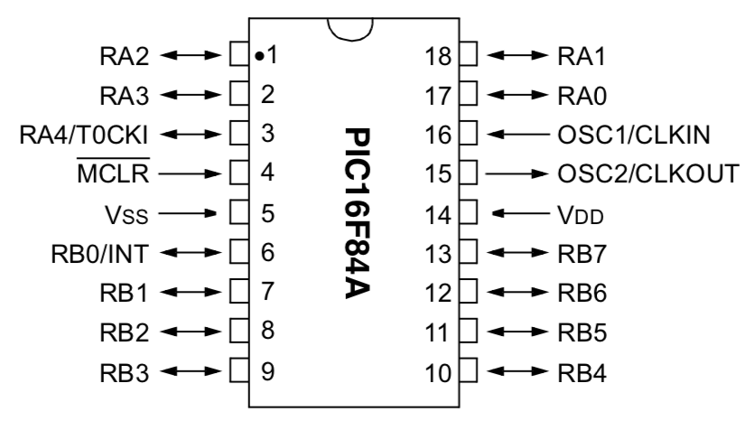

# #532 PIC16F84A Blinky

A quick test of programming a PIC16F84A on a breadboard and 3rd party dev board with MPLAB X (assembler). Updated 2026 for PIC-as and latest IDE tools while still using the old PICkit 3.


Here's a quick demo..

[](https://www.youtube.com/watch?v=vAowaVov7Bk)

## Notes

I'm planning to play around a bit more with low-end (8 bit) PICs. To start I'd like to get my toolchain setup and testing.
So for this project I'm programming a PIC16F84A-04 with a simple assembler "LED blinky" routine in order to test my setup and the following tools:

* MPLAB X IDE
* PICkit 3 (clone)
* PIC16F84A-04 on a breadboard
* PIC16F84A-04 on a 3rd party development/programming board

I originally ran this exercise in 2017 with MPLAB X IDE v5.30 and mpasm 5.86,
but now updated in Feb-2026:

* Revised assembler code to use PIC-as instead of old mpasm syntax.
* Compiled with MPLAB X IDE v6.20 on macOS
* Programmed using the PICkit 3 on Ubuntu with MPLAB X IPE v6.20 (the last version to support PICkit 3)

See [LEAP#331 Getting Blinky with PIC Assembler](../GettingBlinky/) for more details on the trials and tribulations of trying to continue to use the PICkit 3 on macOS.

### PIC16F84A Specs

The
[microchip](https://www.microchip.com/en-us/product/PIC16F84A)
site has plenty of info and datasheets for the processor. The core specs:

* 1024 words flash memory
* 68 bytes SRAM
* 64 bytes EEPROM
* 13 I/O ports
* 1 8-bit timer/counter
* voltage range: 2.0-5.5
* up to 4 MHz oscillator (PIC16F84A-04 variant) or 20 MHz (PIC16F84A-20 variant)



### Compiling the Project with the the MPLAB X IDE

The [PIC16F84ABlinky.X](./PIC16F84ABlinky.X) project is a simple single-file program in assembler that blinks an LED on pin RA3 (2) at about 4Hz.

Project settings selected as follows:

* Family: Mid-Range 8-bit MCUs (PIC10/12/16/MCP)
* Device: PIC16F84A
* Compiler: PIC-as

The [configuration bits](https://microchipdeveloper.com/mplabx:view-and-set-configuration-bits) are set:

* `config "FOSC" = HS`: HS oscillator selected (I'm going to use a 4MHz crystal)
* `config "WDTE" = OFF` watchdog timer disabled
* `config "PWRTE" = OFF` power-up timer disabled
* `config "CP" = OFF` code protection disabled

### Programming

I am still using an old PICkit 3 programmer:
["pickit 3 Programming / emulator + PIC microcontroller / minimum system board / development board / universal programmer seat" (aliexpress seller listing)](https://www.aliexpress.com/item/1734894366.html) purchased for US $18.85 (Feb-2017).
Only 5 of the pins are relevant for programming the PIC16F84A:

| PIC16F84A Pin | Programmer Pin | Function   | Description         |
|---------------|----------------|------------|---------------------|
| MCLR  (4)     | VPP (1)        | VTEST MODE | Program Mode Select |
| VDD   (14)    | VDD (2)        | VDD        | Power Supply        |
| VSS   (5)     | GND (3)        | VSS        | Ground              |
| RB7   (13)    | PGD (4)        | DATA       | Data Input/Output   |
| RB6   (12)    | PGC (5)        | CLOCK      | Clock Input         |

Notes:

* MCLR is the Master Clear (Reset) input/programming voltage input. This pin is an active low RESET to the device
* In the PIC16F8X, the programming high voltage is internally generated. To activate the Programming mode, high voltage needs to be applied to MCLR input. Since the MCLR is used for a level source, this means that MCLR does not draw any significant current.

On Windows or Ubuntu, the PIC16F8X can be easily programmed using the MPLAB X IDE v6.20 or MPLAB IPE v6.20 support for the PICkit 3.

Since I am no longer able to get the PICkit 3 working with macOS,
I am driving it remotely connected to an Ubuntu machine running MPLAB IPE v6.20, using the
[ipe-remote.sh](../GettingBlinky/ipe-remote.sh) script from
[LEAP#331 Getting Blinky with PIC Assembler](../GettingBlinky/).

```sh
$ ../GettingBlinky/ipe-remote.sh ronda-u1 16F84A PIC16F84ABlinky.X/dist/default/production/PIC16F84ABlinky.X.production.hex
PIC16F84ABlinky.X.production.hex                                                                                                                                                                 100%  216    42.4KB/s   00:00
DFP Version Used : PIC16Fxxx_DFP,1.6.156,Microchip
*****************************************************
Connecting to MPLAB PICkit 3...
Currently loaded firmware on PICkit 3
Firmware Suite Version.....01.56.09
Firmware type..............Midrange
Programmer to target power is enabled - VDD = 4.750000 volts.
Target device PIC16F84A found.
Device Revision ID = 0
Erasing...
Erase successful
Device Erased...
Programming...
The following memory area(s) will be programmed:
program memory: start address = 0x0, end address = 0x3ff
configuration memory
Programming/Verify complete
PICKIT3 Program Report
2026-02-06, 19:59:03
Device Type:PIC16F84A
Program Succeeded.
PK3 Verify Report
2026-02-06, 19:59:03
Device Type:PIC16F84A
The following memory areas(s) will be verified:
program memory: start address = 0x0, end address = 0x3ff
configuration memory
EEData memory
User Id Memory
Verification successful.
Verify Succeeded.
Operation Succeeded
```

## Construction

This is a minimal circuit - the application is basically a single LED on RA3.
More interesting details in the schematic are the in-circuit programming connections.

Diodes D1 and D2 prevent interference between programming power (VPP) and the pull-up to VDD required to enable the chip for normal operation.
Note:

* the PIC ICSP Guide does not include D2, but I found that without it I could not get the PIC to run with the programmer connected. This may be due to a difference between the clone PICkit 3 I have and the real thing.


Running on a breadboard:


Scope trace of the generated LED control signal - bang on 4 Hz:


## Using the Dev Board

After successfully programming on a breadboard, I tried the dev board that I received with the PICKit 3.
It turns out to be marginally more convenient, mainly because:

* the zif socket reduces the chance of damaging the PIC
* it has a pull-up resistor, and an LED with current-limiting resistor that can be used if needed

However, two limitations:

* because it is designed to generically handle any PIC up to 40 pin DIP package, it needs the correct connects to be wired up with jumpers
* it doesn't include diodes for diode-steering the VPP and VDD-pullup MCLR connections. I added these in the zif socket and wired up accordingly.


## Bad Chips

The first PIC16F84A chips I tried to program came from an aliexpress supplier and were clearly salvaged parts.
The programmer was unable to identify them or perform any programming actions.

```sh
Connecting to MPLAB PICkit 3...

Currently loaded firmware on PICkit 3
Firmware Suite Version.....01.56.02
Firmware type..............Midrange
Programmer to target power is enabled - VDD = 4.750000 volts.
Target Device ID (0x3fe0) is an Invalid Device ID. Please check your connections to the Target Device.
```

If I still tried to proceed with programming it would fail:

```sh
Programming...

The following memory area(s) will be programmed:
program memory: start address = 0x0, end address = 0x21
configuration memory
program memory
Address: 1 Expected Value: 3400 Received Value: 800
Failed to program device
```

I put this down to faulty chips.
The problems disappeared when I switched to some PIC16F84A chips from a reputable source [element14](https://sg.element14.com/microchip/pic16f84a-04-p/mcu-8bit-pic16-4mhz-dip-18/dp/9760865?st=PIC16F84A).

## Credits and References

* [PIC16F84A datasheet and info](https://www.microchip.com/en-us/product/PIC16F84A)
* [PICkit™ 3 In-Circuit Debugger](https://www.microchip.com/en-us/development-tool/PG164130)
* [PICkit 3 Programmer/Debugger](https://components101.com/misc/pickit3-programmer-debugger-pinout-connections-datasheet)
* ["pickit 3 Programming / emulator + PIC microcontroller / minimum system board / development board / universal programmer seat" (aliexpress seller listing)](https://www.aliexpress.com/item/1734894366.html)
    * Purchased for US $18.85 (Feb-2017)
* [MPLAB X IDE](https://www.microchip.com/en-us/tools-resources/develop/mplab-x-ide)
* [MPLAB Integrated Programming Environment (mplab_ipe)](https://www.microchip.com/en-us/tools-resources/production/mplab-integrated-programming-environment)
