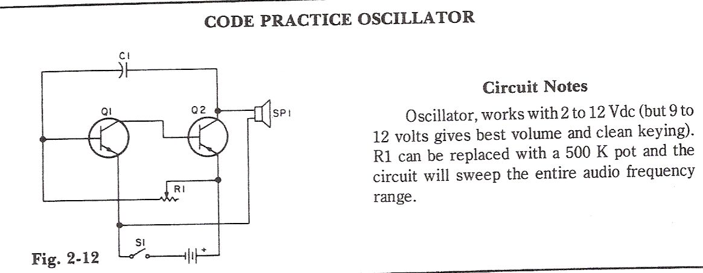
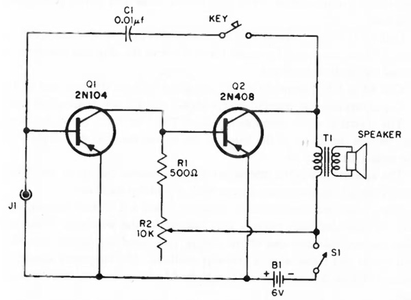

# #668 Code Practice Oscillator

Build and test a simple 2-transistor code practice oscillator.

Here's a quick demo..

## Notes

There's a long history of simple audio oscillator circuits intended to practice morse code.

Some of the circuits found on the internet are from the very early days of vacuum tubes or early transistors.
I've tried to make a few of those circuits work with little success,
and suspect many are no longer a practical designs because of how good our components are these days.
A couple of examples...

### Circuit Design

The circuit I've used here - that **does** work - is based on
[Simple Two Transistor Oscillator (www.homemade-circuits.com)](https://www.homemade-circuits.com/how-to-build-simple-transistor-circuits/).

I've modified some of the values for a tighter audio range.
At 5V it is very loud;-)

### Waveform

Here's a trace of the oscillator output with R1 in a random mid-position, pitching it at 415Hz.
As can be seen, the oscillator is a pretty harsh for an audio tone:

* square wave
* unbalanced duty cycle
* appears to be quite a flyback voltage spike

## Credits and References

* [2N3904](http://parts.io/detail/5427230/2N3904)
* [2N3906](http://parts.io/detail/5427230/2N3904)
* [Simple Two Transistor Oscillator](https://www.homemade-circuits.com/how-to-build-simple-transistor-circuits/)
* [Simple Audio Amplifier/Oscillator Circuit with Two Transistors](https://circuitszone.com/simple-audio-amplifier-oscilator-circuit-with-two-transistors/) - no longer a practical design
* [Simple Two Transistor Code Oscillator](http://www.angelfire.com/art2/artswan/codeosc1.jpg) - no longer a practical design
* [Art Swan's Electronic Circuits](https://www.angelfire.com/art2/artswan/)
