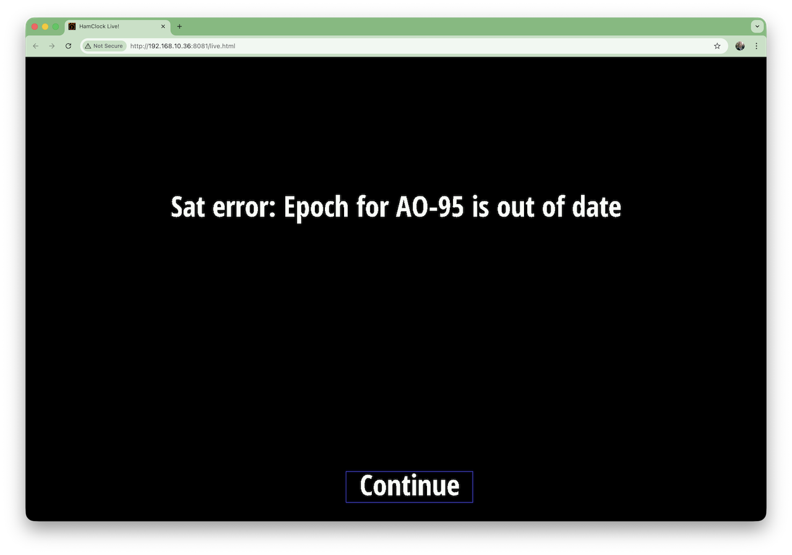
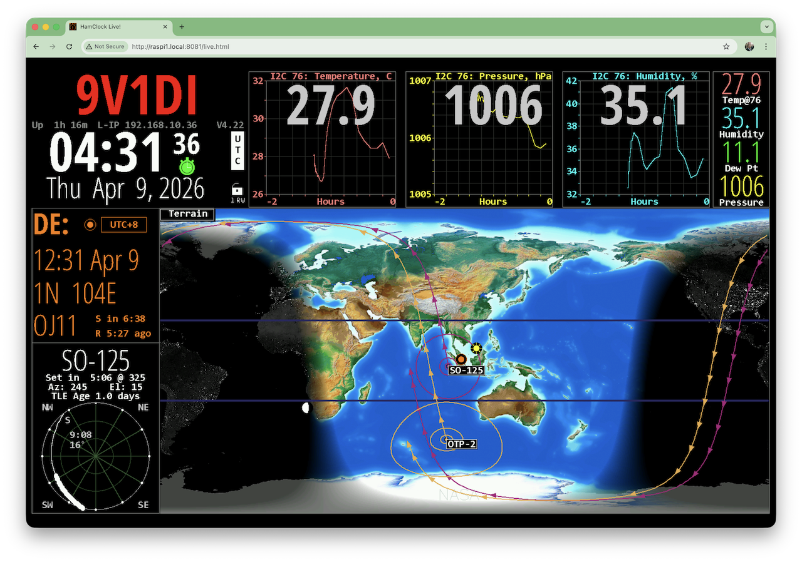
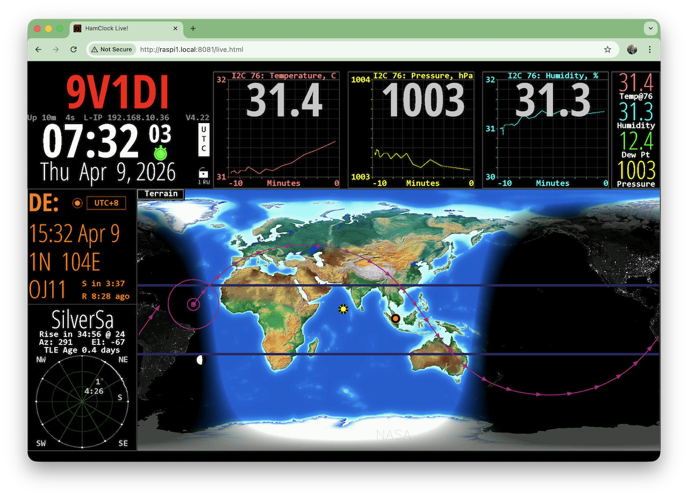
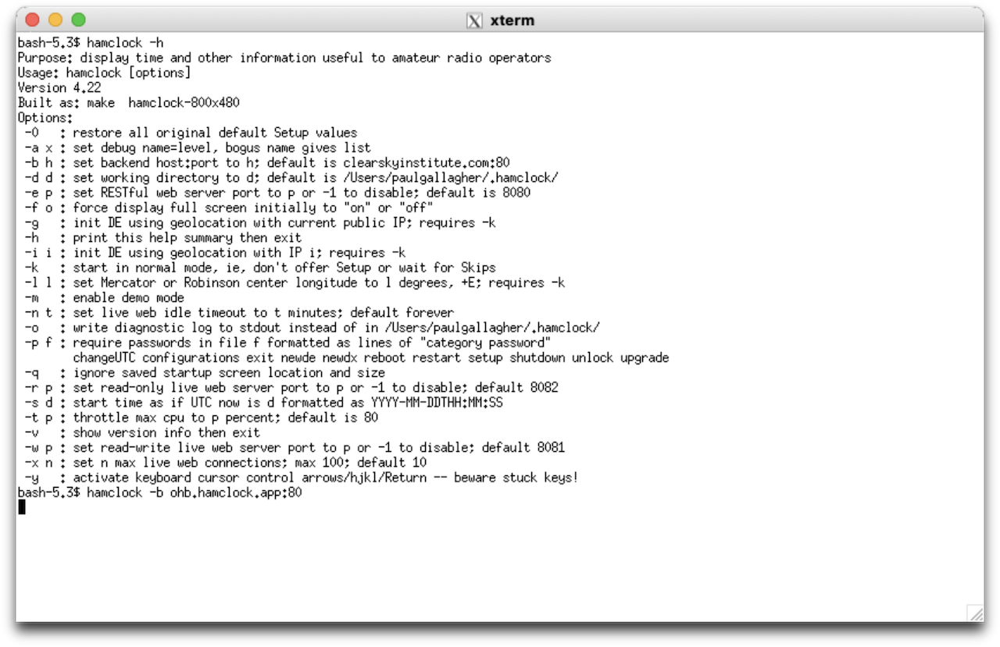
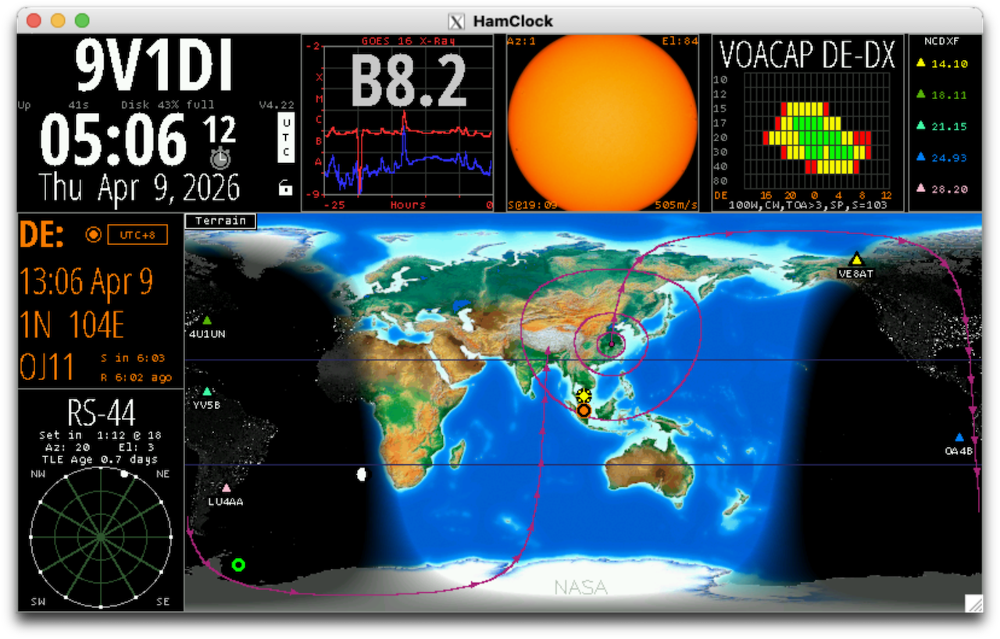
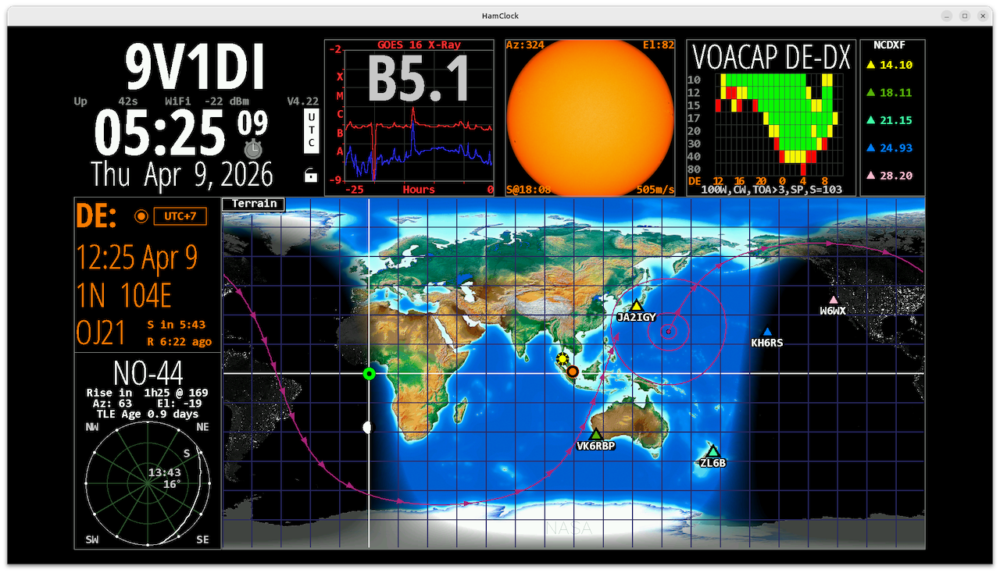

# #836 Using the Open HamClock Backend

Using the new Open HamClock Backend (OHB) to give my HamClock client installation a new lease of life. Testing clients on Raspberry Pi, macOS, and Ubuntu.

## Notes

The [Open HamClock Backend (OHB)](https://ohb.works/) project was started in Feb-2026 with the objective of re-implementing
a fully compatible HamClock backend, so that the wel-known HamClock client could still continue to operate after the
demise of the original Clear Sky Institute services.

Originally started in the now defunct `https://github.com/BrianWilkinsFL/open-hamclock-backend`, the project has as of Apr-2026 largely reached feature-parity with the original Clear Sky Institute service.

The OHB project is currently available at:

* <https://ohb.works/> - main website
* <https://github.com/komacke/open-hamclock-backend> - backend source
* <https://github.com/komacke/hamclock> - client source
* <https://discord.gg/wb8ATjVn6M> - Discord

As this is a fully open-source solution, with an inviting group of maintainers, I am fully onboard with this as my preferred successor to HamClock!

The notes that follow document my first steps in using the HamClock client with the new Open HamClock Backend.

See [LEAP#762 HamClock](../) for more on HamClock itself.

### Using OHB with an Existing Raspberry Pi Client

I have an old Raspberry Pi 1 Model B+,
fitted with the [LEAP#831 HamClock Hat](../DIYHamClockHat/), and
running a [slightly modified](https://github.com/tardate/ESPHamClock/pull/3) version of the final Clear Sky Institute 4.22 client.

Switching it over to use the OHB backend is easily done with the `-b` parameter to specify a different backend:

    pi@raspi1:~ $ hamclock -b ohb.hamclock.app:80

I have the HamClock is configured to run headless.
I am using the default ports and the Raspberry Pi is on 192.168.10.36, so I can now access hamclock interfaces

* RW live view: <http://192.168.10.36:8081/live.html>
* RO live view: <http://192.168.10.36:8082/live.html>
* REST API e.g. get config: <http://192.168.10.36:8080/get_config.txt>

When I first started the client, I would see errors such as "Sat error: Epoch for AO-95 is out of date" when trying to track satellites (as in the screen below).
This due to outdated information cached in the `~/.hamclock/esats.txt` file.
The client will eventually refresh this file in 3-6 hours, but a quick way to get an immediate update is to remove this file before starting hamclock e.g.:

    pi@raspi1:~ $ rm ~/.hamclock/esats.txt
    pi@raspi1:~ $ hamclock -b ohb.hamclock.app:80

With satellite data updated, HamClock is working perfectly with the new backend:

To ensure that HamClock automatically loads on startup, I modify `crontab -e` accordingly:

    @reboot /usr/local/bin/hamclock -b ohb.hamclock.app:80

### Fresh Raspberry Pi Installation

Let's test the automated installation script for the Raspberry Pi.
First I'll remove the existing install:

    rm -fr ESPHamClock
    rm ~/Desktop/hamclock.desktop
    # rm -fr ~/hamclock # not done - I'll leave my previous settings in place
    sudo rm /usr/local/bin/hamclock*

Down load the HamClock RPi installer from the latest <https://github.com/komacke/hamclock/releases>:

    curl -LO https://github.com/komacke/hamclock/releases/download/v4.22.4/install-hc-rpi
    chmod u+x install-hc-rpi
    ./install-hc-rpi

The installer takes care of installing pre-requisites and offering other options such as autostart configuration.

Under the cover, the core is a source installation, which may be performed manually as follows. Here I've chosen to build for web-only at 1600x960 resolution:

    curl -O  https://ohb.hamclock.app/ham/HamClock/ESPHamClock.zip
    unzip ESPHamClock.zip
    cd ESPHamClock
    make help
    ...
    make -j 4 hamclock-web-1600x960
    sudo make install

And then startup in the background:

    $ hamclock -b ohb.hamclock.app:80 &
    [1] 1088
    $

All working fine...

### Using OHB with macOS Client

I'm running macOS with an Apple Silicon M1 chip.
The HamClock client runs with XWindows.

Installing XQuartz (for XWindows support) with brew:

    brew install --cask xquartz

Then run the installation steps per the documentation:

    curl -O https://ohb.hamclock.app/ham/HamClock/ESPHamClock.zip
    unzip ESPHamClock.zip
    cd ESPHamClock
    make -j 4 hamclock-800x480
    sudo make install

The sources can then be removed:

    cd ..
    rm -fR ESPHamClock
    rm ESPHamClock.zip

To run HamClock, first start XQuartz

    open -a XQuartz

Then within XQuartz, choose "Applications > Terminal", and run the `hamclock` command with the `-b` parameter to specify the backend server:

After entering call sign, lat lng options etc, HamClock starts and I can start to play with the display options.

### Ubuntu

I also routinely use Ubuntu (currently version 24.04). Let's try.

Make sure pre-requisites are installed:

    sudo apt install curl make g++ xorg-dev xdg-utils

Run the installation steps per the documentation (this time a slightly larger 1600x960):

    curl -O https://ohb.hamclock.app/ham/HamClock/ESPHamClock.zip
    unzip ESPHamClock.zip
    cd ESPHamClock
    make -j 4 hamclock-1600x960
    sudo make install

The sources can then be removed:

    cd ..
    rm -fR ESPHamClock
    rm ESPHamClock.zip

Run HamClock from the console with the `-b` parameter to specify the backend server:

    hamclock -b ohb.hamclock.app:80

Nice! Also works great.

## Credits and References

* [LEAP#762 HamClock](../)
* [LEAP#831 HamClock Hat](../DIYHamClockHat/)
* Open HamClock Backend
    * <https://ohb.works/> - main website
    * <https://github.com/komacke/open-hamclock-backend> - backend source
    * <https://github.com/komacke/hamclock> - client source
    * <https://discord.gg/wb8ATjVn6M> - Discord
