# #762 HamClock

Exploring HamClock, the kiosk-style application that displays real time space weather, radio propagation models, operating events and other information particularly useful to the radio amateur. Trying it on macOS, Ubuntu and Raspberry Pi. With the Raspberry Pi, hook up the BME280 environmental sensor and satellite, alarm, and timer indicators. As of 2026, HamClock has reached end-of-life, so I also cover potential replacements.

## Notes

I learned about [Geochron](https://www.geochron.com/) clocks (analog and digital) on [Ham Radio Workbench 230](https://www.hamradioworkbench.com/podcast/hrwb-230-all-about-the-geochron-with-patrick-kj7szu).
These are beautiful displays of the current time over a live map of the earth, and support overlays for all manner of interesting details.

They are expensive though! I did find out though (via a tip from Mike Deal N7URH) that there is an open source alternative specifically designed for amateur radio called [HamClock](https://www.clearskyinstitute.com/ham/HamClock/).

HamClock is a kiosk-style application that provides real time space weather, radio propagation models, operating events and other information particularly useful to the radio amateur.

HamClock was introduced in an October 2017 QST article and continues to be maintained and expanded. It supports a range of platforms:

* ESP8266 - the original design, still available but no longer maintained
* Raspberry Pi
* Linux-style systems
* macOS

### Feb-2026 Update

In early 2026, the community of HamClock enthusiasts was sad to learn that the creator of
[HamClock was now an SK](https://www.reddit.com/r/amateurradio/comments/1qqdwln/elwood_downey_wb0oew_creator_of_hamclock_is/)
and that the [HamClock site](https://clearskyinstitute.com/ham/HamClock/) announced:

> HamClock has reached end-of-life, the last release is version 4.22. All HamClocks will cease to function in June 2026. Thank you for your interest. Elwood Downey, WB0OEW, <ecdowney@clearskyinstitute.com>

So what is the future of HamClock? In the immediate future, HamClock services will start to degrade, as backend dependencies go offline.

I have captured a full archive of HamClock front-end releases at <https://github.com/tardate/ESPHamClock>.

A few projects that are potential successors for HamClock include:

* [OpenHamClock - A real-time amateur radio dashboard for the modern operator](https://github.com/accius/openhamclock)
* [GlanceRF (A Hamclock Modern Rebuild)](https://github.com/pomtom44/GlanceRF)
* [Open HamClock Backend](https://github.com/BrianWilkinsFL/open-hamclock-backend) - a project to recreate the HamClock backend

### macOS

I'm running macOS with an Apple Silicon M1 chip, so it is an obvious place to start. Can we run HamClock? Yes!

Installing XQuartz (for XWindows support) with brew:

    brew install --cask xquartz

Then run the installation steps per the documentation:

    curl -O https://www.clearskyinstitute.com/ham/HamClock/ESPHamClock.zip
    unzip ESPHamClock.zip
    cd ESPHamClock
    make -j 4 hamclock-800x480
    sudo make install

The sources can then be removed:

    cd ..
    rm -fR ESPHamClock
    rm ESPHamClock.zip

To run HamClock, first start XQuartz

    open -a XQuartz

Then within XQuartz, choose "Applications > Terminal", and run the "hamclock" command in the xterm

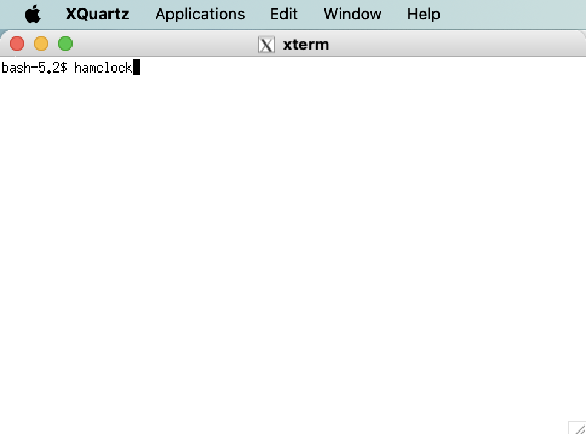

After entering call sign, lat lng options etc, HamClock starts and I can start to play with the display options -
see the user guide <https://www.clearskyinstitute.com/ham/HamClock/HamClockKey.pdf>.

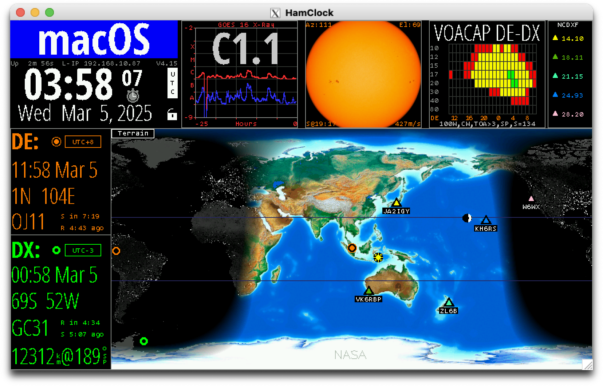

Nice! Works great.

### Ubuntu

I also routinely use Ubuntu (currently version 24.04). Let's try.

Make sure pre-requisites are installed:

    sudo apt install curl make g++ xorg-dev xdg-utils

Run the installation steps per the documentation (this time a slightly larger 1600x960):

    curl -O https://www.clearskyinstitute.com/ham/HamClock/ESPHamClock.zip
    unzip ESPHamClock.zip
    cd ESPHamClock
    make -j 4 hamclock-1600x960
    sudo make install

The sources can then be removed:

    cd ..
    rm -fR ESPHamClock
    rm ESPHamClock.zip

Run HamClock from the console:

    hamclock

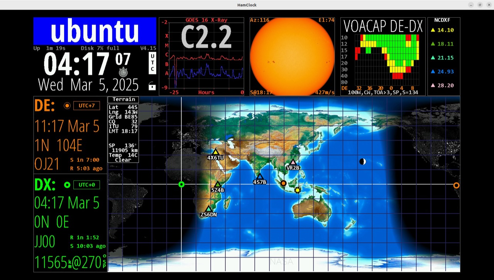

Nice! Also works great.

### Raspberry Pi

I have an old Raspberry Pi 1 Model B+.
Current documentation recommends an RPi model 4b with 1 GB RAM.
Maybe it is possible to use a Raspberry Pi B+?

I grabbed a copy of the latest [Raspberry Pi OS](https://www.raspberrypi.com/documentation/computers/os.html) and ran the HamClock RPi installation per the docs:

    curl -O https://www.clearskyinstitute.com/ham/HamClock/install-hc-rpi
    chmod u+x install-hc-rpi
    ./install-hc-rpi

The installation took a very long time (I left it for an hour or so), but completed successfully. After installation, start from the command line:

    hamclock

HamClock runs fine, albeit a little sluggishly.

### Rebuilding for Headless operation

I removed the previous installation:

    rm -fr ESPHamClock
    rm ~/Desktop/hamclock.desktop
    sudo rm /usr/local/bin/hamclock*

Then downloaded the latest sources to build a web-only 1600x960 version:

    $ wget <https://www.clearskyinstitute.com/ham/HamClock/ESPHamClock.zip>
    $ unzip  ESPHamClock.zip
    $ cd ESPHamClock
    $ make help

    The following targets are available (as appropriate for your system)

        hamclock-800x480          X11 GUI desktop version, AKA hamclock
        hamclock-1600x960         X11 GUI desktop version, larger, AKA hamclock-big
        hamclock-2400x1440        X11 GUI desktop version, larger yet
        hamclock-3200x1920        X11 GUI desktop version, huge

        hamclock-web-800x480      web server only (no local display)
        hamclock-web-1600x960     web server only (no local display), larger
        hamclock-web-2400x1440    web server only (no local display), larger yet
        hamclock-web-3200x1920    web server only (no local display), huge

        hamclock-fb0-800x480      RPi stand-alone /dev/fb0, AKA hamclock-fb0-small
        hamclock-fb0-1600x960     RPi stand-alone /dev/fb0, larger, AKA hamclock-fb0
        hamclock-fb0-2400x1440    RPi stand-alone /dev/fb0, larger yet
        hamclock-fb0-3200x1920    RPi stand-alone /dev/fb0, huge

    Optional command line variables which may be set before the desired target:
        FB_DEPTH=16 or 32         - Specify a given frame buffer pixel size (default is 32 on all but fb0)
        WIFI_NEVER=1              - Disable WiFi fields in setup (already the default on all but fb0)

    $ make -j 4 hamclock-web-1600x960
    $ sudo make install

And then startup in the background:

    $ hamclock &
    [1] 1202
    $

I am using the default ports and the Raspberry Pi is on 192.168.10.36, so I can now access hamclock interfaces

* RW live view: <http://192.168.10.36:8081/live.html>
* RO live view: <http://192.168.10.36:8082/live.html>
* REST API e.g. get config: <http://192.168.10.36:8080/get_config.txt>

The web view:

To start this automatically on each boot, run `crontab -e` then add the following as the last line:

    @reboot /usr/local/bin/hamclock

When running headless, it wasn't clear how to access the configuration screens reliably.
I've found the best approach is to choose "Restart HamClock" from the HamClock menu, and staying on the web page will present an opportunity to go into configuration.

### Exercising GPIO Support

Since it is running on the Pi, I can play with some of the GPIO support.
This requires first visiting setup page 4 and turning on "GPIO".

The features I've enabled include:

* Satellite up LED indicator
* BME280 environmental sensor
* On-the-air button
* Countdown timer indicators and start/reset button
* Alarm indicator and cancel button

I've redrawn the schematic with Fritzing, see [HamClock.fzz](./HamClock.fzz).

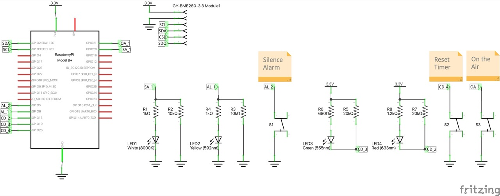

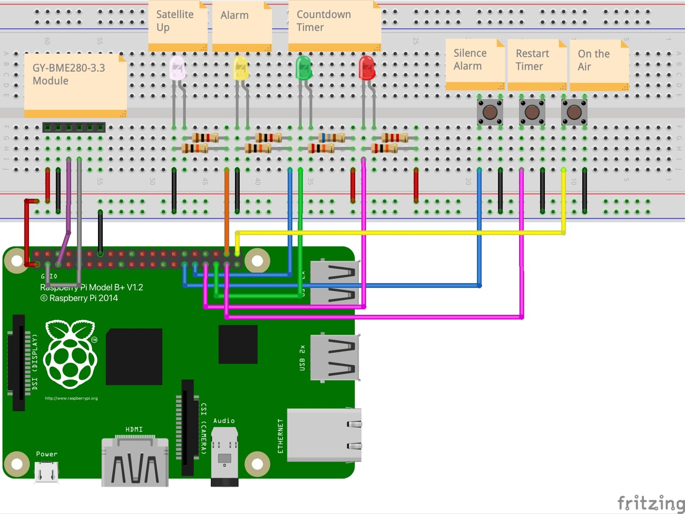

Wired up an breadboard for testing:

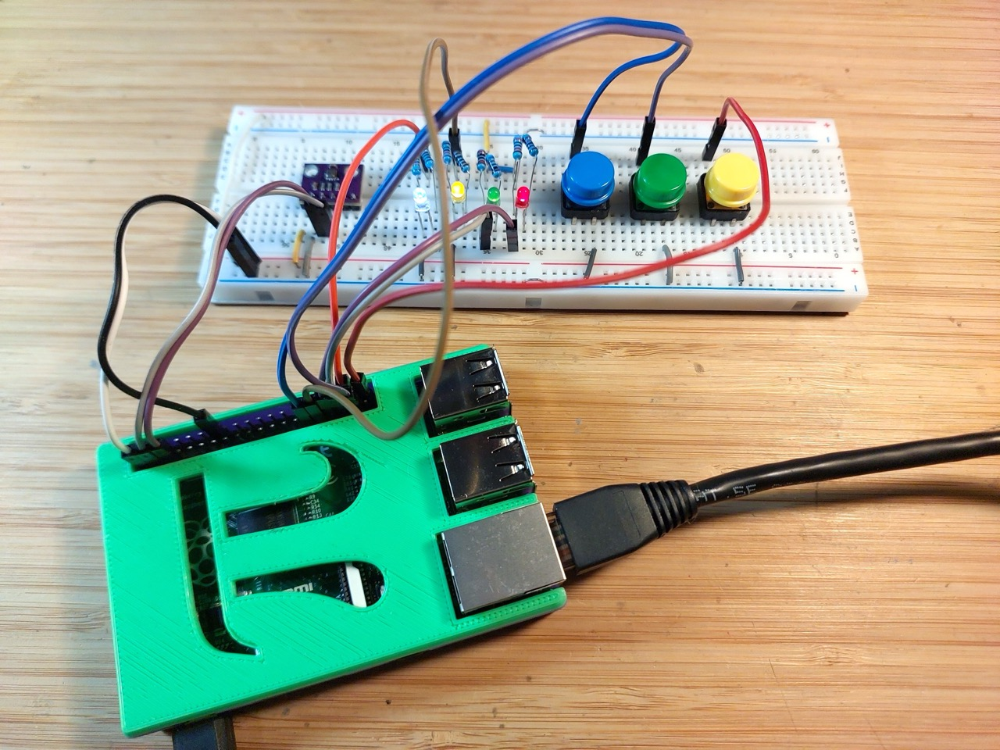

Note: I subsequently made a DIY hat to mount the circuit directly on the Pi. See [LEAP#831 HamClock Hat](./DIYHamClockHat/).

#### Satellite Up Indicator

I am testing the "Satellite up" indicator per the user guide:

* Output terminal SA_1 (GPIO20, pin 38) indicates satellite visibility from DE.
* Normally low
* Cycles high at 1Hz for 1 minute before rise
* Stays high during the pass
* Cycles at 2 Hz during the last minute
* Stays low again after set.

I just tested it with a [ACS3 satellite](https://www.nasa.gov/mission/acs3/) pass near my location (Singapore 1.3521° N, 103.8198° E). Works perfectly as described!

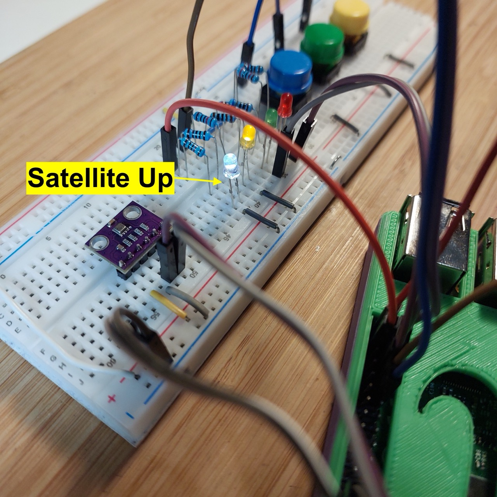

Watching the screen for satellites overhead ...

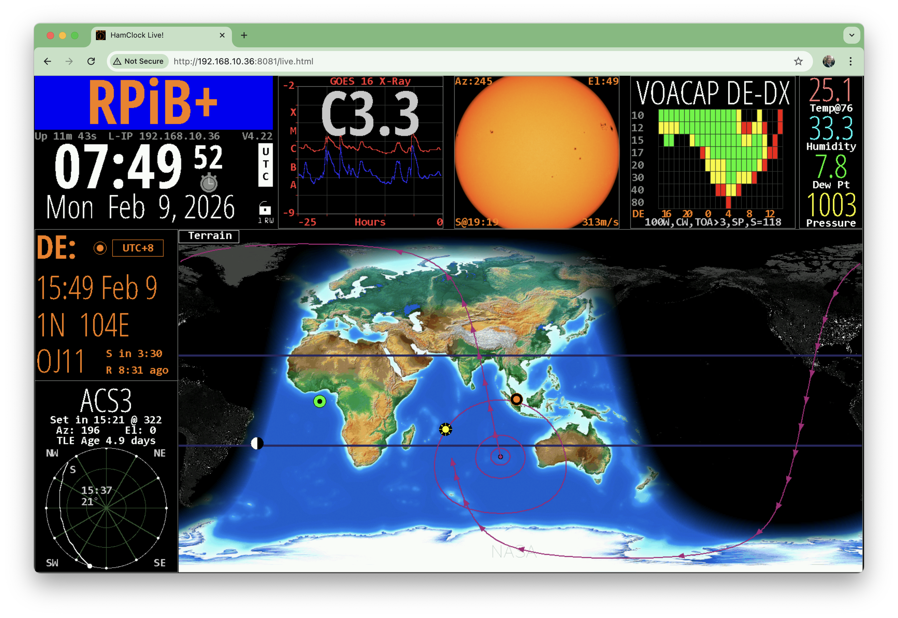

#### BME280 Environmental Sensor

Additional pre-requisites for BME280 support:

* Run `sudo raspi-config` and enable ARM I2C support under "3. Interface Options"
* Verify the `/dev/i2c-1` device is present
* HamClock setup page 4: set I2C file to `/dev/i2c-1`

The BME280 is wired to the Raspberry Pi I²C bus on pins 3 (SDA1) & 5 (SCL1), while also taking 3.3V power and ground.

After restarting HamClock, I can verify the sensor results being collected with the `get_sensors` API endpoint:

    $ curl "http://192.168.10.36:8080/get_sensors.txt"
    #   UTC ISO 8601      UNIX secs I2C  Temp,C   P,hPa   Hum,%  DewP,C
    2026-02-09T07:38:23Z 1770622703  76   25.36 1003.45   33.27    8.04
    2026-02-09T07:38:28Z 1770622708  76   25.35 1003.52   33.30    8.04
    2026-02-09T07:38:34Z 1770622714  76   25.30 1003.49   33.34    8.02
    2026-02-09T07:38:41Z 1770622721  76   25.28 1003.51   33.29    7.98
    2026-02-09T07:38:54Z 1770622734  76   25.28 1003.46   33.55    8.09
    2026-02-09T07:38:54Z 1770622734  76   25.29 1003.44   33.56    8.11
    2026-02-09T07:39:05Z 1770622745  76   25.25 1003.46   33.86    8.20
    2026-02-09T07:39:18Z 1770622758  76   25.07 1003.42   34.16    8.17
    2026-02-09T07:39:33Z 1770622773  76   25.15 1003.44   34.10    8.22
    2026-02-09T07:39:51Z 1770622791  76   25.09 1003.48   34.31    8.25
    2026-02-09T07:40:13Z 1770622813  76   25.17 1003.41   33.98    8.18

Readings from the BME280 can be configured to display in the top panels, for example here is the temperature in pane 1, and BME readings in the narrow, right-most pane 4:

#### On-the-air Button

The "On the Air" button simply signals OTA status to the HamClock.

This simply requires wiring a button to ground/pull-down OA_1 (GPIO21, pin 40)

The status is displayed in the call sign/title area:

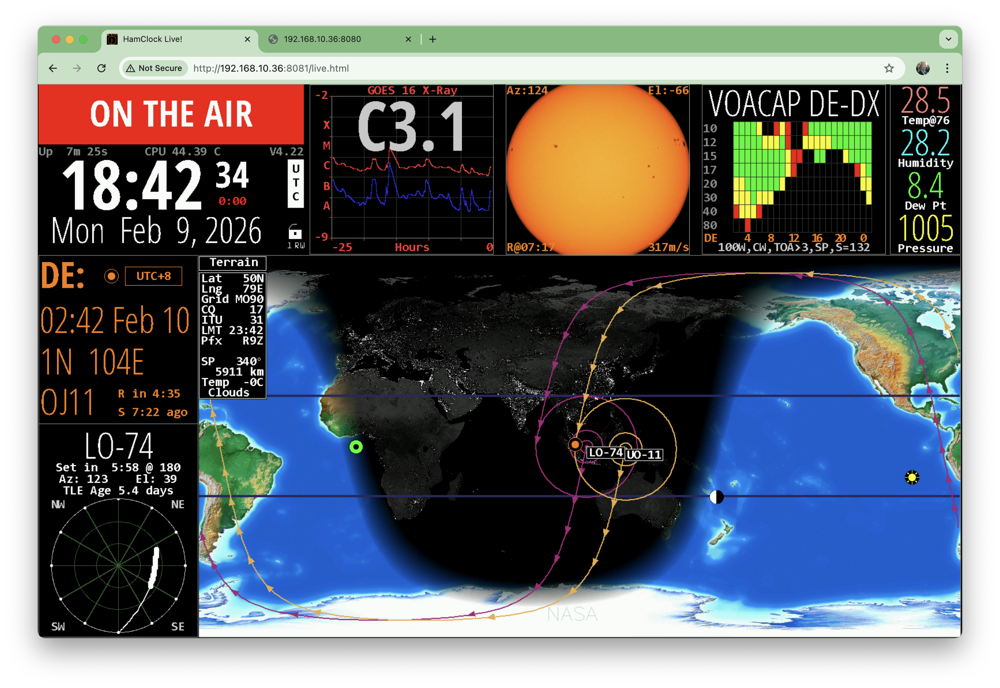

#### Countdown Timer Indicators and Start/Reset Button

The countdown time is configured by clicking on the stopwatch under the UTC seconds in the main screen. I have a 2 minute timer set:

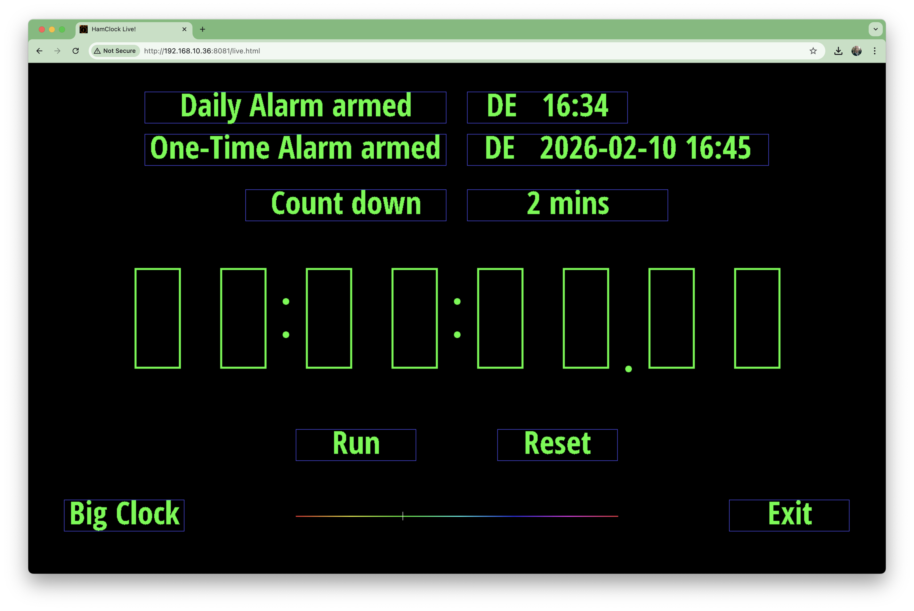

The countdown hardware comprises:

* green LED & resistors
    * on during countdown
    * blinks during the last 1 minute of the count down
    * controlled by the low-side signal CD_3 (GPIO19, pin 35)
* red LED & resistors
    * on during the last 1 minute of the count down
    * blinks for 30 seconds after the count down is complete
    * controlled by the low-side signal CD_2 (GPIO13, pin 33)
* push-button
    * starts or resets the count down
    * ground/pull-down CD_4 (GPIO26, pin 37)

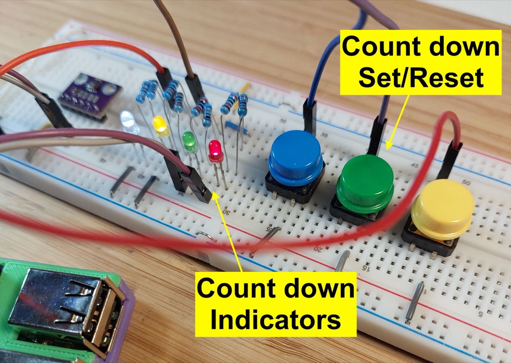

#### Alarm Indicator and Cancel Button

Daily and one-time alarms are configured by clicking on the stopwatch under the UTC seconds in the main screen.

The alarm hardware comprises:

* yellow LED & resistors
    * on when alarm goes off
    * controlled by the high-side signal AL_1 (GPIO6, pin 31)
* push-button
    * starts or resets the count down
    * ground/pull-down AL_2 (GPIO5, pin 29)

NB: I did however discover that the alarm indicator GPIO was not being correctly set for output. I fixed that with a small code change, see [my PR](https://github.com/tardate/ESPHamClock/pull/3).

When the alarm goes of it is displayed in data pane 2:

And the LED lights up. The push-button can be used to cancel the alarm:

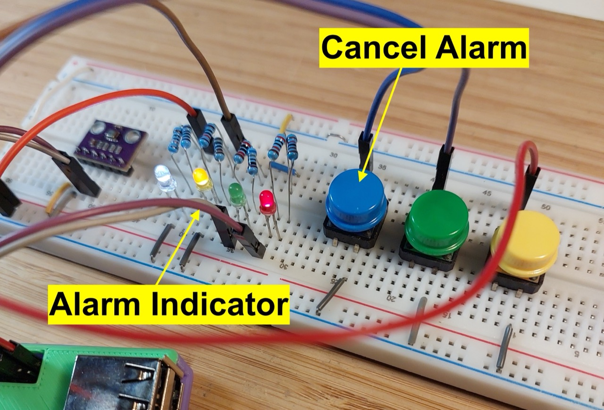

## Credits and References

* [HamClock](https://www.clearskyinstitute.com/ham/HamClock/) - now retired
* <https://github.com/tardate/ESPHamClock> - full archive of HamClock front-end releases
    * includes bug fixes I've had to make in the source
* [Ham Radio Workbench 230 - All About the Geochron with Patrick KJ7SZU](https://www.hamradioworkbench.com/podcast/hrwb-230-all-about-the-geochron-with-patrick-kj7szu)
* [Geochron](https://www.geochron.com/)
* [ACS3 satellite](https://www.nasa.gov/mission/acs3/)
* [OpenHamClock - A real-time amateur radio dashboard for the modern operator](https://github.com/accius/openhamclock)
* [GlanceRF (A Hamclock Modern Rebuild)](https://github.com/pomtom44/GlanceRF)
* [Open HamClock Backend](https://github.com/BrianWilkinsFL/open-hamclock-backend)
* [LEAP#831 HamClock Hat](./DIYHamClockHat/)
* ["1-10pcs BME280 BMP280 5V 3.3V Digital Sensor Temperature Humidity Barometric Pressure Module I2C SPI for Arduino" (aliexpress seller listing)](https://www.aliexpress.com/item/1005008511564094.html)
    * Purchased BME280 3.3V module for SG$3.72 (Jan-2026)
