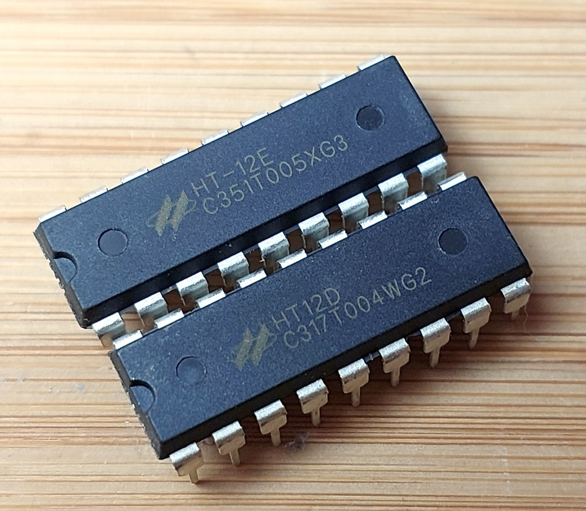
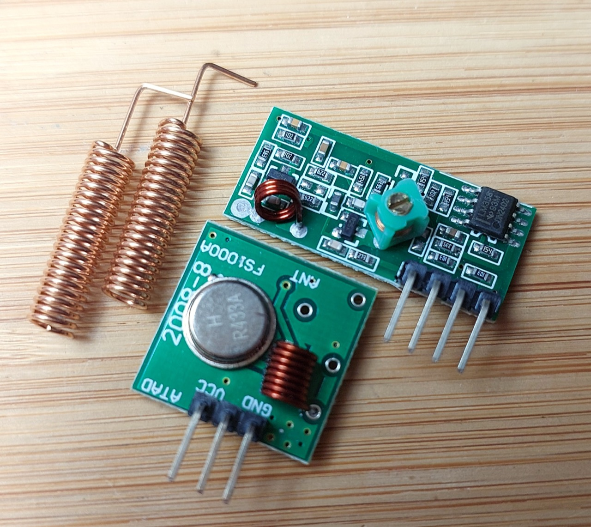
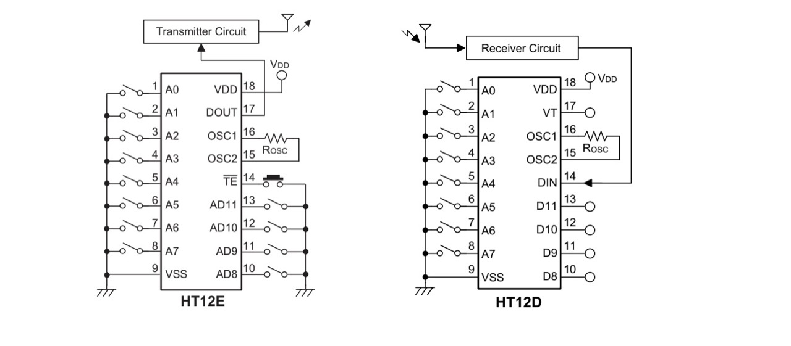

# #765 HT12 Demo

A demo of the HT12D decoder and HT12E encoder ICs used with an LPD433 module to broadcast 4 bits of data to an 8-bit address on the 433 MHz UHF/70-centimeter band.

## Notes

The Holtek Semiconductor HT12D is a decoder IC that is typically paired with the HT12E encoder IC for use in remote control systems and wireless communication applications. The HT12D decodes the received data and extracts the original address code and data code information.

These chips appear to be particularly useful for simple remote automation projects,
providing for up to 4-bits of data without the need to introduce a microcontroller.

The HT12E and HT12D chips in DIP18 form factor:

The LPD433 transmit and receive modules:

Recommended application circuit. Note:

* Transmitter Rosc is not clearly specified in the datasheet, but ~1.1MΩ is indicated. 1MΩ is used in the demonstration circuit below.
* Receiver Rosc is not clearly specified in the datasheet, but ~51kΩ is indicated. 47kΩ is used in the demonstration circuit below.
* Receiver VT pin goes high when a valid transmission is received.

### Some Tutorials and Demonstrations

HT12E and HT12D the Encode and Decoder IC, Experiment Remote control by MrProject TSE

RF Remote Control Circuit Using 433 Mhz Module and HT12E Encoder and HT12D Decoder IC by Manmohan

### Circuit Design

For the demo, I've setup the circuits as follows.

Transmitter:

* 5V power supply
* address A2=low
* manual DIP switches attached to AD8, AD9, AD10, AD11 to set the data to be sent
* manual pushbutton S1 is used to trigger the data send

Receiver:

* 5V power supply
* matching address A2=low
* green LEDs wired to D8, D9, D10, D11
* optional LED attached to VT (valid transmission indicator)

Operation:

* power pon both units
* set the transmission DIP switches to the 4-bit value to be sent
* press S1
* On successful reception, VT goes high momentarily
* data values set on D8, D9, D10, D11 should match the sent data

Works fine. With the on-chip antennas and 5V transmitter, reliable transmission range is only a few metres. Extra range should be achieved by attaching the recommended  external antennas, and boosting the transmission voltage (up to 12V).

## Credits and References

* [HT12E and HT12D: Price, Working and Datasheet](https://www.avaq.com/technology/ht12e-and-ht12d)
* [HT12D/HT12F Decoder Product Information](https://www.holtek.com/page/vg/HT12D_F)
* [HT12A/HT12E Encoder Product Information](https://www.holtek.com/page/vg/HT12E)
* [HT12A/HT12E - 2^12 Series of Encoders](https://www.farnell.com/datasheets/1899539.pdf)
* [HT12D/HT12F - 2^12 Series of Decoders](https://www.farnell.com/datasheets/57850.pdf)
* [RF Transmitter and Receiver With HT12E & HT12D](https://electronics4ubymanmohanpal.blogspot.com/p/blog-page_19.html)
