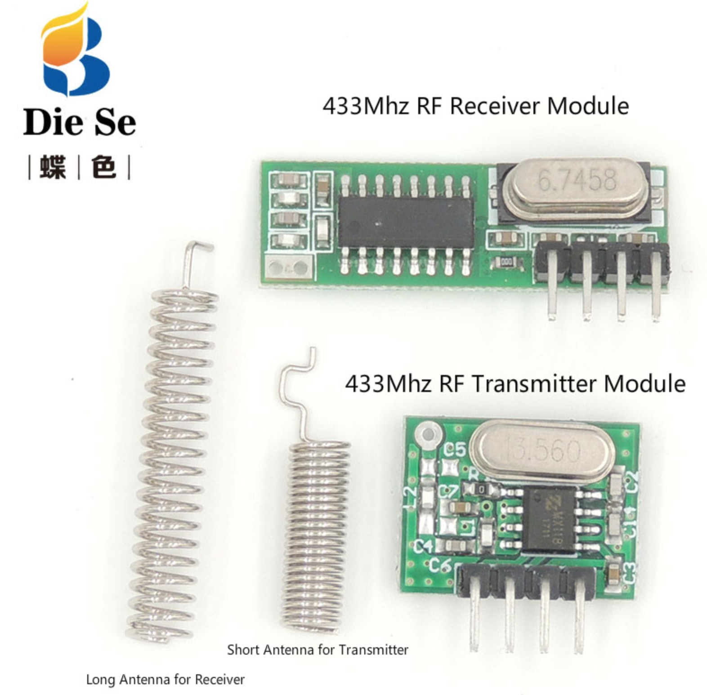
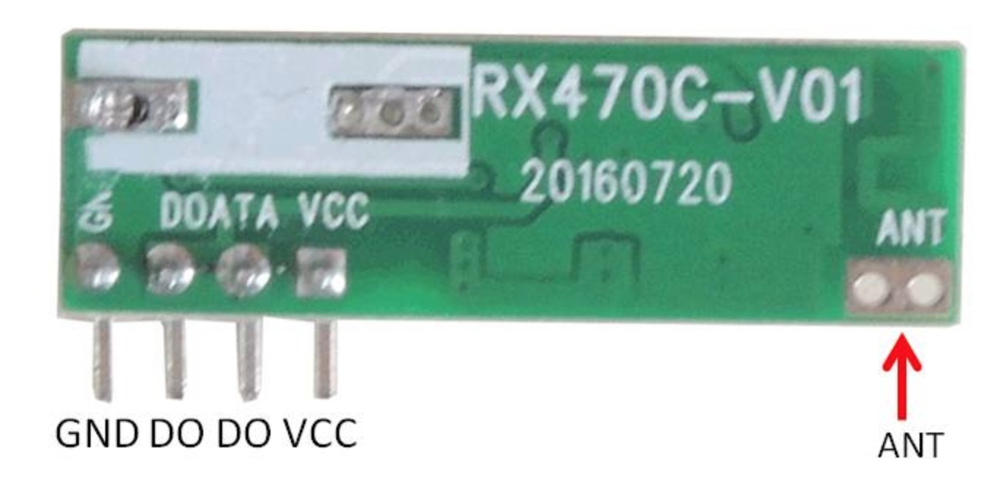
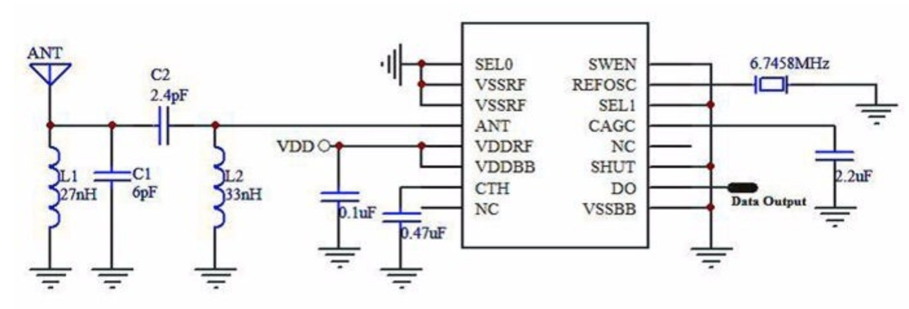
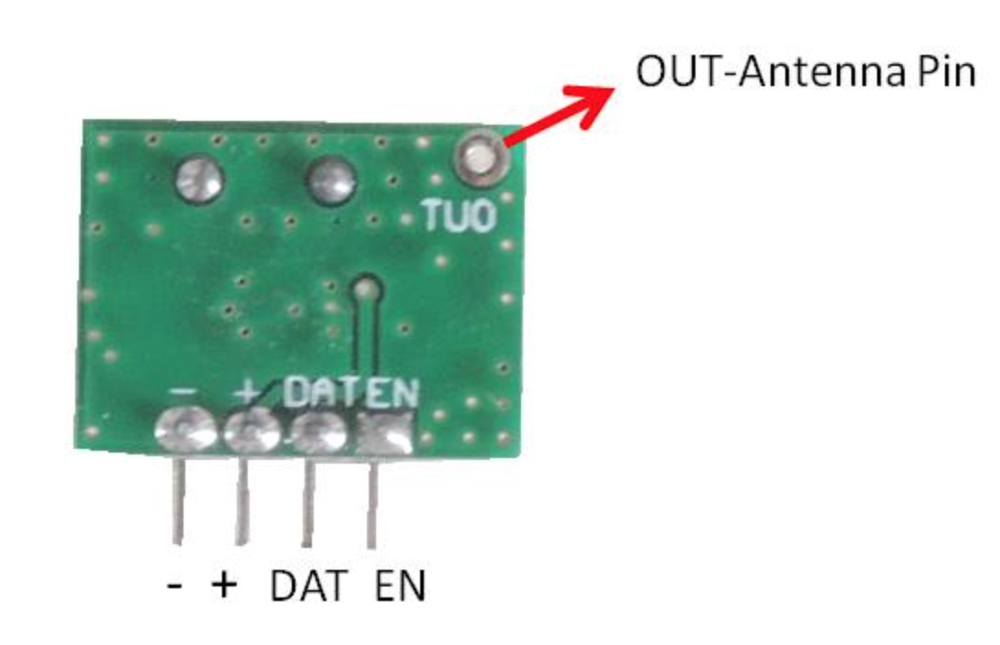
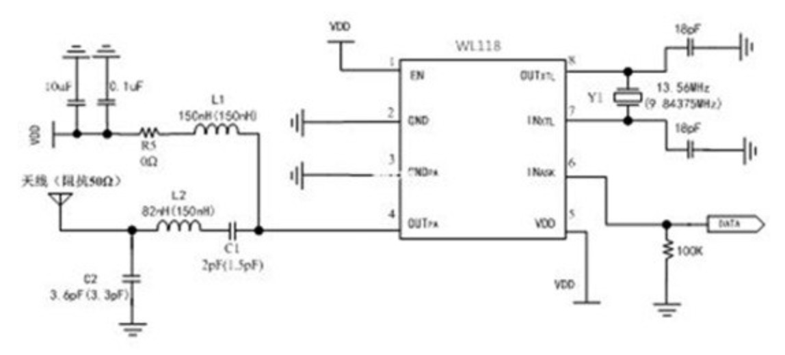
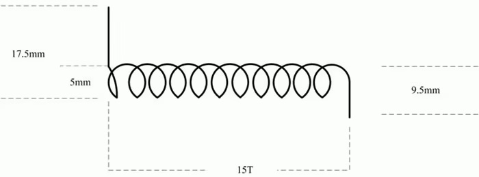
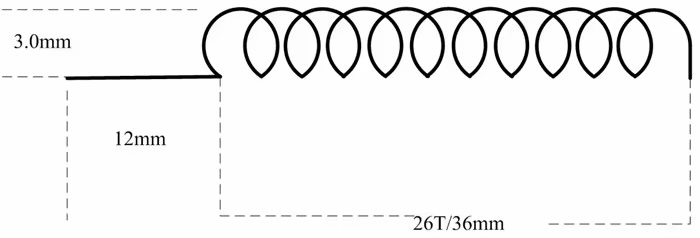
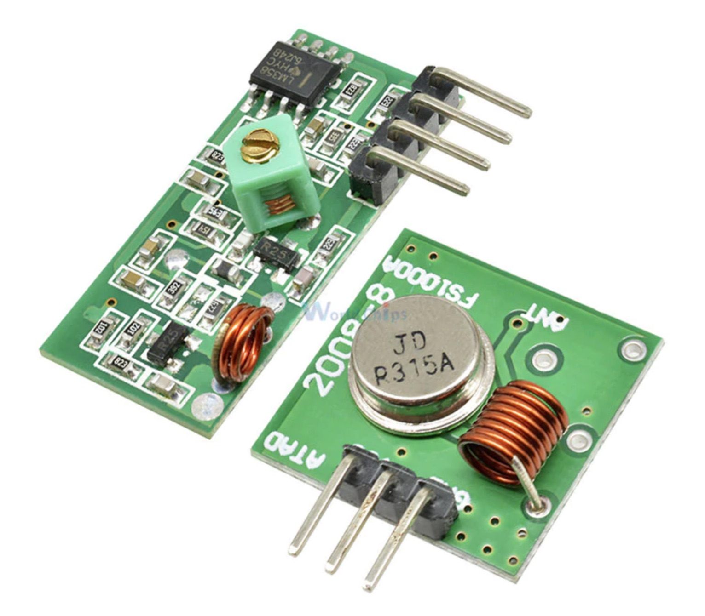
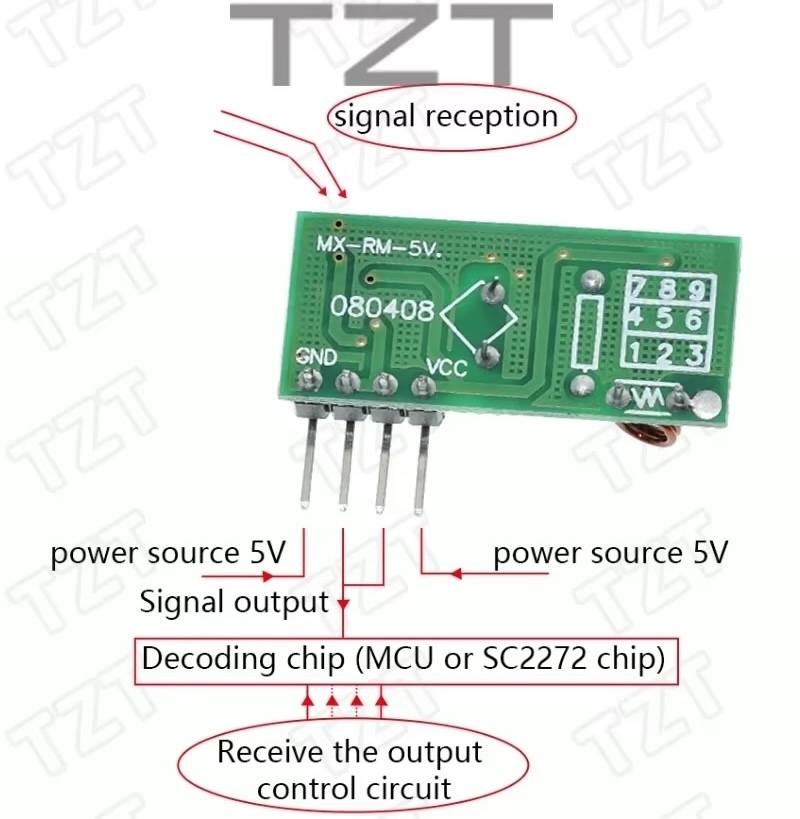
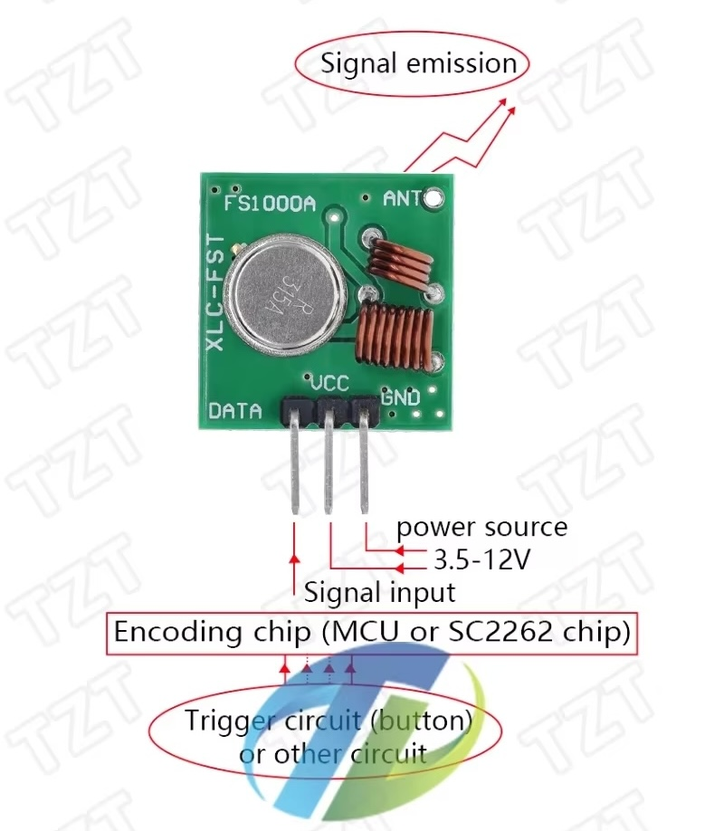

# #712 LPD433 Modules

A roundup of readily available LPD433 modules, low power devices operating on the 433 MHz UHF/70-centimeter band.

## Notes

Paired RF transmit/receive modules are widely available at low cost.
The devices fit into the general category of
[short range/low-power devices](https://en.wikipedia.org/wiki/Short-range_device)
and specifically [LPD433](https://en.wikipedia.org/wiki/LPD433) - low power devices operating on the 433 MHz UHF/70-centimeter band.

Typically applications

* remote control switch
* automotive anti-theft products
* home security products and alarm systems
* remote control electric doors, windows, gates
* remote control curtains
* remote control socket
* remote control LED
* remote control audio, MP3, speakers
* remote control vehicles

The following notes describe the main module types that are readily available on the market.

### Module 1: WL102-341/RX470

This appears to be an earlier design.
Still readily available on aliexpress, for example from this seller:
[QIACHIP 433Mhz RF Transmitter and Receiver](https://www.aliexpress.com/item/32651427149.html).

The main thing to note for this design is that while the receiver can operate up to 5V, the transmitter is specified for max supply of 3.6V.

* Receiver module, typically marked RX470-4 or similar (e.g. RX470C-V01)
    * With long antenna for receiver
* Transmitter module, typically marked WL102-341
    * With short antenna for transmitter

#### Module 1 Receiver, typical specifications

Typically marked RX470-4 or similar (e.g. RX470C-V01)

* Working voltage: DC 2.2~5V
* Quiescent Current: 1µA
* Max current: 2.1mA
* RF frequency: 433.92 MHz
* Frequency band: +/- 150KHz
* transmission rates: 2KHz to 10KHz
* Working temperature: -30~+80 degrees
* Receiving Sensitivity: -110dBm
* Size: 30x9x6mm
* RF Operating mode: ASK/OOK superheterodyne wireless reception
* Pinout
    * GND: ground or negative pole
    * D0: Data output
    * D0: Data output
    * VCC: Power input
    * ANT: Antenna
* External antenna: 32CM single core wire, wound into a spiral

### Module 1 Transmitter, typical specifications

Transmitter module, typically marked WL102-341

* Working voltage: DC 2-3.6V
* Quiescent Current: 1µA
* transfer rate: 20KHz
* RF frequency: 433.92 MHz
* Working temperature: -30~+80 degrees
* Receiving Sensitivity: larger than 11dBm
* Size: 16x12x6mm
* RF Operating mode: ASK/OOK superheterodyne wireless reception
* Pinout
    * DAT - Wave signal input
    * OUT - Antenna pin . RF signal output, can directly connect to the antenna.
    * EN - Enable Pin .But this product EN pin is connected to the power supply, no function
    * Power- ground Pin . The ground wire connects power supply.
    * Power supply pin . Power Input

### Antenna Specifications

Basic Antenna Recommendation

* The antenna core of conductor diameter(including the Antenna skin): 1.0mm, except the Antenna skin: 0.5mm
* The wire length of weld end: 17.5mm, the wire length of antenna terminal: 9.5mm;
* The diameter of antenna winding (including the Antenna skin):5mm;
* The turn number of winding: 15 turns

Enhanced Antenna Recommendation for greater distance:

* The antenna core of conductor diameter (including the Antenna skin): 1.0mm; (except the Antenna skin): 0.35mm
* The wire length of weld end: 12mm
* The diameter of antenna winding (except the Antenna skin):3.0mm;
* The turn number of winding: 26 turns; The length of the winding: 36mm

### Module 2: MX-05V/MX-FS-03V

This appears to be a newer design.
Readily available on aliexpress, for example from this seller:
[433 Mhz RF Transmitter and Receiver Module Link Kit for ARM/MCU WL DIY 315MHZ/433MHZ Wireless Remote Control for arduino Diy Kit](https://www.aliexpress.com/item/32896035786.html).

The main thing to note for this design is that while the receiver still operates up to 5V, the transmitter is specified for max supply of up to 12V.

Typical receiver specifications

* Product Model: MX-05V
* Operating voltage: DC5V
* Quiescent Current: 4MA
* Receiving frequency: 433.92MHZ/315Mhz (optional)
    * receiver has 2.5 round inductor for 433MHz
    * receiver has 3.5 round inductor for 315Mhz
* Receiver sensitivity:-105DB
* Size: 30x14x7mm
* External antenna: 32CM single core wire, wound into a spiral

Typical transmitter specifications

* Product Model: MX-FS-03V
* Launch distance: 20-200 meters (different voltage, different results)
* Operating voltage: 3.5-12V
* Dimensions: 19 x 19mm
* Operating mode: AM
* Transfer rate: 4KB/s
* Transmitting power: 10mW
* Transmitting frequency: 433Mhz/315Mhz (optional)
* An external antenna: 25cm ordinary multi-core or single-core line
* Pinout from left to right: DATA; VCC; GND.

Remarks

* VCC voltage module operating voltage and good power filtering;
* Great influence on the antenna module reception, preferably connected to the 1/4 wavelength of the antenna, typically 50 ohm single conductor, the length of the antenna 433M of about 17cm;
* Antenna position has also affected the reception of the module, the installation, the antenna as possible straight away from the shield, high pressure, and interference source; frequency used to receive, decode and oscillation resistor should match with the transmitter.

## Credits and References

* [433 Mhz Superheterodyne RF Receiver Module and Transmitter Module with antenna for Arduino DIY Kit](https://www.aliexpress.com/item/33036669166.html) - aliexpress seller
* [short range/low-power devices](https://en.wikipedia.org/wiki/Short-range_device) - wikipedia
* [LPD433](https://en.wikipedia.org/wiki/LPD433) - wikipedia, info about low power device 433 MHz/70-centimeter band standards.
