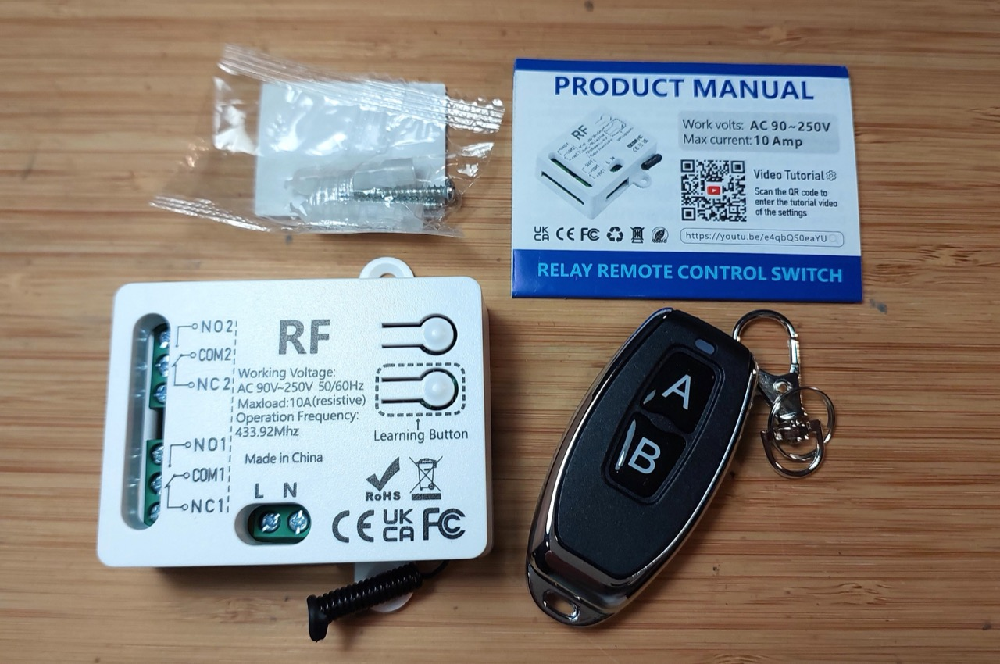

# #855 Remote Control 2202J

Review and test the 433MHz remote control unit 2202J that features two relays, can operate on mains AC or 5V USB, and can be programmed to behave in momentary, toggle, latching, mixed, or motor control modes.

Here's a quick demo..

## Notes

I'm researching remote control options and want to test some complete transmitter/receiver offerings.
This is a review and test of one option I found.

I purchased 1 receiver and 1 remote from Small Tonyy Remote Control Store (aliexpress) for SG$7.86 (Jun-2026):
["433MHz Universal Wireless Remote Control Switch 2 CH,AC 110V 220V RF Relay Receiver,for Light/Fan/Motor/Garage Door Opener etc" (aliexpress seller listing)](https://www.aliexpress.com/item/1005007864400261.html).

According to the manual, the receiver unit is called the "2202J".

### A Quick Teardown

The main receiver board:

Remote control is powered by two CR2016 batteries in series:

### Programming the Remote Control

See the [2202J manual](./assets/2202J-manual.pdf)
and also ["2202RF- How to program" YouTube by Jiahao Chen](https://www.youtube.com/watch?v=e4qbQS0eaYU).

Programming is performed by:

* Press the learning button (on the receiver) a set number of times
    * the number of times pressed will determine the operating mode to be configured
* Wait for 3 seconds (until blue LED inside the receiver has turned on)
* Press button "A" on the remote control
* Wait for 3 seconds (until blue LED inside the receiver has stopped flashing)
* Press button "B" on the remote control
* Programming complete (when blue LED inside the receiver has stopped flashing)

Press the learning button (on the receiver) 8 times to clear all programming.

#### Momentary Mode

Momentary Mode is set by programming with the learning button pressed 1 time.

Behaviour:

* Relay 1 will turn on while button "A" is held down
* Relay 2 will turn on while button "B" is held down

#### Toggle Mode

Toggle Mode is set by programming with the learning button pressed 2 times.

Behaviour:

* Press button "A" will turn on relay "1". Press again to turn off.
* Press button "B" will turn on relay "2". Press again to turn off.

#### Latched Mode

Latched Mode is set by programming with the learning button pressed 3 times.

Behaviour:

* Press button "A" will:
    * first ensure relay "2" is toggled off
    * then turn relay "1" on.
    * Pressing button "A" again will have no effect
* Press button "B" will:
    * first ensure relay "1" is toggled off
    * then turn relay "2" on.
    * Pressing button "B" again will have no effect
* Press button "C" to turn all off

Note: requires a remote control with at least 3 buttons.

#### Mixed Mode

Mixed Mode is set by programming with the learning button pressed 4 times.

Behaviour:

* Press button "A" will control relay "1" in momentary mode
* Press button "B" will control relay "2" in toggle mode.

#### Motor Control Mode

Motor Control Mode is set by programming with the learning button pressed 5 times.

Although intended for motor control, this mode is useful in cases where it is important to "break before make" i.e. turn on relay off before turning the other on.

Behaviour:

* Press button "A" will:
    * first ensure relay "2" is toggled off
    * then turn relay "1" on.
    * Pressing button "A" again will turn relay "1" off
* Press button "B" will:
    * first ensure relay "1" is toggled off
    * then turn relay "2" on.
    * Pressing button "B" again will turn relay "2" off

#### Reset

Press the learning button (on the receiver) 8 times to clear all programming.

### Test Circuit Design

Although the unit can handle and be powered by AC, I'm testing with low voltage DC:

* receiver powered by 5V USB-C
* relays controlling circuits running on 5V DC

The test circuit is intended to clearly illustrate the behaviour of all modes.

Designed with Fritzing: see [RemoteControl2202J.fzz](./RemoteControl2202J.fzz).

Setup for testing:

Receiver in operation:

## Credits and References

* ["433MHz Universal Wireless Remote Control Switch 2 CH,AC 110V 220V RF Relay Receiver,for Light/Fan/Motor/Garage Door Opener etc" (aliexpress seller listing)](https://www.aliexpress.com/item/1005007864400261.html)
    * Purchased 1 receiver and 1 remote from Small Tonyy Remote Control Store (aliexpress) for SG$7.86 (Jun-2026)
* [2202J manual](./assets/2202J-manual.pdf)
* ["2202RF- How to program" YouTube by Jiahao Chen](https://www.youtube.com/watch?v=e4qbQS0eaYU)
