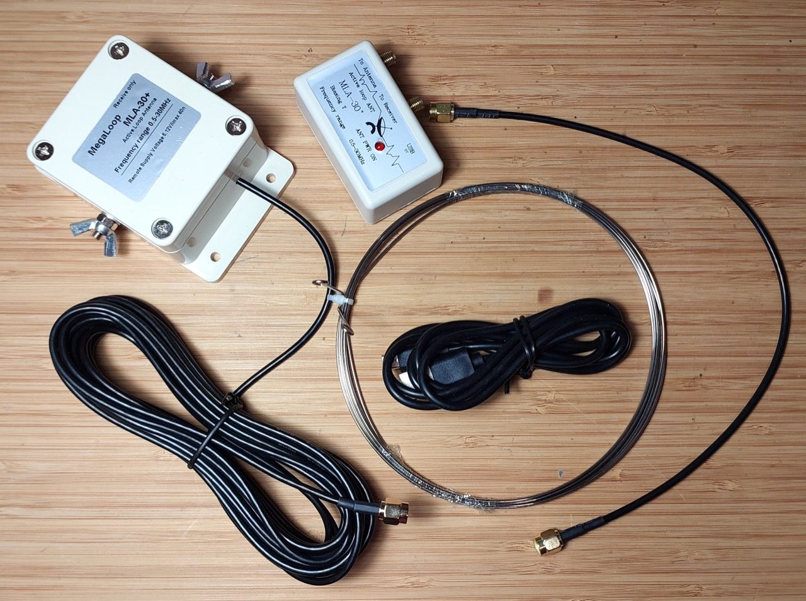
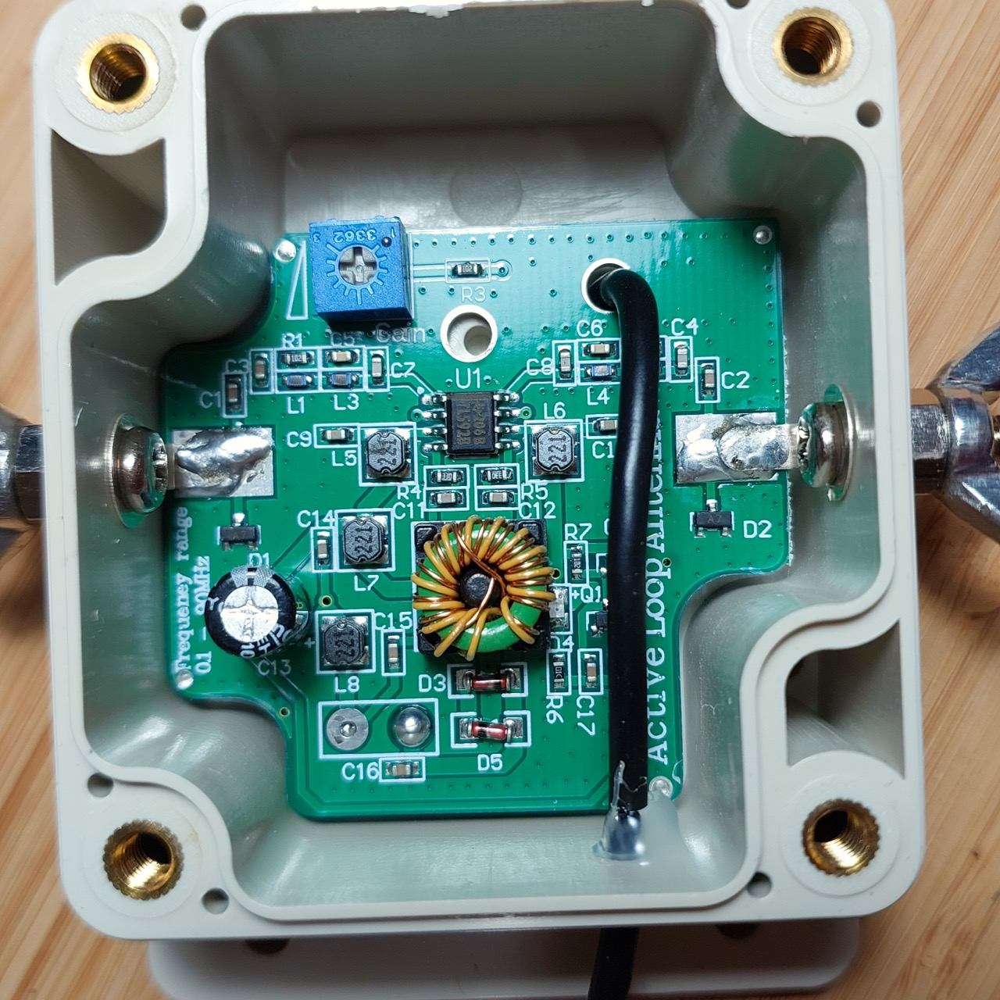
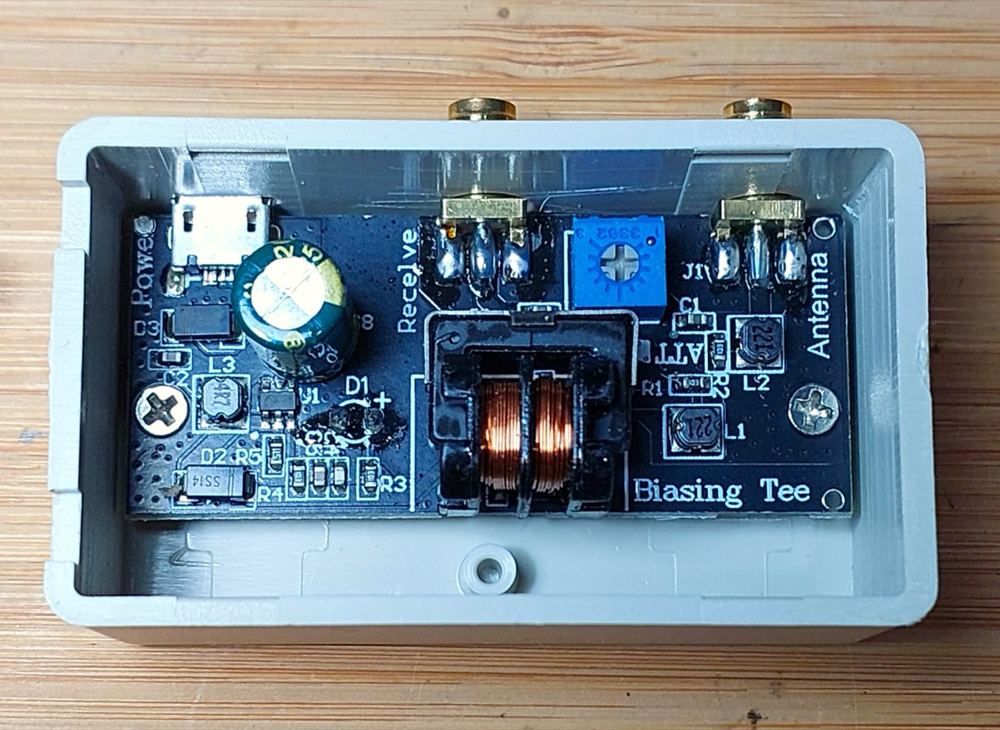
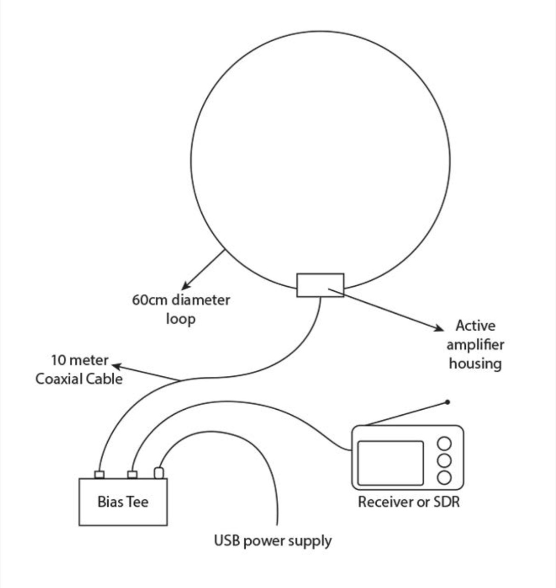

# #744 MLA-30+ Active Loop Antenna

About the MLA-30+ Active Loop Antenna, designed to receive MW/SW/HF from 500kHz to 30MHz.

## Notes

The MLA-30+ Active Loop Antenna antenna is effective for reception across a wide frequency band from 500kHz to 30MHz.

I got mine from [aliexpress](https://www.aliexpress.com/item/1005007653379186.html) for SGD$30 (2025), but it is available from a range of sellers on aliexpress, eBay, and
[Tecsun Radios (AU)](https://www.tecsunradios.com.au/store/product/mla-30-shortwave-loop-antenna/).

Features:

* Reception frequency: 500 kHz to 30 MHz (reduced performance to 100kHz)
* Pre-amplifier included
* Bias-T power supply via supplied USB cable
* Power Supply: 5 V USB
* Current Drain: 750uA
* No adjustments required
* Weatherproof external case

Parts:

* 1x Stainless Steel Wire
* 1x Antenna Box
* 1x Bias-T Power Supply
* 1x 10m SMA Head Line
* 1x SMA to SMA Male Cable
* 1x USB Cable

Inside the antenna box:

Inside the biasing tee:

## Mounting

The loop element of the antenna has a design diameter of 60cm and is connected to the active amplifier housing by two stainless steel wingnuts.

I used some 20mm PVC pip and fittings to mount the antenna.

## Installation

## Credits and References

* [MLA-30 Active Receive Low Noise Loop Antenna Medium Short Wave 500kHz-30MHz Kit](https://www.aliexpress.com/item/1005007653379186.html)
* [Product Page - www.tecsunradios.com.au](https://www.tecsunradios.com.au/store/product/mla-30-shortwave-loop-antenna/)
* [Reviews of the Low Cost MLA-30 Wide Band HF Magnetic Loop Antenna](https://www.rtl-sdr.com/reviews-of-the-low-cost-mla-30-wide-band-hf-magnetic-loop-antenna/)
