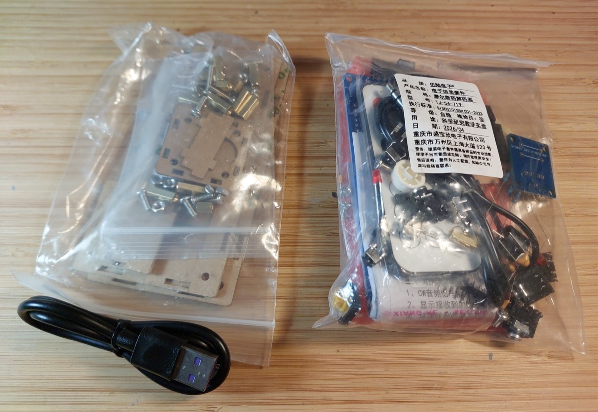
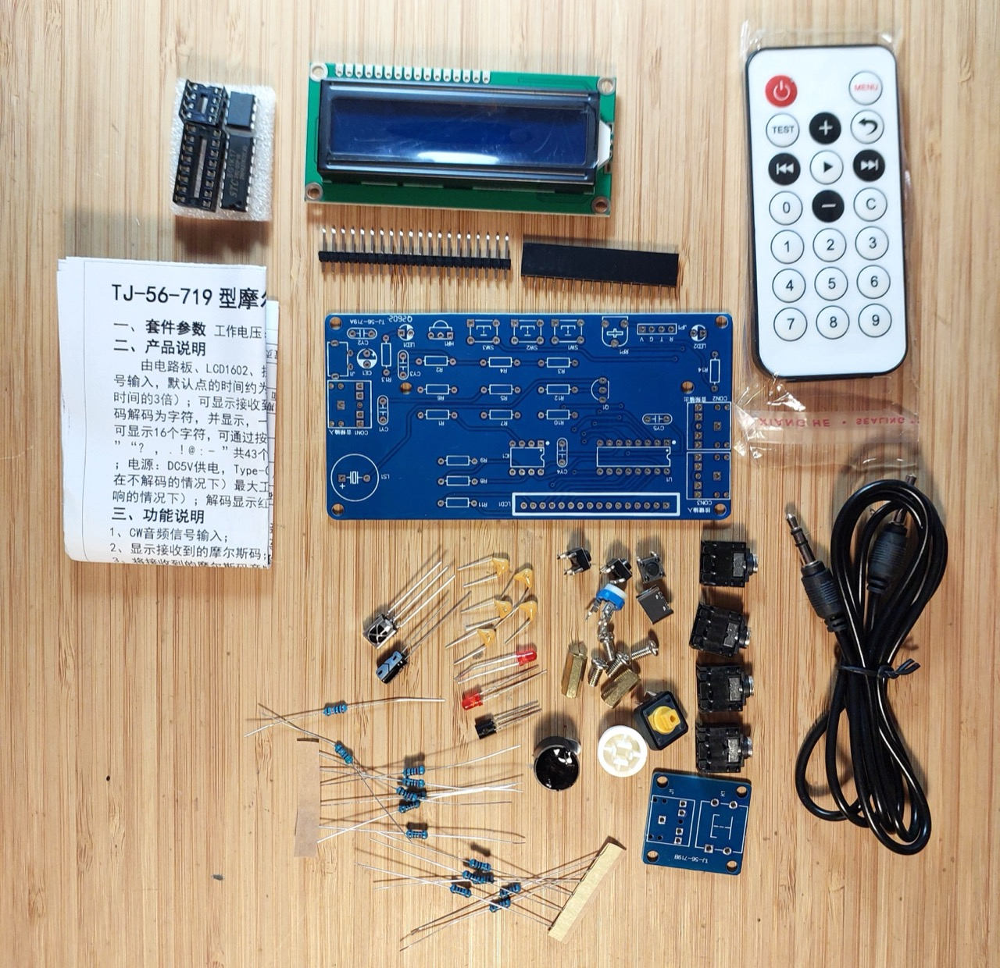
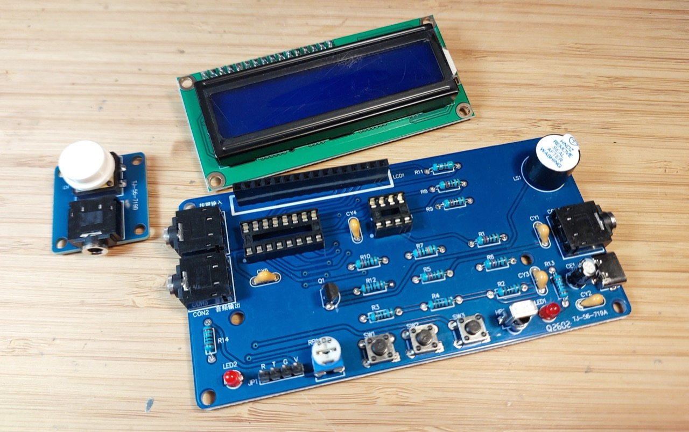
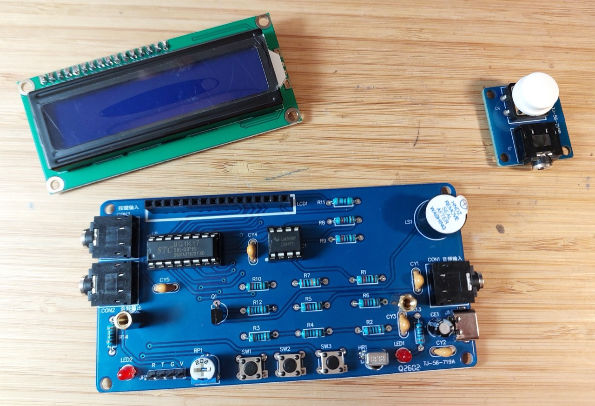
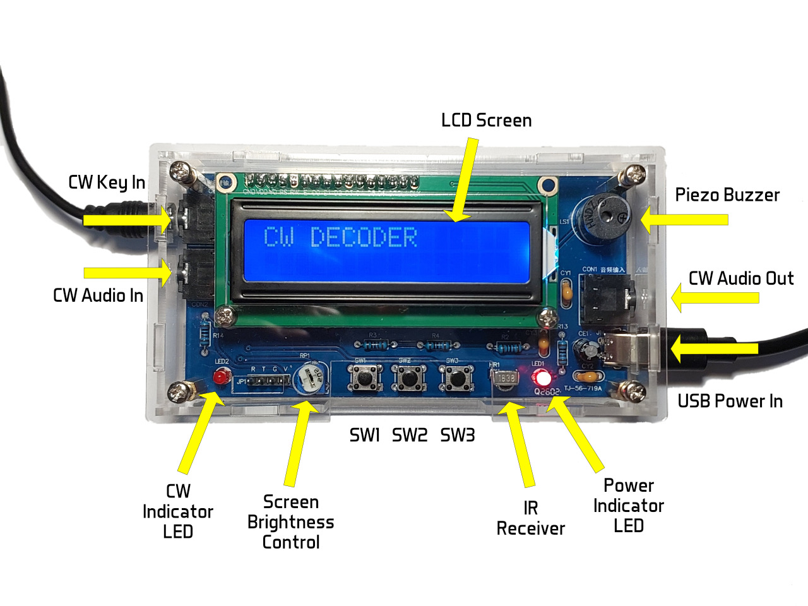
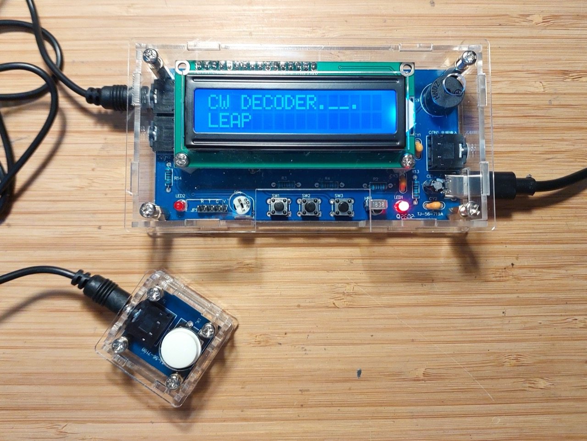
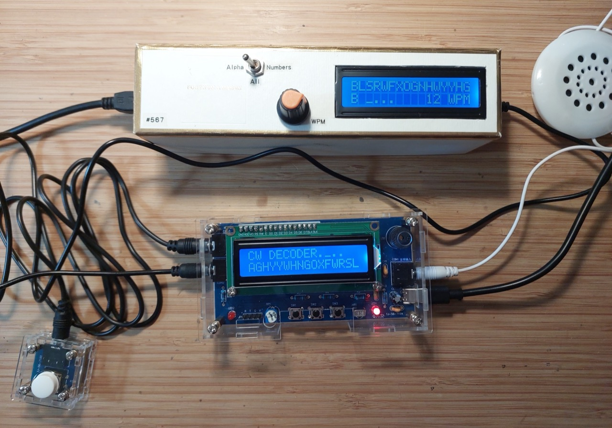
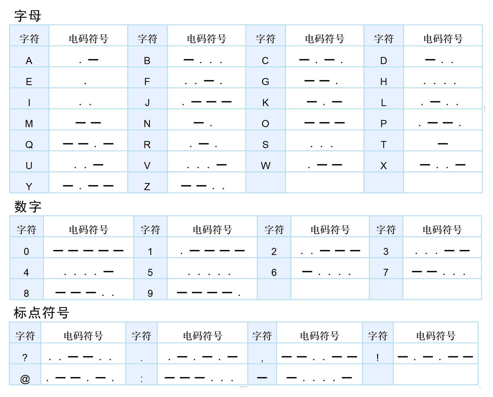

# #859 TJ-56-719 Code Practice Kit

Building and testing the TJ-56-719 code practice kit. It can be used for CW/Morse code decoding and code practice, and also an IR decoder for characterising any IR controller.
Includes clear and verified operating instructions.

Here's a quick demo..

## Notes

### The Kit

The kit appears to be known as the "TJ-56-719". It is a fairly common kit, available from a range of sources

I purchased my kit from AliSupplier Store (aliexpress seller) for SG$12.05 (Jul-2026):
["DIY Kit Electronic Morse Code Telegraph Simulator Decoder with Digital Display Soldering Practice Electronics Projects Kit" (aliexpress seller listing)](https://www.aliexpress.com/item/1005009213948280.html).

A basic [instruction sheet](./references/TJ-56-719-instructions.pdf) is included in the kit, and a full [construction tutorial](./references/TJ-56-719-tutorial.pdf) available for download.

As delivered:

#### Product description

CW mode: Receive and decode Morse code:

* CW audio signal input
* CW keyer/push-button input
* Adjustable Morse code reception time
* Displays the received Morse code on LCD
* Incoming dots/dashes indicated with LED and optionally buzzer

IR Mode: Decodes and displays infrared remote control signals.

#### Kit Features

* Product Name: Morse code infrared decoder building kit
* Operating voltage: 5V DC, USB Type-C interface
* Static current: about 25mA (without decoding)
* Maximum operating current: about 60mA (with the buzzer sounding during decoding)
* Decoding adjustable time: 10~9990ms
    * default dot time is about 100ms
    * default dash time is about 300ms (3 times the dot time)
* Receive up to 64 characters at a time
* Display up to 16 characters at a time
* Decode 43 characters: "A-Z", "0-9", "?,.!@:-"
* PCB size: 108x55mm/25x27mm

#### Kit Parts

| No | Item              | Spec      | Ref         | Qty |
|----|-------------------|-----------|-------------|-----|
|  1 | electrolytic cap  | 220µF     | CE1         | 1   |
|  2 | headphone jack    | 3.5mm     | CON1-3      | 3   |
|  3 | monolithic cap    | 104/100nF | CY1-5       | 5   |
|  4 | IR receiver       | VS1838B   | HR1         | 1   |
|  5 | Dual op amp       | LM358     | IC1         | 1   |
|  6 | Power connector   | USB-C     | J1          | 1   |
|  7 | header pins       | 20P       | JP1         | 1   |
|  8 | LCD screen        | LCD1602   | LCD1        | 1   |
|  9 | LED               | 3mm red   | LED1-2      | 2   |
| 10 | piezo buzzer      | DC5V      | LS1         | 1   |
| 11 | NPN BJT           | S8050     | Q1          | 1   |
| 12 | resistor          | 10kΩ      | R1,5,6,8-10 | 6   |
| 13 | resistor          | 1kΩ       | R2-4,12-14  | 6   |
| 14 | resistor          | 200kΩ     | R7          | 1   |
| 15 | resistor          | 51Ω       | R11         | 1   |
| 16 | variable resistor | 2kΩ       | RP1         | 1   |
| 17 | pushbutton switch | 6x6x5     | SW1-3       | 3   |
| 18 | microcontroller   | STC8G1K17 | U1          | 1   |
| 19 | header socket     | 16P       | LCD1        | 1   |
| 20 | DIP socket        | 8P        | IC1         | 1   |
| 21 | DIP socket        | 16P       | IC1         | 1   |
| 22 | pushbutton switch | square KFC| K1          | 1   |
| 23 | pushbutton cap    |           |             | 1   |
| 24 | hex copper spacer | M3x11     |             | 2   |
| 25 | screw             | M3x6      |             | 4   |
| 26 | audio cable       | 3.5mm     |             | 1   |
| 27 | PCB - main, key   |           |             | 2   |

All the parts accounted for:

### Circuit Design

### Build Log

At this point I have to admit that I built this kit twice!

For my first attempt, I simply followed the recommended construction sequence:

* resistors
* monolithic caps
* electrolytic cap
* LEDs
* BJT
* IR
* USB
* var resistor
* small pb
* dip sockets
* 3.5mm conn
* buzzer
* pin headers
* IC install

After completing the build, I discovered a fatal short between VCC and GND somewhere on the PCB.
I worked through removing virtually all of the components and testing all connections but still could not find the fault.
It appears to be a short somewhere on the board itself.

I gave up on trying to find it, and bought myself a new board!
This time, I built and tested the board step-by-step for each functional subsystem:

* check the PCB before any components installed
* USB and power LED1+R13
* main power caps CE1 CY2
* push-button paddle, input connector and RC filter
* piezo buzzer
* indicator LED2+R14
* push-buttons with pull-ups and CY3
* DIP sockets
* audio input and opamp filter
* solo components: IR; LCD connector; programming header; variable resistor

No issues this time - verified OK throughout the build and worked immediately when construction complete.

### Using the TJ-56-719 Morse Code Decoder

#### Hardware Features

I've annotated the features in the following picture. Source: [Affinity Photo 2 (features.afphoto)](./assets/features.afphoto).

CW Decoder in use with kit-provided keyer:

CW Decoder in use with external keyer audio source and pass-through speaker:

For more details on the  external keyer used here, see
[LEAP#567 Random Code Practice](../RandomCodePractice/).

#### Operational Modes

The device has three modes:

1. Morse decoding (default/startup mode)
2. Infrared decoding
3. Settings

The functions of the three buttons (SW1, SW2, SW3) vary by mode.

#### Morse Decoding Mode

Morse decoding is performed on either the CW keyer input, or CW audio.

* it decodes the CW input into the 64-character buffer
    * when the buffer is full, decoding stops until the buffer is cleared (SW3 short press)
    * SW1/SW2 short presses scroll the buffer display left/right, as only 16 characters can be seen at any time
* the indicator LED and piezo buzzer (if enabled) are activated for each CW dot/dash received
* if code display is enabled, the dots/dashes of the last received character are displayed on the LCD

With CW audio, the in and out ports can be used to insert the CW decoder inline with the audio stream. Note that the ports are directly connected, so the audio direction is not significant.

##### Control Reference: Morse Decoding Mode

| Button          | Action                              |
|-----------------|-------------------------------------|
| SW1 short press | Shifts received Morse code left     |
| SW1 long press  | (no action)                         |
| SW2 short press | Shifts received Morse code right    |
| SW2 long press  | Switch to infrared decoding mode    |
| SW3 short press | Clear received Morse code           |
| SW3 long press  | Enter the settings page             |

#### Infrared Decoding Mode

Infrared decoding is used to determine the codes sent by each button of an IR controller.

That's all. It is not related to the Morse code features at all.

##### Control Reference: Infrared Decoding Mode

| Button          | Action                        |
|-----------------|-------------------------------|
| SW1 short press | (no action)                   |
| SW1 long press  | Switch to Morse decoding mode |
| SW2 short press | (no action)                   |
| SW2 long press  | (no action)                   |
| SW3 short press | (no action)                   |
| SW3 long press  | Switch to settings mode       |

#### Control Reference: Setting Mode

| Button          | Action                                                            |
|-----------------|-------------------------------------------------------------------|
| SW1 short press | Toggles Morse code buzzer on/off                                  |
| SW1 long press  | Toggles display of the last received Morse code (dots and dashes) |
| SW2 short press | Increase the reception time of dots                               |
| SW2 long press  | Switch to Morse decoding mode                                     |
| SW3 short press | Reduce the reception time of dots                                 |
| SW3 long press  | Switch to infrared decoding mode                                  |

### Morse Reference

## Credits and References

* ["DIY Kit Electronic Morse Code Telegraph Simulator Decoder with Digital Display Soldering Practice Electronics Projects Kit" (aliexpress seller listing)](https://www.aliexpress.com/item/1005009213948280.html)
    * Purchased from AliSupplier Store (aliexpress seller) for SG$12.05 (Jul-2026)
    * [instructions](./references/TJ-56-719-instructions.pdf)
    * [tutorial](./references/TJ-56-719-tutorial.pdf)
    * [tutorial source file](https://www.56dz.com/p/4217.html) (pass key: JKL9)
* <https://en.wikipedia.org/wiki/Morse_code>
* [LEAP#567 Random Code Practice](../RandomCodePractice/)
