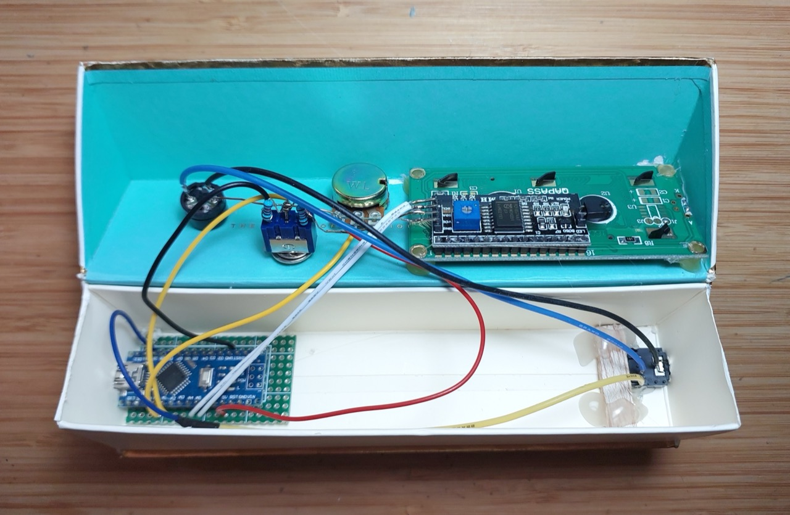
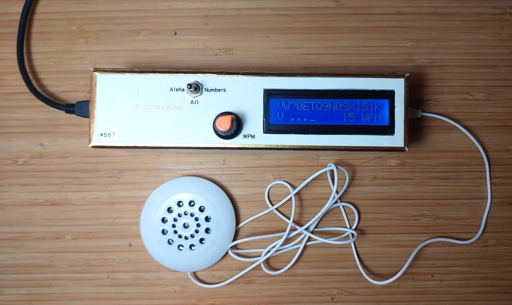

# #567 Random Code Practice

A simple Morse code practice generator that prints the character and sounds the dit-dahs to a speaker. Based on a project by Glen Popiel KW5GP.

Here's a quick demo..

## Notes

Glen Popiel's [Arduino for Ham Radio](../../../books/arduino-for-ham-radio/) is a great little collection
of ham radio-adjacent projects that not only provides some good project inspiration but also presents them in a way that
is easy to follow no matter one's level of Arduino experience.

This project is an adaptation/enhancement of a simple [Morse code](https://en.wikipedia.org/wiki/Morse_code) practice generator:

* it selects a random character
* displays the character on an LCD
* and sounds the Morse code to a piezo speaker
* the speed can be adjusted with a variable resistor

I've extended and revised the code to add some new features:

* a switch to select between all character / alpha only / numbers only
* display the actual dit-dah Morse representation on the screen as well as the character being sounded

## Construction

Designed with Fritzing: see [RandomCodePractice.fzz](./RandomCodePractice.fzz).

A SPDT Centre Off switch is used as a tri-state toggle for the character select:

* ON: pulled high (alpha only)
* CENTRE: VCC/2 voltage divider (all characters)
* OFF: pulled low (numbers only)

First testing the circuit on a breadboard:

## Code & Libraries

Main sketch: [RandomCodePractice.ino](./RandomCodePractice.ino)

Libraries:

* [Arduino Wire library](https://www.arduino.cc/en/reference/wire)
* [LiquidCrystal_I2C](https://github.com/marcoschwartz/LiquidCrystal_I2C) - LCD over I²C
* [Morse.h](./Morse.h) / [Morse.cpp](./Morse.cpp)
    * Morse encoding by Erik Linder SM0RVV and Mark VandeWettering K6HX.
    * I cannot find a link to the original source (Version 0.2), so it is included in the project folder.
    * Includes Glen Popiel KW5GP's fixes for Morse encoding
    * extended by me to allow dynamic speed adjustment

## Putting it in a Box

In the first version of the build, I switched the Uno for an Arduino Nano and mounted it all in a suitably sized chocolate box.
This version didn't have the output jack.

## Adding and output jack

I subsequently added an output jack using a 3.5mm PCB-mount Stereo Socket.
For more details on these connectors, see
[LEAP#309 Audio Connectors](../../../Electronics101/Connectors/Audio/).

Designed with Fritzing: see [RandomCodePractice_v2.fzz](./RandomCodePractice_v2.fzz).

With the jack installed:

With an external speaker plugged in, it is used and bypasses the internal buzzer.

## Credits and References

* [LEAP#309 Audio Connectors](../../../Electronics101/Connectors/Audio/)
* [Arduino for Ham Radio](../../../books/arduino-for-ham-radio/)
* [Morse code](https://en.wikipedia.org/wiki/Morse_code) - wikipedia
* [fun with morse code](https://docs.google.com/presentation/d/e/2PACX-1vQ1wCN2WNHQ8JHC16zOAehkV6TV5PAG0DpXSQE45hlHU4hbF2h3YgiZJj5Iy-RTNDrDjJ21saaD4Rp-/pub?start=false&loop=false&delayms=3000&slide=id.p) - presentation on learning CW by Anthony Luscre K8ZT
