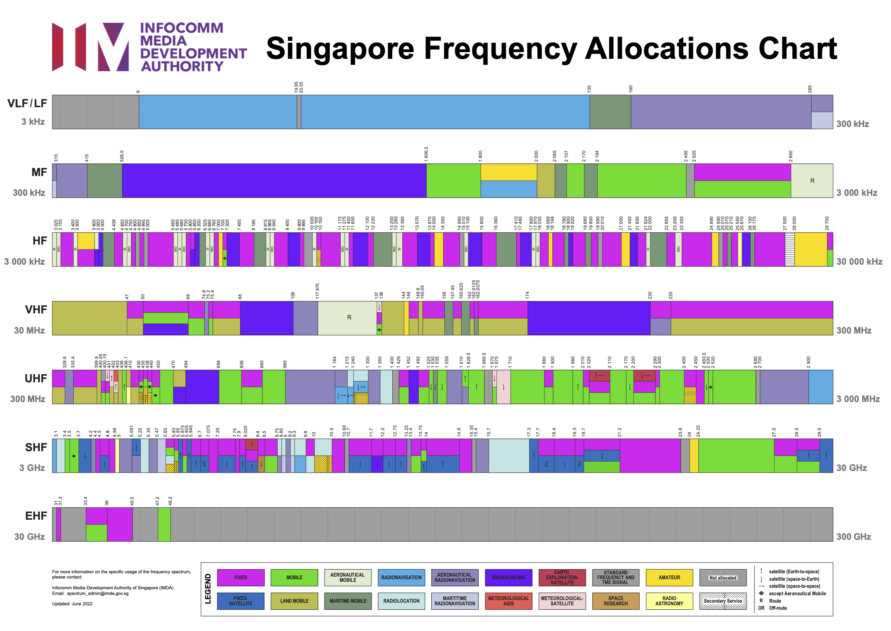

# #388 Singapore Radio Band Activity

Notes on official band plans for Singapore and my and personal observations on where the activity is found.

## Notes

Singapore is relatively progressive when it comes to radio spectrum allocation and use - for example, AM services disappeared by 2000 or so,
DAB came and went in 2011 (rendered irrelevant by Internet services and continued popularity of FM).
With the almost universal adoption of mobile and internet technology, the general perception is that shortwave and amateur radio are pretty much a thing of the past.
Singapore has an [amateur radio association (SARTS)](https://www.sarts.org.sg/).

So as I become more interested in RF, my first question is basic: is there much activity, and if so, what modes and bands?
I've got my FCC general license - [KM7ABZ](https://www.qrz.com/db/KM7ABZ) - but not my Singapore call sign (yet).

This document is going to be a work-in-progress. It comprises my notes on:

* frequency allocations and services
* personal observations i.e. signals I've actually been able to receive
* mainly shortwave and amateur bands

### IMDA Spectrum Allocation

The IMDA maintains allocations for amateur radio that are roughly in line with [ITU Region 3 guidelines](https://en.wikipedia.org/wiki/Amateur_radio_frequency_allocations#ITU_Region_3).
Excluded are bands at the low and high end: 2200m, 630m, 23cm.

Allocations were last revised in June 2022.

## 9V Amateur Radio Allocations

Overview and comparison of Singapore amateur allocations with US allocations:

| Band                                                     | Frequency     | Range | SG Ham License            | US Ham License       |
|----------------------------------------------------------|---------------|-------|---------------------------|----------------------|
| [2200m](https://en.wikipedia.org/wiki/2200-meter_band)   | 135 kHz       | LF    | -                         | General, Extra       |
| [630m](https://en.wikipedia.org/wiki/630-meter_band)     | 472 kHz       | MF    | -                         | General, Extra       |
| [160m](https://en.wikipedia.org/wiki/160-meter_band)     | 1.8 MHz       | MF    | General                   | General, Extra       |
| [80m](https://en.wikipedia.org/wiki/80-meter_band)       | 3.5 MHz       | HF    | General                   | Tech, General, Extra |
| [60m](https://en.wikipedia.org/wiki/60-meter_band)       | 5.3 MHz       | HF    | -                         | General, Extra       |
| [40m](https://en.wikipedia.org/wiki/40-meter_band)       | 7 MHz         | HF    | General                   | Tech, General, Extra |
| [30m](https://en.wikipedia.org/wiki/WARC_bands)          | 10 MHz        | HF    | General                   | General, Extra       |
| [20m](https://en.wikipedia.org/wiki/20-meter_band)       | 14 MHz        | HF    | General                   | General, Extra       |
| [17m](https://en.wikipedia.org/wiki/WARC_bands)          | 18 MHz        | HF    | General                   | General, Extra       |
| [15m](https://en.wikipedia.org/wiki/15-meter_band)       | 21 MHz        | HF    | General                   | Tech, General, Extra |
| [12m](https://en.wikipedia.org/wiki/WARC_bands)          | 24 MHz        | HF    | General                   | Tech, General, Extra |
| [10m](https://en.wikipedia.org/wiki/10-meter_band)       | 28 MHz        | HF    | General                   | Tech, General, Extra |
| [6m](https://en.wikipedia.org/wiki/6-meter_band)         | 50 MHz        | VHF   | -                         | Tech, General, Extra |
| [2m](https://en.wikipedia.org/wiki/2-meter_band)         | 144 MHz       | VHF   | General & Restricted      | Tech, General, Extra |
| [1.25m](https://en.wikipedia.org/wiki/1.25-meter_band)   | 220 MHz       | VHF   | -                         | Tech, General, Extra |
| [70cm](https://en.wikipedia.org/wiki/70-centimeter_band) | 430 MHz       | UHF   | General & Restricted      | Tech, General, Extra |
| [33cm](https://en.wikipedia.org/wiki/33-centimeter_band) | 902 MHz       | UHF   | -                         | Tech, General, Extra |
| [23cm](https://en.wikipedia.org/wiki/23-centimeter_band) | 1240 MHz      | UHF   | On application            | Tech, General, Extra |
|                                                          | 2300 MHz      | SHF   | -                         | Tech, General, Extra |
|                                                          | 2390 MHz      | SHF   | On application(2400-2450) | Tech, General, Extra |
|                                                          | 3400 MHz      | SHF   | -                         | Tech, General, Extra |
|                                                          | 5650 MHz      | SHF   | On application            | Tech, General, Extra |
|                                                          | 10.0 GHz      | SHF   | On application            | Tech, General, Extra |
|                                                          | 24.0 GHz      | SHF   | On application            | Tech, General, Extra |
|                                                          | 47.0 GHz      | EHF   | -                         | Tech, General, Extra |
|                                                          | 76.0 GHz      | EHF   | -                         | Tech, General, Extra |
|                                                          | 122.25 GHz    | EHF   | -                         | Tech, General, Extra |
|                                                          | 134 GHz       | EHF   | -                         | Tech, General, Extra |
|                                                          | 241 GHz       | EHF   | -                         | Tech, General, Extra |
|                                                          | Above 275 GHz | EHF   | -                         | Tech, General, Extra |

The Singapore Restricted Class licence permits the licensee to operate only on the VHF/UHF amateur bands using phone by FM or SSB.

## 9V Amateur Radio Band Plans

* NB: Narrow band modes including Digital modes not exceeding 2 kHz
* WB: Wide band modes including FM

### 160m, 1.8 MHz

* nighttime only band; during daylight, signals absorbed by the D-layer and the band is dead
* after local sunrise, propagation to 1000 to 2300 miles is possible
* signals peak at about local midnight
* during summertime, conditions are limited due to atmospheric noise and storms
* efficient antennas are essential
* can be challenging because of the large sizes required for efficient antennas

Conditions:

* Maximum DC Input Power: 10W
* PEP: 26.67W
* RTTY is not allowed
* shared with other services.

### 80m, 3.5 MHz

* nighttime only band but can provide some daytime action
* distances limited to about 250 miles during the day
* for DX, efficient antennas are essential

Conditions:

* Maximum DC Input Power: 300W
* PEP: 800W
* shared with other services.

### 40m, 7 MHz

* most popular QRP band
* tends to follow ionization levels closely
* day: distances to 500 miles
* night:
    * signals rise quickly after dusk
    * recombination of F-layer means unsettled conditions 10-11pm local
    * once F settles, transcontinental possible
    * simple dipole suspended 25-40 feet
    * even mediocre antennas perform well

Conditions:

* Maximum DC Input Power: 300W
* PEP: 800W

### 30m, 10MHz

* great for QRP
* open day and night
* summer noise levels lower than 40m but absorption greater than 20m

Conditions:

* Maximum DC Input Power: 300W
* PEP: 800W
* allocated to amateur radio on secondary basis.

### 20m, 14 MHz

* lowest frequency DX band, considered among the best for DX
* open most time to various areas of the world
* closely follows ionization levels in upper ionosphere

Conditions:

* Maximum DC Input Power: 300W
* PEP: 800W

### 17m, 18 MHz

* mainly daylight band
* must be sufficient solar activity to produce band openings
* can produce outstanding DX to most areas of the world

Conditions:

* Maximum DC Input Power: 300W
* PEP: 800W

### 15m, 21 MHz

* mainly daylight band
* must be sufficient solar activity to produce band openings
* propagate primarily via reflection off of the F2 layer
* can produce outstanding DX to most areas of the world

Conditions:

* Maximum DC Input Power: 300W
* PEP: 800W

### 12m, 24 MHz

* daylight band
* can produce outstanding DX during much of the solar cycle
* band forms up several hours after sunrise
* normal skip distance about 900 miles

Conditions:

* Maximum DC Input Power: 300W
* PEP: 800W

### 10m, 28 MHz

* portion of the shortwave radio spectrum, HF
* daylight band
* can produce outstanding DX during much of the solar cycle
* at peak solar cycle, can achieve extremely long-distance signals, refracting from the F2 layer
* band forms up several hours after sunrise
* normal skip distance about 900 miles
* summertime sporadic-E openings

Conditions:

* Maximum DC Input Power: 300W
* PEP: 800W

### 2m, 144 MHz

* portion of the VHF radio spectrum
* predominately used for FM or digital voice communications through repeaters
* mainly local (50 miles), but DX possible with tropospheric ducting, sporadic E and meteor scatter
* SARTS maintains a 2m repeater, managed by 9V1AI.
    * Repeater Tx 145.625 MHz
    * Repeater Rx 145.025 MHz
    * CTCSS Tone 156.7 Hz

Conditions:

* PEP: 25W
Conditions:

* Use of any frequency in the VHF/UHF bands shall be only with the prior written consent of the IMDA.
* Power limit on 2 m is 25 W PEP, on 70 cm 10 W (erp).

### 70cm, 430 MHz

* portion of the UHF radio spectrum internationally allocated to amateur radio and amateur satellite use
* predominately used for FM or digital voice communications through repeaters
* overlaps with the LPD433 band used by short range devices/RC models

Conditions:

* Use of any frequency in the VHF/UHF bands shall be only with the prior written consent of the IMDA.
* Power limit on 2 m is 25 W PEP, on 70 cm 10 W (erp).
* Spot frequencies for 70 cm (UHF) are:
    * CW 432.000 MHz,
    * SSB/CW 432.200 MHz,
    * RTTY/FAX 432.600 MHz,
    * FM simplex 433.625 MHz and 433.650 MHz.

## Shortwave Broadcast Services covering Singapore

The [BBC Far Eastern Relay Station](https://en.wikipedia.org/wiki/BBC_Far_Eastern_Relay_Station)
was closed in July 2023, after 75 years of broadcasting. Since then, Singapore is only serviced by stations in Madagascar and Oman.

See also:

* [BBC World Service Schedule - South East Asia, summer 2025](https://downloads.bbc.co.uk/worldservice/schedules/frequencies/bbc_world_service_south_east_asia_frequencies.pdf)
* <https://en.wikipedia.org/wiki/China_Radio_International>
    * <https://english.cri.cn/> - official website
    * <https://radio.cgtn.com/> - seems much more geared towards internet radio and podcast these days
    * <https://www.short-wave.info/index.php?station=China%20Radio%20International> - still have a schedule of CRI shortwave, need to verify

| Service                   | Frequency (kHz) | Meter Band | Language | Transmitter              | Scheduled Time (GMT) |
|---------------------------|-----------------|------------|----------|--------------------------|----------------------|
| BBC World Service         | 21565           | 13m        |          | Madagascar               | 12:00 - 14:00        |
| BBC World Service         | 15310           | 19m        |          | Oman                     | 22:00 - 00:00        |
| China Radio International | 7215            | 41m        | English  | Xianyang 594 500 kW      | 10:00 - 10:57        |
| China Radio International | 7215            | 41m        | Chinese  | Xianyang 594 500 kW      | 13:00 - 13:57        |
|                           |                 |            |          |                          |                      |

Transmitter sites:

* Xianyang/NRTA594 500 kW
    * Located in [Qindu District, Xianyang, Shaanxi, China](https://maps.app.goo.gl/bCiRN9Rne38vb2y66)
    * [Frequencies and schedules](https://www.mwlist.org/sw.php?locationid=40010025)
    * about 3200 km from my QTH in Singapore

## Shortwave Broadcast Log

The following is a personal log of shortwave broadcast services I have been able to receive in central Singapore.

| Service                   | Frequency (kHz) | Meter Band | Language | Transmitter              | Scheduled Time (GMT) | Received                   | Receiver |
|---------------------------|-----------------|------------|----------|--------------------------|----------------------|----------------------------|----------|
| Reach Beyond Australia    | 11865           | 25m        |          | Kununurra                | 11:30 - 12:45        | 2018-01-31 Wed 20:57 UTC+8 | |
| China Radio International | 11910           | 25m        |          | Beijing 500 kw           | 13:00 - 13:57        | 2018-01-31 Wed 21:55 UTC+8 | |
| China Radio International | 11710           | 25m        | Chinese  | Nanning 954 100 kw       | 07:00 - 08:00        | 2019-03-23 Wed 15:08 UTC+8 | |
| China Radio International | 11875           | 25m        | Chinese  | Nanning 954 100 kw       | 07:00 - 08:00        | 2019-03-23 Wed 15:08 UTC+8 | |
| China Radio International | 13660           | 22m        | English  | Xian 594 500 kw          | 07:00 - 07:57        | 2019-03-23 Wed 15:15 UTC+8 | |
| China Radio International | 15145           | 22m        | Chaozhou | Xian 594 500 kw          | 07:00 - 07:57        | 2019-03-23 Wed 15:16 UTC+8 | |
| NHK World Radio Japan     | 15280           | 19m        | Japanese | Ibaragi-Koga-Yamata 300kw| 06:55 - 08:58        | 2019-03-23 Wed 15:19 UTC+8 | |
| China National Radio 1    | 15480           | 19m        | Chinese  | Beijing 572 100kw        | 06:00 - 09:00        | 2019-03-23 Wed 15:21 UTC+8 | |
| China National Radio 1    | 17595           | 16m        | Chinese  | Shijiazhuang 723 100kw   | 06:00 - 09:00        | 2019-03-23 Wed 15:29 UTC+8 | |
| China National Radio 2    | 15500           | 19m        | Chinese  | Beijing 491 150kw        | 06:00 - 09:00        | 2019-03-23 Wed 15:22 UTC+8 | |
| China Radio International | 17710           | 16m        | English  | Beijing 500 kw           | 06:00 - 08:00        | 2019-03-23 Wed 15:25 UTC+8 | |
| China Radio International | 17740           | 16m        | Chinese  | Xian 594 500 kw          | 06:00 - 08:00        | 2019-03-23 Wed 15:23 UTC+8 | |
| China Radio International | 17750           | 16m        | Chaozhou | Xian 594 500 kw          | 07:00 - 07:57        | 2019-03-23 Wed 15:23 UTC+8 | |
| China Radio International | 17650           | 16m        | Chinese  | Kashi-Saibagh 2022 500 kw| 06:00 - 09:00        | 2019-03-23 Wed 15:26 UTC+8 | |
| China Radio International | 17670           | 16m        | English  | Kashi-Saibagh 2022 500 kw| 07:00 - 09:00        | 2019-03-23 Wed 15:28 UTC+8 | |
| Radio Saudi               | 17895           | 16m        | Arabic   | Riyadh 500 kw            | 02:55 - 08:00        | 2019-03-23 Wed 15:34 UTC+8 | |
| China Radio International | 7215            | 41m        | Chinese  | Xianyang 594 500 kW      | 13:00 - 13:57        | 2025-05-11 Sun 21:50 UTC+8 | [SolderSmokeDCRX](../SolderSmokeDCRX/) |
| China Radio International | 7215            | 41m        | Chinese  | Xianyang 594 500 kW      | 13:00 - 13:57        | 2025-05-12 Mon 21:49 UTC+8 | [SolderSmokeDCRX](../SolderSmokeDCRX/) |
|                           |                 |            |          |                          |                      |                            | |

## Credits and References

* [Singapore Amateur Radio Transmitting Society (SARTS)](https://www.sarts.org.sg/)
    * [9V Band Plan](https://www.sarts.org.sg/bands.html)
* [IMDA Frequency Allocation & Assignment](https://www.imda.gov.sg/regulations-and-licensing-listing/spectrum-management)
* [Info-communications Media Development Authority (IMDA)](https://www.imda.gov.sg/).
* [List of radio stations in Singapore](https://en.wikipedia.org/wiki/List_of_radio_stations_in_Singapore) - wikipedia
* [Broadcasting in Singapore](https://en.wikipedia.org/wiki/Broadcasting_in_Singapore)
* [Broadcast Radio in Singapore](https://www.radio-singapore.com/) - listen live
* [Radio Stations in Singapore](https://www.asiawaves.net/singapore-radio.htm)
* <https://www.reversebeacon.net/> - excellent resource for hunting ham activity in the region
* Shortwave Services
    * <https://www.short-wave.info/index.php> - reference for scheduled shortwave broadcasts
    * <https://shortwaveschedule.com/> - reference for scheduled shortwave broadcasts
    * <https://www.mwlist.org/shortwave_transmitter_sites.php> - good transmitter details, schedules seem a little unreliable
    * <https://hfradio.org/swbc/> - another resource for scheduled services; not particularly reliable. Currently not working correctly.
    * [BBC World Service Global Short Wave Frequencies](https://www.bbc.co.uk/programmes/articles/2x9tqt6mc05vB2S37j8MWMJ/global-short-wave-frequencies)
