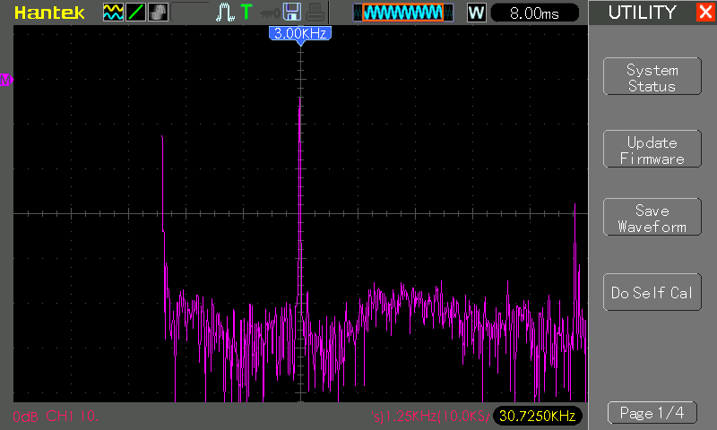

# #771 SolderSmoke DC RX

Building the SolderSmoke Direct Conversion Radio Receiver

TLDR: And it was a success! For my "proof of life" demo I plucked a few signals from the air:

* Shortwave on 7215 kHz - China Radio International broadcasting from [Xianyang/NRTA594 500 kW](https://maps.app.goo.gl/bCiRN9Rne38vb2y66), about 3200km from my QTH
* Some Malaysian rag chewing on 7005 kHz
* Briefly caught some CW on 7028 kHz

## Notes

Bill, Dean, and Pete from the
[SolderSmoke podcast](https://soldersmoke.blogspot.com/)
laid down the
SolderSmoke Direct Conversion Challenge
after Bill was a guest on [Ham Radio Workbench podcast #223](https://www.hamradioworkbench.com/podcast/hrwb-223-a-conversation-with-bill-meara-n2cqr-from-the-soldersmoke-podcast).

The receiver design is based on the project that
the SolderSmoke crew originally did with a local high school:
[High Schoolers Build a Radio Receiver](https://hackaday.io/project/190327-high-schoolers-build-a-radio-receiver).

Note that the official source for all current information and documentation
is on the [SolderSmoke Discord Server](https://discord.gg/Fu6B7yGxx2).

What follows are the notes that I made as I built the receiver for myself.

### How it works: Just Four Stages

The design comprises just four main boards/sub-circuits:

* Bandpass filter
    * takes radio signals from the antenna and filters out all except those of the frequency we need: 7 to 7.3 MHz.
* RF Oscillator (PTO)
    * produces the signal that we mix with the signal from the bandpass filter
    * Also called the VFO or the PTO.  We use a PTO.
* Mixer
    * takes the signal we create in the oscillator and mixes it with the signal from the bandpass filter.
    * produces both sum and difference frequencies
    * we throw away the sum (around 14 MHz) but keep the difference (audio from 3 to 3000 Hz)
* Audio Amplifier
    * takes the very weak signal from the mixer and amplifies it to the point where we can hear it coming from the speaker or headphones

#### Full Schematic

### SolderSmoke DCR Challenge #1 Overview

An introduction to the project by Dean KK4DAS:

## Recommended Build Sequence

Principles:

* One stage at a time
* Manhattan construction
* Use a safe and simple power supply - a 9V battery

Sequence:

* RF Oscillator (PTO)
* Mixer
* Bandpass filter
* Audio Amplifier

## Power Supply

Per the notes from Dean KK4DAS:

> We opted for the use of 9 volt batteries.  This proved to be a safer and wiser choice that limited the kind of mayhem that could occur should a variable voltage supply be used.

I'm using a 9V Battery case with switch available from [sellers on aliexpress](https://www.aliexpress.com/item/1005005014819303.html).
I've also added a 3mm green LED and 1kΩ resistor as a power indicator (not included in the schematics).

## RF Oscillator (PTO) Build

### SolderSmoke DCR Challenge #2 PTO

Build tutorial by Dean KK4DAS:

> Normally we might have used a variable capacitor to change the frequency of this oscillator.
> But variable capacitors are now expensive and hard-to-source.
>
> Our friend Farhan in Hyderabad used a simple variable inductor for this purpose in his “Daylight Again” transceiver. The coil form for this part could be 3D printed. A metallic screw would vary the inductance as it is screwed in and out of the coil.
>
> We also decided to use the same simple Colpitts oscillator circuit used by Farhan in his own high school direct conversion receiver.  This circuit is unusual in that the feedback capacitors are also the frequency determining elements (along with the variable inductor).  This simplified the circuit and reduced the parts count, and proved to be remarkably stable.
>
> For the VFO buffer we used the simple JFET buffer from Farhan’s Daylight Again design.
> Based on suggestions from other radio amateurs, we developed a simple frequency readout based on the position of the end of the tuning screw.
> We selected the 40 Meter band for this receiver because we thought it would be easier to get the VFO stable on this frequency, and because Farhan had built his receiver for 40 meters.

### PTO Schematic

### PTO Parts

Note: components came from my spare parts stash unless otherwise noted

| Ref        | Value                                                       | Qty | Source        | Description             | Notes |
|------------|-------------------------------------------------------------|-----|---------------|-------------------------|-------|
| L1         | 1.48µH                                                      | 1   |               | variable inductor       | custom built - see below |
| L2         | 10µH                                                        | 1   |               | RF Inductor - Leaded 5% |       |
| C1,C2      | 660pF                                                       | -   |               | mica                    | use equivalent 3x 220pF in parallel |
| C1,C2 (eq) | 220pF                                                       | 6   | Sim Lim Tower | mica                    |       |
| C3         | 130pF                                                       | -   |               | ceramic                 | 130pF specified, use 140pF instead |
| C3 (eq)    | 140pF                                                       | 1   |               | ceramic                 |       |
| C4,C5,C6   | 100nF                                                       | 3   |               | MLCC                    |       |
| R1,R2      | 10kΩ                                                        | 2   |               |                         |       |
| R3         | 3.3kΩ                                                       | 1   |               |                         |       |
| R4,R6      | 100Ω                                                        | 2   |               |                         |       |
| R5         | 100kΩ                                                       | 1   |               |                         |       |
| Q1         | [2N3904](https://www.futurlec.com/Transistors/2N3904.shtml) | 1   |               | NPN BJT                 |       |
| Q2         | [J310](https://www.futurlec.com/Transistors/J310.shtml)     | 1   |               | N-channel JFET          |       |
| D1         | BZX84C8V2L                                                  | -   |               | 8.2V 500W Zener         | BZX84C8V2L specified, replace with 1N4738 |
| D1 (eq)    | [1N4738](https://www.futurlec.com/Diodes/1N4738.shtml)      | 1   |               | 8.2V 1W Zener Diode     |       |

### Making L1 Variable Inductor

For L1 variable inductor:

* PTO Former - 3D printed
    * source STL: [pto-former.stl](./assets/pto-former.stl)
    * printed at 100% scale as I'm using a metric bolt
    * g-code: [pto-former.gx](./assets/pto-former.gx)
* M6x40 Brass bolt and 2x nuts
* 0.4mm enamelled coil winding wire, 19 turns
* solder braid to ground the tuning bolt

I printed the PTO former at the [library (NLB MakeIt)](../../Equipment/NLB/FlashforgeCreatorPro2/):

Finished winding the inductor, attaching the tuning bolt and ground strap:

Testing the inductance of the tuner at its maximum extents:

### PTO Test

The completed PTO module under test with a temporary 50Ω dummy load attached:

Key tests:

* check incoming voltage, and zener-regulated voltage supply
* check the variable inductor should be ~1.48µH
* verify operation of the completed module with an oscilloscope: able to tune from 7.0MHz to 7.3MHz.

| Test           | Note                                                            | Result/Pass? |
|----------------|-----------------------------------------------------------------|--------------|
| Voltage V1     | reasonably fresh 9V battery, should be ~9V                      | 8.98V √      |
| Voltage D1     | zener-regulated voltage supply should be ~8.2V                  | 8.14V √      |
| PTO inductance | bolt fully retracted (before final assembly), should be ~1.48µH | 1.45µH √     |
| PTO inductance | bolt fully inserted (before final assembly), should be <1.48µH  | 1.18µH √     |
| PTO frequency  | bolt fully retracted                                            | 6.49 MHz √   |
| PTO frequency  | bolt fully inserted                                             | 7.52 MHz √   |

With the PTO module fully assembled, checking the output with an oscilloscope.

* CH1 (Yellow): Buffer gate (input)
* CH2 (Blue): Buffer output, AC-coupled via C6 into a 50Ω load

Measurements (50Ω dummy load):

| Frequency | CH1 Gate | CH2 Output | Note |
|-----------|----------|------------|------|
| 6.46 MHz  | 2.60 Vpp | 2.02 Vpp   | bolt fully retracted. Oscillator is a nice sine wave, output a little distorted |
| 7.00 MHz  | 1.86 Vpp | 1.54 Vpp   | Lower limit is required tuning range |
| 7.30 MHz  | 1.58 Vpp | 1.40 Vpp   | Upper limit is required tuning range |
| 7.49 MHz  | 1.46 Vpp | 1.30 Vpp   | bolt fully inserted. Reasonably clean sine waves. |

All looking good so far!

## Mixer Build

The mixer stage emits the difference between the RF input and the Local oscillator - direct conversion to audio range.
It uses a double-balanced mixer - I've covered these before in [LEAP#327 RF Diode Ring Mixer](../../Electronics101/Mixers/RFDiodeRing/).

### SolderSmoke DCR Challenge -- Mixer and Diplexer

Build tutorial by Dean KK4DAS:

> At first we hoped to use a simple singly-balanced mixer using two diodes and a single trifilar transformer.   But we found unacceptably high levels of AM breakthrough (mostly from Radio Marti on 7335 kHz) when using this circuit.  So we switched to a diode ring.  This required two more diodes and an additional trifilar transformer.   We believed the students would have great difficulty building and installing two trifilar transformers so early in their building experience.  So we used transformers that had been wound in Hyderabad by a women’s collective employed by Farhan in India, and developed a scheme for fool-proof installation of these transformers.
>
> We also found that the mixer needed a diplexer at its output – this would provide a 50 ohm termination at all frequencies and would result in much cleaner action by the mixer and greatly reduced AM breakthrough from Radio Marti.   We used the same circuit used by Roy Lewellen W7EL in his Optimized Transceiver circuit.

### Mixer Schematic

### Mixer Parts

Note: components came from my spare parts stash unless otherwise noted

| Ref            | Value                                                  | Qty | Description                      | Notes |
|----------------|--------------------------------------------------------|-----|----------------------------------|-------|
| L5/6/7,L8/9/10 | [FT50-43](https://toroids.info/FT50-43.php)            | 2   | Ferrite Toroid Core              | source: [aliexpress](https://www.aliexpress.com/item/1005004278685388.html)      |
| D2,3,4,5       | [1N5819](https://www.futurlec.com/Diodes/1N5819.shtml) | 4   | Schottky Barrier Diode           |       |
| C7             | 100nF                                                  | 1   | MLCC                             |       |
| C16            | 470nF                                                  | 1   | MLCC                             |       |
| R7             | 50Ω                                                    | -   | Use eq 2x 100Ω in parallel       |       |
| R7 (eq)        | 100Ω                                                   | 2   |                                  |       |
| L11            | 100µH                                                  | 1   | RF Inductor - Leaded 5%          |       |

For L5/6/7,L8/9/10 trifilar toroidal transformers:

* [FT50-43](https://toroids.info/FT50-43.php) Ferrite Toroid Core
* 0.4mm enamelled coil winding wire

### Mixer Test Points

| TP               | Note | Check |
|------------------|------|-------|
| Measure AF #1    | LO=7000kHz 2Vpp sine, RF=7003kHz 0.4Vpp sine     | 3kHz audio out √     |
| Test with PTO LO | Connect PTO to LO, inject RF=7003kHz 0.4Vpp sine | test tuning and audio out √ |

Measure AF #1 with the isolated module. The FFT on the scope shows the 3kHz output signal:

Testing the mixer connected to the PTO:

## Bandpass Filter Build

### SolderSmoke DCR Challenge #4 Band Pass Filter

Build tutorial by Dean KK4DAS:

> This was the simplest board in the project but it required the students to wind two coils on toroidal cores.  A simple dual-tuned circuit design would be sufficient.  We used component values from the QRP Labs website.  We showed them how to wind the coils, and made a video about the technique.  Students used a simple Vector Network Analyzer (Nano VNA)  to tune the filter.

Bandpass filter frequency is set for 40m:

`f = 1/(2π√(LC))`
= [7.151 MHz](https://www.wolframalpha.com/input?i=1%2F%282%CF%80%E2%88%9A%283.02%C2%B5H+*+164pF%29%29)

### Bandpass Filter Schematic

### Bandpass Filter Parts

Note: components came from my spare parts stash unless otherwise noted

| Ref           | Value                                   | Qty | Description       | Notes |
|---------------|-----------------------------------------|-----|-------------------|-------|
| L12/13,L14/15 | [T50-6](https://toroids.info/T50-6.php) | 2   |                   | source: [aliexpress](https://www.aliexpress.com/item/1005006770662619.html)      |
| C18,C19       | 164pF                                   | -   |                   | Use 150pF in parallel with 5-50pF trimmer        |
| C18,C19 (eq)  | 82pF                                    | 2   | MLCC              | substituted after tuning with NanoVNA      |
| C18,C19 (eq)  | 5-50pF trimmer                          | 2   | trimmer capacitor |       |
| C20           | 5-50pF trimmer (10pF nom)               | 1   | trimmer capacitor |       |

For L12/13,L14/15 toroidal transformers:

* [T50-6](https://toroids.info/T50-6.php) Ferrite Toroid Core
* 0.4mm enamelled coil winding wire
    * ~52cm for long winding
    * ~12.5cm for short winding
* 5:26 turns

### Bandpass Filter Test Points

| TP                          | Note           | Check    |
|-----------------------------|----------------|----------|
| Inductance - long winding   | 26 turns       | 3.10µH √ |
| Inductance - short winding  | 5 turns        | 0.36µH √ |
| Tuning with NanoVNA         | reduce C18,C19 | √        |

Checking the inductance of the long and short windings:

Testing the filter using the NanoVNA:

Initial tuning of the filter using the NanoVNA:

* demonstrating the expected peak close to 7.15MHz
* however the passband is a little low, cannot be adjusted much higher

After substituting C18,C19 with 82pF, can now tune to a tight band around 7.15MHz:

## Audio Amplifier

### SolderSmoke Direct Conversion Receiver Challenge #5 Audio Amp

Build tutorial by Dean KK4DAS:

> We had to make several design decisions here.  First, we rejected the idea of using an IC amplifier like the ubiquitous LM-386. We wanted this to be a completely analog and discrete component experience. Then we rejected the idea of using a push-pull output circuit.  While this would have eliminated the need for an audio output transformer, it would have resulted in a more complicated circuit.  In the end we opted for three simple RC-coupled common emitter amplifiers with an audio output transformer.  There was no feedback in these circuits.  We found there is a lot of gain (hFe) variation in the 2N3904 transistors that we used.  Care needs to be exercised in making sure that transistors of moderate (but not too high) gain are used.
>
> This AF amplifier chain probably presented a 1500 ohm impedance to the mixer (instead of the desired 50 ohms), but we think this problem may have largely been taken care of by the diplexer.
>
> We found some very small (one square inch) speakers that could be easily used in this circuit.

### Audio Amplifier Schematic

### Audio Amplifier Parts (Build v1)

While waiting on delivery of the 1000:8 Xicon 42TL013-RC audio transformer,
I did the initial build with a 1300:8 audio transformer from aliexpress.

See further below for the revision using the Xicon 42TL013-RC.

Note: components came from my spare parts stash unless otherwise noted

| Ref           | Value                                                       | Qty | Description                        | Notes |
|---------------|-------------------------------------------------------------|-----|------------------------------------|-------|
| C8,14         | 10µF                                                        | 2   | electrolytic                       |       |
| C11,13        | 470µF                                                       | 2   | electrolytic                       |       |
| C9            | 470µF                                                       | -   | electrolytic                       | constantly motor-boating with this value. see notes below      |
| C9 (eq)       | 47µF                                                        | 1   | electrolytic                       | substitute with 47µF to eliminate motor-boating      |
| C12           | 47µF                                                        | 3   | electrolytic                       |       |
| C10,15        | 47µF                                                        | -   | electrolytic                       | add 470µF to eliminate motor-boating      |
| C10,15 (eq)   | 47µF + 470µF                                                | 3   | electrolytic                       | 47µF + 470µF in parallel      |
| C17           | 33µF                                                        | 1   | electrolytic                       |       |
| Q3,4,5        | [2N3904](https://www.futurlec.com/Transistors/2N3904.shtml) | 3   |                                    |       |
| R8,12,16      | 14.7kΩ                                                      | -   |                                    |       |
| R8,12,16 (eq) | 12kΩ + 3kΩ                                                  | 3   |                                    |       |
| R9,13,17      | 4.7kΩ                                                       | 3   |                                    |       |
| R10,18        | 1kΩ                                                         | 2   |                                    |       |
| R11,19        | 470Ω                                                        | 2   |                                    |       |
| R14           | 100Ω                                                        | 1   |                                    |       |
| R20           | 200Ω                                                        | 1   |                                    | may not be required, or value adjusted |
| U1            | 10kΩ audio pot                                              | 1   |                                    |       |
| R15           | 8Ω speaker                                                  | 1   |                                    |       |
| L3/4          | 1000:8                                                      | -   | Xicon 42TL013-RC audio transformer | substitute with 1300:8 |
| L3/4 (eq)     | 1300:8                                                      | 1   |                                    | source: [aliexpress](https://www.aliexpress.com/item/33025908686.html)      |

### Audio Amplifier (Build v1) Test Points

| TP              | Note                                                 | Check |
|-----------------|------------------------------------------------------|-------|
| Q4 Stage Test   | test signal to C8: 700Hz 200mVpp                     | √ strong signal out |
| Q3 Stage Test   | touch C14 - should generate strong static signal out | uh oh, it's motor-boating      |
| Q3 Stage Retest | replace C9 with 47µF, add 2x 470µF to power rail     | no more motor-boating, generates static when touch C14      |
| Complete Test   |                                                      | ok √ |

Testing the Q4 stage with signal generator input:

Testing the Q3 stage, initially failed - constantly "motor-boating" (i.e. low frequency oscillation)

* I've seems quite a few other people report the amplifier "motor-boating".
* Rebuilt the Q3 and Q4 stages with new components - same result
* Checked Q3, Q4 hFE at approx 270. This is at the high end of the expected range, but still within spec

Tamed the amplifier stage with some small changes:

* replace C9 with 47µF
* add 2x 470µF to power rail, in parallel with C15 and C10

Now it doesn't motor-boat, and delivers significant amplification.
At 10mV input signal to C17 pushes the amplifier output far beyond its limits - the wave is significantly clipped and produces
a very loud, almost square wave output.

Finally able to successfully test the full amplifier module

## Integrated Test

Connecting all the modules for a first test.
Putting a 7MHz signal generator lead near the antenna input delivers a tunable signal through the entire chain.

## Preparing a base

I used a LasterCutter to make an engraved base for the project at the [library](../../Equipment/NLB/LionsforgeCraftlaser/).

* composed with Affinity Designer [base.afdesign](./assets/base.afdesign)
* finalised for cutting with Inkscape: [base-inkscape.svg](./assets/base-inkscape.svg)

All mounted on the base:

## Antenna and Getting on the Air

> While the students could use a wide variety of antennas, we recommended a simple ¼ wave antenna with a ¼ wave counterpoise.  We thought that this antenna – of only 33 feet in length would provide good performance with low complexity, and would be well suited to the “upper floor bedrooms” from  which many of the students would be listening.  Also, this antenna would not require the use of coaxial cable or an impedance matching transformer. We made a video on how to build and use this antenna.

I am operating indoors from a 15th floor apartment in Singapore, so antennas can be a problem unless I go mobile.
For initial tests at home, I'm using an MLA-30 Active Loop antenna, and it is proving pretty effective.

On one of my first tests, I picked up a clear signal in the 41m shortwave bands: China Radio International on 7215 kHz,
from a transmitter in [Xianyang](https://maps.app.goo.gl/bCiRN9Rne38vb2y66).

NB: I've attached a [PLJ-1601](../../Equipment/PLJ1601/) frequency counter to help with my tuning - tapping the signal at the drain of Q2 via a 100nF capacitor for isolation.

## Revising the Audio Amplifier

I finally received the 1000:8 Xicon 42TL013-RC audio transformer.
I'm interested to see if they have any effect on the "motor-boating" I (and others) had seen.

I rebuilt the final two stages of the audio amplifier on a breadboard to compare the two audio transformers.
NB: I also tried manhattan-style construction, but experienced the same motor-boating behaviour. At AF the construction method does not seem to have much effect.

Did the audio transformer change the behaviour? Short-answer: no! The same motor-boating behaviour, and the same fix works:

* additional 2x 470µF capacitors on the power rails (in addition to C10, C15) tames the motor-boating
* the Xicon 42TL013-RC does seem to produce a slightly stronger and cleaner signal

Conclusion: still need the fix, but I should replace the audio transformer in my build so that it is "100%" to spec.

### Audio Amplifier Parts (Build v2)

Updating the Audio Amplifier with the 1000:8 Xicon 42TL013-RC audio transformer.

Note: components came from my spare parts stash unless otherwise noted

| Ref           | Value                                                       | Qty | Description                        | Notes |
|---------------|-------------------------------------------------------------|-----|------------------------------------|-------|
| C8,14         | 10µF                                                        | 2   | electrolytic                       |       |
| C11,13        | 470µF                                                       | 2   | electrolytic                       |       |
| C9            | 470µF                                                       | -   | electrolytic                       | constantly motor-boating with this value. see notes below      |
| C9 (eq)       | 47µF                                                        | 1   | electrolytic                       | substitute with 47µF to eliminate motor-boating      |
| C12           | 47µF                                                        | 3   | electrolytic                       |       |
| C10,15        | 47µF                                                        | -   | electrolytic                       | add 470µF to eliminate motor-boating      |
| C10,15 (eq)   | 47µF + 470µF                                                | 3   | electrolytic                       | 47µF + 470µF in parallel      |
| C17           | 33µF                                                        | 1   | electrolytic                       |       |
| Q3,4,5        | [2N3904](https://www.futurlec.com/Transistors/2N3904.shtml) | 3   |                                    |       |
| R8,12,16      | 14.7kΩ                                                      | -   |                                    |       |
| R8,12,16 (eq) | 12kΩ + 3kΩ                                                  | 3   |                                    |       |
| R9,13,17      | 4.7kΩ                                                       | 3   |                                    |       |
| R10,18        | 1kΩ                                                         | 2   |                                    |       |
| R11,19        | 470Ω                                                        | 2   |                                    |       |
| R14           | 100Ω                                                        | 1   |                                    |       |
| R20           | 200Ω                                                        | 1   |                                    | may not be required, or value adjusted |
| U1            | 10kΩ audio pot                                              | 1   |                                    |       |
| R15           | 8Ω speaker                                                  | 1   |                                    |       |
| L3/4          | 1000:8                                                      | 1   | Xicon 42TL013-RC audio transformer | source: [mouser](https://www.mouser.sg/ProductDetail/Xicon/42TL013-RC) |

### Audio Amplifier (Build v2) Test Points

| TP              | Note                                                 | Check |
|-----------------|------------------------------------------------------|-------|
| Q4 Stage Test   | test signal to C8: 700Hz 200mVpp                     | √ strong signal out |
| Q3 Stage Test   | touch C14 - should generate strong static signal out | it's still motor-boating |
| Q3 Stage Retest | add 2x 470µF to power rail                           | no more motor-boating, generates static when touch C14 |
| Complete Test   |                                                      | still got a hum      |
| Complete Test   | replace C9 with 47µF                                 | ok √      |

With the audio transformer replaced in the receiver:

## Final Build and Tests

With accessories:

* MLA-30 Active Loop antenna
* [PLJ-1601](../../Equipment/PLJ1601/) frequency counter

Here's my official "proof of life" demo! I found a few signals today:

* Shortwave on 7215 kHz - China Radio International broadcasting from [Xianyang/NRTA594 500 kW](https://maps.app.goo.gl/bCiRN9Rne38vb2y66), about 3200km from my QTH
* Some Malaysian rag chewing on 7005 kHz
* Briefly caught some CW on 7028 kHz

## Credits and References

* [SolderSmoke posts with label TJ DC RX](https://soldersmoke.blogspot.com/search/label/TJ%20DC%20RX)
* [High Schoolers Build a Radio Receiver](https://hackaday.io/project/190327-high-schoolers-build-a-radio-receiver)
* [kk4das google docs](https://drive.google.com/drive/folders/1Yk-LbHdPqtp_usHKrnV1OglyHv6Fy0dk)
* [SolderSmoke Discord Server](https://discord.gg/Fu6B7yGxx2) - best source for latest documentation
* [SolderSmoke Direct Conversion Receivers playlist](https://www.youtube.com/playlist?list=PLv9MEKq1quk9md3eF3zlMA4OGE79lAOCb)
* [Really good build notes of the SolderSmoke-DCR by Rick N3FJZ](http://www.remmepark.com/circuit6040/SolderSmoke-DCR/SolderSmoke-DCR.html)
* [From Atoms to Amperes by F.A. Wilson.](https://worldradiohistory.com/UK/Bernards-And-Babani/Bernards/BP254-From-Atoms-To-Amperes-Wilson-1989.pdf)
    * A really great book if you want to dig into the theory (without going off the deep end!)
* Parts info/datasheets:
    * [1N4738](https://www.futurlec.com/Diodes/1N4738.shtml)
    * [1N5819](https://www.futurlec.com/Diodes/1N5819.shtml)
    * [J310](https://www.futurlec.com/Transistors/J310.shtml)
    * [2N3904](https://www.futurlec.com/Transistors/2N3904.shtml)
    * [T50-6](https://toroids.info/T50-6.php)
    * [FT50-43](https://toroids.info/FT50-43.php)
    * [Xicon 42TL013-RC](https://www.mouser.sg/ProductDetail/Xicon/42TL013-RC)
