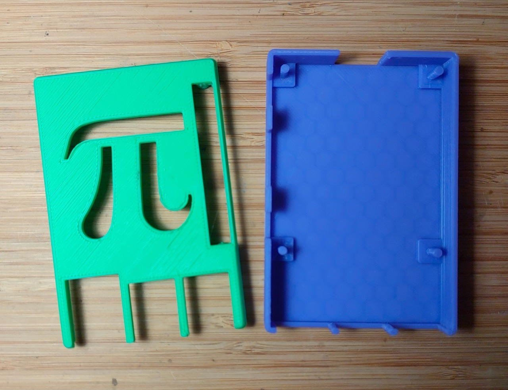
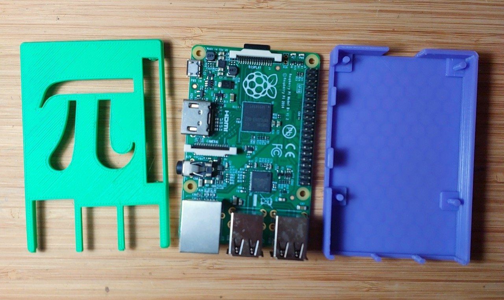
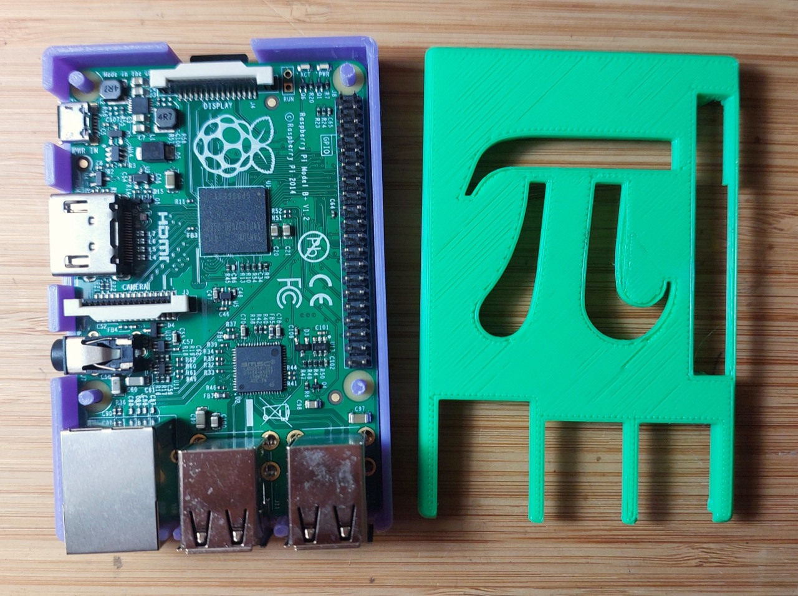
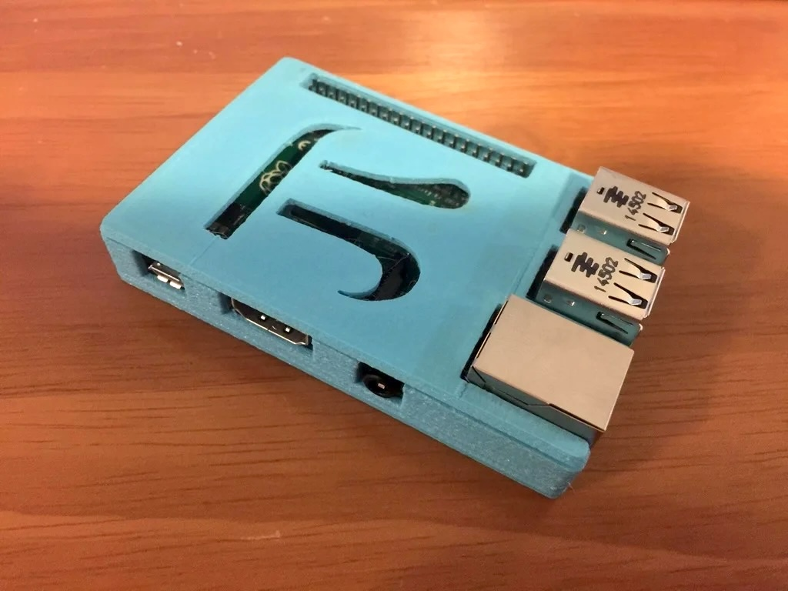
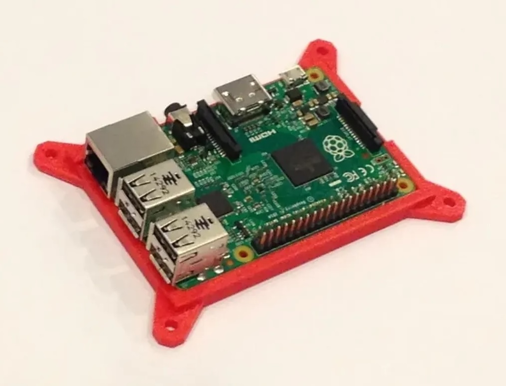

# #764 Raspberry Pi B+ Case

Finally, 3D PLA printing a case for the Raspberry Pi Model B+ ... at the library.

## Notes

I'm finally getting around to making a case for my Raspberry Pi Model B+.

The libraries here in Singapore are fantastic, with 3D PLA printers available for use.
See [LEAP#756 NLB Flashforge Creator Pro 2](../../Equipment/NLB/FlashforgeCreatorPro2/)
for details of the printers.

I found a couple of nice designs freely available,
and for now I've gone with a
[Raspberry Pi case (model B+ /2) w/ Pi Symbol](https://www.thingiverse.com/thing:989353).

The STLs took under 2 hours to print.

They required very little cleanup.
Main thing was to file any burrs off the locating connectors
so that the Pi sits nicely in the case
and the two halves snap together nicely.
They press-fit perfectly.

## 3D Case Designs

Some of the nice options I found..

### [Raspberry Pi case (model B+ /2) w/ Pi Symbol](https://www.thingiverse.com/thing:989353)

> Note: the one I've used here

A somewhat more enclosed option, this is a nice design that still retains access to all ports and connectors.

* [989353-lid-v2.stl](./assets/989353-lid-v2.stl)
* [989353-bottom.stl](./assets/989353-bottom.stl)

### [Raspberry Pi B+ / 2 Mount](https://www.printables.com/model/157800-raspberry-pi-b-2-mount)

I like the idea of this mounting for breadboarding and experimentation as it keeps the board fully accessible.

* [pibracket-v1.stl](./assets/pibracket-v1.stl).

## Credits and References

* [Raspberry Pi 1 Model B+](https://www.raspberrypi.com/products/raspberry-pi-1-model-b-plus/)
* [LEAP#756 NLB Flashforge Creator Pro 2](../../Equipment/NLB/FlashforgeCreatorPro2/)
* [Raspberry Pi case (model B+ /2) w/ Pi Symbol](https://www.thingiverse.com/thing:989353)
* [Raspberry Pi B+ / 2 Mount](https://www.printables.com/model/157800-raspberry-pi-b-2-mount)
