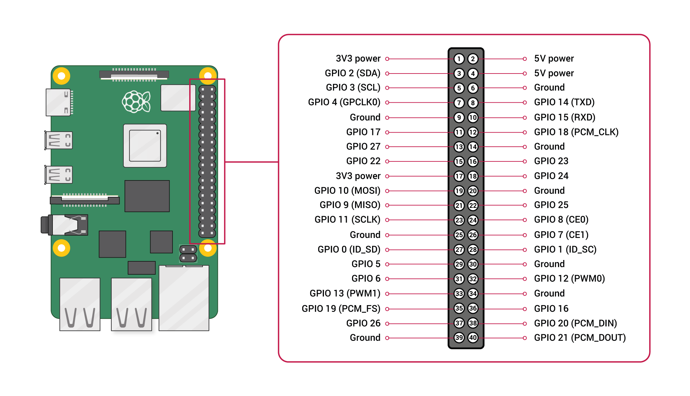
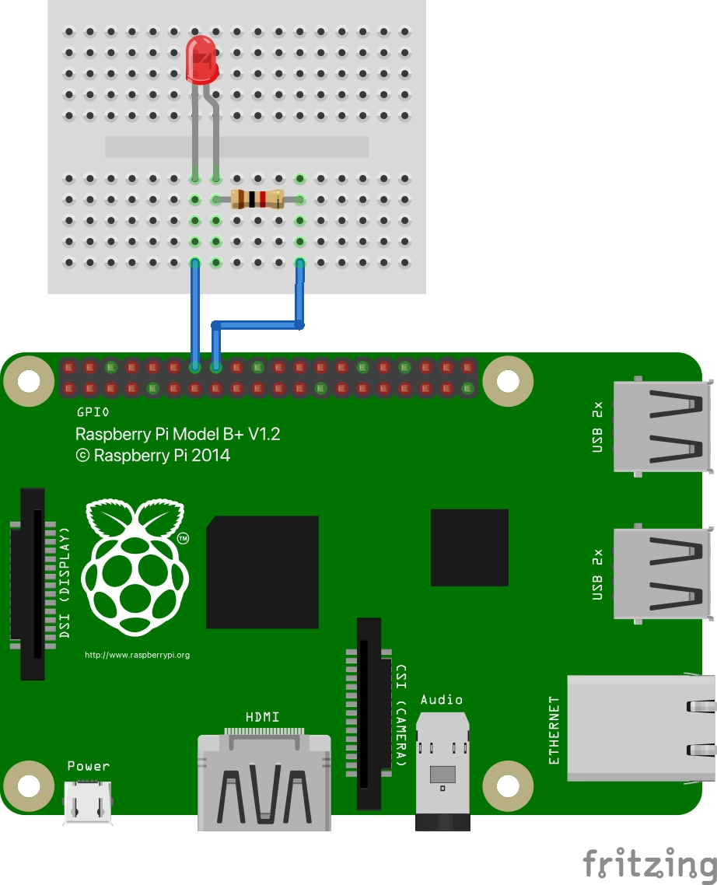
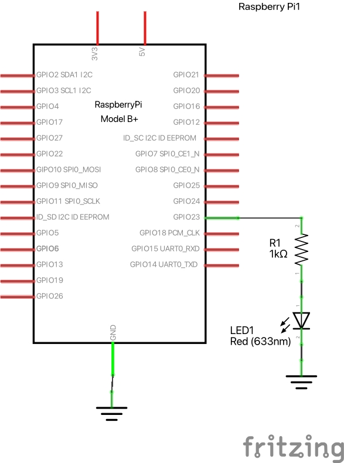

# #599 Raspberry Pi B+

Getting Started with the original Raspberry Pi 1 Model B+.
Notes on the device, an LED blinky test, running and old NOOBS distro and also the latest Raspberry Pi OS.

## Notes

The [Raspberry Pi Model B+](https://www.raspberrypi.com/products/raspberry-pi-1-model-b-plus/)
is the final revision of the original Raspberry Pi. It replaced the Model B in July 2014 and was superseded by Raspberry Pi 2 Model B.
Raspberry Pi 1 Model B+ will remain in production until at least January 2030.

I bought this back in 2014 for SGD$45.00.

### Specifications

* Chip: Broadcom BCM2835 SoC
* Core architecture: ARM11
* CPU: 700 MHz Low Power ARM1176JZFS Applications Processor
* GPU:
    * Dual Core VideoCore IV® Multimedia Co-Processor
    * Provides Open GL ES 2.0, hardware-accelerated OpenVG, and 1080p30 H.264 high-profile decode
    * Capable of 1Gpixel/s, 1.5Gtexel/s or 24GFLOPs with texture filtering and DMA infrastructure
* Memory: 512MB SDRAM
* Operating System:
    * Boots from Micro SD card, running a version of the Linux operating system
    * Raspberry Pi OS is the recommended operating system for normal use
* Dimensions: 85 x 56 x 17mm
* Power: Micro USB socket 5V, 2A

### Connectors

* Ethernet 10/100 BaseT Ethernet socket
* Video Output
    * HDMI (rev 1.3 & 1.4)
    * Composite RCA (PAL and NTSC)
* Audio Output: 3.5mm jack, HDMI
* USB: 4 x USB 2.0 Connector
* GPIO Connector:
    * 40-pin 2.54 mm (100 mil) expansion header: 2x20 strip
    * Providing 27 GPIO pins as well as +3.3 V, +5 V and GND supply lines
* Camera Connector: 15-pin MIPI Camera Serial Interface (CSI-2)
* JTAG: Not populated
* Display Connector: Display Serial Interface (DSI) 15 way flat flex cable connector with two data lanes and a clock lane
* Memory Card Slot: Micro SDIO

### GPIO

See the [GPIO documentation](https://www.raspberrypi.com/documentation/computers/raspberry-pi.html#gpio)

### NOOBS

I have a microSD card with a version of [NOOBS](https://www.raspberrypi.com/news/introducing-noobs/) that I made when I originally got the B+

It still boots (default credentials `pi/raspberry`)!

    $ uname -a
    Linux raspberrypi 3.12.22+ #691 PREEMPT Wed Jun 18 18:29:58 BST 2014 armv61 GNU/Linux

It's been a while since I booted this version, so run some updates:

    sudo apt-get update && sudo apt-get upgrade

Some basic commands:

* `sudo raspi-config` - configure the RPi with `raspi-config` (include boot to desktop etc)
* `startx` - start the desktop manually
* `sudo shutdown -h now` - shutdown & halt

#### NOOBS LED Blinky Test

NOOBS still has an old 2.7 version installed:

    $ python --version
    Python 2.7.3

Let's check things with a simple LED blinky that toggles an LED on pin 16/GPIO 23 at 0.5Hz.
It uses the [RPi.GPIO library](https://sourceforge.net/projects/raspberry-gpio-python/).
It seems I need to use sudo to get the required privileges to control the GPIO pins:

    sudo python blinky.py

See [blinky.py](./blinky.py) for the script:

    import time
    import RPi.GPIO as GPIO

    GPIO.setwarnings(False)
    GPIO.setmode(GPIO.BOARD)
    led1 = 16

    try:
        GPIO.setup(led1, GPIO.OUT)
        while True:
            GPIO.output(led1, True)
            time.sleep(0.5)
            GPIO.output(led1, False)
            time.sleep(0.5)
    except KeyboardInterrupt:
        pass
    finally:
        GPIO.cleanup(led1)

### Raspberry Pi OS

NOOBS is pretty ancient now. Let's try the latest Raspberry Pi OS.

I used the [Raspberry Pi Imager](https://www.raspberrypi.com/software/)
to put a copy of the [Raspberry Pi OS](https://www.raspberrypi.com/documentation/computers/os.html) on a 64Gb microSD card.

### Raspberry Pi OS LED Blinky Test

Raspberry Pi OS has python 3 installed:

    $ python --version
    Python 3.11.2

Then update and make sure the GPIO support is installed:

    sudo apt-get update
    sudo apt-get install python3-rpi.gpio

After that, can successfully use the same [blinky.py](./blinky.py) script to toggle an LED on pin 16/GPIO 23 at 0.5Hz.
Note: does not require sudo to run.

So while Raspberry Pi OS works, the Desktop and app launching is quite sluggish.
It seems "headless apps" would be much better suited to the old B+ now, and Desktop reserved for beefier, newer models!

## 3D Printed Case

I'm thinking of printing a case. Found a couple of options..
see [LEAP#764 Raspberry Pi B+ Case](../BPlusCase/) for more.

## Credits and References

* [Raspberry Pi 1 Model B+](https://www.raspberrypi.com/products/raspberry-pi-1-model-b-plus/)
* [Introducing the New Out Of Box Software (NOOBS)](https://www.raspberrypi.com/news/introducing-noobs/)
* [Raspberry Pi OS](https://www.raspberrypi.com/documentation/computers/os.html)
* [raspberry-gpio-python](https://sourceforge.net/projects/raspberry-gpio-python/)
