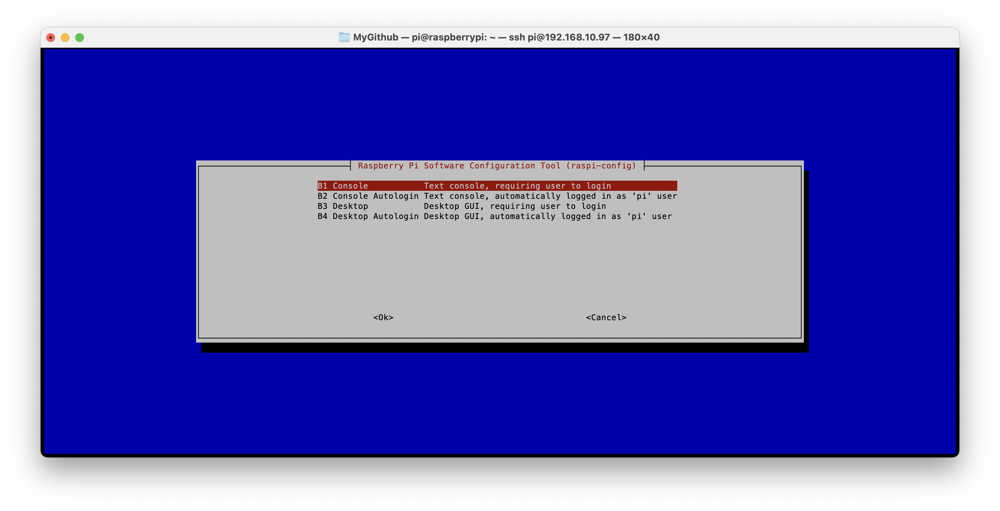
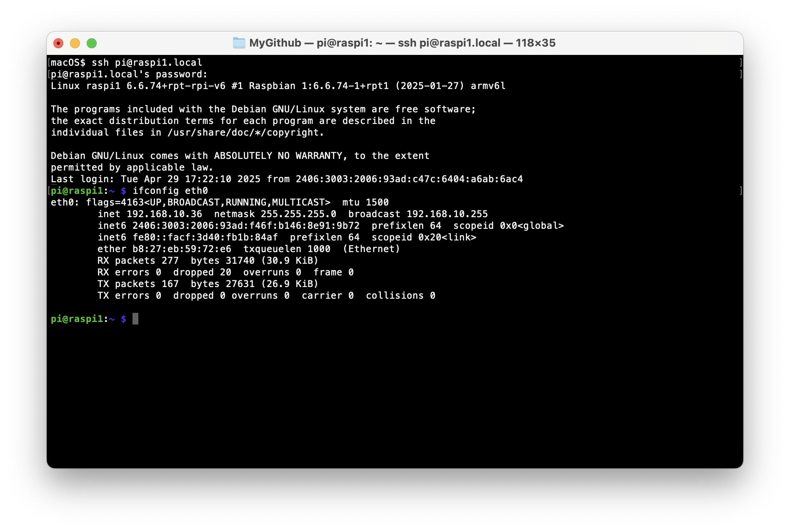

# #xxx Headless Raspberry Pi

How to configure Raspberry Pi OS for headless operation, including static IP and mDNS.


## Notes

I'm using a pretty old [Raspberry Pi Model B+ running the latest Raspberry Pi OS](../BPlusGettingStarted/).

I used the [Raspberry Pi Imager](https://www.raspberrypi.com/software/)
to put a copy of the [Raspberry Pi OS](https://www.raspberrypi.com/documentation/computers/os.html) on a 64Gb microSD card.

By default it boots to the GUI, but on the old B+, this is very sluggish and best avoided unless really needed.
I used `Raspberry Pi Configuration` GUI app to switch the config:

* System Boot: to CLI
* System Auto-login: enabled
* Interfaces: SSH enabled

After reboot, its automatically logs into the `pi` account. I used `passwd` to set a custom password.

### Checking the IP address

The system is set for DHCP by default. Checking the address with `ifconfig` yields a local eth0 address of 192.168.10.97.

```sh
pi@raspberrypi:~ $ ifconfig
eth0: flags=4163<UP,BROADCAST,RUNNING,MULTICAST>  mtu 1500
        inet 192.168.10.97  netmask 255.255.255.0  broadcast 192.168.10.255
        inet6 fe80::facf:3d40:fb1b:84af  prefixlen 64  scopeid 0x20<link>
        inet6 2406:3003:2006:93ad:f46f:b146:8e91:9b72  prefixlen 64  scopeid 0x0<global>
        ether b8:27:eb:59:72:e6  txqueuelen 1000  (Ethernet)
        RX packets 293  bytes 28500 (27.8 KiB)
        RX errors 0  dropped 53  overruns 0  frame 0
        TX packets 126  bytes 18646 (18.2 KiB)
        TX errors 0  dropped 0 overruns 0  carrier 0  collisions 0

lo: flags=73<UP,LOOPBACK,RUNNING>  mtu 65536
        inet 127.0.0.1  netmask 255.0.0.0
        inet6 ::1  prefixlen 128  scopeid 0x10<host>
        loop  txqueuelen 1000  (Local Loopback)
        RX packets 22  bytes 2452 (2.3 KiB)
        RX errors 0  dropped 0  overruns 0  frame 0
        TX packets 22  bytes 2452 (2.3 KiB)
        TX errors 0  dropped 0 overruns 0  carrier 0  collisions 0
```

Now I can SSH from my macOS desktop:

```sh
$ ssh pi@192.168.10.97
The authenticity of host '192.168.10.97 (192.168.10.97)' can't be established.
ED25519 key fingerprint is SHA256:Fo5g0FF0PagdxRLG010PX/mt+sg1M1FdMLi3hUVwgtE.
This key is not known by any other names.
Are you sure you want to continue connecting (yes/no/[fingerprint])? yes
Warning: Permanently added '192.168.10.97' (ED25519) to the list of known hosts.
pi@192.168.10.97's password:
Linux raspberrypi 6.6.74+rpt-rpi-v6 #1 Raspbian 1:6.6.74-1+rpt1 (2025-01-27) armv6l

The programs included with the Debian GNU/Linux system are free software;
the exact distribution terms for each program are described in the
individual files in /usr/share/doc/*/copyright.

Debian GNU/Linux comes with ABSOLUTELY NO WARRANTY, to the extent
permitted by applicable law.
Last login: Tue Apr 29 15:55:16 2025
$
```

### Reconfiguring from the command line

I now want to switch to CLI but without auto-login. Over SSH I can invoke config with `sudo raspi-config` and choose `1 System Options`.



### Reboot from the command line

```sh
pi@raspberrypi:~ $ sudo reboot

Broadcast message from root@raspberrypi on pts/1 (Tue 2025-04-29 16:19:49 BST):

The system will reboot now!

pi@raspberrypi:~ $ Connection to 192.168.10.97 closed by remote host.
Connection to 192.168.10.97 closed.
```

### Shutdown from the command line

```sh
pi@raspberrypi:~ $ sudo shutdown now

Broadcast message from root@raspberrypi on pts/1 (Tue 2025-04-29 16:30:00 BST):

The system will power off now!

pi@raspberrypi:~ $ Connection to 192.168.10.97 closed by remote host.
Connection to 192.168.10.97 closed.
```

### Network Management CLI

The [nmcli](https://people.freedesktop.org/~lkundrak/nm-docs/nmcli.html)

```sh
pi@raspberrypi:~ $ nmcli device show
GENERAL.DEVICE:                         eth0
GENERAL.TYPE:                           ethernet
GENERAL.HWADDR:                         B8:27:EB:59:72:E6
GENERAL.MTU:                            1500
GENERAL.STATE:                          100 (connected)
GENERAL.CONNECTION:                     Wired connection 1
GENERAL.CON-PATH:                       /org/freedesktop/NetworkManager/ActiveConnection/2
WIRED-PROPERTIES.CARRIER:               on
IP4.ADDRESS[1]:                         192.168.10.97/24
IP4.GATEWAY:                            192.168.10.1
IP4.ROUTE[1]:                           dst = 192.168.10.0/24, nh = 0.0.0.0, mt = 100
IP4.ROUTE[2]:                           dst = 0.0.0.0/0, nh = 192.168.10.1, mt = 100
IP4.DNS[1]:                             192.168.10.1
IP6.ADDRESS[1]:                         2406:3003:2006:93ad:f46f:b146:8e91:9b72/64
IP6.ADDRESS[2]:                         fe80::facf:3d40:fb1b:84af/64
IP6.GATEWAY:                            fe80::3223:3ff:fec1:1056
IP6.ROUTE[1]:                           dst = fe80::/64, nh = ::, mt = 1024
IP6.ROUTE[2]:                           dst = 2406:3003:2006:93ad::/64, nh = ::, mt = 100
IP6.ROUTE[3]:                           dst = 2406:3003:2006:93ad::/64, nh = fe80::3223:3ff:fec1:1056, mt = 105
IP6.ROUTE[4]:                           dst = ::/0, nh = fe80::3223:3ff:fec1:1056, mt = 100
IP6.DNS[1]:                             2406:3003:2006:93ad:3223:3ff:fec1:1056

GENERAL.DEVICE:                         lo
GENERAL.TYPE:                           loopback
GENERAL.HWADDR:                         00:00:00:00:00:00
GENERAL.MTU:                            65536
GENERAL.STATE:                          100 (connected (externally))
GENERAL.CONNECTION:                     lo
GENERAL.CON-PATH:                       /org/freedesktop/NetworkManager/ActiveConnection/1
IP4.ADDRESS[1]:                         127.0.0.1/8
IP4.GATEWAY:                            --
IP6.ADDRESS[1]:                         ::1/128
IP6.GATEWAY:                            --
```

### Using mDNS

The hostname is set with `/etc/hostname`. Let's change it to `raspi1` (the default is `raspberrypi`).

```sh
pi@raspberrypi:~ $ sudo nano /etc/hostname
pi@raspberrypi:~ $ cat /etc/hostname
raspi1
```

Tehn need to change the local name respolution for `127.0.1.1` in `/etc/hosts`:

```sh
pi@raspi1:~ $ sudo nano /etc/hosts
pi@raspi1:~ $ cat /etc/hosts
127.0.0.1 localhost
::1  localhost ip6-localhost ip6-loopback
ff02::1  ip6-allnodes
ff02::2  ip6-allrouters

127.0.1.1  raspi1
```

After `sudo reboot` I can now find the respberry Pi on the network by its new name using mDNS:

```sh
$ ping raspi1.local
PING raspi1.local (192.168.10.97): 56 data bytes
64 bytes from 192.168.10.97: icmp_seq=0 ttl=64 time=8.000 ms
64 bytes from 192.168.10.97: icmp_seq=1 ttl=64 time=3.886 ms
64 bytes from 192.168.10.97: icmp_seq=2 ttl=64 time=6.827 ms
^C
--- raspi1.local ping statistics ---
3 packets transmitted, 3 packets received, 0.0% packet loss
round-trip min/avg/max/stddev = 3.886/6.238/8.000/1.730 ms
$ ssh pi@raspi1.local
pi@raspi1.local's password:
Linux raspi1 6.6.74+rpt-rpi-v6 #1 Raspbian 1:6.6.74-1+rpt1 (2025-01-27) armv6l

The programs included with the Debian GNU/Linux system are free software;
the exact distribution terms for each program are described in the
individual files in /usr/share/doc/*/copyright.

Debian GNU/Linux comes with ABSOLUTELY NO WARRANTY, to the extent
permitted by applicable law.
Last login: Tue Apr 29 16:49:01 2025 from 192.168.10.87
pi@raspi1:~ $
```



### Setting a Static IP

Since I'll run headless, it will be useful to use a static IP for the wired ethernet connection.
I've reserved `192.168.10.36` on my local network for this device.
See <https://www.abelectronics.co.uk/kb/article/31/set-a-static-ip-address-on-raspberry-pi-os-bookworm> for more.

```sh
pi@raspi1:~ $ nmcli -p connection show
======================================
  NetworkManager connection profiles
======================================
NAME                UUID                                  TYPE      DEVICE
------------------------------------------------------------------------------------------------------------------
Wired connection 1  76b7ff9c-5b91-3260-b550-b5baf72c9b2b  ethernet  eth0
lo                  cab01dce-d6de-466a-bca8-5fe46ca03cac  loopback  lo
pi@raspi1:~ $ ifconfig eth0
eth0: flags=4163<UP,BROADCAST,RUNNING,MULTICAST>  mtu 1500
        inet 192.168.10.97  netmask 255.255.255.0  broadcast 192.168.10.255
        inet6 2406:3003:2006:93ad:f46f:b146:8e91:9b72  prefixlen 64  scopeid 0x0<global>
        inet6 fe80::facf:3d40:fb1b:84af  prefixlen 64  scopeid 0x20<link>
        ether b8:27:eb:59:72:e6  txqueuelen 1000  (Ethernet)
        RX packets 291  bytes 31326 (30.5 KiB)
        RX errors 0  dropped 31  overruns 0  frame 0
        TX packets 196  bytes 33556 (32.7 KiB)
        TX errors 0  dropped 0 overruns 0  carrier 0  collisions 0

pi@raspi1:~ $ sudo nmcli c mod "Wired connection 1" ipv4.addresses 192.168.10.36/24 ipv4.method manual
pi@raspi1:~ $ sudo nmcli con mod "Wired connection 1" ipv4.gateway 192.168.10.1
pi@raspi1:~ $ sudo nmcli con mod "Wired connection 1" ipv4.dns 192.168.10.1
```

After a reboot ... or interface up/down - not possible over ssh;-)
the device comes up on the static IP:

```sh
$ ping raspi1.local
PING raspi1.local (192.168.10.36): 56 data bytes
64 bytes from 192.168.10.36: icmp_seq=0 ttl=64 time=9.211 ms
64 bytes from 192.168.10.36: icmp_seq=1 ttl=64 time=3.940 ms
64 bytes from 192.168.10.36: icmp_seq=2 ttl=64 time=3.194 ms
^C
--- raspi1.local ping statistics ---
3 packets transmitted, 3 packets received, 0.0% packet loss
round-trip min/avg/max/stddev = 3.194/5.448/9.211/2.678 ms
```

To see the details of the interface:

```sh
pi@raspi1:~ $ nmcli -p connection show "Wired connection 1"
===============================================================================
                Connection profile details (Wired connection 1)
===============================================================================
connection.id:                          Wired connection 1
connection.uuid:                        76b7ff9c-5b91-3260-b550-b5baf72c9b2b
connection.stable-id:                   --
connection.type:                        802-3-ethernet
connection.interface-name:              eth0
connection.autoconnect:                 yes
connection.autoconnect-priority:        -999
connection.autoconnect-retries:         -1 (default)
connection.multi-connect:               0 (default)
connection.auth-retries:                -1
connection.timestamp:                   1745942520
connection.read-only:                   no
connection.permissions:                 --
connection.zone:                        --
connection.master:                      --
connection.slave-type:                  --
connection.autoconnect-slaves:          -1 (default)
connection.secondaries:                 --
connection.gateway-ping-timeout:        0
connection.metered:                     unknown
connection.lldp:                        default
connection.mdns:                        -1 (default)
connection.llmnr:                       -1 (default)
connection.dns-over-tls:                -1 (default)
connection.mptcp-flags:                 0x0 (default)
connection.wait-device-timeout:         -1
connection.wait-activation-delay:       -1
-------------------------------------------------------------------------------
802-3-ethernet.port:                    --
802-3-ethernet.speed:                   0
802-3-ethernet.duplex:                  --
802-3-ethernet.auto-negotiate:          no
802-3-ethernet.mac-address:             --
802-3-ethernet.cloned-mac-address:      --
802-3-ethernet.generate-mac-address-mask:--
802-3-ethernet.mac-address-blacklist:   --
802-3-ethernet.mtu:                     auto
802-3-ethernet.s390-subchannels:        --
802-3-ethernet.s390-nettype:            --
802-3-ethernet.s390-options:            --
802-3-ethernet.wake-on-lan:             default
802-3-ethernet.wake-on-lan-password:    --
802-3-ethernet.accept-all-mac-addresses:-1 (default)
-------------------------------------------------------------------------------
ipv4.method:                            manual
ipv4.dns:                               192.168.10.1
ipv4.dns-search:                        --
ipv4.dns-options:                       --
ipv4.dns-priority:                      0
ipv4.addresses:                         192.168.10.36/24
ipv4.gateway:                           192.168.10.1
ipv4.routes:                            --
ipv4.route-metric:                      -1
ipv4.route-table:                       0 (unspec)
ipv4.routing-rules:                     --
ipv4.replace-local-rule:                -1 (default)
ipv4.ignore-auto-routes:                no
ipv4.ignore-auto-dns:                   no
ipv4.dhcp-client-id:                    --
ipv4.dhcp-iaid:                         --
ipv4.dhcp-timeout:                      0 (default)
ipv4.dhcp-send-hostname:                yes
ipv4.dhcp-hostname:                     --
ipv4.dhcp-fqdn:                         --
ipv4.dhcp-hostname-flags:               0x0 (none)
ipv4.never-default:                     no
ipv4.may-fail:                          yes
ipv4.required-timeout:                  -1 (default)
ipv4.dad-timeout:                       -1 (default)
ipv4.dhcp-vendor-class-identifier:      --
ipv4.link-local:                        0 (default)
ipv4.dhcp-reject-servers:               --
ipv4.auto-route-ext-gw:                 -1 (default)
-------------------------------------------------------------------------------
ipv6.method:                            auto
ipv6.dns:                               --
ipv6.dns-search:                        --
ipv6.dns-options:                       --
ipv6.dns-priority:                      0
ipv6.addresses:                         --
ipv6.gateway:                           --
ipv6.routes:                            --
ipv6.route-metric:                      -1
ipv6.route-table:                       0 (unspec)
ipv6.routing-rules:                     --
ipv6.replace-local-rule:                -1 (default)
ipv6.ignore-auto-routes:                no
ipv6.ignore-auto-dns:                   no
ipv6.never-default:                     no
ipv6.may-fail:                          yes
ipv6.required-timeout:                  -1 (default)
ipv6.ip6-privacy:                       -1 (unknown)
ipv6.addr-gen-mode:                     default
ipv6.ra-timeout:                        0 (default)
ipv6.mtu:                               auto
ipv6.dhcp-duid:                         --
ipv6.dhcp-iaid:                         --
ipv6.dhcp-timeout:                      0 (default)
ipv6.dhcp-send-hostname:                yes
ipv6.dhcp-hostname:                     --
ipv6.dhcp-hostname-flags:               0x0 (none)
ipv6.auto-route-ext-gw:                 -1 (default)
ipv6.token:                             --
-------------------------------------------------------------------------------
proxy.method:                           none
proxy.browser-only:                     no
proxy.pac-url:                          --
proxy.pac-script:                       --
-------------------------------------------------------------------------------
===============================================================================
       Active connection details (76b7ff9c-5b91-3260-b550-b5baf72c9b2b)
===============================================================================
GENERAL.NAME:                           Wired connection 1
GENERAL.UUID:                           76b7ff9c-5b91-3260-b550-b5baf72c9b2b
GENERAL.DEVICES:                        eth0
GENERAL.IP-IFACE:                       eth0
GENERAL.STATE:                          activated
GENERAL.DEFAULT:                        yes
GENERAL.DEFAULT6:                       yes
GENERAL.SPEC-OBJECT:                    --
GENERAL.VPN:                            no
GENERAL.DBUS-PATH:                      /org/freedesktop/NetworkManager/ActiveConnection/2
GENERAL.CON-PATH:                       /org/freedesktop/NetworkManager/Settings/1
GENERAL.ZONE:                           --
GENERAL.MASTER-PATH:                    --
-------------------------------------------------------------------------------
IP4.ADDRESS[1]:                         192.168.10.36/24
IP4.GATEWAY:                            192.168.10.1
IP4.ROUTE[1]:                           dst = 192.168.10.0/24, nh = 0.0.0.0, mt = 100
IP4.ROUTE[2]:                           dst = 0.0.0.0/0, nh = 192.168.10.1, mt = 100
IP4.DNS[1]:                             192.168.10.1
-------------------------------------------------------------------------------
IP6.ADDRESS[1]:                         2406:3003:2006:93ad:f46f:b146:8e91:9b72/64
IP6.ADDRESS[2]:                         fe80::facf:3d40:fb1b:84af/64
IP6.GATEWAY:                            fe80::3223:3ff:fec1:1056
IP6.ROUTE[1]:                           dst = fe80::/64, nh = ::, mt = 1024
IP6.ROUTE[2]:                           dst = 2406:3003:2006:93ad::/64, nh = ::, mt = 100
IP6.ROUTE[3]:                           dst = 2406:3003:2006:93ad::/64, nh = fe80::3223:3ff:fec1:1056, mt = 105
IP6.ROUTE[4]:                           dst = ::/0, nh = fe80::3223:3ff:fec1:1056, mt = 100
IP6.DNS[1]:                             2406:3003:2006:93ad:3223:3ff:fec1:1056
-------------------------------------------------------------------------------
DHCP6.OPTION[1]:                        dhcp6_client_id = 00:04:c7:3f:44:aa:2f:02:4d:b0:ce:0b:60:c2:9a:b9:11:47
DHCP6.OPTION[2]:                        dhcp6_name_servers = 2406:3003:2006:93ad:3223:3ff:fec1:1056
DHCP6.OPTION[3]:                        iaid = 2b:50:67:35
-------------------------------------------------------------------------------
```

If possible the connection will be made using IPv6

```sh
$ ssh pi@raspi1.local
pi@raspi1.local's password:
Linux raspi1 6.6.74+rpt-rpi-v6 #1 Raspbian 1:6.6.74-1+rpt1 (2025-01-27) armv6l

The programs included with the Debian GNU/Linux system are free software;
the exact distribution terms for each program are described in the
individual files in /usr/share/doc/*/copyright.

Debian GNU/Linux comes with ABSOLUTELY NO WARRANTY, to the extent
permitted by applicable law.
Last login: Tue Apr 29 17:04:50 2025 from 2406:3003:2006:93ad:c47c:6404:a6ab:6ac4
pi@raspi1:~ $
```

## Credits and References

* [Raspberry Pi Cookbook](../../books/raspberry-pi-cookbook/)
* <https://www.raspberrypi.com/documentation/computers/configuration.html>
* <https://www.abelectronics.co.uk/kb/article/31/set-a-static-ip-address-on-raspberry-pi-os-bookworm>
