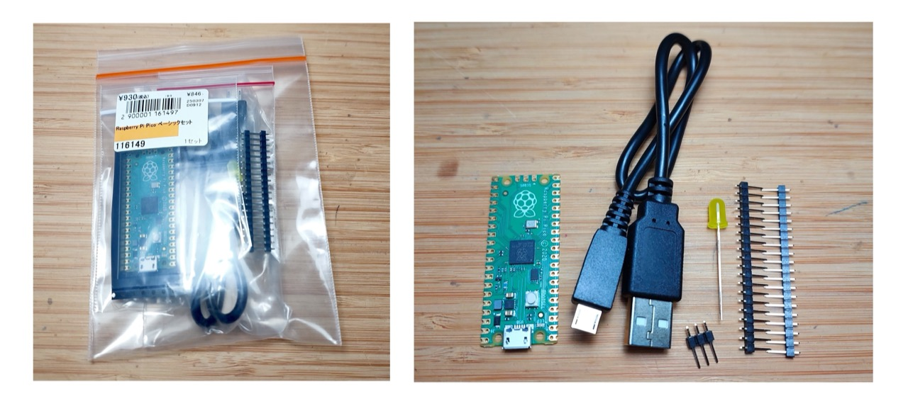
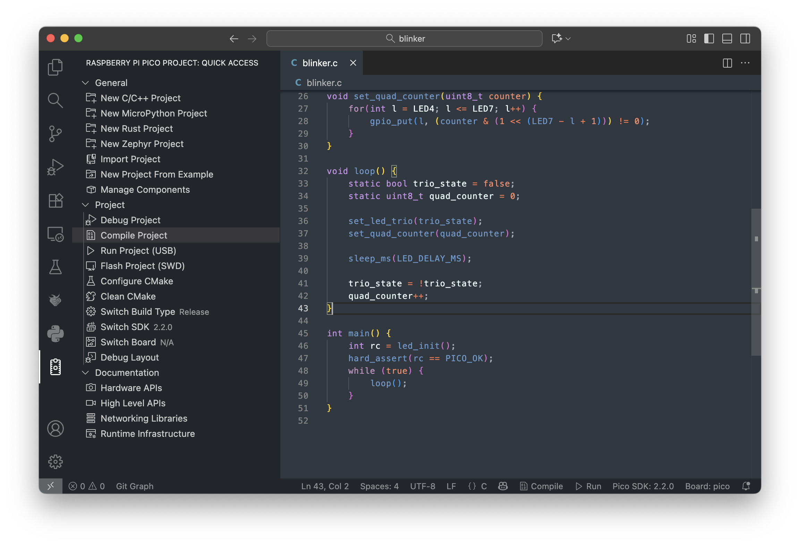

# #813 About the Raspberry Pi Pico

All about the Raspberry Pi Pico, demonstrated with a simple LED sequencing programmed using the C/C++ Pico SDK and VS Code extension.


Here's a quick demo..

[](https://www.youtube.com/watch?v=oVsFol4PKmg)

## Notes

I picked up my first Raspberry Pi Pico from
[Akizuki Denshi Akihabara 秋月電子通商](https://akizukidenshi.com/catalog/pages/akiba.aspx)
for ¥930 in Nov-2025.

It came in a nice little package containing:

* Raspberry Pi Pico 1 board with castellated pins
* header pins for board mounting and the SWD interface
* a micro USB cable
* and a 5mm yellow LED, because why not?!



## About the Raspberry Pi Pico

The
[Raspberry Pi Pico](https://www.raspberrypi.com/products/raspberry-pi-pico/)
was launched in January 2021
and was Raspberry Pi’s first microcontroller board built around the RP2040 chip.

The Pico is designed for embedded and real-time applications rather than running Linux, and is typically programmed in MicroPython or C/C++. It offers a rich set of peripherals (GPIO, I²C, SPI, UART, PWM, ADC) and is widely used for learning, prototyping, and hobbyist or lightweight industrial projects.

See the [Raspberry Pi Pico 1 datasheet](https://datasheets.raspberrypi.com/pico/pico-datasheet.pdf) for more information.

### Key Specifications

* RP2040 microcontroller chip designed by Raspberry Pi:
    * Dual-core Arm Cortex-M0+ processor, flexible clock running up to 133 MHz
    * 264kB on-chip SRAM
    * 2MB on-board QSPI flash
* 26 multifunction GPIO pins, including 3 analogue inputs
* 2 × UART, 2 × SPI controllers, 2 × I2C controllers, 16 × PWM channels
* 1 × USB 1.1 controller and PHY, with host and device support
* 8 × Programmable I/O (PIO) state machines for custom peripheral support
* Low-power sleep and dormant modes
* Accurate on-chip clock
* Temperature sensor
* Accelerated integer and floating-point libraries on-chip
* Supported input voltage 1.8–5.5V DC
* 21 mm × 51 mm form factor
* For the Raspberry Pi Pico W and WH only:
    * 2.4GHz 802.11n wireless LAN
    * Bluetooth 5.2

### Pico Pinouts


### Programming Options

The principle methods of programming for the Raspberry Pi Pico:

* C/C++ Pico SDK. Either:
    * use [Raspberry Pi Pico](https://marketplace.visualstudio.com/items?itemName=raspberry-pi.raspberry-pi-pico) VS Code extension. This is the approach I'll demonstrate in the example below
    * or setup the SDK manually
* MicroPython
    * download the appropriate [MicroPython UF2 file](https://www.raspberrypi.com/documentation/microcontrollers/micropython.html#drag-and-drop-micropython) for the board
    * Drag-and-drop it to the Pico USB
    * then use the device like any other MicroPython host device
* CircuitPython
    * download the appropriate [CircuitPython UF2 file](https://circuitpython.org/board/raspberry_pi_pico/) for the board
    * Drag-and-drop it to the Pico USB
    * then use the device like any other CircuitPython host device
* Arduino IDE with Arduino-Pico core
    * See <https://arduino-pico.readthedocs.io/en/latest/>
* Assembly language. There are two primary ways to approach this:
    * Integrated with the C/C++ SDK: The official Pico SDK is designed to support C, C++, and assembly language. This is the recommended method for most users as it allows you to write performance-critical functions in assembly while leveraging the rich libraries and build system of the C/C++ SDK for other tasks. The build process using CMake and GCC assembler handles the integration.
    * Bare-metal programming: Advanced users can choose to program the entire chip in assembly language without the SDK, which requires manual configuration of the boot process, vector tables, and hardware registers.

The key ways to actually flash the device:

* Drag-and-drop programming using mass storage over USB
    * For example, this is what the VS Code extension does under the cover
* OpenOCD to the SWD interface

### Demonstration Circuit Design

Schematic designed with Fritzing: see [About.fzz](./About.fzz).

The circuit simply requires 7 LEDs to be wired to GP7-GP13.


The schematic shows individual LEDs and current-limiting resistors,
but in practice I'm using an
8-bit Red LED module with common cathode -
["3-24V 8 Bit Blue/Red Common anode/cathode LED indicator Module Breadboard starter kit Board for MCU ARM 3d printer UNO MEGA2560" (aliexpress seller listing)](https://www.aliexpress.com/item/1005004567063273.html).


### A Demo Program

I'm using the
[Raspberry Pi Pico](https://marketplace.visualstudio.com/items?itemName=raspberry-pi.raspberry-pi-pico)
VS Code extension to build and flash a C program for the Pico.
The installation and build progress is covered in
["Getting started with Raspberry Pi Pico: C/C++ development"](https://datasheets.raspberrypi.com/pico/getting-started-with-pico.pdf).

I've created a "blinker" example that runs patterns on 7 LEDs connected to the GP7-13.
The source is in
[blinker/blinker.c](./blinker/blinker.c),
and the project is supported by additional files created by the VS Code extension:

* [blinker/CMakeLists.txt](./blinker/CMakeLists.txt) - project-specific make support
* [blinker/pico_sdk_import.cmake](./blinker/pico_sdk_import.cmake) - generic boilerplate
* project-specific VS Code configuration
    * [blinker/.vscode/c_cpp_properties.json](./blinker/.vscode/c_cpp_properties.json)
    * [blinker/.vscode/cmake-kits.json](./blinker/.vscode/cmake-kits.json)
    * [blinker/.vscode/extensions.json](./blinker/.vscode/extensions.json)
    * [blinker/.vscode/launch.json](./blinker/.vscode/launch.json)
    * [blinker/.vscode/settings.json](./blinker/.vscode/settings.json)
    * [blinker/.vscode/tasks.json](./blinker/.vscode/tasks.json)
* `build/`
    * automatically generated build/make scripts
    * automatically imported pico-sdk
    * build assets



Compiling and programming the device is a simple 2-step procedure

* hold the `BOOTSEL` button down on the Pico while plugging in to USB.
    * The Pico will be recognised as a USB device by the OS
    * On the USb device is a file `INFO_UF2.TXT` that summarises capabilities. In my case:
        * UF2 Bootloader v3.0
        * Model: Raspberry Pi RP2
        * Board-ID: RPI-RP2
* Select `Run Project (USB)` from the VS Code Raspberry Pi Pico: Quick Access menu

The program runs a simple LED pattern.

* first 3 LEDs blink on/off
* the remaining 4 LEDs display a binary counter

See [blinker/blinker.c](./blinker/blinker.c) for the full program:

```c
#include "pico/stdlib.h"

const int LED_DELAY_MS = 250;

// LED pin definitions. The code assumes these are sequential GPIO pins.
const uint8_t LED1 = 7;
const uint8_t LED2 = 8;
const uint8_t LED3 = 9;
const uint8_t LED4 = 10;
const uint8_t LED5 = 11;
const uint8_t LED6 = 12;
const uint8_t LED7 = 13;

int led_init(void) {
    for(int l = LED1; l <= LED7; l++) {
        gpio_init(l);
        gpio_set_dir(l, GPIO_OUT);
    }
    return PICO_OK;
}

void set_led_trio(bool led_state) {
    for(int l = LED1; l <= LED3; l++) {
        gpio_put(l, led_state);
    }
}

void set_quad_counter(uint8_t counter) {
    for(int l = LED4; l <= LED7; l++) {
        gpio_put(l, (counter & (1 << (LED7 - l + 1))) != 0);
    }
}

void loop() {
    static bool trio_state = false;
    static uint8_t quad_counter = 0;

    set_led_trio(trio_state);
    set_quad_counter(quad_counter);

    sleep_ms(LED_DELAY_MS);

    trio_state = !trio_state;
    quad_counter++;
}

int main() {
    int rc = led_init();
    hard_assert(rc == PICO_OK);
    while (true) {
        loop();
    }
}

```

Here's a quick demo to see the program in action:

[](https://www.youtube.com/watch?v=oVsFol4PKmg)

## Credits and References

* <https://www.raspberrypi.com/products/raspberry-pi-pico/>
* [Raspberry Pi Pico 1 datasheet](https://datasheets.raspberrypi.com/pico/pico-datasheet.pdf)
* [Pico-series Microcontrollers Documentation](https://www.raspberrypi.com/documentation/microcontrollers/pico-series.html)
* [Getting started with Raspberry Pi Pico: C/C++ development](https://datasheets.raspberrypi.com/pico/getting-started-with-pico.pdf)
* ["3-24V 8 Bit Blue/Red Common anode/cathode LED indicator Module Breadboard starter kit Board for MCU ARM 3d printer UNO MEGA2560" (aliexpress seller listing)](https://www.aliexpress.com/item/1005004567063273.html)
* [Raspberry Pi Pico](https://marketplace.visualstudio.com/items?itemName=raspberry-pi.raspberry-pi-pico) VS Code Extension
