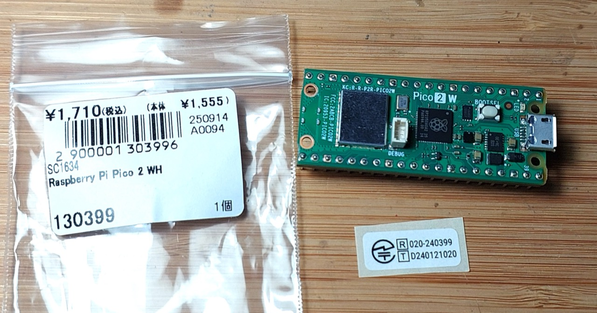

# #xxx About the Raspberry Pi Pico 2

All about the Raspberry Pi Pico 2, with a demonstration program created with the C/C++ Pico SDK and VS Code extension.
The demo displays the the ADC internal temperature on a I²C 1602 LCD.


## Notes

I picked up my first Raspberry Pi Pico 2 WH from
[Akizuki Denshi Akihabara 秋月電子通商](https://akizukidenshi.com/catalog/pages/akiba.aspx)
for ¥1,710 in Nov-2025.



## About the Raspberry Pi Pico 2

The
[Raspberry Pi Pico 2](https://www.raspberrypi.com/products/raspberry-pi-pico-2/)
was launched in August 2024.

It is the second-generation Pico-series microcontroller board powered by the new RP2350 chip with dual-core Arm Cortex-M33 (and optional dual-core RISC-V) at up to 150 MHz, doubling RAM and flash compared with the original Pico and adding modern security features while keeping the same compact form factor and broad programming support in C/C++ and Python; its wireless sibling, the Raspberry Pi Pico 2 W adds 2.4 GHz Wi-Fi (802.11n) and Bluetooth 5.2 for connected and IoT projects.

### Key Specifications

* powered by the new high-performance, secure RP2350 microcontroller
    * Dual Arm Cortex-M33 or dual Hazard3 RISC-V processors @ 150MHz
    * 520 KB on-chip SRAM
    * ARM TrustZone for Cortex-M
* Supported input voltage 1.8–5.5V DC
* 2 × UART
* 2 × SPI controllers
* 2 × I2C controllers
* 24 × PWM channels
* 3 x ADC channels
* 1 × USB 1.1 controller and PHY, with host and device support
* 12 × PIO state machines
* Robust and fully documented security features:
    * Optional boot signing, enforced by on-chip mask ROM, with key fingerprint in OTP
    * Protected OTP storage for optional boot decryption key
    * Global bus filtering based on Arm or RISC-V security/privilege levels
    * Peripherals, GPIOs, and DMA channels individually assignable to security domains
    * Hardware mitigations for fault injection attacks
    * Hardware SHA-256 accelerator
* Software- and hardware-compatible with Raspberry Pi Pico 1
* For the Raspberry Pi Pico 2 W only:
    * 2.4GHz 802.11n wireless LAN
    * Bluetooth 5.2

### Pico 2W Pinouts


### Programming Options

The principle methods of programming for the Raspberry Pi Pico:

* C/C++ Pico SDK. Either:
    * use [Raspberry Pi Pico](https://marketplace.visualstudio.com/items?itemName=raspberry-pi.raspberry-pi-pico) VS Code extension. This is the approach I'll demonstrate in the example below
    * or setup the SDK manually
* MicroPython
    * download the appropriate [MicroPython UF2 file](https://www.raspberrypi.com/documentation/microcontrollers/micropython.html#drag-and-drop-micropython) for the board
    * Drag-and-drop it to the Pico USB
    * then use the device like any other MicroPython host device
* CircuitPython
    * download the appropriate [CircuitPython UF2 file](https://circuitpython.org/board/raspberry_pi_pico2_w/) for the board
    * Drag-and-drop it to the Pico USB
    * then use the device like any other CircuitPython host device
* Arduino IDE with Arduino-Pico core
    * See <https://arduino-pico.readthedocs.io/en/latest/>
* Assembly language. There are two primary ways to approach this:
    * Integrated with the C/C++ SDK: The official Pico SDK is designed to support C, C++, and assembly language. This is the recommended method for most users as it allows you to write performance-critical functions in assembly while leveraging the rich libraries and build system of the C/C++ SDK for other tasks. The build process using CMake and GCC assembler handles the integration.
    * Bare-metal programming: Advanced users can choose to program the entire chip in assembly language without the SDK, which requires manual configuration of the boot process, vector tables, and hardware registers.

The key ways to actually flash the device:

* Drag-and-drop programming using mass storage over USB
    * For example, this is what the VS Code extension does under the cover
* OpenOCD to the SWD interface

### Demonstration Circuit Design

Schematic designed with Fritzing: see [About.fzz](./About.fzz).

The circuit combines a Pico 2 is used to drive a I²C 1602 LCD. I'm not using any wireless or Bluetooth functionality specific to the "W" version of hte Pico 2 at this stage.

["Blue Display IIC/I2C/TWI/SPI Serial Interface 1602 16X2 Character LCD Backlight Module LCD-1602 5V For Arduino" (aliexpress seller listing)](https://www.aliexpress.com/item/32278943097.html).

The display unit is actually an HD44780-based 1602 LCD combined with a PCF8574A-based I²C adapter.
See [LEAP#398 LCD I²C Adapter](../../../playground/LCD/I2CAdapter/) for more details.

One issue is that the display unit is designed for 5V use, and doesn't work at 3.3V.
To overcome this, the project adds a [level shift module](../../../Electronics101/BidirectionalLevelShifterModule/) to adapter the 5V display with the 3.3V Pico 2.
See [LEAP#134 Bidirectional Level Shifter Module](../../../Electronics101/BidirectionalLevelShifterModule/) for more details.


### A Demo Program

I'm using the
[Raspberry Pi Pico](https://marketplace.visualstudio.com/items?itemName=raspberry-pi.raspberry-pi-pico)
VS Code extension to build and flash a C program for the Pico 2.

I've created a `internal_temp_lcd` example that displays the Pico 2 internal temperature on the 1602 LCD.
The source is in
[internal_temp_lcd/internal_temp_lcd.c](./internal_temp_lcd/internal_temp_lcd.c),
and the project is supported by additional files created by the VS Code extension:

* [internal_temp_lcd/CMakeLists.txt](./internal_temp_lcd/CMakeLists.txt) - project-specific make support
* [internal_temp_lcd/pico_sdk_import.cmake](./internal_temp_lcd/pico_sdk_import.cmake) - generic boilerplate
* project-specific VS Code configuration
    * [internal_temp_lcd/.vscode/c_cpp_properties.json](./internal_temp_lcd/.vscode/c_cpp_properties.json)
    * [internal_temp_lcd/.vscode/cmake-kits.json](./internal_temp_lcd/.vscode/cmake-kits.json)
    * [internal_temp_lcd/.vscode/extensions.json](./internal_temp_lcd/.vscode/extensions.json)
    * [internal_temp_lcd/.vscode/launch.json](./internal_temp_lcd/.vscode/launch.json)
    * [internal_temp_lcd/.vscode/settings.json](./internal_temp_lcd/.vscode/settings.json)
    * [internal_temp_lcd/.vscode/tasks.json](./internal_temp_lcd/.vscode/tasks.json)
* `build/`
    * automatically generated build/make scripts
    * automatically imported pico-sdk
    * build assets

Compiling and programming the device is a simple 2-step procedure

* hold the `BOOTSEL` button down on the Pico 2 while plugging in to USB.
* Select `Run Project (USB)` from the VS Code Raspberry Pi Pico: Quick Access menu

The program structure.

* setup
    * Initialise I2C and the LCD display
    * Initialise ADC for reading the internal temperature sensor
* main loop
    * read the internal temperature
    * update the LCD display

See [internal_temp_lcd/internal_temp_lcd.c](./internal_temp_lcd/internal_temp_lcd.c) for the full program:

```c
#include <stdio.h>
#include <string.h>
#include "pico/stdlib.h"
#include "hardware/adc.h"
#include "hardware/i2c.h"
#include "pico/binary_info.h"

const int LCD_REFRESH_DELAY_MS = 2000;

// commands
const int LCD_CLEARDISPLAY = 0x01;
const int LCD_RETURNHOME = 0x02;
const int LCD_ENTRYMODESET = 0x04;
const int LCD_DISPLAYCONTROL = 0x08;
const int LCD_CURSORSHIFT = 0x10;
const int LCD_FUNCTIONSET = 0x20;
const int LCD_SETCGRAMADDR = 0x40;
const int LCD_SETDDRAMADDR = 0x80;

// flags for display entry mode
const int LCD_ENTRYSHIFTINCREMENT = 0x01;
const int LCD_ENTRYLEFT = 0x02;

// flags for display and cursor control
const int LCD_BLINKON = 0x01;
const int LCD_CURSORON = 0x02;
const int LCD_DISPLAYON = 0x04;

// flags for display and cursor shift
const int LCD_MOVERIGHT = 0x04;
const int LCD_DISPLAYMOVE = 0x08;

// flags for function set
const int LCD_5x10DOTS = 0x04;
const int LCD_2LINE = 0x08;
const int LCD_8BITMODE = 0x10;

// flag for backlight control
const int LCD_BACKLIGHT = 0x08;

const int LCD_ENABLE_BIT = 0x04;

// By default these LCD display drivers are on bus address 0x27. Mine are on 0x3F
static int lcd_addr = 0x3F;

// Modes for lcd_send_byte
const uint8_t LCD_CHARACTER = 1;
const uint8_t LCD_COMMAND = 0;

const uint8_t MAX_LINES = 2;
const uint8_t MAX_CHARS = 16;

void i2c_write_byte(uint8_t val) {
    i2c_write_blocking(i2c_default, lcd_addr, &val, 1, false);
}

void lcd_toggle_enable(uint8_t val) {
    // Toggle enable pin on LCD display
    // We cannot do this too quickly or things don't work
    const int LCD_TOGGLE_DELAY_US = 600;
    sleep_us(LCD_TOGGLE_DELAY_US);
    i2c_write_byte(val | LCD_ENABLE_BIT);
    sleep_us(LCD_TOGGLE_DELAY_US);
    i2c_write_byte(val & ~LCD_ENABLE_BIT);
    sleep_us(LCD_TOGGLE_DELAY_US);
}

// The display is sent a byte as two separate nibble transfers
void lcd_send_byte(uint8_t val, int mode) {
    uint8_t high = mode | (val & 0xF0) | LCD_BACKLIGHT;
    uint8_t low = mode | ((val << 4) & 0xF0) | LCD_BACKLIGHT;

    i2c_write_byte(high);
    lcd_toggle_enable(high);
    i2c_write_byte(low);
    lcd_toggle_enable(low);
}

void lcd_clear(void) {
    lcd_send_byte(LCD_CLEARDISPLAY, LCD_COMMAND);
}

void lcd_set_cursor(int line, int position) {
    int val = (line == 0) ? 0x80 + position : 0xC0 + position;
    lcd_send_byte(val, LCD_COMMAND);
}

static inline void lcd_char(char val) {
    lcd_send_byte(val, LCD_CHARACTER);
}

void lcd_string(const char *s) {
    while (*s) {
        lcd_char(*s++);
    }
}

void lcd_init() {
    lcd_send_byte(0x03, LCD_COMMAND);
    lcd_send_byte(0x03, LCD_COMMAND);
    lcd_send_byte(0x03, LCD_COMMAND);
    lcd_send_byte(0x02, LCD_COMMAND);

    lcd_send_byte(LCD_ENTRYMODESET | LCD_ENTRYLEFT, LCD_COMMAND);
    lcd_send_byte(LCD_FUNCTIONSET | LCD_2LINE, LCD_COMMAND);
    lcd_send_byte(LCD_DISPLAYCONTROL | LCD_DISPLAYON, LCD_COMMAND);
    lcd_clear();
}

float read_internal_temperature() {
    uint16_t raw = adc_read();
    const float conversion_factor = 3.3f / (1 << 12);
    float voltage = raw * conversion_factor;
    float temperature_c = 27.0f - (voltage - 0.706f) / 0.001721f;
    return temperature_c;
}

int setup() {
    // Initialise I2C and the LCD display
    i2c_init(i2c_default, 100 * 1000);
    gpio_set_function(PICO_DEFAULT_I2C_SDA_PIN, GPIO_FUNC_I2C);
    gpio_set_function(PICO_DEFAULT_I2C_SCL_PIN, GPIO_FUNC_I2C);
    gpio_pull_up(PICO_DEFAULT_I2C_SDA_PIN);
    gpio_pull_up(PICO_DEFAULT_I2C_SCL_PIN);
    bi_decl(bi_2pins_with_func(PICO_DEFAULT_I2C_SDA_PIN, PICO_DEFAULT_I2C_SCL_PIN, GPIO_FUNC_I2C));
    lcd_init();

    // Initialise ADC for reading the internal temperature sensor
    adc_init();
    adc_set_temp_sensor_enabled(true);
    adc_select_input(4);

    return PICO_OK;
}

void loop() {
    static char message[] = "Internal temp:";
    lcd_set_cursor(0, (MAX_CHARS / 2) - strlen(message) / 2);
    lcd_string(message);

    char current_reading[MAX_CHARS];
    float temperature_c = read_internal_temperature();
    snprintf(
        current_reading,
        sizeof(current_reading),
        "%.2fC",
        temperature_c
    );
    lcd_set_cursor(1, (MAX_CHARS / 2) - strlen(current_reading) / 2);
    lcd_string(current_reading);

    sleep_ms(LCD_REFRESH_DELAY_MS);
    lcd_clear();
}

int main() {
    int rc = setup();
    hard_assert(rc == PICO_OK);

    while (1) {
        loop();
    }
}
```

## Credits and References

* <https://www.raspberrypi.com/products/raspberry-pi-pico-2/>
* [Raspberry Pi Pico 2 series product brief](https://datasheets.raspberrypi.com/pico/pico-2-product-brief.pdf)
* [Raspberry Pi Pico 2 MicroPython SDK](https://datasheets.raspberrypi.com/pico/raspberry-pi-pico-python-sdk.pdf)
* [Raspberry Pi Pico 2 C/C++ SDK](https://datasheets.raspberrypi.com/pico/raspberry-pi-pico-c-sdk.pdf)
* [Pico-series Microcontrollers Documentation](https://www.raspberrypi.com/documentation/microcontrollers/pico-series.html)
* <https://github.com/raspberrypi/pico-examples>
* ["Blue Display IIC/I2C/TWI/SPI Serial Interface 1602 16X2 Character LCD Backlight Module LCD-1602 5V For Arduino" (aliexpress seller listing)](https://www.aliexpress.com/item/32278943097.html)
    * LCD combined with I²C adapter
    * Originally purchased US$2.06 (Jan-2018), currently listing for SG$3.21 (Jan-2026)
* [LEAP#398 LCD I²C Adapter](../../../playground/LCD/I2CAdapter/)
* [LEAP#134 Bidirectional Level Shifter Module](../../../Electronics101/BidirectionalLevelShifterModule/)
