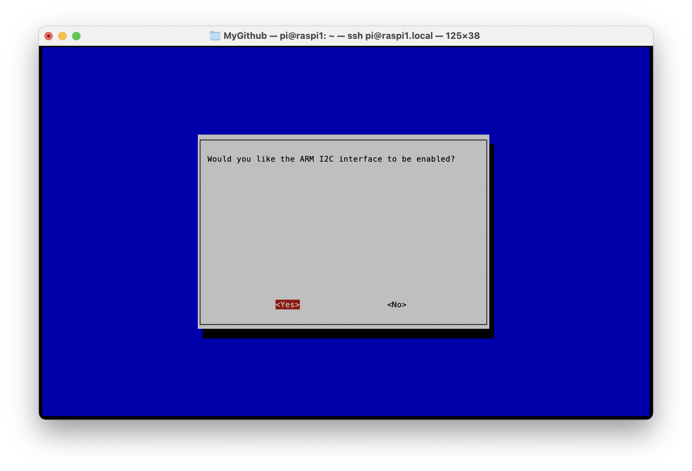

# #832 Using I²C on the Raspberry Pi

All about configuring the I²C on the Raspberry Pi. Demonstrates using the bus with BME280 and BMP280 environmental sensors attached, with examples of probing the bus with i2c-tools, and reading the sensors with python, using the smbus library.


## Notes

### Circuit Design

Designed with Fritzing: see [i2c.fzz](./i2c.fzz).


### Configuring I²C

First, need to ensure ARM I2C support is enabled.
Run `sudo raspi-config` and enable ARM I2C support under "3. Interface Options"



This change can be checked in `config.txt`:

```sh
pi@raspi1:~ $ grep -i i2c /boot/firmware/config.txt
dtparam=i2c_arm=on
```

Checking that the required kernel modules are loaded:

```sh
pi@raspi1:~ $ lsmod | grep i2c
i2c_bcm2835            12288  1
i2c_dev                12288  2
```

If `i2c_dev` is missing, user-space access won’t work.

Finally, check for I²C devices:

```sh
pi@raspi1:~ $ ls -1 /dev/i2c-*
/dev/i2c-1
/dev/i2c-2
```

The `/dev/i2c-1` device is the tain header I²C on GPIO2/3.

I am using a Raspberry Pi B+. On this device, the second device
`/dev/i2c-2` (BSC0) is reserved for camera/display/HAT EEPROM.

### Probing the I²C bus with `i2c-tools`

The `i2c-tools` are useful for diagnosing issues and testing devices on the I²C bus, without code.
First install tools if needed:

```sh
sudo apt install -y i2c-tools
```

Detecting buses:

```sh
pi@raspi1:~ $ i2cdetect -l
i2c-1 i2c        bcm2835 (i2c@7e804000)           I2C adapter
i2c-2 i2c        bcm2835 (i2c@7e805000)           I2C adapter
```

Checking devices on i2c-1 ... perfect, it is seeing the two devices on address 0x76 and 0x77, as expected:

```sh
pi@raspi1:~ $ i2cdetect -y 1
     0  1  2  3  4  5  6  7  8  9  a  b  c  d  e  f
00:                         -- -- -- -- -- -- -- --
10: -- -- -- -- -- -- -- -- -- -- -- -- -- -- -- --
20: -- -- -- -- -- -- -- -- -- -- -- -- -- -- -- --
30: -- -- -- -- -- -- -- -- -- -- -- -- -- -- -- --
40: -- -- -- -- -- -- -- -- -- -- -- -- -- -- -- --
50: -- -- -- -- -- -- -- -- -- -- -- -- -- -- -- --
60: -- -- -- -- -- -- -- -- -- -- -- -- -- -- -- --
70: -- -- -- -- -- -- 76 77
```

Checking devices on i2c-2 ... nothing, as expected:

```sh
pi@raspi1:~ $ i2cdetect -y 2
     0  1  2  3  4  5  6  7  8  9  a  b  c  d  e  f
00:                         -- -- -- -- -- -- -- --
10: -- -- -- -- -- -- -- -- -- -- -- -- -- -- -- --
20: -- -- -- -- -- -- -- -- -- -- -- -- -- -- -- --
30: -- -- -- -- -- -- -- -- -- -- -- -- -- -- -- --
40: -- -- -- -- -- -- -- -- -- -- -- -- -- -- -- --
50: -- -- -- -- -- -- -- -- -- -- -- -- -- -- -- --
60: -- -- -- -- -- -- -- -- -- -- -- -- -- -- -- --
70: -- -- -- -- -- -- -- --
```

### Raw Query: BME280 (0x76)

Using `i2cget` to probe the BME280 at address 0x76

```sh
pi@raspi1:~ $ i2cget -y 1 0x76 0xD0
0x60
pi@raspi1:~ $ i2cget -y 1 0x76 0xFA
0x80
pi@raspi1:~ $ i2cdump -y 1 0x76
No size specified (using byte-data access)
     0  1  2  3  4  5  6  7  8  9  a  b  c  d  e  f    0123456789abcdef
00: 00 00 00 00 00 00 00 00 00 00 00 00 00 00 00 00    ................
10: 00 00 00 00 00 00 00 00 00 00 00 00 00 00 00 00    ................
20: 00 00 00 00 00 00 00 00 00 00 00 00 00 00 00 00    ................
30: 00 00 00 00 00 00 00 00 00 00 00 00 00 00 00 00    ................
40: 00 00 00 00 00 00 00 00 00 00 00 00 00 00 00 00    ................
50: 00 00 00 00 00 00 00 00 00 00 00 00 00 00 00 00    ................
60: 00 00 00 00 00 00 00 00 00 00 00 00 00 00 00 00    ................
70: 00 00 00 00 00 00 00 00 00 00 00 00 00 00 00 00    ................
80: 7e 70 89 0f 81 55 69 06 91 6e e3 66 32 00 41 90    ~p???Ui??n?f2.A?
90: 9b d5 d0 0b 68 16 57 00 f9 ff b4 2d e8 d1 88 13    ????h?W.?.?-????
a0: 00 4b 35 00 00 00 00 00 00 00 00 00 33 00 00 c0    .K5.........3..?
b0: 00 54 00 00 00 00 60 02 00 01 ff 7f 1f 60 03 00    .T....`?.?.??`?.
c0: 00 00 00 ff 00 00 00 00 00 00 00 00 00 00 00 00    ................
d0: 60 00 00 00 00 00 00 00 00 00 00 00 00 00 00 00    `...............
e0: 00 64 01 00 14 2f 03 1e 9d 41 ff ff ff 7f ff 7f    .d?.?/???A...?.?
f0: ff 00 00 00 00 00 00 80 00 00 80 00 00 80 00 80    .......?..?..?.?
```

### Raw Query: BMP180 (0x77)

```sh
pi@raspi1:~ $ i2cget -y 1 0x77 0xD0
0x58
pi@raspi1:~ $ i2cget -y 1 0x77 0xFA
0x80
pi@raspi1:~ $ i2cdump -y 1 0x77
No size specified (using byte-data access)
     0  1  2  3  4  5  6  7  8  9  a  b  c  d  e  f    0123456789abcdef
00: 00 00 00 00 00 00 00 00 00 00 00 00 00 00 00 00    ................
10: 00 00 00 00 00 00 00 00 00 00 00 00 00 00 00 00    ................
20: 00 00 00 00 00 00 00 00 00 00 00 00 00 00 00 00    ................
30: 00 00 00 00 00 00 00 00 00 00 00 00 00 00 00 00    ................
40: 00 00 00 00 00 00 00 00 00 00 00 00 00 00 00 00    ................
50: 00 00 00 00 00 00 00 00 00 00 00 00 00 00 00 00    ................
60: 00 00 00 00 00 00 00 00 00 00 00 00 00 00 00 00    ................
70: 00 00 00 00 00 00 00 00 00 00 00 00 00 00 00 00    ................
80: 91 6e 90 4b 30 4f ee 00 15 6a 17 66 18 fc 34 94    ?n?K0O?.?j?f??4?
90: 85 d5 d0 0b 73 07 ec 00 f9 ff 8c 3c f8 c6 70 17    ????s??.?.?<??p?
a0: 00 00 be 00 00 00 00 00 00 00 00 00 33 00 00 c0    ..?.........3..?
b0: 00 54 00 00 00 00 60 02 00 01 ff be 13 60 03 00    .T....`?.?.??`?.
c0: 00 00 00 ff 00 00 00 00 00 00 00 00 00 00 00 00    ................
d0: 58 00 00 00 00 00 00 00 00 00 00 00 00 00 00 00    X...............
e0: 00 00 00 00 00 00 00 00 00 00 00 00 00 00 00 00    ................
f0: 00 00 00 00 00 00 00 80 00 00 80 00 00 00 00 00    .......?..?.....
```

### Using Python to query the BME280 and BMP280 Devices

The two devices I have on the bus are similar environmental sensors.

* the BME280 is a newer device, and measures temperature, pressure and humidity
    * for more details, see [LEAP#830 BME280 3.3V Module](../../Electronics101/BME280/Module3V/)
* the BMP280  measures temperature and pressure
    * for more details, see [LEAP#826 BMP280 Module](../../Electronics101/BMP280/Module/)

These examples use the [Python smbus](https://github.com/Gadgetoid/py-smbus) library,
and do the bare minimum to read from the sensors.

Although these are presented as separate scripts, the sensors operate very similarly,
so it would be quite easy to refactor a script that could handle both sensors.

#### BME280 (0x76) with Python

See the source in [simple_bme280_logger.py](./simple_bme280_logger.py).

Test run:

```sh
pi@raspi1:~ $ ./simple_bme280_logger.py 76
| Temperature | Pressure    | Humidity |
|-------------|-------------|----------|
|    26.04 °C | 1006.77 hPa |  33.15 % |
|    26.04 °C | 1006.80 hPa |  33.08 % |
|    26.05 °C | 1006.72 hPa |  33.11 % |
|    26.04 °C | 1006.71 hPa |  33.14 % |
|    26.04 °C | 1006.79 hPa |  33.10 % |
^C
pi@raspi1:~ $ ./simple_bme280_logger.py 77
Error: Invalid BME280 chip ID: 0x58
pi@raspi1:~ $
```

#### BMP280 (0x77) with Python

See the source in [simple_bmp280_logger.py](./simple_bmp280_logger.py).

Test run:

```sh
pi@raspi1:~ $ ./simple_bmp280_logger.py 77
| Temperature | Pressure    |
|-------------|-------------|
|    27.33 °C | 1006.82 hPa |
|    27.33 °C | 1006.79 hPa |
|    27.33 °C | 1006.84 hPa |
|    27.34 °C | 1006.78 hPa |
^C
pi@raspi1:~ $ ./simple_bmp280_logger.py 76
Error: Invalid BMP280 chip ID: 0x60
pi@raspi1:~ $
```

## Credits and References

* [Using the I2C Interface](https://raspberry-projects.com/pi/programming-in-python/i2c-programming-in-python/using-the-i2c-interface-2)
* ["1-10pcs BME280 BMP280 5V 3.3V Digital Sensor Temperature Humidity Barometric Pressure Module I2C SPI for Arduino" (aliexpress seller listing)](https://www.aliexpress.com/item/1005008511564094.html)
    * Purchased BME280 3.3V module for SG$3.72 (Jan-2026)
* ["GY-68 BMP180 BMP280 Digital Barometric Pressure Sensor Module for arduino" (aliexpress seller listing)](https://www.aliexpress.com/item/32709141948.html)
    * Originally purchased BMP180 3.3V version for SG$0.85 (Jun-2020)
    * No longer offered by this seller
* [BME280 Datasheet](https://www.bosch-sensortec.com/media/boschsensortec/downloads/datasheets/bst-bme280-ds002.pdf)
* [BMP280 Datasheet](https://www.bosch-sensortec.com/media/boschsensortec/downloads/datasheets/bst-bmp280-ds001.pdf)
* [LEAP#830 BME280 3.3V Module](../../Electronics101/BME280/Module3V/)
* [LEAP#826 BMP280 Module](../../Electronics101/BMP280/Module/)
