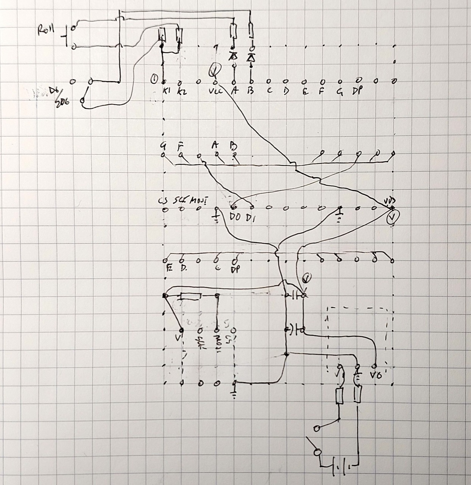
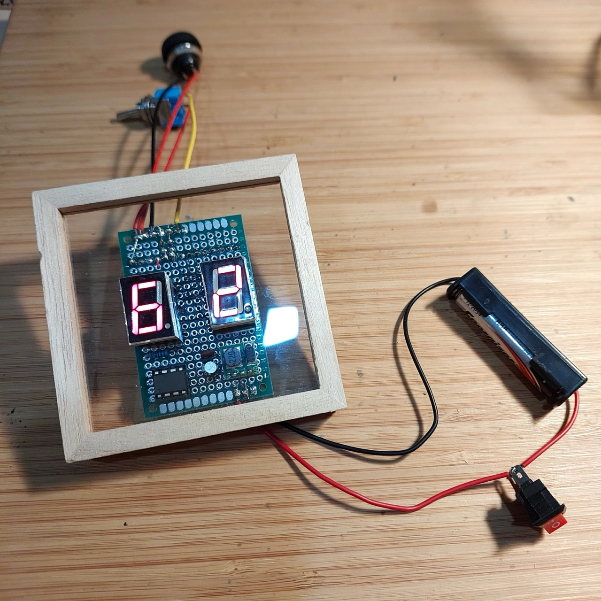
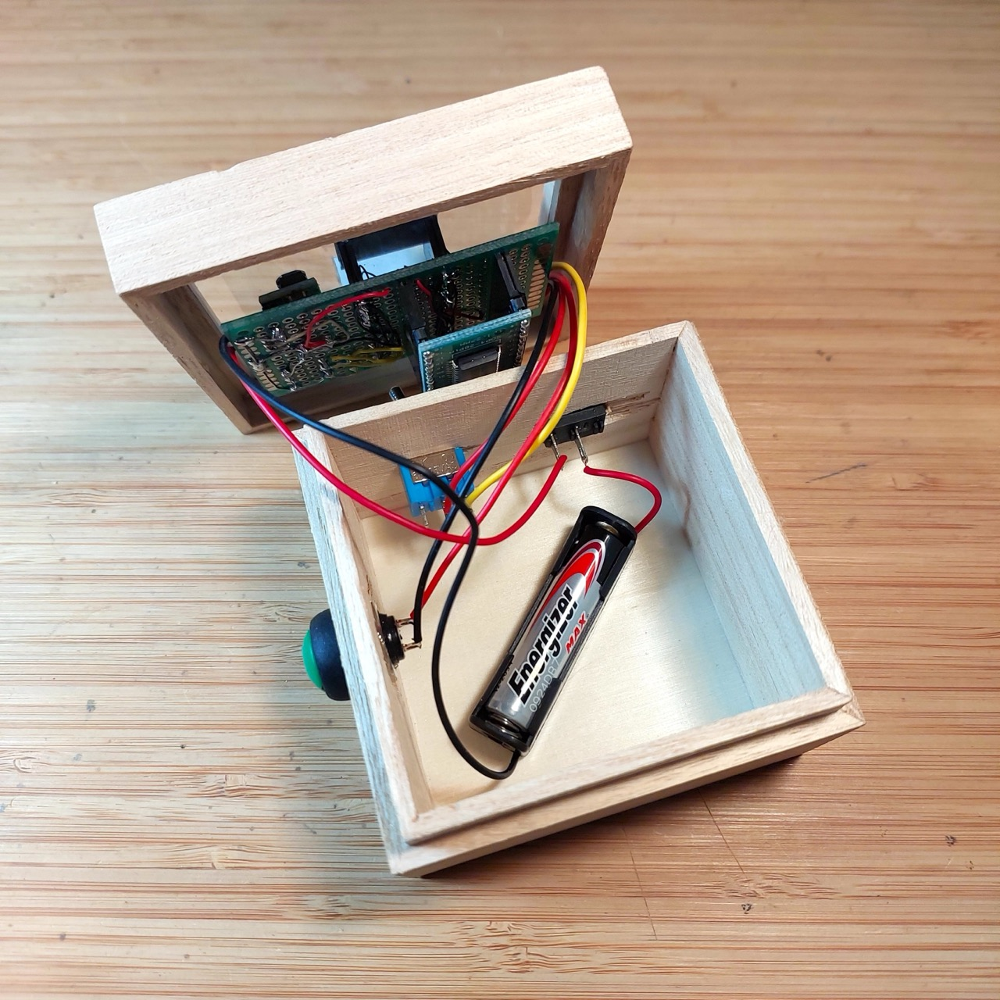
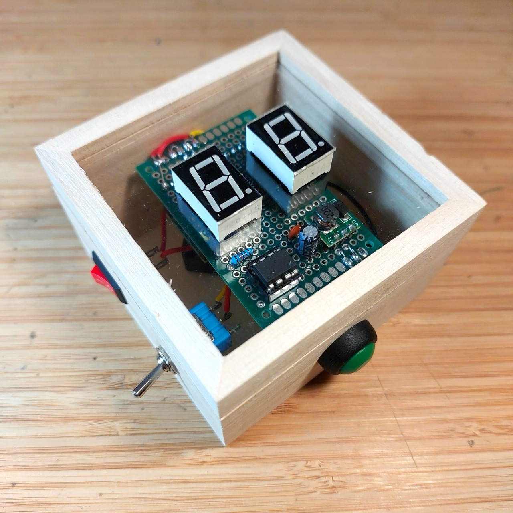
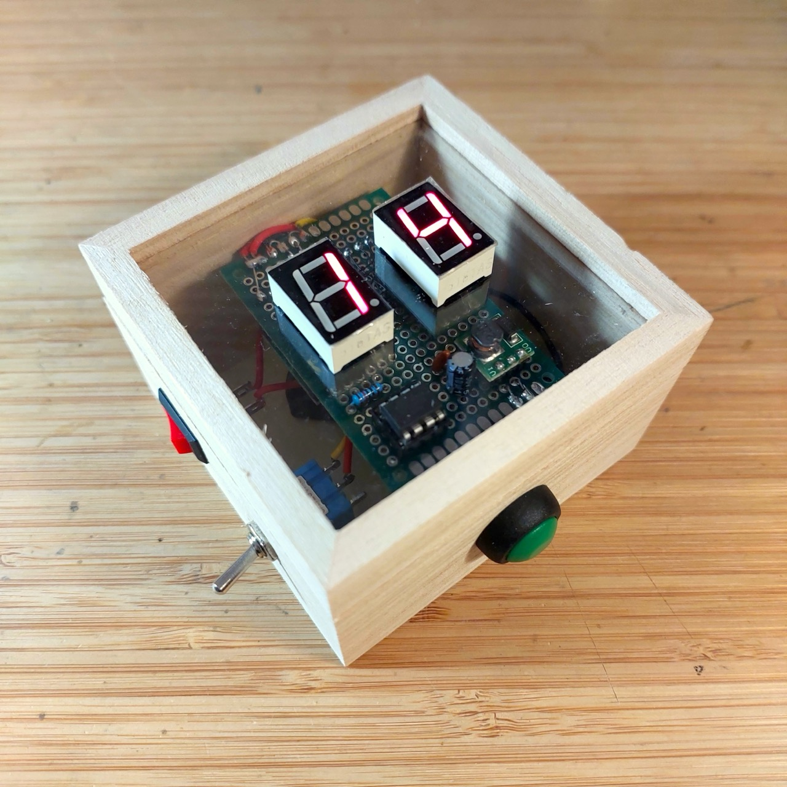
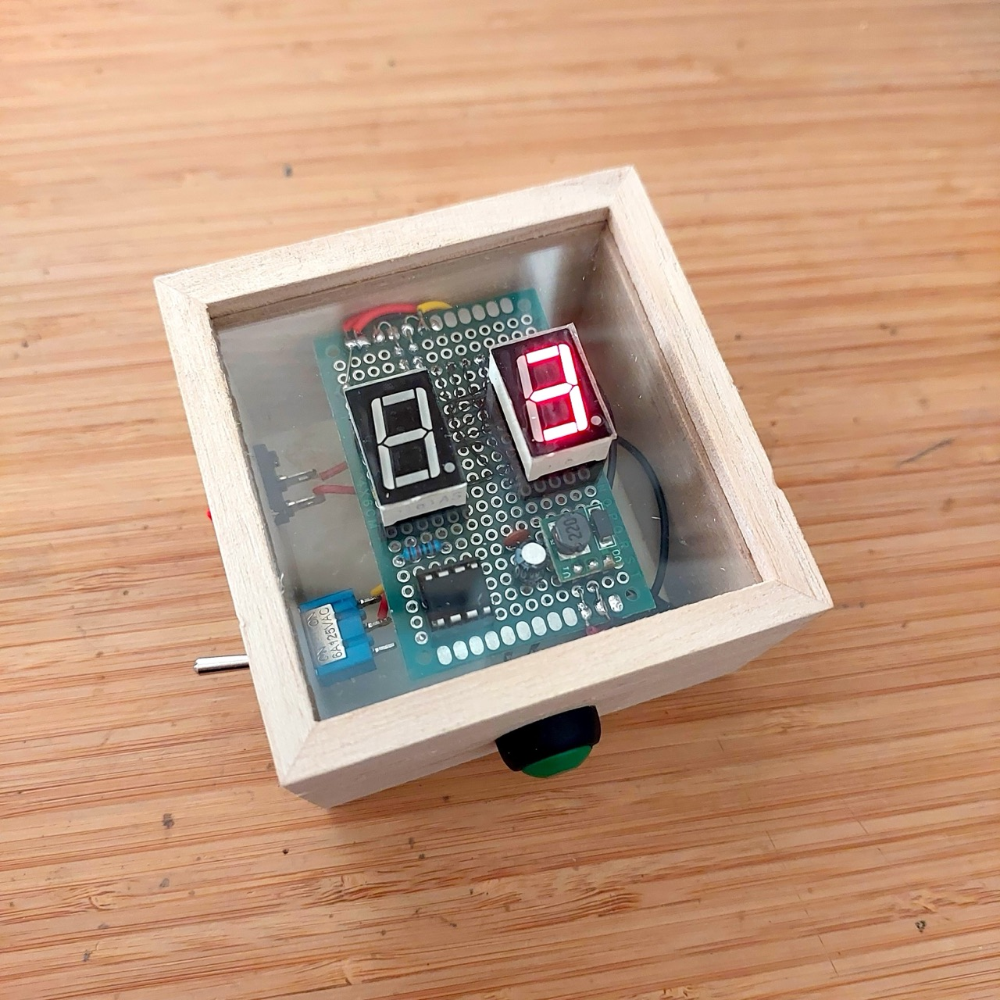
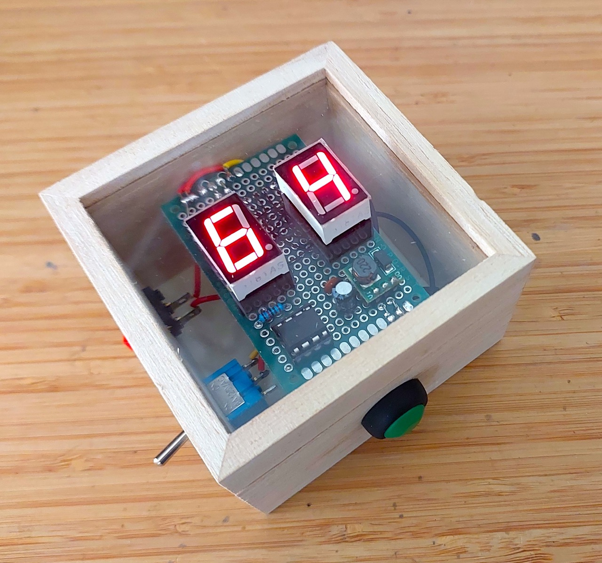

# #xxx 2d6 Dice Roller

A little 1d6 or 2d6 dice roller using the TM1638 and ATtiny85.

Here's a quick demo..

## Notes

I have a number of games that require one or two 6-side dice.
Rather than hunt for some dice or need space to roll them, how about a simple Arduino-based gadget?

Here are my basic requirements:

* Toggle between d6 or 2d6 die modes
* Roll with a button press: hold to shake and release to roll
* The "shake and roll" should be animated:
    * constant changing of the LED display while "shaking"
    * then decelerate to final value while "rolling"
* Auto-off? Rather than have on/off switch:
    * the unit should turn on when the die roll button is pressed
    * and auto-off after some delay (like 3 mins)
* Battery powered (no wires)

Technology selections:

* This is going to be an Arduino-based project:
    * prototype with Arduino Uno
    * perhaps final gadget using ATtiny85
* Final gadget power at 5V:
    * 9V battery with buck converter or 3V with a boost converter
* Use two 7-segment LEDs to represent the two dice
* LED driver:
    * options:
        * MAX7219 & SPI: can handle 2 digits with 3 pins for SPI
        * 2 x 74HC595 shift registers: can handle 2 digits with 3 pins
        * 2 x CD4026: can handle 2 digits with 2 pins
        * TM1638: LED control and button input with 3 pins
    * I've decided to use the TM1638, at least for a first prototype. It simplifies LED and push-button management, but I am not sure I can figure out a way for the push-button to also trigger the device wake-up.

### LED 7-Segment Components

The 7-segment components I'm using here are similar to the [SC56-11](../LED7Segment/assets/SC56-11_datasheet.pdf?raw=true).

I'm using common cathode variants, so segments are wired to the TM1638 segment pins,
and each digits cathode goes to the corresponding grid pin.

| Segment  | SC56-11 pin | TM1638 SEG pin |
|----------|-------------|----------------|
| a        | 7           | SEG1: 5        |
| b        | 6           | SEG2: 6        |
| c        | 4           | SEG3: 7        |
| d        | 2           | SEG4: 8        |
| e        | 1           | SEG5: 9        |
| f        | 9           | SEG6: 10       |
| g        | 10          | SEG7: 11       |
| dp       | 5           | SEG8: 12       |

### Arduino Uno Prototype Circuit Design

Designed with Fritzing: see [2d6.fzz](./2d6.fzz).

The first prototype uses an Arduino Uno for convenience of programming.

This is working nicely. On startup, the die values are blank ("--"):

After a roll:

### ATtiny85 Prototype Circuit Design

Designed with Fritzing: see [2d6-ATtiny85.fzz](./2d6-ATtiny85.fzz).

Reconfigured to use an ATtiny85. This mainly entailed modifying the microcontroller pin selection: [2d6.ino](./2d6.ino) uses the `ARDUINO_attiny` definition to conditionally compile pin configurations based ont he processor.

Running nicely on the ATtiny85:

#### Auto-off?

I haven't been able to figure out how to incorporate auto-power off without introducing another switch, or a different switch.

The SPST momentary push-button used for the "roll" function can't also be used to trigger power-on, because it needs to be floating to be scanned by the TM1638.

Options:

* Replace the SPST with a DPST momentary push-button, but I don't have any in my parts collection, and they appear to be quite an uncommon component at least in small footprint/low power.
    * Component options are limited, so this is not ideal
* Don't use the TM1638 to scan the roll switch, read direct from the microcontroller
    * Becomes self-defeating: if I don't use the TM1638 for the switches, then why use a TM1638 at all? Better to just use CD4026 or equivalent for the LEDs, and read the switches directly.
* Add another switch for power control
    * Unfortunately, perhaps the best option for a TM1638-based design.

Decision: I'm sticking with the TM1638, and since there's no great solution for supporting auto-off, I'm going to scrap that idea for this version of the 2d6, and just use simple on/off switch.

I'll probably do another version of the 2d6 with CD4026 instead of the TM1638 but with auto-off and no extra buttons or switches.

### The Sketch

The program is organised as follows:

* [2d6.ino](./2d6.ino)
    * main program loop
* [Die.h](./Die.h) / [Die.cpp](./Die.cpp)
    * models all operations for a single die
* [TM1638.h](./TM1638.h) / [TM1638.cpp](./TM1638.cpp)
    * TM1638 driver
    * doesn't expose all capabilities of the TM1638, just enough to handle the two LED 7-segment displays and two buttons.
* [KeyController.h](./KeyController.h) / [KeyController.cpp](./KeyController.cpp)
    * models key states, using the TM1638 driver under the cover

### Final Build

For the final build:

* 5V bench power supply replaced by 1xAAA battery and a 5V boost converter
    * Using a ["0.9-5V To 5V DC-DC Step-Up Power Module Voltage Boost Converter Board 1.5V 1.8V 2.5V 3V 3.3V 3.7V 4.2V To 5V" (aliexpress seller listing)](https://www.aliexpress.com/item/1005006438496545.html)
    * Purchased for SG$1.74 including tax for 5 pieces (Nov-2024)
    * See [LEAP#760 AAA 5v Power Pack](../../Electronics101/Power/AAA5vPower/) for more on this module
* Transferred the circuit to 4x6cm protoboard
* Selected some more appropriate switches
* Mounted in a small wooden box I found at Daiso for SG$2

Updated design with Fritzing: see [2d6-ATtiny85-final.fzz](./2d6-ATtiny85-final.fzz).

Running nicely on the ATtiny85:

Here's the protoboard layout:

Testing the circuit before final assembly:

Installed in the $2 wooden box from Daiso:

Testing, 2d6 mode:

Testing, 1d6 mode:

### Conclusions and Next Steps

It's a nice little gadget that gets the job done:

I was a little disappointed that I couldn't figure out a good way to enable auto-off and reset with the roll button with the TM1368.

I will probably make some more die rolling projects:

* my partner immediately asked for a 3 die version!
* swap out the TM1368 for perhaps the CD4026, and do a true auto-off/single-button control version
* and perhaps a fully configurable multi-die roller with LCD or OLED display that can handle a wide variety of die configurations

## Credits and References

* [Titam TM1638](http://www.titanmec.com/index.php/en/product/view/id/303.html) - info from the original manufacturer, Shenzhen Titan Micro Electronics Co., Ltd. (深圳市天微电子股份有限公司)
* ["0.9-5V To 5V DC-DC Step-Up Power Module Voltage Boost Converter Board 1.5V 1.8V 2.5V 3V 3.3V 3.7V 4.2V To 5V" (aliexpress seller listing)](https://www.aliexpress.com/item/1005006438496545.html)
    * Purchased for SG$1.74 including tax for 5 pieces (Nov-2024)
    * See [LEAP#760 AAA 5v Power Pack](../../Electronics101/Power/AAA5vPower/) for more on this module
