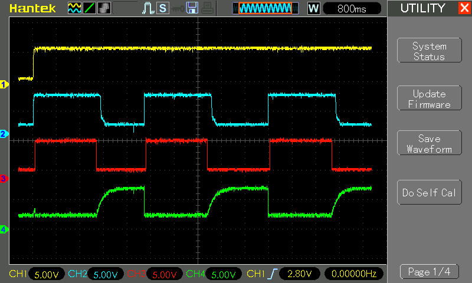
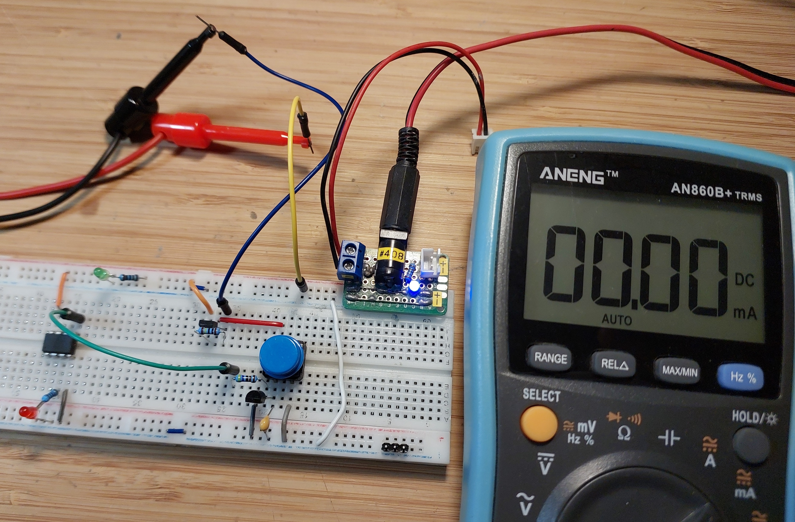

# #128 ATtiny TotalSleep

Test a total power shutdown with an ATtiny85 processor on a breadboard: power-on with push-button PFET; power-off by the microprocessor itself.

Here's a quick video of the circuit in action:

## Notes

The [ATtiny SleepMode](../SleepMode) project showed me that even in CPU sleep mode, an ATtiny85 circuit can
still draw something in the order of 238µA.

This project tests a scheme for total power shutdown triggered by the microcontroller itself.
The circuit then draws virtually no current (just component leakage).

The trade-off is that the circuit requires an external trigger to wake-up again. Here it uses a push-button to switch a p-channel MOSFET.

### How it Works

* power is supplied to the ATtiny and other circuit elements through a p-channel MOSFET (I'm using a BS250 here)
* when power is turned on, the 1MΩ resistor R1 charges the 220nF capacitor C1 with a time constant of [220ms](https://www.wolframalpha.com/input/?i=1M%CE%A9*220nF)
* this keeps the FET Vgs negative long enough for the ATtiny to power up and apply a high signal to the base of the NPN transistor
    * ATtiny85 cold power-on is typically up to ~65 ms with default fuses.
    * With optimized fuses (fast startup), startup may only take a few microseconds to a few milliseconds
* the NPN collector-emitter conduction holds the FET Vgs negative, and therefore "powered on"
* when the ATtiny wants to power-down, it brings the NPN base low, cutting the collector-emitter channel, and sending the FET Vgs to 0V.
* this turns off the FET and everything is powered down. The current drawn in this state is limited to leakage of the components
* to power-up, the push-button shorts the capacitor, bringing the FET Vgs down and setting the cycle off again

### Circuit Design

Designed with Fritzing: see [TotalSleep.fzz](./TotalSleep.fzz).

Setup on a breadboard:

### The Sketch

See [TotalSleep.ino](./TotalSleep.ino). Essential program structure:

* setup:
    * pulls the `POWER_EN` pin high
* main program:
    * flashes the LED at 5Hz for 2 seconds
    * trigger power-off: switch the `POWER_EN` pin to high-impedance input state
    * NOP until dead

The ATtiny85 is programmed using an Arduino Uno as described in [LEAP#070 Programming an ATtiny With ArduinoISP](../ProgrammingWithArduinoISP).

### Demonstration

This all seems to work very reliably.
The following scope trace illustrates the behaviour:

* CH1 (Yellow): 5V power
* CH2 (Blue): VDD
* CH3 (Red): `POWER_EN` pin
* CH4 (Green): R1-C1 junction

After the ATtiny85 cuts its power, total current draw is negligible, less than the 1µA resolution of an inline multimeter:

Here's a quick video of the circuit in action:

## Credits and References

* [LEAP#070 Programming an ATtiny With ArduinoISP](../ProgrammingWithArduinoISP)
* [ATtiny85 datasheet](https://www.microchip.com/en-us/product/ATTINY85)
* [BS250 datasheet](https://www.futurlec.com/Transistors/BS250.shtml)
* [BC547 datasheet](https://www.futurlec.com/Transistors/BC547.shtml)
* [Arduino DigitalPins reference](https://www.arduino.cc/en/Tutorial/DigitalPins)
* [Topic: Circuit for MCU to control its own power on/off](http://forum.arduino.cc/index.php?topic=118504.0) - another approach using a flip-flop
* [Self Shutting Down Arduino](http://letsmakerobots.com/content/self-shutting-down-arduino-or-any-other-microcontroller-matter) - describes a similar approach
